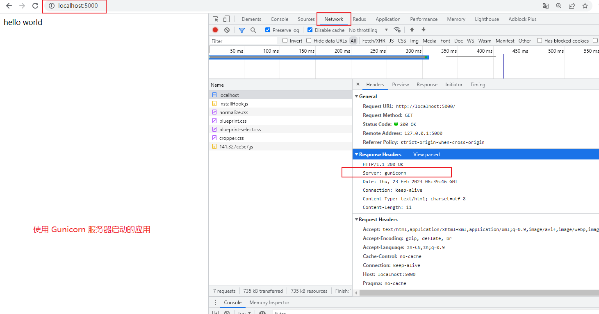

## （一） Flask 应用
### 1. 创建一个目录并切换进去
```
$ mkdir gunicorn_demo
$ cd gunicorn_demo
```

### 2. 创建一个 Flask 应用
构建一个最基本的 Flask 项目
app.py 文件
```py
from flask import Flask


app = Flask(__name__)


@app.route("/")
def index():
    return 'Hello World'
```


## （二） Gunicorn 相关
### 1. 后端工作的简单示意图


### 2. Gunicorn 概述
Gunicorn 是目前使用最广泛的高性能的 Python WSGI（WEB Server Gateway interface）服务器，移植自 Ruby 的 Unicorn 项目，使用 ```pre-fork worker``` 模式，具有简单、易用、轻量级、低资源消耗和高性能等特点。

什么是 ```pre-fork worker``` 模型？
- ```worker``` 模型意味着：这个模型有一个中心主控 master进程，由它来管理一组 worker 进程；这个主控进程并不知晓任何客户端，所有的请求和响应都完全是由多个 worker 进程来处理的。
- ```fork``` 意味着：worker 进程是由 master 进程 fork （复刻）出来的；
- ```pre-``` 意味着：在任何客户端请求到来之前（程序启动的时候），就已从 master 进程 fork 出了多个 worker 进程，坐等请求到来。

### 3. Gunicorn 的工作方式
存放在 ```/gunicorn/workers/__init__.py``` 文件中
以下针对每一个 worker 进程中的工作模式
- ```sync```：```单进程单线程```的工作模式，而且还是同步的，也就是说当前请求未处理结束，其他请求只能排队等待
- ```eventlet```：```单进程单线程多协程```的工作模式（异步）
- ```gevent```：```单进程单线程多协程```的工作模式（异步）
- ```gthread```：```单进程多线程```的工作模式
- ```...``` 还有一些其他工作模式，具体请看官方文档


注意事项：
1. Gunicorn 建议设置的 workers 的数量为 ```(2 * CPU) + 1```
2. Gunicorn 默认启动的工作方式为 ```sync``` 模式
3. Gunicorn 中的多线程和多协程的工作方式是互斥的，也就是说在一个 worker 进程中，```单进程多线程```和 ```单进程单线程多协程``` 这两种工作方式是可以的，但是 ```单进程多线程多协程``` 目前是不可以的


### 4. Gunicorn 的参数配置
参数名 | 描述 | 默认值
:---|:---|:---
bind、 -b、 --bind | 服务监听地址和端口 | 127.0.0.1:8000
backlog、--backlog | 等待连接的最大数 | 2048
workers、 -w、 --workers | 用于处理工作进程的数量 | 1
worker_class、 -k、 --worker-class | 工作模式 | sync
threads、 --threads | 一个worker中的工作线程数 | 1
worker_connections、 --worker-connections | 同时连接的客户端的最大数量，只影响 eventlet 和 gevent 类型 | 1000
keepalive、 --keep-alive | 在 Keep-Alive 连接上等待请求的秒数。 | 2
debug | debug 模式 | -
proc_name、 -n、 --name | 进程名 | None
loglevel、 --log-level | 日志级别 | -

更具体的内容请查看文档：[Gunicorn Settings](https://docs.gunicorn.org/en/latest/settings.html)

### 5. 运行方式一（命令行 + 运行参数）
#### ① 同步
```
$ gunicorn --workers=5 app:app
```
以上开启了 5 个 worker 进程，默认是以 ```sync``` 的工作模式运行的，也就是 ```同步``` 的工作模式
第一个 ```app``` 指的是 ```app.py``` 文件名
第二个 ```app``` 指的是文件中的实例变量 ```app```

#### ② 多线程
```
$ gunicorn --workers=5 --threads=2 app:app
# 等同于
$ gunicorn --workers=5 --threads=2 --worker-class=gthread app:app
```
开启了 5 个 workder 进程，每个进程中有两个线程，这里最大的并发请求数就是 ```worker * 线程数 = 10```

#### ③ 协程
```
$ gunicorn --workers=5 --worker-connections=1000 --worker-class=gevent app:app
```
开启了 5 个 workder 进程，每个进程中默认是一个线程，然后开启的协程数为 1000，在这种情况下，能够处理的最大并发请求数量为 ```worker * 协程数 = 5000```

### 6. 运行方式二（将运行参数信息放到配置文件中）
在项目根目录上创建 gunicorn_config.py 文件，内容如下：
```py
"""gunicorn + gevent 的配置文件"""

# 多进程
import multiprocessing

# 绑定ip + 端口
bind = '0.0.0.0:5000'

# 进程数 = cup数量 * 2 + 1
workers = multiprocessing.cpu_count() * 2 + 1

# 等待队列最大长度，超过这个长度的链接将被拒绝连接
backlog = 2048

# 工作模式--协程
worker_class = 'gevent'

# 最大客户客户端并发数量，对使用协程的 worker 的工作有影响
# 服务器配置设置的值  1000：中小型项目  上万并发： 中大型
worker_connections = 1000

# 进程名称
proc_name = 'gunicorn.pid'

# 进程 pid 记录文件
pidfile = 'gunicorn.pid'

# 日志等级
loglevel = 'warning'

# 日志文件名
logfile = 'gunicorn_log.log'

# 设置访问日志
accesslog = 'gunicorn_acess.log'

# 设置错误信息日志
errorlog  = 'gunicorn_error.log'

# 代码发生变化是否自动重启
reload = True
```

命令行运行：
```
$ gunicorn -c gunicorn_config.py app:app
```


## （三） Docker 部署 Flask
### 1. 编写 Dockerfile 文件
> app.py 和 Dockerfile 文件在同一个目录下

Dockerfile 文件的内容
```
# 指定下载 python 版本，说明该镜像以哪个镜像为基础
FROM python:3.8.5

# 构建者的基本信息
MAINTAINER whxcer

# 创建 app 文件夹
RUN mkdir -p /app

# 进入 app 目录
RUN cd /app
# 或 WORKDIR /app

# 在容器内部执行的命令
# 注意：gunicorn 与 gevent 存在版本依赖关系，此外 gevent 依赖的 greenlet 也会有版本问题，尽量使用最新版本即可
# RUN pip install -r requirements.txt -i https://pypi.douban.com/simple/
RUN pip install -i https://pypi.douban.com/simple/ flask
RUN pip install -i https://pypi.douban.com/simple/ gunicorn
RUN pip install -i https://pypi.douban.com/simple/ gevent
RUN pip install -i https://pypi.douban.com/simple/ greenlet

# 将 linux 系统当前目录下的内容拷贝到容器的 /app 目录下
ADD . /app

# 暴露 5000 端口
EXPOSE 5000

# 将 app 文件夹为工作目录
WORKDIR /app

# 容器启动的时候执行的命令 flask run（使用内置的开发服务器启动）
# CMD ["flask", "run", "--host", "0.0.0.0"]
# 使用 Gunicorn 服务器启动 Flask 应用
CMD ["gunicorn", "-c", "gunicorn_config.py", "app:app"]
```

此时的文件结构为：
```
├── gunicorn_demo
│   ├── app.py
│   ├── Dockerfile
│   ├── gunicorn_config.py
```

### 2. 构建镜像
```
# 构建镜像
docker build -t="gunicorn_demo" .
或
docker build -t gunicorn_demo .


# 查看构建之后的镜像
docker images
```

### 3. 使用镜像，启动容器
```
# 使用镜像，启动容器
docker run -d -p 5000:5000 gunicorn_demo


# 查看启动后的容器
docker ps

# 将处于运行状态的容器暂停
docker stop container_id
```

### 4. 运行效果图
- 使用 Flask 内置的开发服务器启动的效果图

- 使用 Gunicorn 服务器启动的效果图

