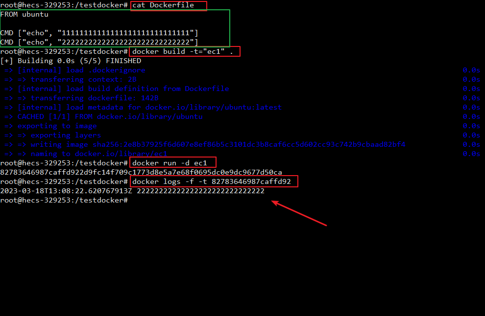
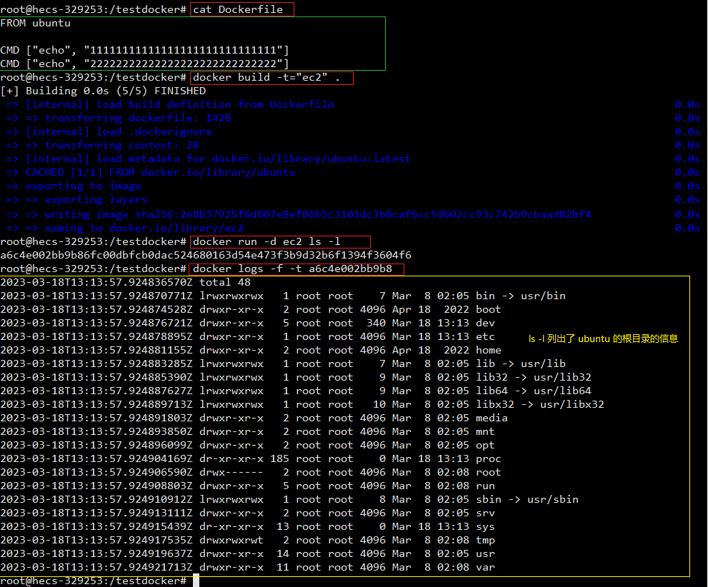
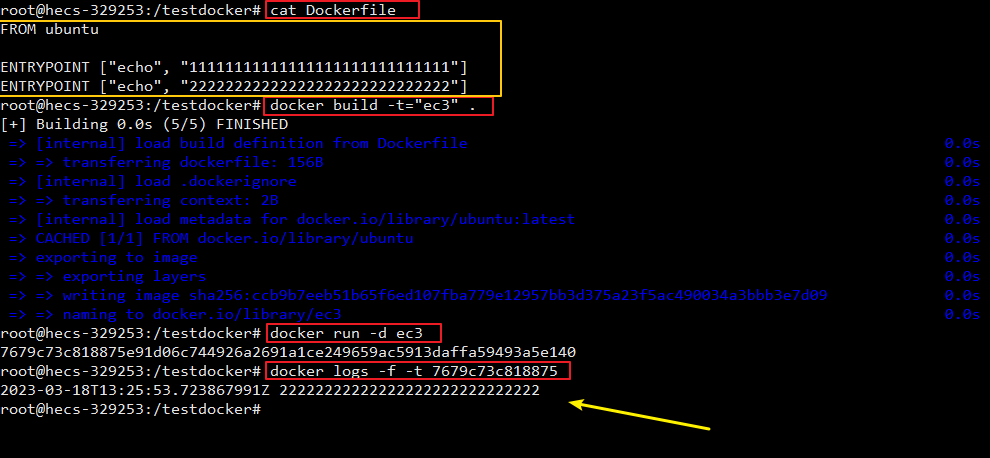
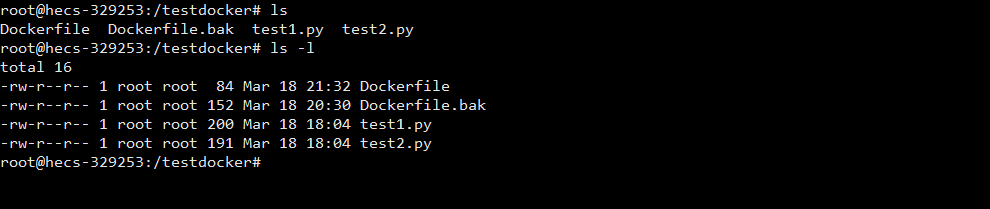
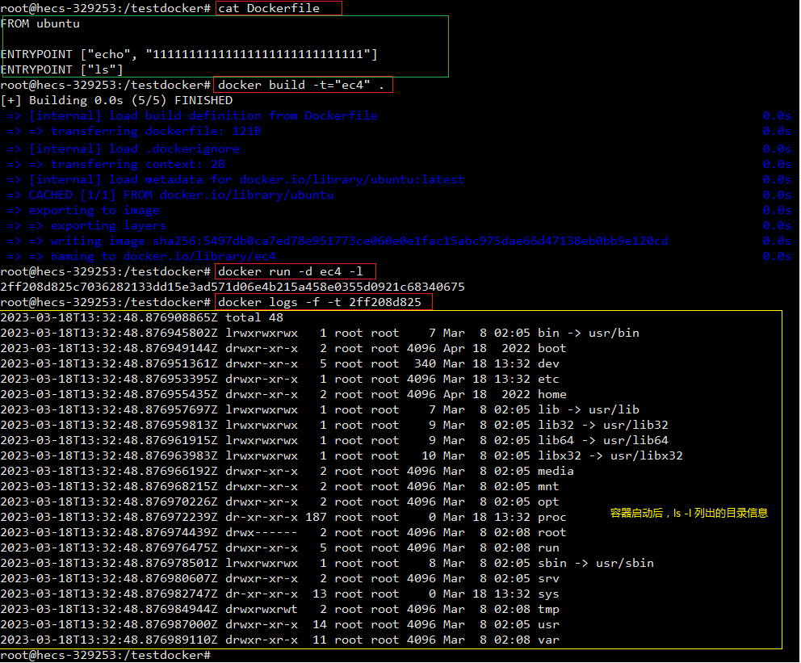
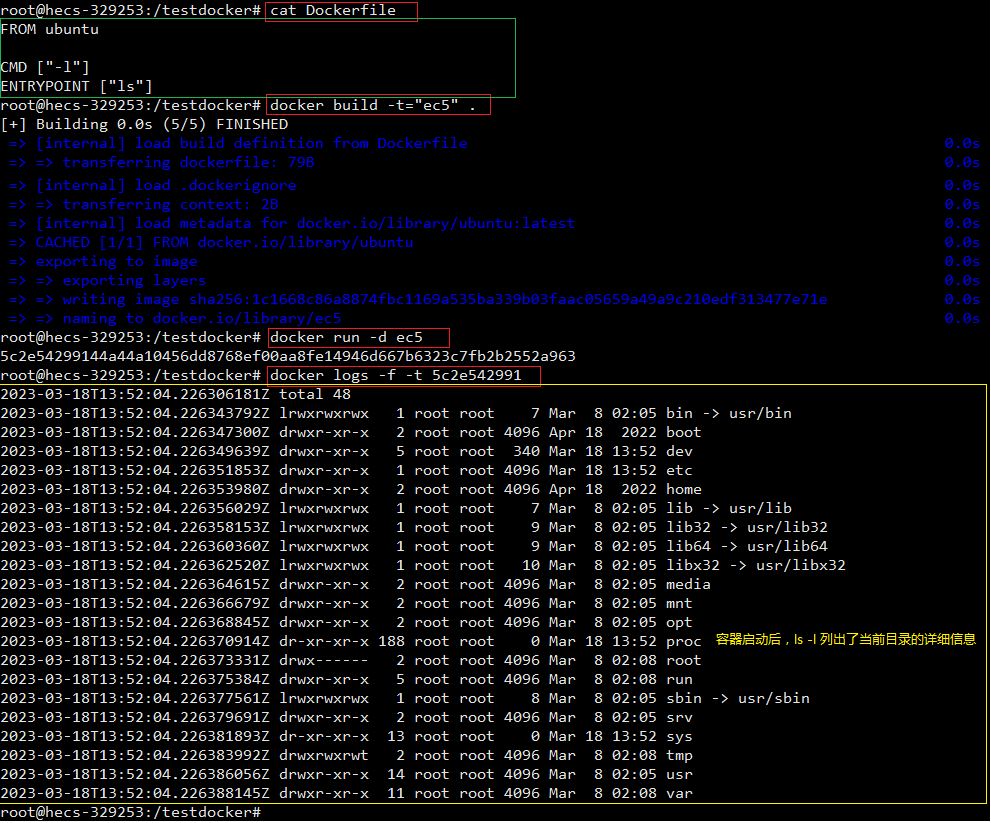
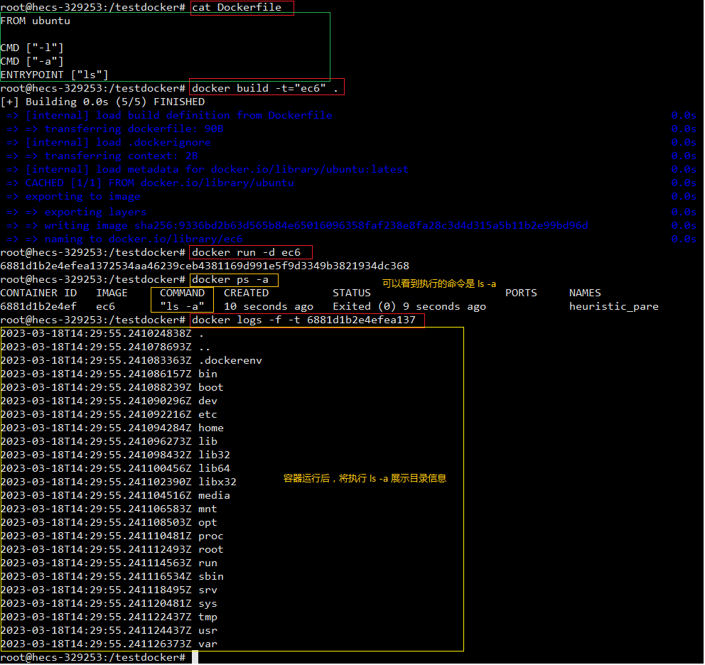
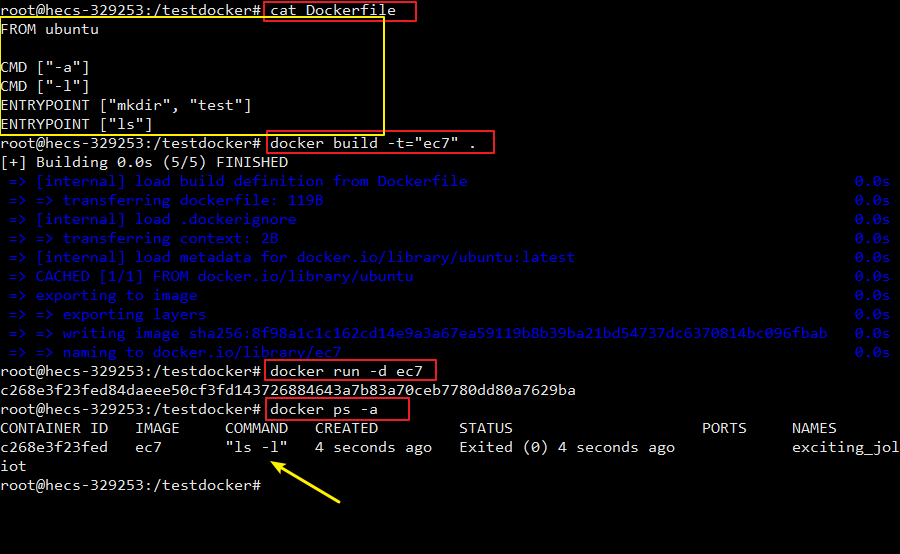
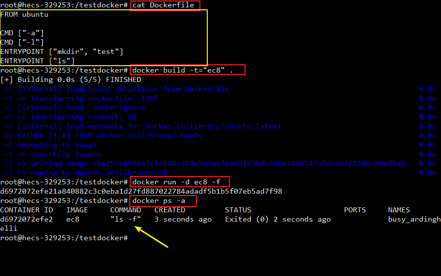

### 1. 概述
```CMD``` 指令
```
功能：
    指定一个容器启动时要运行的命令
指令格式：
    shell 格式：
        CMD "可执行文件" "参数1" "参数2" ...
    exec 格式：
        CMD ["可执行文件", "参数1", "参数2" ...]
详细说明:
    1. Dockerfile 中可以有多个 CMD 指令，但只有最后一个生效，前面的 CMD 都不会被执行
    2. CMD 会被 docker run 之后的参数替换。（覆盖）
额外提示：
    CMD ["参数1", "参数2" ...]，在指定了 ENTRYPOINT 指令后，将会使用 CMD 指定具体的参数
```

```ENTRYPOINT``` 指令
```
功能：
    指定一个容器启动时要运行的命令
指令格式：
    shell 格式：
        ENTRYPOINT "可执行文件" "参数1" "参数2" ...
    exec 格式：
        ENTRYPOINT ["可执行文件", "参数1", "参数2" ...]
详细说明:
    1. Dockerfile 中可以有多个 ENTRYPOINT 指令，但只有最后一个生效，前面的 ENTRYPOINT 都不会被执行
    2. ENTRYPOINT 的目的和 CMD 一样，都是在指定容器启动程序和参数，不过 ENTRYPOINT 命令不会被 docker run 之后的参数替换，而是在 ENTRYPOINT 的基础上，在后面加上 docker run 之后的参数。（追加）
```


### 2. 实际操作的示例
提示：
- 可通过 ```docker ps -a``` 来查看最终运行的命令
- 可通过 ```docker logs -f -t 容器ID``` 来查看命令运行后的打印效果

#### （1） 多个 CMD 的情况
```
FROM ubuntu

CMD ["echo", "111111111111111111111111"]
CMD ["echo", "222222222222222222222222"]
```

运行结果：
只有第二个 ```CMD``` 指令运行


#### （2） 多个 CMD 的情况 + docker run 有参数
```
FROM ubuntu

CMD ["echo", "111111111111111111111111"]
CMD ["echo", "222222222222222222222222"]
```

```
docker run -d ubuntu ls -l

ls -l 将某目录以详细列表的形式进行展示
```

运行结果：
``Dockerfile`` 中所有的 ```CMD``` 都没有被执行，而是运行了 ```docker run``` 之后的参数，或者说最后一个 ```CMD ["echo", "222222222222222222222222"]``` 被替换成了 ```CMD ["ls", "-l"]```


#### （3） 多个 ENTRYPOINT 的情况
```
FROM ubuntu

ENTRYPOINT ["echo", "111111111111111111111111"]
ENTRYPOINT ["echo", "222222222222222222222222"]
```

运行结果：
只有第二个 ```ENTRYPOINT``` 指令运行


#### （4） 多个 ENTRYPOINT 的情况 + docker run 有参数
```
FROM ubuntu

ENTRYPOINT ["echo", "111111111111111111111111"]
ENTRYPOINT ["ls"]
```

```
docker run -d ubuntu -l

最终将会被转化为：
    ls -l
```

```ls``` 和 ```ls -l``` 展示目录详细信息的差别：


运行结果：
```ENTRYPOINT``` 命令不会被 ```docker run``` 之后的参数替换，而是在 ```ENTRYPOINT``` 的基础上，在后面加上 ```docker run``` 之后的参数


#### （5） 一个 CMD 和一个 ENTRYPOINT 结合使用的情况
```
FROM ubuntu

CMD ["-l"]
ENTRYPOINT ["ls"]
```

运行结果：
在指定了 ```ENTRYPOINT``` 指令后，将会使用 ```CMD``` 指定具体的参数，即 ```ls -l```


额外说明：
```CMD指令放在ENTRYPOINT指令前面``` 与 ```CMD指令放在ENTRYPOINT指令后面``` 是一样的结果，也就是下面的 ```Dockerfile``` 和上面是一致的效果
```
FROM ubuntu

ENTRYPOINT ["ls"]
CMD ["-l"]
```

#### （6） 多个 CMD 和一个 ENTRYPOINT 结合使用的情况
```
FROM ubuntu

CMD ["-l"]
CMD ["-a"]
ENTRYPOINT ["ls"]
```

运行结果：
最终只有最后一个 ```CMD``` 被当做 ```ENTRYPOINT``` 指令的参数，即最终执行的命令为 ```ls -a```



---

```
FROM ubuntu

CMD ["-l"]
ENTRYPOINT ["ls"]
CMD ["-a"]
```

```
FROM ubuntu

ENTRYPOINT ["ls"]
CMD ["-l"]
CMD ["-a"]
```

以上两种都会转换为命令：```ls -a```

#### （7） 多个 CMD 和多个 ENTRYPOINT 结合使用的情况
```
FROM ubuntu

CMD ["-a"]
CMD ["-l"]
ENTRYPOINT ["mkdir", "tes"]
ENTRYPOINT ["ls"]
```

运行结果：
只有最后一个 ```CMD``` 和 最后一个 ```ENTRYPOINT``` 起效果了，即 ```ls -l```


下面的 ```Dockerfile``` 内容的实际运行效果和上面的一致
```
FROM ubuntu

ENTRYPOINT ["mkdir", "tes"]
ENTRYPOINT ["ls"]
CMD ["-a"]
CMD ["-l"]
```

#### （8） 多个 CMD 和多个 ENTRYPOINT + docker run 加参数的使用情况
```
FROM ubuntu

CMD ["-a"]
CMD ["-l"]
ENTRYPOINT ["mkdir", "tes"]
ENTRYPOINT ["ls"]
```

```
docker run -d ubuntu -f
```

运行结果：
```CMD``` 被 ```docker run``` 后面的 ```-f``` 参数给替换了，因此和最后一个 ```ENTRYPOINT``` 形成了 ```ls -f```


下面的 ```Dockerfile``` 内容的实际运行效果和上面的一致
```
FROM ubuntu

ENTRYPOINT ["mkdir", "tes"]
ENTRYPOINT ["ls"]
CMD ["-a"]
CMD ["-l"]
```

```
docker run -d ubuntu -f
```
