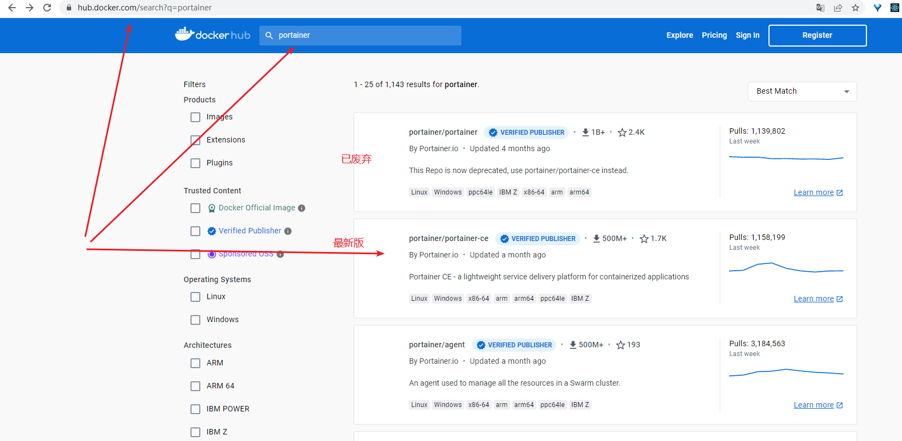
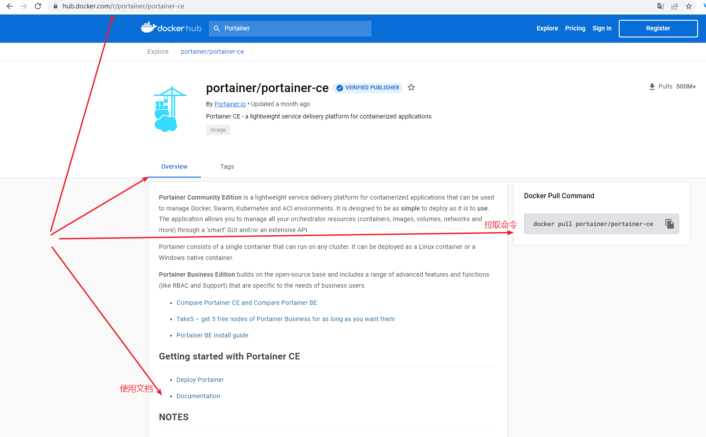
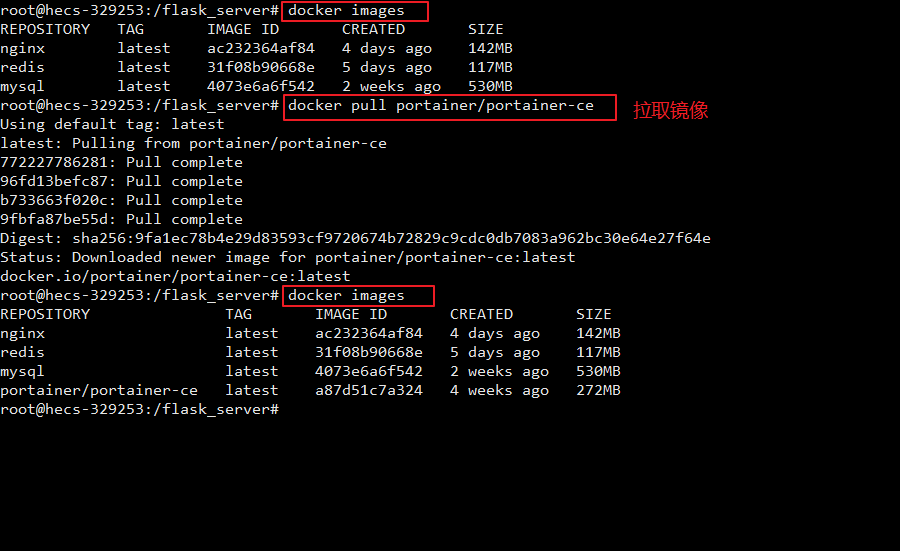
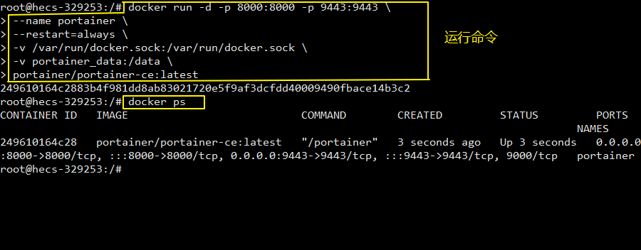
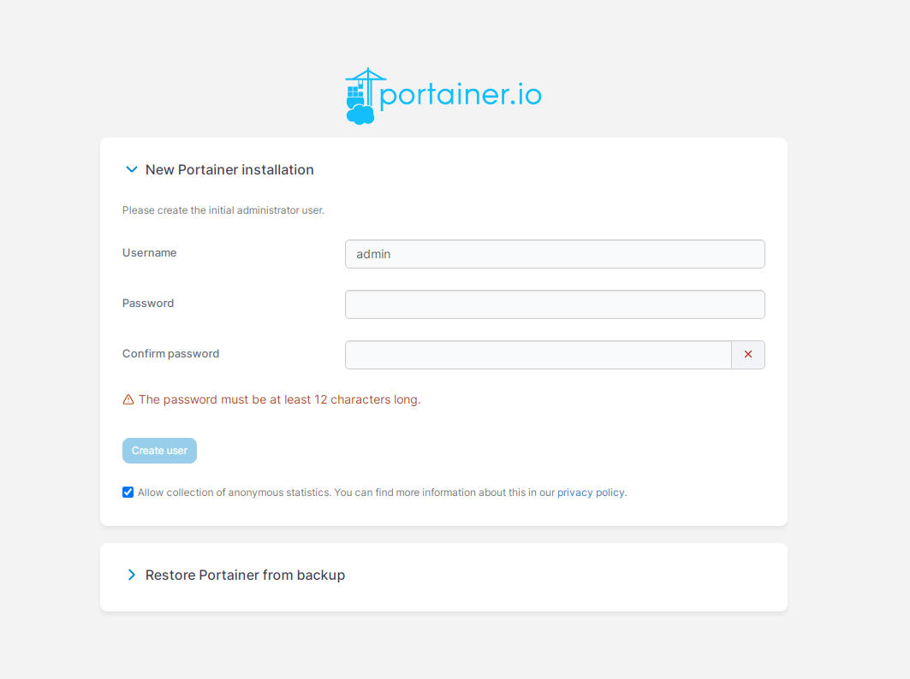
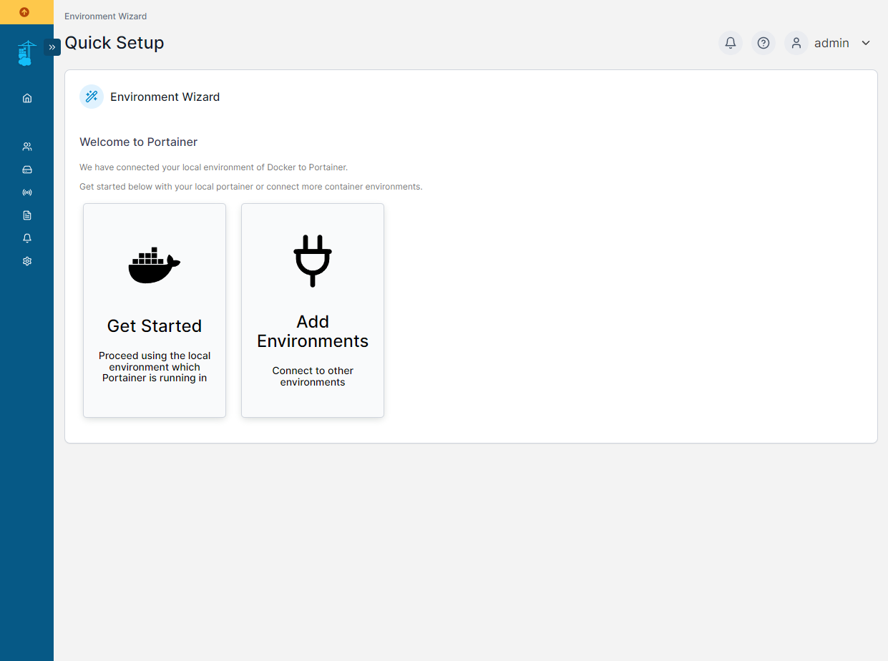
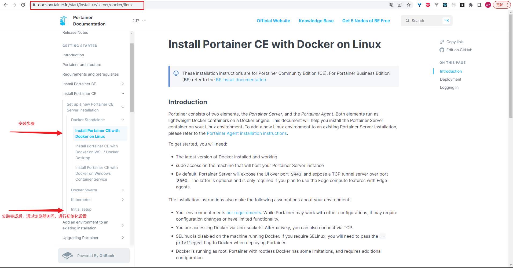

### 1. 概述
Portainer 是一款轻量级的应用，它提供了图形化界面，用于方便地管理 Docker 环境，包括单机环境和集群环境。

官网：https://www.portainer.io/

### 2. 在 Docker 镜像仓库查找 Portainer 镜像
[dockerhub 镜像仓库](https://hub.docker.com/)




### 3. 拉取 Portainer 镜像
```
# 拉取 nginx 镜像
docker pull portainer/portainer-ce           # 不加版本号默认下载 latest 版本

# 查看镜像
docker images
```



### 4. Portainer 的运行
在宿主机上创建用于存储 portainer 数据的数据卷
```
mkdir -p /docker/portainer
```

使用 Portainer 镜像创建并启动容器
```
docker run -d -p 8000:8000 -p 9443:9443 \
--name portainer \
--restart=always \
-v /var/run/docker.sock:/var/run/docker.sock \
-v portainer_data:/data \
portainer/portainer-ce:latest
```
命令说明：
- ```-p 9443:9443```
指定端口映射（宿主机端口:容器端口）；默认情况下，Portainer 生成并使用自己的 SSL 整数来保护端口 ```9443```，即使用 HTTPS 来访问；如果想要打开 HTTP 端口，则将 ```-p 9443:9443``` 改为 ```-p 9000:9000```。
- ```--name portainer```
命名启动的容器名字为 ```portainer```
- ```--restart=always```
重启模式，每次启动 docker 都会自动重启 ```portainer``` 容器
- ```-v``` 挂载容器数据卷，前面是宿主机部分，后面是容器部分
- ```portainer/portainer-ce:latest```
表示使用该镜像创建容器



### 5. 在浏览器上登录网站查看可视化界面
#### （1） 首次访问（将会进入 Portainer 服务器的初始设置页面）
当通过 Portainer 镜像创建并启动容器后，就可以在浏览器上登录网站查看可视化界面了：
```
# 登录的网址，如：https://127.0.0.1:9443
https://你的域名或ip:9443

# 如果使用的是 -p 9000:9000 启动的，则访问
http://你的域名或ip:9000
```

通过网址进入网站后，就可以进行初始化设置了（即创建第一个用户）：
- 你创建的第一个用户将是管理员，用户名默认为 ```admin```，你可以根据需要来更改它。
- 密码必须至少包含 12 个字符并满足列出的密码要求



#### （2） 登陆 Portainer 管理画面
创建管理员用户后，环境向导将自动启动，该向导将帮助你开始使用 Portainer，现在就能使用 Portainer 管理服务器的容器了。



### 6. 官方文档
官方文档：https://docs.portainer.io/start/install-ce/server/docker/linux


