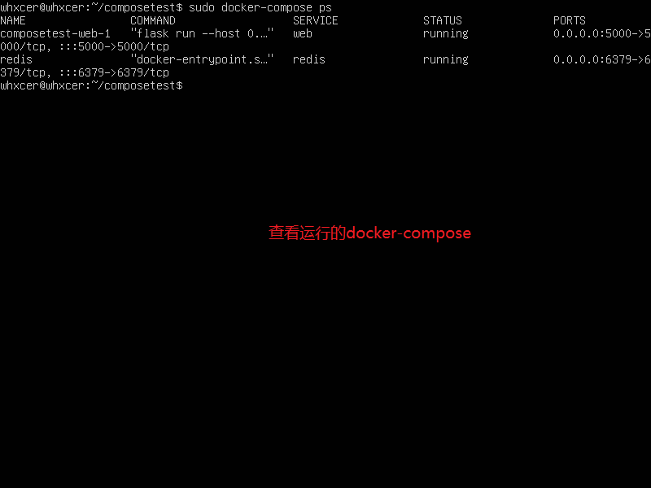
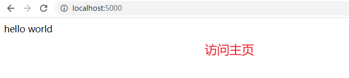
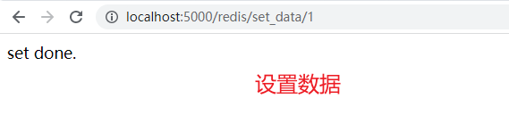
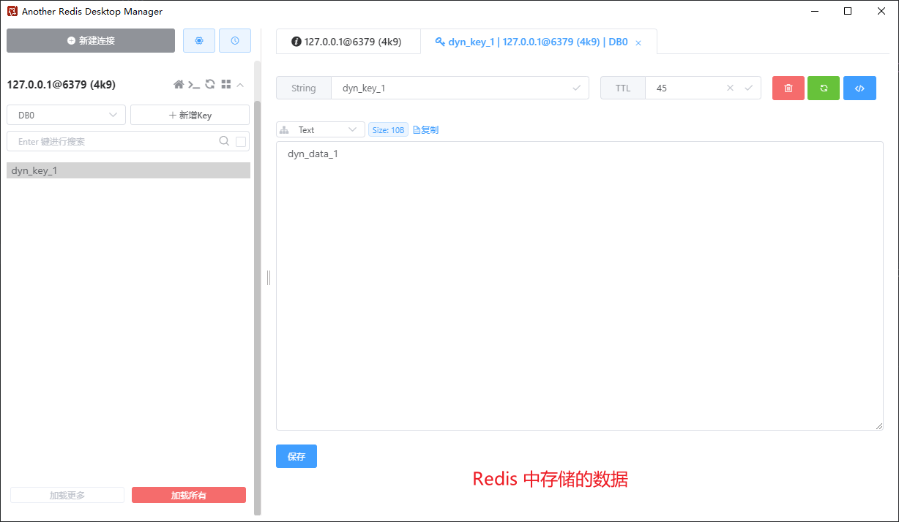
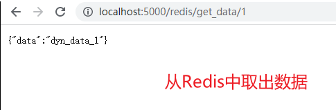

## （一） 概述
使用 Docker 来开发，我们应遵循每个容器只做一件事的原则，因此 Flask应用、MySQL、Redis 等，它们分别运行在各自的容器中，所以一个完整的项目，可以视为是由多个容器组成的。

管理多个容器：
1. 手动操作
手动建立各个容器之间的依赖关系
2. 使用 docker-compose
docker-compose 是基于 docker 的编排工具，使容器的操作能够批量的，可视的执行，是一个管理多个容器的工具，比如可以解决容器之间的依赖关系，当宿主机需要启动较多的容器时，如果都是手动操作会比较麻烦而且容易出错，这个时候推荐使用 docker 的单机编排工具 docker-compose。

## （二） docker-compose 的安装和卸载
### 1. ubuntu 安装（下载的是 v2.2.2 版本）
```
# 从官方 GitHub Release 处直接下载编译好的二进制包
sudo curl -L https://github.com/docker/compose/releases/download/v2.2.2/docker-compose-`uname -s`-`uname -m` > /usr/local/bin/docker-compose

# 国内用户可以使用以下方式加快下载
sudo curl -L https://download.fastgit.org/docker/compose/releases/download/v2.2.2/docker-compose-`uname -s`-`uname -m` > /usr/local/bin/docker-compose
或
sudo curl -L https://get.daocloud.io/docker/compose/releases/download/v2.2.2/docker-compose-`uname -s`-`uname -m` > /usr/local/bin/docker-compose
```

### 2. ubuntu 上安装 docker-compose 遇到 Permission denied 问题
使用 ```sudo curl -L https://github.com/docker/compose/releases/download/v2.2.2/docker-compose-`uname -s`-`uname -m` > /usr/local/bin/docker-compose``` 命令来执行时，会提示上述命令的权限不够，即使加了 ```sudo``` 也不行。

解决方案：切换到超级用户下执行安装命令
```
# 进入超级用户模式（root）
$ sudo -i

# 退出超级用户模式
$ exit
或
$ logout
```

### 3. 将可执行权限应用于刚刚下载的 docker-compose 二进制文件
```
sudo chmod +x /usr/local/bin/docker-compose
```

### 4. 测试是否安装成功
```
docker-compose version
# Docker Compose version v2.2.2
```

### 5. docker-compose 的卸载
```
sudo rm /usr/local/bin/docker-compose
```

## （三） docker-compose 的使用
以一个 Flask 应用和 redis 作为示例
### 1. docker-compose 使用的三个步骤
1. 使用 Dockerfile 定义应用程序的环境
2. 使用 docker-compose.yml 定义构成应用程序的服务，这样它们可以在隔离环境中一起运行
3. 执行 docker-compose up 命令来启动并运行整个应用程序

### 2. 创建一个目录并切换至目录中
```
$ mkdir composetest
$ cd composetest
```

### 3. 创建 web 应用
app.py 文件
```py
from flask import Flask, jsonify
from flask_redis import FlaskRedis
import time


app = Flask(__name__)


# flask-redis 的配置和初始化
# 说明：Redis 服务启动后默认有 16 个数据库，编号分别是从 0 到 15，这边连接的是 0 号数据库
# 这边的 REDIS_URL 中的主机名必须使用 redis，使用 localhost 或者是 127.0.0.1 的话都不能连接上 redis
# REDIS_URL = "redis://用户名:密码@主机:端口/Redis默认的n号数据库" --> 在 Redis 6.0 之前的版本中，登陆Redis Server只需要输入密码（前提配置了密码 requirepass ）即可，不需要输入用户名
app.config['REDIS_URL'] = 'redis://:123456@redis:6379/0'
redis_client = FlaskRedis(app)


@app.route('/')
def index():
    return 'Hello World'

@app.route('/redis/set_data/<int:id>')
def set_data(id):
    # 准备相关的数据
    user_id = str(id)
    data = 'dyn_data_{}'.format(user_id)
    data_key = 'dyn_key_{}'.format(user_id)
    # 设置超时时间为 60 秒，当动态数据超过 60 没有更新时，Redis 会自动清除该数据。
    expires = int (time.time()) + 60

    # 写入 redis 中
    # 通过管道 pipeline 来操作 redis，以减少客户端与 redis-server 的交互次数。
    p = redis_client.pipeline()
    p.set(data_key, data)
    p.expireat(data_key, expires)
    p.execute()

    return '设置成功'

@app.route('/redis/get_data/<int:id>')
def get_data(id):
    user_id = str(id)
    data_key = 'dyn_key_{}'.format(user_id)
    data = redis_client.get(data_key)

    print('data = {}'.format(data))

    if data:
        return jsonify(
            {
                'data': data.decode(),
            }
        )
    else:
        return jsonify({})
```

### 4. 创建 Dockerfile 文件
```
# 指定下载 python 版本，说明该镜像以哪个镜像为基础
FROM python:3.8.5

# 构建者的基本信息
MAINTAINER whxcer

# 创建 app 文件夹
RUN mkdir -p /app

# 进入 app 目录
RUN cd /app
# 或 WORKDIR /app

# 在容器内部执行的命令
RUN pip install flask -i https://pypi.douban.com/simple/
RUN pip install flask-redis -i https://pypi.douban.com/simple/
# RUN pip install -r requirements.txt -i https://pypi.douban.com/simple/

# 将 linux 系统当前目录下的内容拷贝到容器的 /app 目录下
ADD . /app

# 暴露 5000 端口
EXPOSE 5000

# 将 app 文件夹为工作目录
WORKDIR /app

# 容器启动的时候执行的命令 flask run
CMD ["flask", "run", "--host", "0.0.0.0"]
# 用单引号的话，flask应用启动不起来，必须要用双引号
```

### 5. 关于 Redis 的下载、安装、配置
具体请查看之前的博客：[使用Docker启动并运行Redis](https://www.cnblogs.com/wanghuizhao/p/17124637.html)

### 6. 创建 docker-compose.yml 配置文件
```
version: '3'
services:
    web
        build: .
        ports:
            - "5000:5000"
    redis:
        image: redis:latest
        container_name: redis
        volumes:
            - /docker/redis/data:/data                              # 通过挂载给 redis 数据备份
            - /docker/redis/redis.conf:/etc/redis/redis.conf        # 挂载 redis 配置文件
        command: /bin/bash -c "redis-server /etc/redis/redis.conf"  # 容器启动后启动 redis 服务器
        ports:
            - 6379:6379         # 使用宿主机的端口映射到容器的端口，宿主机:容器
        restart: always         # always 表示容器运行发生错误时一直重启
```

命令说明：
- 定义了两个服务：```web``` 和 ```redis```
- ```web``` 该 web 服务使用从当前目录的 Dockerfile 中构建的镜像。并且它将容器和主机绑定到暴露的端口 5000。此示例服务使用 Flask Web 服务器的默认端口 5000
- ```redis``` 由于已经在本地下载了 redis，而且版本为 latest，所以该 redis 服务使用本地的 redis 镜像。如果本地不存在该镜像，它将会自动去 ```Docker Hub``` 拉取公共 Redis 镜像

### 7. docker-compose 的启动、查看、停止
当前目录结构为：
```
├── composetest
│   ├── app.py
│   ├── Dockerfile
│   ├── docker-compose.yml
```

docker-compose 的启动、查看、停止
> 提示：以下三个命令的操作，都得在之前创建好的 composetest 目录下进行

```
# 后台启动 docker-compose
$ docker-compose up -d

# 查看正在运行的 docker-compose
$ docker-compose ps

# 停止 docker-compose 的运行
$ docker-compose stop
```

### 8. 示意图
1. 服务器下查看运行的 docker-compose

2. 访问主页

3. 设置数据，在 Redis 中缓存

4. 查看 Redis 中存储的数据

5. 获取 Redis 中存储的数据


## （四） 参考
[docker-compose 分类](https://www.cnblogs.com/liwenchao1995/category/2213923.html)
[RUNOOB Docker Compose](https://www.runoob.com/docker/docker-compose.html)
