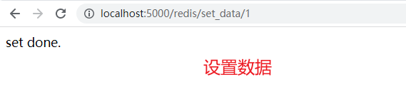
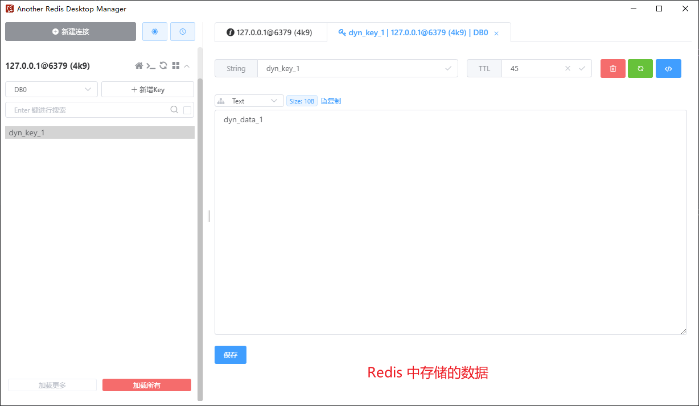
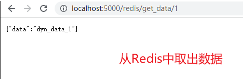

## （一） docker 多容器的应用
1. 使用 flask 编写一个 web 应用，将数据存放于 redis 中
2. 在 docker 开发中，我们应该遵循每个容器只做一件事的原则
3. 我们运行两个容器，一个用于运行 flask 应用，一个用于运行 redis

## （二） redis 和 flask 应用

### 1. Docker 运行 redis
具体的操作请参考之前的博客：[使用Docker启动并运行Redis](https://www.cnblogs.com/wanghuizhao/p/17124637.html)

### 2. flask 应用
具体的操作请参考之前的博客：
- [在 Flask 中使用 Redis 来缓存数据](https://www.cnblogs.com/wanghuizhao/p/17124629.html)
- [使用Docker启动并运行Flask应用](https://www.cnblogs.com/wanghuizhao/p/17132229.html)

需要改动的地方
1. Dockerfile 文件
```
# 指定下载 python 版本，说明该镜像以哪个镜像为基础
FROM python:3.8.5

# 构建者的基本信息
MAINTAINER whxcer

# 创建 app 文件夹
RUN mkdir -p /app

# 进入 app 目录
RUN cd /app
# 或 WORKDIR /app

# 在容器内部执行的命令
RUN pip install flask -i https://pypi.douban.com/simple/
RUN pip install flask-redis -i https://pypi.douban.com/simple/
# RUN pip install -r requirements.txt -i https://pypi.douban.com/simple/

# 将 linux 系统当前目录下的内容拷贝到容器的 /app 目录下
ADD . /app

# 暴露 5000 端口
EXPOSE 5000

# 将 app 文件夹为工作目录
WORKDIR /app

# 容器启动的时候执行的命令 flask run
CMD ["flask", "run", "--host", "0.0.0.0"]
# 用单引号的话，flask应用启动不起来，必须要用双引号
```
2. app.py 文件
```py
from flask import Flask, jsonify
from flask_redis import FlaskRedis
import time


app = Flask(__name__)


# flask-redis 的配置和初始化
# 说明：Redis 服务启动后默认有 16 个数据库，编号分别是从 0 到 15，这边连接的是 0 号数据库
# 这边的 REDIS_URL 中的主机名必须使用 redis，使用 localhost 或者是 127.0.0.1 的话都不能连接上 redis
# REDIS_URL = "redis://用户名:密码@主机:端口/Redis默认的n号数据库" --> 在 Redis 6.0 之前的版本中，登陆Redis Server只需要输入密码（前提配置了密码 requirepass ）即可，不需要输入用户名
app.config['REDIS_URL'] = 'redis://:123456@redis:6379/0'
redis_client = FlaskRedis(app)


@app.route('/')
def index():
    return 'Hello World'

@app.route('/redis/set_data/<int:id>')
def set_data(id):
    # 准备相关的数据
    user_id = str(id)
    data = 'dyn_data_{}'.format(user_id)
    data_key = 'dyn_key_{}'.format(user_id)
    # 设置超时时间为 60 秒，当动态数据超过 60 没有更新时，Redis 会自动清除该数据。
    expires = int (time.time()) + 60

    # 写入 redis 中
    # 通过管道 pipeline 来操作 redis，以减少客户端与 redis-server 的交互次数。
    p = redis_client.pipeline()
    p.set(data_key, data)
    p.expireat(data_key, expires)
    p.execute()

    return '设置成功'

@app.route('/redis/get_data/<int:id>')
def get_data(id):
    user_id = str(id)
    data_key = 'dyn_key_{}'.format(user_id)
    data = redis_client.get(data_key)

    print('data = {}'.format(data))

    if data:
        return jsonify(
            {
                'data': data.decode(),
            }
        )
    else:
        return jsonify({})
```

### 3. 构建 flask 应用的镜像
利用 ```docker build``` 命令构建镜像

```bash
docker build -t="flask_demo" .
或
docker build -t flask_demo .
```
命令说明
- ```-t``` 用来指定新镜像的用户信息、名字、版本等
- ```.``` 命令最后的 点 表示在当前目录寻找 Dockerfile 文件

## （三） 将这两个容器相互连接
```
docker run -d --rm -p 5000:5000 --link redis flask_demo

# 连接多个容器的情况
# docker run -d --rm -p 5000:5000 --link redis --link mysql flask_demo
```
命令说明：
- ```-d``` 后台运行容器，并返回容器ID
- ```--rm``` 表示退出容器时会自动将其删除
- ```-p``` 指定端口映射，格式为：主机(宿主)端口:容器端口
- ```--link``` 用于连接其他容器，我们这里连接的是 redis 容器
- ```flask_demo``` 为运行的镜像的名字

## （四） 运行效果图
1. 访问主页

2. 设置数据，在 Redis 中缓存

3. 查看 Redis 中存储的数据

4. 获取 Redis 中存储的数据


## （五）额外说明：进入容器手动操作
### 1. 常用的 docker 命令
```
docker images       查看存在的镜像
docker ps -a        查看存在的容器
docker ps           查看正在运行的容器

docker rm -f [id]   删除容器
docker rmi [id]     删除镜像

docker start [id]   将处于暂停状态的容器启动
docker stop [id]    将处于运行状态的容器暂停
docker restart [id] 将处于暂停状态的容器启动
docker attach [id]  进入运行状态的容器中
ctrl+p ctrl+q       退出容器，容器状态处于 Up
exit                退出容器，容器状态处于 exit
```

### 2. 以交互模式运行容器
```
docker run -it -p 5000:5000 flask_demo /bin/bash
或
docker run -it -p 5000:5000 --link redis flask_demo /bin/bash
```
