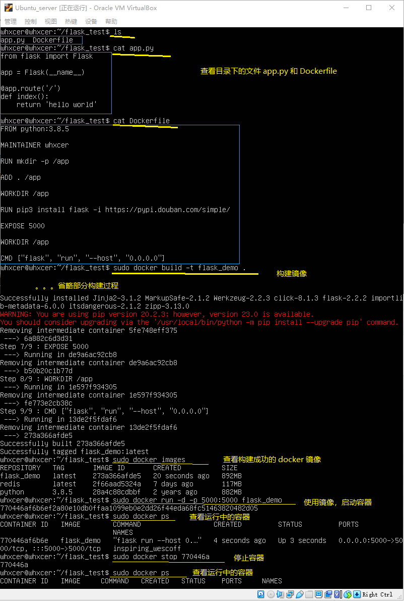
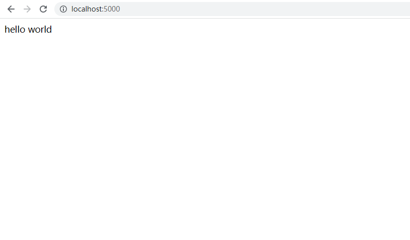

## （一） 拉取 Python 镜像
```
docker pull python

# 查看当前主机中存在的镜像
docker images
```

## （二） 编写 flask 应用
### 1. 创建一个目录
```
mkdir flask_demo

# 进入目录中
cd flask_demo
```

### 2. 创建 flask 应用
使用 vi 编辑 app.py 文件
```
vi app.py
```

app.py 文件的内容
```py
from flask import Flask

app = Flask(__name__)

@app.route('/')
def index():
    return 'hello world'
```

## （二） 编写 Dockerfile 生成镜像以及相关操作
### 1. 编写 Dockerfile 文件
> app.py 和 Dockerfile 文件在同一个目录下

使用 vi 编辑 Dockerfile 文件
```
vi Dockerfile
```

Dockerfile 文件的内容
```
# 指定下载 python 版本，说明该镜像以哪个镜像为基础
FROM python:3.8.5

# 构建者的基本信息
MAINTAINER whxcer

# 创建 app 文件夹
RUN mkdir -p /app

# 进入 app 目录
RUN cd /app
# 或 WORKDIR /app

# 在容器内部执行的命令
RUN pip install flask -i https://pypi.douban.com/simple/
# RUN pip install -r requirements.txt -i https://pypi.douban.com/simple/

# 将 linux 系统当前目录下的内容拷贝到容器的 /app 目录下
ADD . /app

# 暴露 5000 端口
EXPOSE 5000

# 将 app 文件夹为工作目录
WORKDIR /app

# 容器启动的时候执行的命令 flask run
CMD ["flask", "run", "--host", "0.0.0.0"]
# 用单引号的话，flask应用启动不起来，必须要用双引号
```


> 提示：虽然可以先手动运行原生的镜像，进入容器后再手动去下载程序依赖以及运行应用，但是不建议这样做，这样操作麻烦还耗时。最佳的方案是编写一个 Dockerfile，并在每次发生更改(例如修改源代码)时构建镜像的新版本。

### 2. 构建镜像
有了 Dockerfile 之后，就可以利用 docker build 命令构建镜像了
```
docker build -t="flask_demo" .
或
docker build -t flask_demo .
```
命令说明
- ```-t``` 用来指定新镜像的用户信息、名字、版本等
- ```.``` 命令最后的 点 表示在当前目录寻找 Dockerfile 文件

### 3. 查看构建之后的镜像
```
docker images
```

### 4. 使用镜像，启动容器
```
docker run -d -p 5000:5000 flask_demo
```
### 5. 查看启动后的容器
```
docker ps
```

### 6. 停止项目
```
docker stop 容器id
```

### 7. 操作示意图


