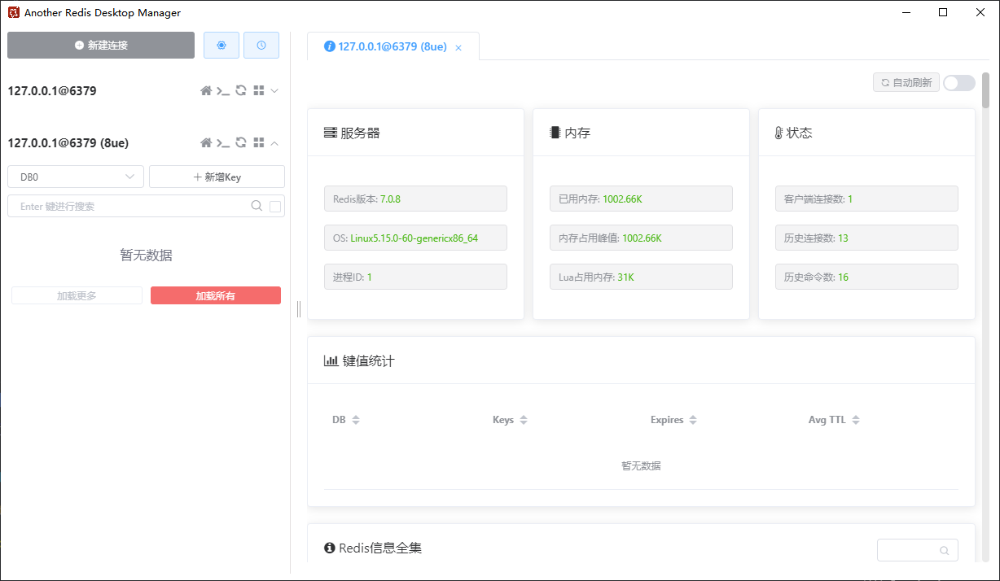

### 1. 拉取 redis 镜像
```
# 拉取 redis 镜像
docker pull redis

# 查看镜像
docker images
```

### 2. Redis 相关的配置
创建挂载目录以及获取 redis.conf 配置文件
```
1. 创建挂载目录
mkdir -p /docker/redis
mkdir -p /docker/redis/data

2. 进入挂载目录
cd /docker/redis

3. 下载 redis.conf 文件
wget http://download.redis.io/redis-stable/redis.conf

4. 更改 redis.conf 文件的权限
chmod 777 redis.conf
```

修改默认的 redis.conf 配置文件
```
vi redis.conf
```

```
# 这行要注释掉，解除本地连接限制
bind 127.0.0.1          --> 需要注释掉

# 保护模式是一层安全保护，以避免在互联网上打开的 Redis 实例被访问和利用。
# 当保护模式打开并且默认用户没有密码时，服务器仅允许在本机的回环连接，其他机器无法连接。
# 默认为 yes，在生产环境下一般设置为 no，这样可以避免客户端连接时出现超时或连接不上的情况。
protected-mode no

# 默认 no 为不守护进程模式，docker 部署不需要改为 yes，docker run -d 本身就是后台启动，不然会冲突
daemonize no

# 设置密码
requirepass 123456

# 持久化
appendonly yes
```

### 3. docker run 运行 redis 镜像
```
docker run --name redis -p 6379:6379 \
-v /docker/redis/redis.conf:/etc/redis/redis.conf \
-v /docker/redis/data:/data \
-d redis \
redis-server /etc/redis/redis.conf \
--appendonly yes

# 或额外添加 privileged 配置
docker run --name redis -p 6379:6379 \
--privileged=true \
-v /docker/redis/redis.conf:/etc/redis/redis.conf \
-v /docker/redis/data:/data \
-d redis \
redis-server /etc/redis/redis.conf \
--appendonly yes
```

命令说明：
- ```--name redis``` 为容器指定一个名称，查看和进行操作都比较方便。
- ```-p 6379:6379``` 指定端口映射，格式为：```主机(宿主)端口:容器端口```
- ```--privileged=true``` 开启特殊权限
Docker 挂载主机目录时（添加容器数据卷），如果 Docker 访问出现 ```cannot open directory:Permission denied```，在挂载目录的命令后多加一个 --privileged=true 参数即可。
因为出于安全原因，容器不允许访问任何设备，```privileged``` 让 docker 应用容器获取宿主机 ```root``` 权限（特殊权限），允许我们的 Docker 容器访问连接到主机的所有设备。容器获得所有能力，可以访问主机的所有设备，例如，CD-ROM、闪存驱动器、连接到主机的硬盘驱动器等。
- ```-v``` 挂载文件或目录：前面是宿主机部分，后面是容器部分
- ```-d redis``` 表示后台启动 redis；使用此方式启动，则 redis.conf 中 daemonize 必须设置为 no，否则会无法启动
- ```redis-server /etc/redis/redis.conf```  在容器内启动 redis-server 的命令，用于加载容器内的 conf 文件，最终找到的是挂载的目录 /docker/redis/redis.conf。
- ```--appendonly yes``` 开启 redis 持久化

### 4. 查看 redis 运行的状态
```
docker ps
或
docker ps -a
```

### 5. 在 Windows 下连接 redis
使用的可视化工具 [AnotherRedisDesktopManager](https://github.com/qishibo/AnotherRedisDesktopManager/)
由于我们在 redis.conf 设置了 redis 访问密码为 ```123456```，所以使用可视化工具连接 redis 的时候记得输入密码




### 6. 参考
[docker启动redis](https://blog.csdn.net/occultskyrong/article/details/85199926)
