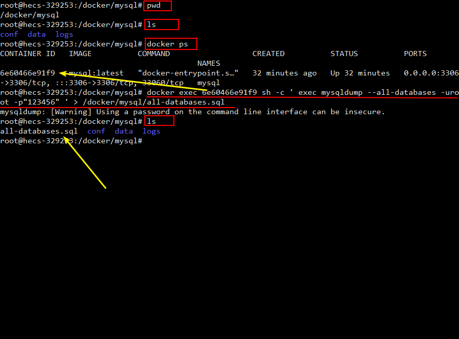

### 1. 在 Docker 镜像仓库查找 MySQL 镜像
1. [dockerhub 镜像仓库](https://hub.docker.com/)


2. 或者通过命令 ```docker search mysql``` 在宿主机终端查找

### 2. 拉取 MySQL 镜像
```
# 拉取 MySQL 镜像
docker pull mysql           # 不加版本号默认下载 latest 版本，即 docker pull mysql:latest

# 查看镜像
docker images
```

### 3. 运行镜像（使用 mysql:latest 镜像创建容器）
在宿主机的根目录中创建挂载目录
```
mkdir -p /mysql/conf            # mysql 的配置目录
mkdir -p /mysql/logs            # mysql 的日志目录
mkdir -p /mysql/data            # mysql 的数据目录
```

使用 mysql:latest 镜像创建容器
```
docker run -p 3306:3306 --name mysql -v /mysql/conf:/etc/mysql/conf.d -v /mysql/logs:/logs -v /mysql/data:/var/lib/mysql -e MYSQL_ROOT_PASSWORD=123456 -d mysql:latest
```
命令说明：
- ```-p 3306:3306```
将宿主机的 3306 端口映射到 docker 容器的 3306 端口，格式为：主机(宿主)端口:容器端口
- ```--name mysql```
运行服务的名字
- ```-v /mysql/conf:/etc/mysql/conf.d```
将宿主机 ```/mysql``` 目录下的 ```/conf``` 挂载到容器的 ```/etc/mysql/conf.d```
- ```-v /mysql/logs:/logs```
将宿主机 ```/mysql``` 目录下的 ```/logs``` 目录挂载到容器的 ``` /logs```
- ```-v /mysql/data:/var/lib/mysql```
将宿主机 ```/mysql``` 目录下的 ```/data``` 目录挂载到容器的 ```/var/lib/mysql```
- ```-e MYSQL_ROOT_PASSWORD=123456```
初始化 ```root``` 用户的密码为 ```123456```
- ```-d mysql:latest```
后台程序运行 ```mysql```


运行效果：


### 4. 连接已启动的 MySQL
1. 进入 docker 容器内，使用 cmd 命令行工具查看

2. 在 windows 上使用可视化工具查看（HeidiSQL 是开源免费的 MySQL 客户端图形化管理工具）


### 5. 数据备份
```
docker exec myql服务容器ID sh -c ' exec mysqldump --all-databases -uroot -p"123456" ' > /mysql/all-databases.sql
```

