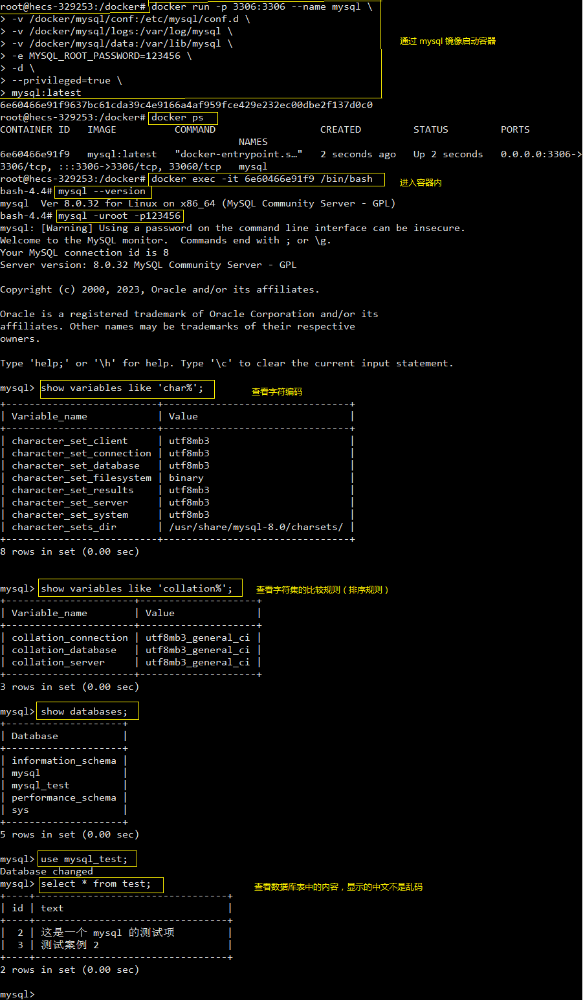

### 1. 在 Docker 镜像仓库查找 MySQL 镜像
1. [dockerhub 镜像仓库](https://hub.docker.com/)


2. 或者通过命令 ```docker search mysql``` 在宿主机终端查找

### 2. 拉取 MySQL 镜像
```
# 拉取 MySQL 镜像
docker pull mysql           # 不加版本号默认下载 latest 版本，即 docker pull mysql:latest

# 查看镜像
docker images
```

### 3. 查看 MySQL 的具体信息
使用 MySQL 镜像启动容器，然后查看 MySQL 的具体信息
```
docker run -it mysql /bin/bash

# 查看数据库的版本
mysql --version

# 查找 Docker 内，MySQL 配置文件 my.cnf 的位置
# mysql --help | grep my.cnf
# 将配置文件从容器内拷贝到宿主机中
# docker cp mysql_container:/etc/mysql/my.cnf /docker/mysql/conf
```

或直接看 [dockerhub](https://hub.docker.com/) 官方文档，拉取镜像的地方有具体的配置说明：https://hub.docker.com/_/mysql


### 4. 运行镜像（使用 mysql:latest 镜像创建容器）
在移除容器的时候，为了不让数据库的数据丢失，需要把 mysql 容器里的目录挂载在宿主机的目录上
```
mkdir -p /docker/mysql/conf            # mysql 的配置目录
mkdir -p /docker/mysql/logs            # mysql 的日志目录
mkdir -p /docker/mysql/data            # mysql 数据存储位置
mkdir -p /docker/mysql/mysql-files
```

为了避免出现乱码的情况，需要设定 mysql 的字符编码为 utf-8，下面为 ```my.cnf``` 文件中的内容，放在 ```/docker/mysql/conf``` 目录中
```sql
[client]
port = 3306
default-character-set=utf8

[mysql]
no-auto-rehash
default-character-set=utf8

[mysqld]
default-storage-engine=INNODB
character-set-server=utf8
```

使用 mysql:latest 镜像创建容器
```
docker run -p 3306:3306 --name mysql \
-v /docker/mysql/conf:/etc/mysql/conf.d \
-v /docker/mysql/logs:/var/log/mysql \
-v /docker/mysql/data:/var/lib/mysql \
-e MYSQL_ROOT_PASSWORD=123456 \
-d \
--privileged=true \
mysql:latest


# -v /docker/mysql/conf:/etc/mysql/conf.d \
# 上面这行的“挂载配置文件”可更换为下面的这行
# -v /docker/mysql/conf/my.cnf:/etc/mysql/my.cnf \

# 可加可不加的一行
# -v /docker/mysql/mysql-files:/var/lib/mysql-files/ \
```
命令说明：
- ```-p 3306:3306```
将宿主机的 3306 端口映射到 docker 容器的 3306 端口，格式为：主机(宿主)端口:容器端口
- ```--name mysql```
运行服务的名字
- ```-v```
挂载数据卷，格式为：宿主机目录或文件:容器内目录或文件
- ```-e MYSQL_ROOT_PASSWORD=123456```
初始化 ```root``` 用户的密码为 ```123456```
- ```-d```
后台程序运行容器
- ```--privileged=true``` 开启特殊权限
Docker 挂载主机目录时（添加容器数据卷），如果 Docker 访问出现 ```cannot open directory:Permission denied```，在挂载目录的命令后多加一个 --privileged=true 参数即可。
因为出于安全原因，容器不允许访问任何设备，```privileged``` 让 docker 应用容器获取宿主机 ```root``` 权限（特殊权限），允许我们的 Docker 容器访问连接到主机的所有设备。容器获得所有能力，可以访问主机的所有设备，例如，CD-ROM、闪存驱动器、连接到主机的硬盘驱动器等。

运行效果：


在 windows 上使用可视化工具查看（HeidiSQL 是开源免费的 MySQL 客户端图形化管理工具）


### 5. 数据备份
```
docker exec myql服务容器ID sh -c ' exec mysqldump --all-databases -uroot -p"123456" ' > /docker/mysql/all-databases.sql
```

