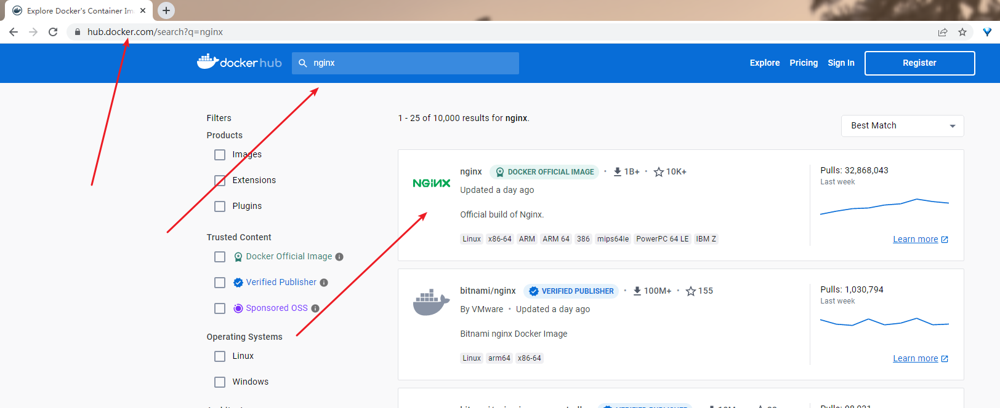
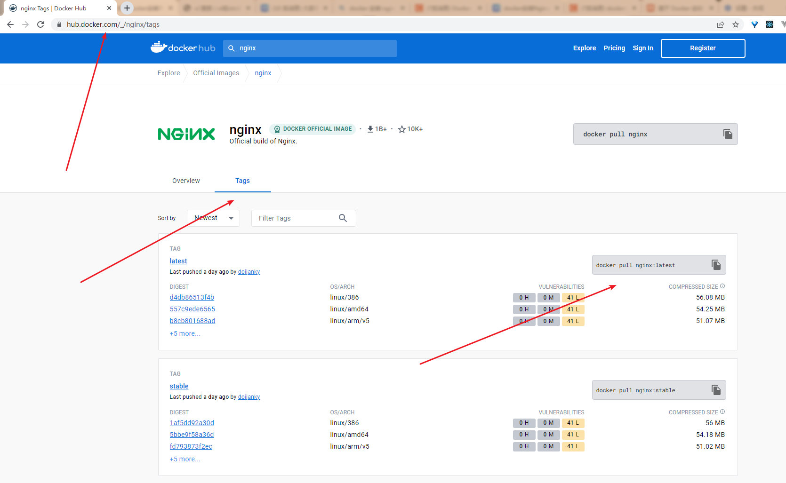
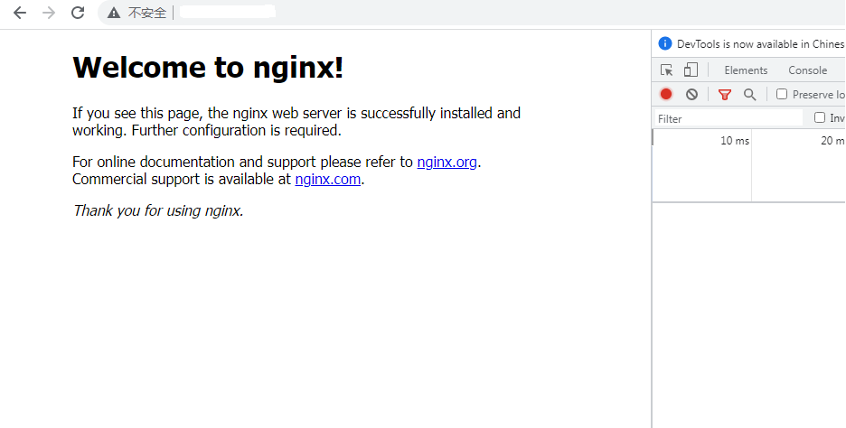
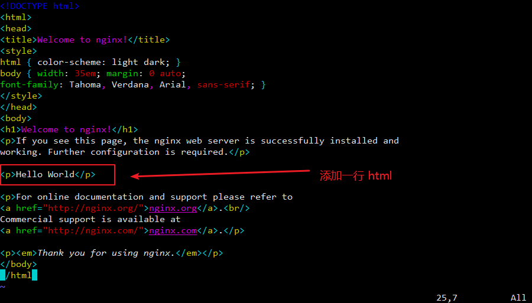
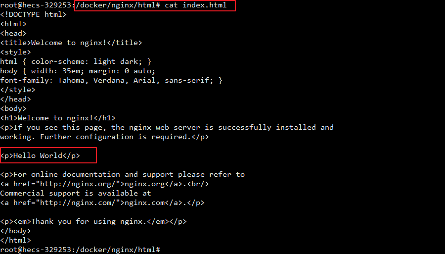
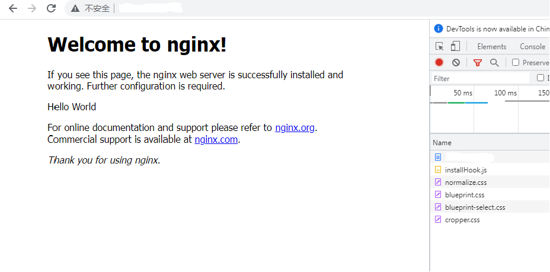

### 1. 在 Docker 镜像仓库查找 nginx 镜像
1. [dockerhub 镜像仓库](https://hub.docker.com/)


1. 或者通过命令 docker search nginx 在宿主机终端查找

### 2. 拉取 nginx 镜像
```
# 拉取 nginx 镜像
docker pull nginx           # 不加版本号默认下载 latest 版本，即 docker pull nginx:latest

# 查看镜像
docker images
```

### 3. 运行镜像（使用 nginx:latest 镜像创建容器）
先在宿主机的根目录中创建挂载目录
```
mkdir -p /docker/nginx/conf         # nginx 存放配置文件的目录
mkdir -p /docker/nginx/logs         # nginx 存放日志的目录
mkdir -p /docker/nginx/html         # nginx 启动网站目录（存放静态文件的目录）
```

然后将 nginx 镜像中的部分文件拷贝到宿主机的挂载目录中
```
# 1. 先使用 nginx 镜像创建 nginx 容器，将文件拷贝出来先
docker run --name nginx -d -p 80:80 nginx

# 2. 将容器中的 nginx.conf 文件拷贝到宿主机中
docker cp nginx:/etc/nginx/nginx.conf /docker/nginx/conf/nginx.conf

# 3. 将容器中 conf.d 文件夹（包括里面的文件）拷贝到宿主机中
docker cp nginx:/etc/nginx/conf.d /docker/nginx/conf/conf.d

# 4. 将容器中的 html 文件夹拷贝到宿主机中
docker cp nginx:/usr/share/nginx/html /docker/nginx/
```

停止刚刚运行的 nginx 容器
```
# 停止 nginx 容器
docker stop nginx

# 删除 nginx 容器
docker rm nginx

# 删除正在运行的 nginx 容器
docker rm -f nginx
```

重新使用 nginx 镜像创建 nginx 容器，并挂载容器数据卷到宿主机目录中
```
# 要执行的命令
docker run -p 80:80 --name nginx -v /docker/nginx/conf/nginx.conf:/etc/nginx/nginx.conf -v /docker/nginx/conf/conf.d:/etc/nginx/conf.d -v /docker/nginx/logs:/var/log/nginx -v /docker/nginx/html:/usr/share/nginx/html -d --restart=always nginx:latest

# 方便阅读
docker run -p 80:80 --name nginx \
-v /docker/nginx/conf/nginx.conf:/etc/nginx/nginx.conf \
-v /docker/nginx/conf/conf.d:/etc/nginx/conf.d \
-v /docker/nginx/logs:/var/log/nginx \
-v /docker/nginx/html:/usr/share/nginx/html \
-d \
--restart=always \
nginx:latest
```
命令说明：
- ```-p 80:80``` 指定端口映射，格式为：主机(宿主)端口:容器端口
- ```--name nginx``` 命名启动的容器名字为 nginx
- ```-v``` 载文件或目录：前面是宿主机部分，后面是容器部分
- ```-d``` 表示后台启动容器
- ```--restart=always``` 重启模式，每次启动 docker 都会自动重启 nginx 容器。
- ```nginx:latest``` 表示使用该镜像创建容器

### 4. 运行效果

以容器内的目录来说明，nginx 启动后，加载了主配置文件 ```/etc/nginx/nginx.conf ```，然后主配置文件中有这么一句配置：```include /etc/nginx/conf.d/*.conf;```，相当于引用了 ```/etc/nginx/conf.d/*.conf``` 中所有的 ```conf``` 文件，目前 ```/etc/nginx/conf.d``` 中只有一个 ```default.conf``` 文件，里面设定了欢迎页面为 ``` /usr/share/nginx/html/index.html``` 文件。如果需要更详细的说明，请直接查看主配置文件 ```/etc/nginx/nginx.conf ```。

### 5. 运行效果
尝试更改欢迎页面的 html



在浏览器上刷新，就可以看到修改后的内容了

