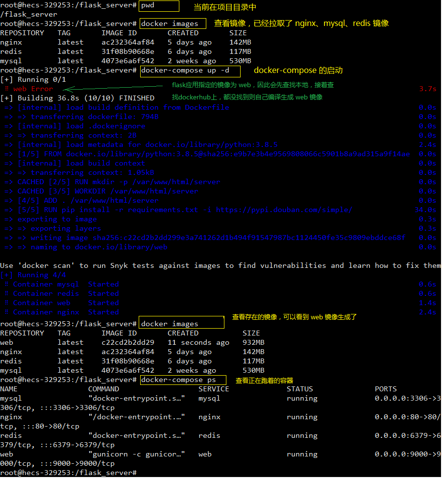
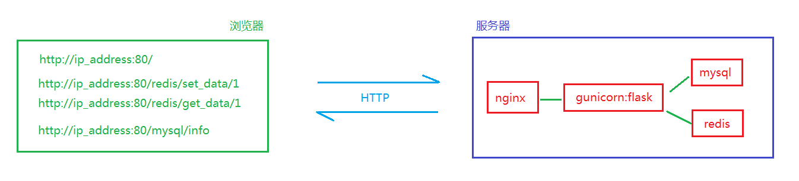
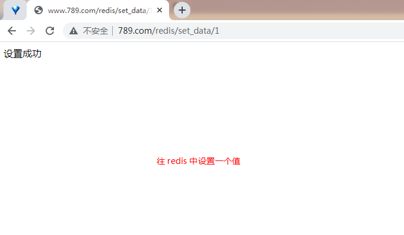
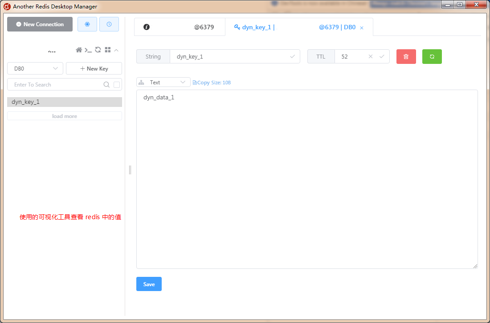
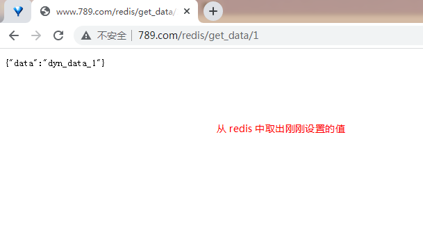
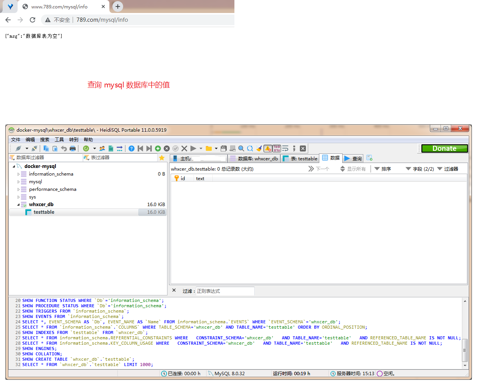
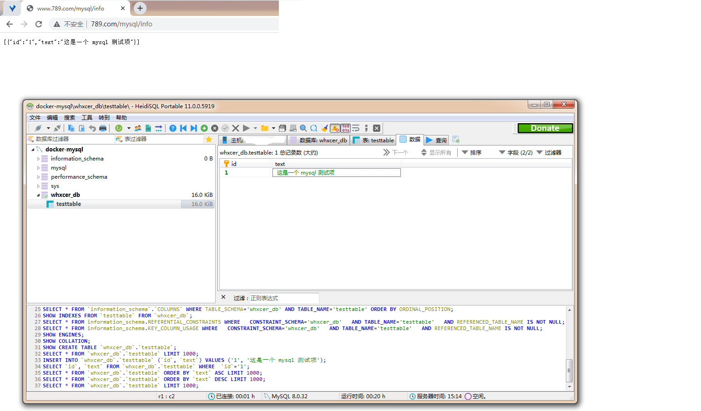

## （一） 镜像的准备
### 1. docker-compose 的概述
docker-compose 中的两个要素：
1. 服务（service）
一个个应用容器实例，比如订单微服务、库存微服务、mysql容器、nginx容器或者redis容器
2. 工程（project）
由一组关联的应用容器组成的一个完整业务单元，在 docker-compose.yml 文件中定义。

docker-compose 使用的三个步骤：
1. 编写 ```Dockerfile``` 定义各个服务应用，并构建出对应的镜像文件
2. 使用 ```docker-compose.yml``` 定义一个完整业务单元，安排好整体应用中的各个容器服务。
3. 最后，执行 ```docker-compose up``` 命令 来启动并运行整个应用程序，完成一键部署上线

### 2. 项目整体的目录结构图
```
│
├─flask_server
│  ├─app
│  │  ├─compose
│  │  │  ├─gunicorn
│  │  │  ├─mysql
│  │  │  │  ├─conf
│  │  │  │  │  └─my.cnf
│  │  │  │  ├─data
│  │  │  │  ├─init
│  │  │  │  ├─logs
│  │  │  │  └─mysql-files
│  │  │  ├─nginx
│  │  │  │  ├─nginx.conf
│  │  │  │  ├─conf
│  │  │  │  ├─html
│  │  │  │  │  └─index.html
│  │  │  │  └─logs
│  │  │  └─redis
│  │  │      ├─redis.conf
│  │  │      └─data
│  │  └─server
│  │      └─__init__.py
│  ├─.env
│  ├─docker-compose.yml
│  ├─Dockerfile
│  ├─gunicorn_config.py
│  ├─requirements.txt
│  └─wsgi.py

```

flask_server 为整个后端项目的目录，具体的信息为：
1. ```/app/compose```
该目录里面包含了运行容器要挂载在宿主机上的数据卷（nginx、mysql、redis、gunicorn）
2. ```/app/server```
整个 flask 应用的代码包
3. ```.env```
环境变量配置文件，供 docker-compose 和 flask 应用来使用
4. ```docker-compose.yml```
docker-compose 的配置文件
5. ```Dockerfile```
要生成 flask 应用镜像的 Dockerfile 文件
6. ```gunicorn_config.py```
Gunicorn 服务器的启动配置文件
7. ```requirements.txt```
flask 应用要安装的依赖包
8. ```wsgi.py```
flask 应用的入口文件，供 gunicorn 服务器调用（Gunicorn 服务器和 flask 应用在同一个容器中）

### 3. nginx、mysql、redis 镜像的准备
直接从 [dockerhub](https://hub.docker.com/) 镜像仓库拉取对应的镜像
```
docker pull nginx
docker pull mysql
docker pull redis
```

### 4. Flask 应用镜像的准备
Gunicorn 和 Flask 应用代码都在一个容器内，由 Gunicorn 这个高性能的 Python WSGI 服务器来跑 Flask 应用。

#### （1） ```wsgi.py``` 和 ```./app/server/__init__.py``` 文件
```wsgi.py``` flask 应用入口文件，供 gunicorn 调用
```py
import os
from dotenv import load_dotenv


dotenv_path = os.path.join(os.path.dirname(__file__), '.env')
if os.path.exists(dotenv_path):
    load_dotenv(dotenv_path)

from app.server import app

# app = create_app('production')
application = app
```

```./app/server/__init__.py``` flask 应用主文件
```
from flask import Flask, jsonify
from flask_redis import FlaskRedis
import time
import pymysql


app = Flask(__name__)


# flask-redis 的配置和初始化
# 说明：Redis 服务启动后默认有 16 个数据库，编号分别是从 0 到 15，这边连接的是 0 号数据库
# 这边的 REDIS_URL 中的主机名必须使用 redis，使用 localhost 或者是 127.0.0.1 的话都不能连接上 redis
# REDIS_URL = "redis://用户名:密码@主机:端口/Redis默认的n号数据库" --> 在 Redis 6.0 之前的版本中，登陆Redis Server只需要输入密码（前提配置了密码 requirepass ）即可，不需要输入用户名
app.config['REDIS_URL'] = 'redis://:123456@redis:6379/0'
app.config['JSON_AS_ASCII'] = False
redis_client = FlaskRedis(app)


@app.route('/')
def index():
    return 'Hello World'

@app.route('/redis/set_data/<int:id>')
def set_data(id):
    # 准备相关的数据
    user_id = str(id)
    data = 'dyn_data_{}'.format(user_id)
    data_key = 'dyn_key_{}'.format(user_id)
    # 设置超时时间为 60 秒，当动态数据超过 60 没有更新时，Redis 会自动清除该数据。
    expires = int (time.time()) + 60

    # 写入 redis 中
    # 通过管道 pipeline 来操作 redis，以减少客户端与 redis-server 的交互次数。
    p = redis_client.pipeline()
    p.set(data_key, data)
    p.expireat(data_key, expires)
    p.execute()

    return '设置成功'

@app.route('/redis/get_data/<int:id>')
def get_data(id):
    user_id = str(id)
    data_key = 'dyn_key_{}'.format(user_id)
    data = redis_client.get(data_key)

    print('data = {}'.format(data))

    if data:
        return jsonify(
            {
                'data': data.decode(),
            }
        )
    else:
        return jsonify({})

@app.route('/mysql/info')
def mysql_info():
    # 打开数据库连接；数据库、用户名、密码 要和 .env 配置文件中的配置保持一致
    db = pymysql.connect(host='mysql',
                        port=3306,
                        user='root',
                        password='whxcer123456',
                        database='whxcer_db')

    # 使用 cursor() 方法创建一个游标对象 cursor
    cursor = db.cursor()

    result = []
    try:
        # 使用 execute() 方法执行 SQL，如果表不存在，则创建一个
        sql = """create table if not exists testtable (
                    id   VARCHAR(20)  NOT NULL,
                    text VARCHAR(20)  NOT NULL,
                    PRIMARY KEY(id) )"""
        cursor.execute(sql)

        # 使用 execute()  方法执行 SQL 查询
        cursor.execute("select * from testtable")
        # 使用 fetchall() 方法获取所有记录列表
        data = cursor.fetchall()

        if data:
            for row in data:
                d = {
                    'id': row[0],
                    'text': row[1],
                }
                result.append(d)

            print("result = {}".format(result))
            return jsonify(result)
        else:
            return jsonify({"msg": "数据库表为空"})
    except:
        print("======数据库查询出错======")

    # 关闭数据库连接
    db.close()
    return jsonify({"msg": "数据库操作报错"})
```

#### （2） ```.env``` 文件
```.env``` 环境变量配置文件
```
# Redis
REDIS_IMAGE_TAG=redis
REDIS_CONTAINER_NAME=redis
REDIS_PORTS=6379:6379

# MySQL
MYSQL_IMAGE_TAG=mysql
MYSQL_CONTAINER_NAME=mysql
MYSQL_PORTS=3306:3306
MYSQL_ROOT_PASSWORD=whxcer123456
MYSQL_DATABASE=whxcer_db
MYSQL_USER=whxcer
MYSQL_PASSWORD=whxcer123456

# Web
WEB_IMAGE_TAG=web
WEB_CONTAINER_NAME=web
WEB_PORTS=9000:9000

# Nginx
NGINX_IMAGE_TAG=nginx
NGINX_CONTAINER_NAME=nginx
NGINX_PORTS=80:80

FLASK_APP=wsgi.py
# SECRET_KEY=youdontknow
# MD5_SALT=youdontknow
# FLASK_ENV=production
```

#### （3） ```requirements.txt``` 文件
```requirements.txt``` 依赖包
```
flask
python-dotenv
gunicorn
gevent
greenlet
pymysql
flask-redis
```

#### （4） ```gunicorn_config.py``` 文件
```gunicorn_config.py``` 文件，gunicorn 的启动配置文件
```
"""gunicorn + gevent 的配置文件"""

# 多进程
import multiprocessing

# 绑定ip + 端口
bind = '0.0.0.0:9000'

# 进程数 = cup数量 * 2 + 1
workers = multiprocessing.cpu_count() * 2 + 1

# 等待队列最大长度，超过这个长度的链接将被拒绝连接
backlog = 2048

# 工作模式--协程
worker_class = 'gevent'

# 最大客户客户端并发数量，对使用协程的 worker 的工作有影响
# 服务器配置设置的值  1000：中小型项目  上万并发： 中大型
worker_connections = 1000

# 进程名称
proc_name = 'gunicorn.pid'

# 进程 pid 记录文件
pidfile = '/tmp/gunicorn.pid'

# 日志等级
loglevel = 'warning'

# 日志文件名
logfile = '/tmp/gunicorn_log.log'

# 设置访问日志
accesslog = '/tmp/gunicorn_acess.log'

# 设置错误信息日志
errorlog  = '/tmp/gunicorn_error.log'

# 代码发生变化是否自动重启
reload = True
```

#### （5） ```Dockerfile``` 文件
```Dockerfile``` 打包 flask 应用镜像用到的 Dockerfile 文件
```
# 指定下载 python 版本，说明该镜像以哪个镜像为基础
FROM python:3.8.5

# 构建者的基本信息
MAINTAINER whxcer

# 创建 server 文件夹
RUN mkdir -p /var/www/html/server

# 将 server 文件夹作为工作目录，并且进入 server 目录
WORKDIR /var/www/html/server

# 将 linux 系统当前目录下的内容拷贝到容器的 /var/www/html/server 目录下
ADD . /var/www/html/server

# 在容器内部执行的命令，利用 pip 安装依赖
# RUN pip3 install -r requirements.txt -i https://pypi.douban.com/simple/
RUN pip install -r requirements.txt -i https://pypi.douban.com/simple/

# 使用 Gunicorn 服务器启动 Flask 应用
CMD ["gunicorn", "-c", "gunicorn_config.py", "wsgi:application"]
```

#### （6） 生成 flask 应用的镜像的方式
1. 使用 ```docker build``` 命令直接打包出 flask 应用的镜像
2. 使用 ```docker-compose up``` 启动的时候，自动打包 flask 应用的镜像

### 5. docker-compose.yml 的准备
#### （1） nginx 数据卷相关
1. 创建相应的目录数据卷，参照上面的 ```项目目录结构图```
2. 创建 ```nginx.conf``` 配置文件，放在 ```/app/compose/nginx``` 目录中
```
# nginx.conf 文件
user  nginx;
worker_processes  auto;

error_log   /var/log/nginx/error.log notice;
pid         /var/log/nginx/nginx.pid;

events {
    use   epoll;                # epoll是多路复用IO(I/O Multiplexing)中的一种方式,但是仅用于linux2.6以上内核,可以大大提高nginx的性能
    worker_connections  1024;   # 单个后台 worker process 进程的最大并发链接数
}

#设定 http 服务器，利用它的反向代理功能提供负载均衡支持
http {
    include       mime.types;
    default_type  application/octet-stream;

    access_log  /var/log/nginx/access.log;
    error_log   /var/log/nginx/error.log;

    sendfile        on;
    keepalive_timeout  65;

    # 设定请求缓冲
    client_header_buffer_size    1k;
    large_client_header_buffers  4 4k;

    include /etc/nginx/conf.d/*.conf;

    # 设定负载均衡的服务器列表
    upstream flask {
        ip_hash;
        server web:9000; # Docker-compose web 服务端口，该 ip 是云服务器本机的地址，根据实际情况修改
    }

    server {
        listen 80   ; # 监听 80 端口
        server_name localhost;

        charset utf-8;
        client_max_body_size 1024m;

        location /static/ {
            # 需要提前把要托管的静态文件放置到挂载的数据卷中 ./app/compose/nginx/html:/usr/share/nginx/html，容器内就可以访问到了
            # 或者直接将要挂载到 nginx 容器中的数据卷指向前端项目的 static 或 templates 目录中
            alias /usr/share/nginx/html/;       # 和 docker-compose 中挂载的数据卷保持一致
            add_header Cache-Control no-store;

            autoindex on;       # 开启索引功能，可以在浏览器上显示目录

            # 关闭计算文件确切大小（单位bytes），只显示大概大小（单位kb、mb、gb）
            autoindex_exact_size off;

            autoindex_localtime on;     # 显示本机时间而非 GMT 时间
        }

        location / {
            proxy_pass http://flask;
            proxy_read_timeout 6000;
            proxy_connect_timeout 6000;
            proxy_send_timeout 6000;

            # Nginx 解决浏览器跨域问题
            add_header Access-Control-Allow-Origin *;
            add_header Access-Control-Allow-Headers X-Requested-With;
            add_header Access-Control-Allow-Methods GET,POST,PUT,DELETE,PATCH,OPTIONS;
       }
    }
}
```

#### （2） mysql 数据卷相关
1. 创建相应的目录数据卷，参照上面的 ```项目目录结构图```
2. 创建 ```my.cnf``` 配置文件，放在 ```/app/compose/mysql/conf``` 目录中
```
# my.cnf 文件
[client]
port = 3306
default-character-set=utf8

[mysql]
no-auto-rehash
default-character-set=utf8

[mysqld]
default-storage-engine=INNODB
character-set-server=utf8
collation-server=utf8_general_ci
```

#### （3） redis 数据卷相关
1. 创建相应的目录数据卷，参照上面的 ```项目目录结构图```
2. 创建 ```redis.conf``` 配置文件，放在 ```/app/compose/redis``` 目录中

从云上下载 redis.conf 配置文件，然后更改里面的某些配置
```
下载 redis.conf 文件
wget http://download.redis.io/redis-stable/redis.conf
```

修改 redis.conf 配置文件
```
# 这行要注释掉，解除本地连接限制
bind 127.0.0.1    --> 需要注释掉

# 默认 yes，如果设置为 yes，则只允许在本机的回环连接，其他机器无法连接。
protected-mode no

# 默认 no 为不守护进程模式，docker 部署不需要改为 yes，docker run -d 本身就是后台启动，不然会冲突
daemonize no

# 设置密码
requirepass 123456

# 持久化
appendonly yes
```

#### （4） gunicorn 数据卷相关
在 ```/app/compose``` 目录中创建一个 ```gunicorn``` 目录，用来存放 gunicorn 服务器的相关 log 文件


## （二） docker-compose.yml 文件
```
version: "3"
services:
    redis:
        image: ${REDIS_IMAGE_TAG}
        container_name: ${REDIS_CONTAINER_NAME}
        privileged: true
        volumes:
            - ./app/compose/redis/redis.conf:/etc/redis/redis.conf  # 挂载 redis 配置文件
            - ./app/compose/redis/data:/data  # 通过挂载给 redis 数据备份
        ports:
            - ${REDIS_PORTS}
        command: /bin/bash -c "redis-server /etc/redis/redis.conf"   # 容器启动后启动 redis 服务器
        restart: always # always 表示容器运行发生错误时一直重启
        env_file:
            - ./.env

    mysql:
        image: ${MYSQL_IMAGE_TAG}
        container_name: ${MYSQL_CONTAINER_NAME}
        privileged: true
        volumes:
            - ./app/compose/mysql/conf:/etc/mysql/conf.d    # 挂载配置文件对应的目录
            # - ./app/compose/mysql/conf/my.cnf:/etc/mysql/my.cnf # 挂载配置文件
            - ./app/compose/mysql/logs:/var/log/mysql
            - ./app/compose/mysql/data:/var/lib/mysql:rw  # 挂载数据库数据，可读可写
            - ./app/compose/mysql/init:/docker-entrypoint-initdb.d/ # 挂载数据初始化 sql 脚本
            - ./app/compose/mysql/mysql-files:/var/lib/mysql-files
        ports:
            - ${MYSQL_PORTS}  # 与配置文件保持一致
        command: --default-authentication-plugin=mysql_native_password  # 解决外部无法访问
        restart: always
        env_file:
            - ./.env

    web:
        image: ${WEB_IMAGE_TAG}
        build: .                 # 使用当前目录下的 Dockerfile
        container_name: ${WEB_CONTAINER_NAME}
        ports:
            - ${WEB_PORTS}
        volumes:
            - ./:/var/www/html/server # 挂载项目代码
            - ./app/compose/gunicorn:/tmp # 挂载 gunicorn 日志
        links:
            - mysql:mysql
            - redis:redis
        depends_on: # 依赖关系
            - mysql
            - redis
        environment:
            - DEBUG=False
        restart: always
        tty: true
        stdin_open: true
        env_file:
            - ./.env

    nginx:
        image: ${NGINX_IMAGE_TAG}
        container_name: ${NGINX_CONTAINER_NAME}
        ports:
            - ${NGINX_PORTS}
        expose:
            - "80"
        volumes:
            - ./app/compose/nginx/nginx.conf:/etc/nginx/nginx.conf
            - ./app/compose/nginx/conf/conf.d:/etc/nginx/conf.d         # nginx 存放配置文件的目录
            - ./app/compose/nginx/logs:/var/log/nginx                   # nginx 存放日志的目录
            - ./app/compose/nginx/html:/usr/share/nginx/html            # nginx 启动网站目录（存放静态文件的目录）
        links:
            - web
        depends_on:
            - web
        restart: always
        env_file:
            - ./.env
```


## （三） docker-compose 的运行
### 1. docker-compose 的操作过程


### 2. 前后端的整体结构示意图


### 3. 浏览器上访问效果图
#### （1） 访问主页


#### （2） 往 redis 中设置值


#### （3） 使用 redis 可视化工具
使用可视化工具 [AnotherRedisDesktopManager](https://github.com/qishibo/AnotherRedisDesktopManager/) 查看 redis 中的值


#### （4） 从 redis 中获取刚刚设置的值


#### （5） 查询 MySQL 数据库中的数据


#### （6） 往 MySQL 数据库中手动添加记录再访问


## （四） 完整 demo 项目放在 GitHub 上
demo 地址：
https://github.com/wtraceback/docker-compose-flask-server

项目运行：
```
# 1. 拉取 nginx、mysql、redis 镜像
docker pull nginx
docker pull mysql
docker pull redis

# 2. 克隆项目到服务器中
$ git clone https://github.com/wtraceback/docker-compose-flask-server.git

# 3. 切换至目录中
$ cd docker-compose-flask-server

# 4. 运行 docker-compose
docker-compose up -d

# 5. 查看运行的状态
docker-compose ps
```

测试：
在浏览器中输入 ```http://服务器的ip:80``` 即可访问刚刚启动的 flask 应用