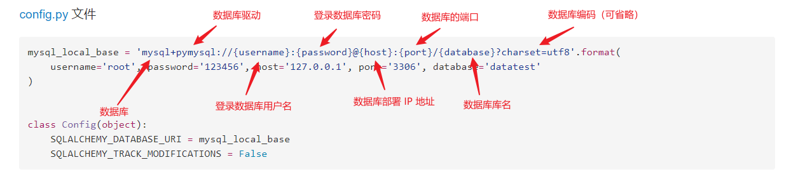

## （一） 前言
SQLAlchemy “采用简单的 Python 语言，为高效和高性能的数据库访问设计，实现了完整的企业级持久模型”。SQLAlchemy 是目前 Python 中最强大的 ORM 框架，功能全面。

Flask-SQLAlchemy 是一个为您的 Flask 应用增加 SQLAlchemy 支持的扩展，它封装了 SQLAlchemy，简化了在 Flask 中 SQLAlchemy 的使用。

## （二） 连接 SQLite
SQLite 它基于文件，不需要单独启动数据库服务器，适合在开发时使用，或是在数据库操作简单、访问量低的程序中使用。

使用 Flask-SQLAlchemy 连接 SQLite 比较简单，如下示例：
### 1. 初始化配置
config.py 文件
```py
import os
import sys


# 在扩展类实例化之前设置好配置项
WIN = sys.platform.startswith('win')
if WIN:
    # 如果是 Windows 系统，则使用三个斜线
    prefix = 'sqlite:///'
else:
    # 否则使用四个斜线
    prefix = 'sqlite:////'

basedir = os.path.abspath(os.path.dirname(__file__))


class Config(object):
    SQLALCHEMY_DATABASE_URI = prefix + os.path.join(basedir, 'data.db')
    SQLALCHEMY_TRACK_MODIFICATIONS = False
```

### 2. 使用示例
app.py 文件
```py
from flask import Flask
from flask_sqlalchemy import SQLAlchemy
import click
from config import Config


app = Flask(__name__)
app.config.from_object(Config)
db = SQLAlchemy(app)


class User(db.Model):
    id = db.Column(db.Integer, primary_key=True)
    username = db.Column(db.String(64), index=True, unique=True)
    password_hash = db.Column(db.String(128))


# 自定义命令来创建数据库表
@app.cli.command()
@click.option('--drop', is_flag=True, help='Create after drop.')
def initdb(drop):
    if drop:
        db.drop_all()
    db.create_all()

    click.echo('创建数据库表完成')
```

### 3. 创建数据库表的相关说明
1. 已经自定义了命令来创建数据库表，因此**不需要**通过 ```flask shell``` 进入交互模式去手动导入相关模块、手动创建数据库表
2. 在命令行下，使用命令 ```flask initdb``` 就可以创建数据库表了
3. 如果连接的是 SQLite 数据库，如果本地不存在对应的数据库文件，那么 Flask-SQLAlchemy 将会先自动的创建数据库文件，然后再创建数据库表（说明：SQLite 的数据库文件名就是数据库名）


## （三） 连接 MySQL
使用 Flask-SQLAlchemy 连接 MySQL，如下示例：
### 1. 初始化配置
config.py 文件
```py
mysql_local_base = 'mysql+pymysql://{username}:{password}@{host}:{port}/{database}?charset=utf8'.format(
    username='root', password='123456', host='127.0.0.1', port='3306', database='datatest'
)


class Config(object):
    SQLALCHEMY_DATABASE_URI = mysql_local_base
    SQLALCHEMY_TRACK_MODIFICATIONS = False
```



### 2. 使用示例
app.py 文件
```py
from flask import Flask
from flask_sqlalchemy import SQLAlchemy
import click
from config import Config


app = Flask(__name__)
app.config.from_object(Config)
db = SQLAlchemy(app)


class User(db.Model):
    id = db.Column(db.Integer, primary_key=True)
    username = db.Column(db.String(64), index=True, unique=True)
    password_hash = db.Column(db.String(128))


# 自定义命令来创建数据库表
@app.cli.command()
@click.option('--drop', is_flag=True, help='Create after drop.')
def initdb(drop):
    if drop:
        # 如果是 sqlite 数据库，则 db.create_all() 函数会创建数据库文件以及数据库表
        # 如果是 mysql 数据库，需要提前手动创建数据库，db.create_all() 函数只能创建数据库表：
        #   连接 mysql 时，db.create_all() 方法不会创建数据库本身，它只是基于 SQLAlchemy 模型在已经存在的数据库中创建表。
        #   如果数据库不存在，尝试运行 db.create_all() 将会引发错误，因为它无法连接到一个不存在的数据库。
        db.drop_all()
    db.create_all()

    click.echo('创建数据库表完成')
```

### 3. 启动 MySQL 数据库服务器
更具体的请查看博客 [MySQL的安装、安装过程遇到的问题以及可视化客户端的使用](https://www.cnblogs.com/wanghuizhao/p/16311200.html)

在 Windows 下启动 MySQL 数据库服务器：
```
1. 以管理员的身份运行 cmd 命令行工具
2. 然后通过命令行切换到 MySQL 解压后的 bin 目录里面
3. 启动 MySQL 服务器命令：
    net start mysql
```

### 4. 操作 MySQL 数据库服务器的方式
1. 命令行操作
用管理员身份运行 cmd
进入 MySQL 的命令行 mysql -u root -p
输入创建数据库的命令 create database library
...
2. 使用 MySQL 客户端，图形化管理工具（推荐）
HeidiSQL （有 安装版 和 免安装版）
https://www.heidisql.com/download.php

### 5. 相关说明
- 使用 Flask-SQLAlchemy 连接 MySQL，Flask-SQLAlchemy 不能直接创建库，只能进行表级别的操作。因此，需要我们【手动创建数据库】。
- 由于连接 MySQL 需要驱动包 pymysql，所以需要先安装驱动。```pip install pymysql```


## （四） 连接 SQLite 或 MySQL 的区别
使用 Flask-SQLAlchemy 连接 SQLite 或 MySQL，只是配置项之间的差异，其它代码保持一致即可。