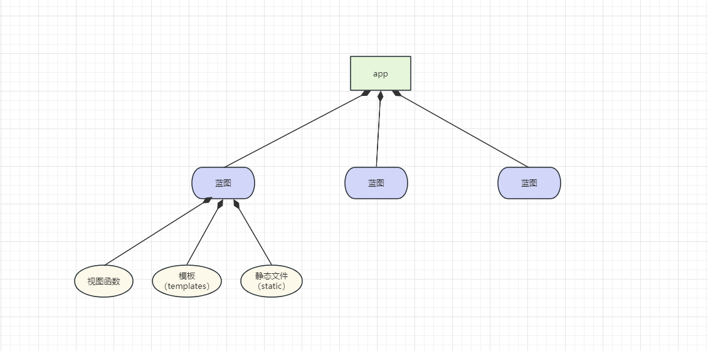
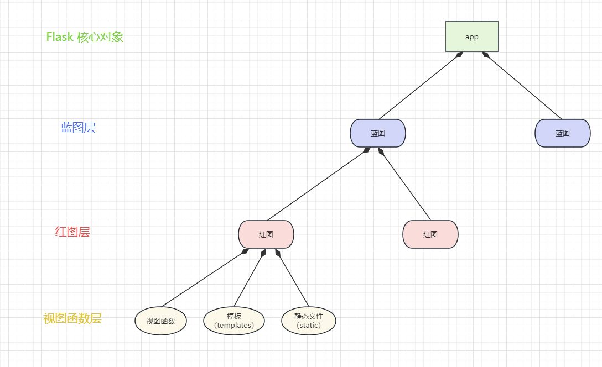

## 1. 蓝图
### 1.1. 概述
在 Flask 中，蓝图（Blueprint）是一种组织和管理路由、视图函数和静态文件的方式。它可以将一个应用分成多个模块，每个模块负责处理特定的路由和视图函数。
1. 模块化
蓝图可以将一个大型应用拆分成多个小模块，每个模块负责处理特定的功能或业务逻辑。这样可以提高代码的可维护性和可扩展性。
2. 路由管理
蓝图可以定义自己的路由，包括 URL 规则和对应的处理函数。这样可以将路由的定义分散到不同的蓝图中，使代码更加清晰和易于管理。
3. 视图函数组织
蓝图可以定义自己的视图函数，这些函数只处理蓝图范围内的请求。这样可以将相同功能的视图函数组织到同一个蓝图中，方便代码的组织和复用。
4. 静态文件管理
蓝图可以定义自己的静态文件目录，包括 CSS、JavaScript、图片等。这样可以将静态文件与视图函数关联起来，方便统一管理和加载。
5. 错误处理
蓝图可以定义自己的错误处理函数，用于处理特定蓝图范围内的错误。这样可以对不同模块的错误进行个性化处理，提高用户体验。



### 1.2. 蓝图的使用
项目整体的目录结构图
```bash
# 项目整体的目录结构图

│
├─flask_server
│  ├─ app.py
│  ├─ book.py
│  └─ user.py
```

在 ```book.py``` 文件中
```python
from flask import Blueprint

book = Blueprint('book', __name__)

@book.route("/get_book")
def get_book():
    return 'get book'
```

在 ```user.py``` 文件中
```python
from flask import Blueprint

user = Blueprint('user', __name__)

@user.route("/get_user")
def get_user():
    return 'get user'
```

在 ```app.py``` 文件中
```python
from flask import Flask


def register_blueprints(app):
    from book import book
    app.register_blueprint(book)
    from user import user
    app.register_blueprint(user)


app = Flask(__name__)
# 调用注册蓝图的函数
register_blueprints(app)


if __name__ == '__main__':
    app.run(debug=True)
```


## 2. 创建自己的 Redprint（即自定义 红图）
### 2.1. 概述
红图（Redprint）是自定义的一个概念，其目的是为了解决蓝图（Blueprint）在大型项目中的一些问题，红图和蓝图类似，但它允许我们更灵活地管理路由。

比如现在有两个路由：```/v1/book/get``` 和 ```/v1/user/get```，如何去定义路由？
方式一：
```
# 在注册蓝图时，使用 url_prefix 来解决
book = Blueprint('book', __name__)
app.register_blueprint(book, url_prefix='/v1/book')

user = Blueprint('user', __name__)
app.register_blueprint(user, url_prefix='/v1/user')
```
方式二：
```
# 在注册视图函数时，直接在路由中指定
book = Blueprint('book', __name__)
@book.route("/book/get")
def get_book():
    return 'get book'
app.register_blueprint(book, url_prefix='/v1')

user = Blueprint('user', __name__)
@user.route("/user/get")
def get_user():
    return 'get user'
app.register_blueprint(user, url_prefix='/v1')
```

上面两种创建路由的方式都不是很完美，都得写重复的代码，因此我们可以仿照蓝图的功能，照猫画虎的写一个叫做```红图```的类去做这件事，结构如下图所示：




### 2.1. 红图的注册和使用
下面是使用红图的一个例子：

项目整体的目录结构图
```bash
# 项目整体的目录结构图

│
├─flask_server
│  ├─ app.py
│  ├─ book.py
│  ├─ redprint.py
│  └─ user.py
```

首先，我们需要定义自己的 ```Redprint``` 类：
```
# 在 redprint.py 文件中
class Redprint():
    def __init__(self, name):
        self.name = name
        self.mound = []

    def route(self, rule, **options):
        def decorator(f):
            self.mound.append((f, rule, options))
            return f
        return decorator

    def register(self, bp, url_prefix=None):
        if url_prefix is None:
            url_prefix = '/' + self.name
        for f, rule, options in self.mound:
            # 仿照 Blueprint 中 route 方法的写法
            endpoint = self.name + '+' + options.pop('endpoint', f.__name__)
            bp.add_url_rule(url_prefix + rule, endpoint, f, **options)
```

然后，在我们的模块中使用这个 ```Redprint``` 替代原来的 ```Blueprint```：
```
# 在 book.py 文件中
from redprint import Redprint

book = Redprint('book')

@book.route('/get')
def get_book():
    return 'get book'
```

```
# 在 user.py 文件中
from redprint import Redprint

user = Redprint('user')

@user.route('/get')
def get_user():
    return 'get user'
```

最后，在主应用文件中注册这些 ```Redprint``` 到一个 ```Blueprint``` 上，这就是我们的 ```URL``` 前缀 ```'/v1'``` 出现的地方
```
# 在 app.py 或你的主文件中
from flask import Flask


def register_blueprints(app):
    from flask import Blueprint
    from book import book
    from user import user

    # 定义一个蓝图
    bp_v1 = Blueprint('v1', __name__)

    # 将红图注册到蓝图中
    book.register(bp_v1)
    user.register(bp_v1)

    # 将蓝图注册到 flask 核心对象中
    app.register_blueprint(bp_v1, url_prefix='/v1')


app = Flask(__name__)
# 调用注册蓝图的函数
register_blueprints(app)


if __name__ == '__main__':
    # 通过 url_map 可以查看整个 flask 中的路由信息
    print(app.url_map)
    app.run(debug=True)
```
这样，所有注册到 ```'v1'``` ```Blueprint``` 的 ```Redprint``` 都会拥有 ```'/v1'``` 这个 ```URL``` 前缀。如果想要改变这个前缀，只需要在 ```app.register_blueprint``` 中修改它即可。
