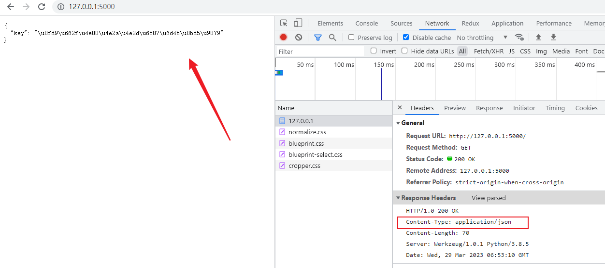
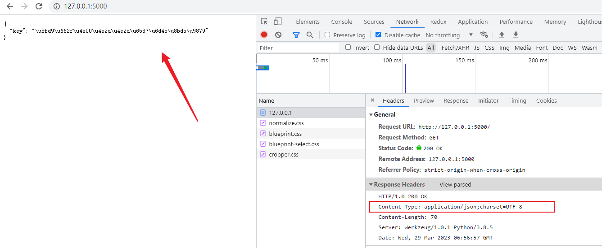
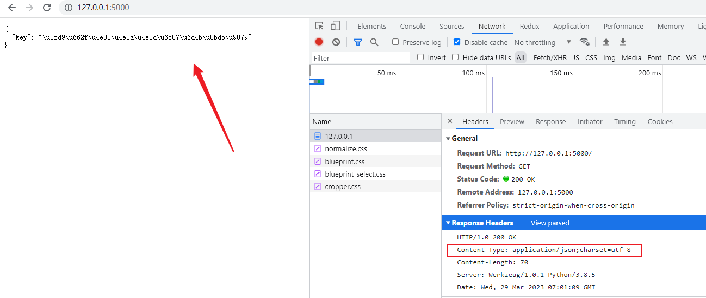
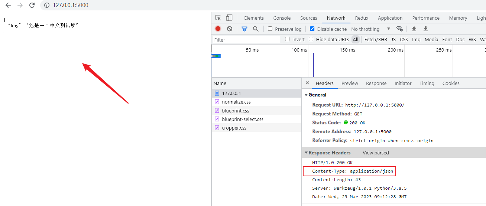

### 1. 问题点
使用 jsonify 直接返回数据，不加任何配置

```py
from flask import Flask, jsonify


app = Flask(__name__)

@app.route("/")
def index():
    data = {
        'key': '这是一个中文测试项'
    }
    return jsonify(data)
```



可以看到显示的并不是中文，而是 Unicode 编码的信息，完全不具有可读性


### 2. 尝试的解决方案
#### （1） 在响应中指定返回的数据类型（无法解决问题）
```
from flask import Flask, make_response, jsonify


app = Flask(__name__)

def json_response(data):
    # 指定返回的数据类型
    response = make_response(jsonify(data))
    response.headers["Content-Type"] = "application/json;charset=UTF-8"
    return response


@app.route("/")
def index():
    data = {
        'key': '这是一个中文测试项'
    }
    return json_response(data)
```



#### （2） 指定 jsonify 响应的媒体类型（无法解决问题）
```
from flask import Flask, jsonify


app = Flask(__name__)
# 指定发送数据的类型
app.config['JSONIFY_MIMETYPE'] = "application/json;charset=utf-8"


@app.route("/")
def index():
    data = {
        'key': '这是一个中文测试项'
    }
    return jsonify(data)
```



#### （3） 禁用 JSON_AS_ASCII 配置（解决问题）
```py
from flask import Flask, jsonify


app = Flask(__name__)
# 指定浏览器渲染的文件类型，和解码格式
app.config['JSON_AS_ASCII'] = False
# app.config['JSONIFY_MIMETYPE'] = "application/json;charset=utf-8"


@app.route("/")
def index():
    data = {
        'key': '这是一个中文测试项'
    }
    return jsonify(data)
```


