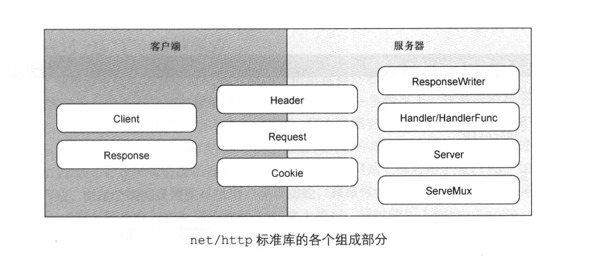
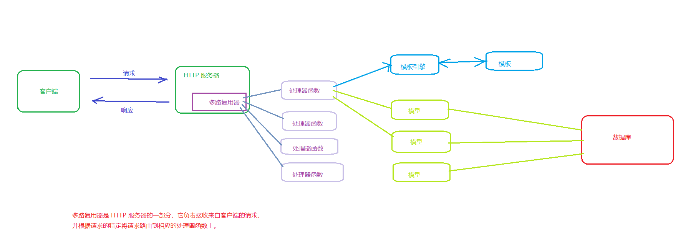

### 1. 概述
Go 中的 ```net/http``` 库提供了 HTTP 客户端和服务端的实现。也就是说 ```net/http``` 可以分为```客户端```和```服务器端```两部分，库中的结构和函数有些只支持客户端和服务器这两者中的一个，而有些则同时支持客户端和服务器，如下图所示：




### 2. 对 web 服务器的理解的示意图


#### 2.1. http 服务器（只讨论http，不讨论https的情况）
在 Go 语言的 ```net/http``` 库中，创建一个 HTTP 服务器的方式：

方式一：
```
http.ListenAndServe("", nil)

# 说明：
#     http.ListenAndServe 函数用于创建一个普通的 HTTP 服务器，它需要传入监听的地址和处理请求的多路复用器。
#     网络地址参数为空字符串，则服务器默认使用 80 端口进行网络连接
#     如果处理器参数为 nil，那么服务器将使用默认的多路复用器 DefaultServeMux
```

方式二：
```
s := &http.Server{
    Addr:           ":8080",
    Handler:        nil,
}
s.ListenAndServe()

# 说明：
#    创建一个自定义的 Server，管理服务端的行为
```

#### 2.2. 多路复用器
根据上面的图片所示，我们定义的```处理函数```，要将其注册到 ```多路复用器``` 里面，而 ```多路复用器``` 是 HTTP服务器 中的一个模块，多路复用器的创建方式：

方式一：默认的多路复用器 DefaultServeMux
```
# 创建方式：
#    根据上面创建 http 服务器的两种方式，传入的处理器参数为 nil，则服务器将使用默认的多路复用器 DefaultServeMux

# 1. 传入的处理器为 nil
http.ListenAndServe("", nil)

# 2. 传入的处理器为 nil
s := &http.Server{
    Addr:           ":8080",
    Handler:        nil,
}
s.ListenAndServe()

=====================================

# 往这个默认的多路复用器中注册处理函数
#     使用 HandleFunc 函数可以向 DefaultServeMux 添加处理器。

http.HandleFunc("/", func (w http.ResponseWriter, r *http.Request) {
    fmt.Fprintf(w, "Hello World")
})
```

方式二：新的多路复用器
```
# 创建方式：
#     使用 http.NewServeMux() 创建一个新的多路复用器

mux := http.NewServeMux()

server := http.Server{
    Addr:    ":8080",
    Handler: mux,
}

err := server.ListenAndServe()
if err != nil {
    fmt.Println("Server start failed:", err)
}

=====================================

# 往这个多路复用器中注册处理函数：

mux.HandleFunc("/", func (w http.ResponseWriter, r *http.Request) {
    fmt.Fprintf(w, "Hello World")
})
```


### 3. 简单示例
#### 3.1. 使用默认的多路复用器的服务器示例代码
```
package main

import (
    "fmt"
    "net/http"
)

func main() {
    // 注册路由，将处理函数注册到默认的多路复用器 DefaultServeMux 上
    http.HandleFunc("/", func (w http.ResponseWriter, r *http.Request) {
        fmt.Fprintf(w, "Hello World")
    })

    // 启动服务器
    http.ListenAndServe(":8080", nil)
}
```
运行以上代码，将在本地启动一个监听 8080 端口的服务器。当访问 http://localhost:8080 时，服务器将返回 "Hello World"

#### 3.2. 使用新的多路复用器的服务器示例代码
```
package main

import (
    "fmt"
    "net/http"
)

func main() {
    // 创建一个新的 ServeMux
    mux := http.NewServeMux()

    // 定义路由处理函数
    helloHandler := func(w http.ResponseWriter, r *http.Request) {
        fmt.Fprintf(w, "Hello World")
    }

    // 注册路由，往这个新的 ServeMux 中添加一个路由处理函数
    mux.HandleFunc("/", helloHandler)

    // 启动服务器
    http.ListenAndServe(":8080", mux)
}
```


#### 3.3. 使用 http.Server 结构体创建服务器的示例代码
```
package main

import (
    "fmt"
    "net/http"
)

func main() {
    // 创建一个新的 ServeMux
    mux := http.NewServeMux()

    // 定义路由处理函数
    helloHandler := func(w http.ResponseWriter, r *http.Request) {
        fmt.Fprintf(w, "Hello World")
    }

    // 注册路由，往这个新的 ServeMux 中添加一个路由处理函数
    mux.HandleFunc("/", helloHandler)

    // 创建一个新的 Server 结构体
    server := &http.Server{
        Addr:    ":8080",
        Handler: mux,
    }

    // 启动服务器
    server.ListenAndServe()
}
```
在这个示例中，我们首先创建了一个新的 ```http.ServeMux```，用于注册和管理路由。然后，我们使用 ```http.Server``` 结构体指定服务器的配置，包括监听地址和处理程序。最后，我们使用 ```ListenAndServe``` 方法启动服务器。

无论是使用 ```http.ListenAndServe``` 还是使用 ```http.Server```，都可以实现一个简单的服务器。但是，使用 ```http.Server``` 结构体可以更好地控制服务器的行为，并提供更多的配置选项。


#### 3.4. 使用 http.Server 结构体并使用默认的多路复用器的示例代码
```
package main

import (
    "fmt"
    "net/http"
)

func main() {
    // 定义路由处理函数
    helloHandler := func(w http.ResponseWriter, r *http.Request) {
        fmt.Fprintf(w, "Hello World")
    }

    // 注册路由到默认的多路复用器上
    http.HandleFunc("/", helloHandler)

    // 创建一个新的 Server 结构体
    server := &http.Server{
        Addr: ":8080",
    }

    // 启动服务器
    server.ListenAndServe()
}
```
在这个示例中，我们省略了显式创建 ```ServeMux``` 的步骤，而是直接使用 ```http.HandleFunc``` 将路由注册到默认的多路复用器上。然后，我们创建了一个新的 ```http.Server``` 结构体，并将其配置为监听地址为 ```:8080```。最后，我们使用 ```ListenAndServe``` 方法启动服务器。

在这种情况下，服务器将使用默认的多路复用器来处理路由。这是因为 ```http.HandleFunc``` 实际上是将路由注册到默认的多路复用器 ```http.DefaultServeMux``` 上。所以，如果你想使用默认的多路复用器，你可以简单地使用 ```http.HandleFunc``` 注册路由，而不需要显式创建一个新的 ```ServeMux```。


### 4. 标准库文档
[Go语言标准库文档中文版](https://studygolang.com/pkgdoc)
