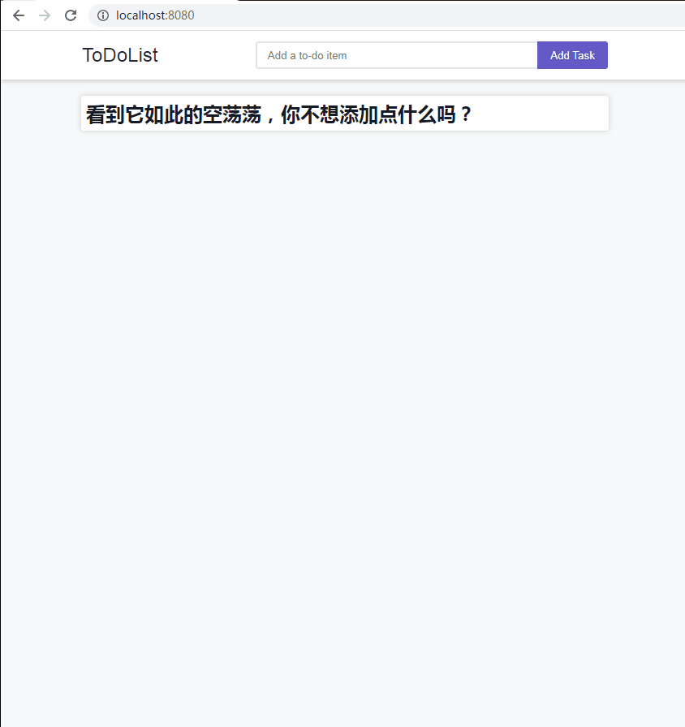
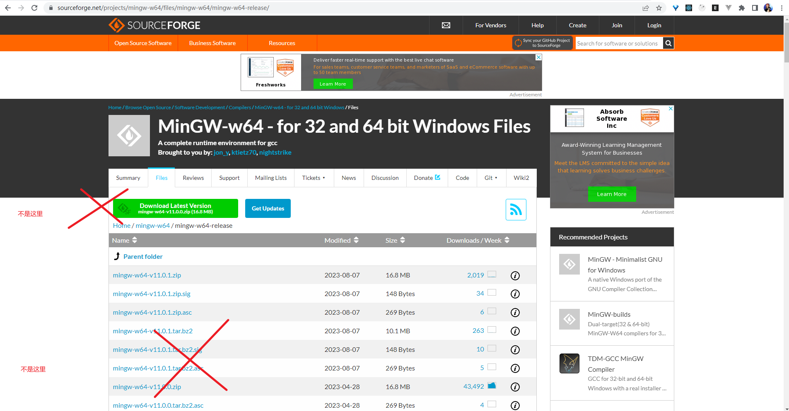
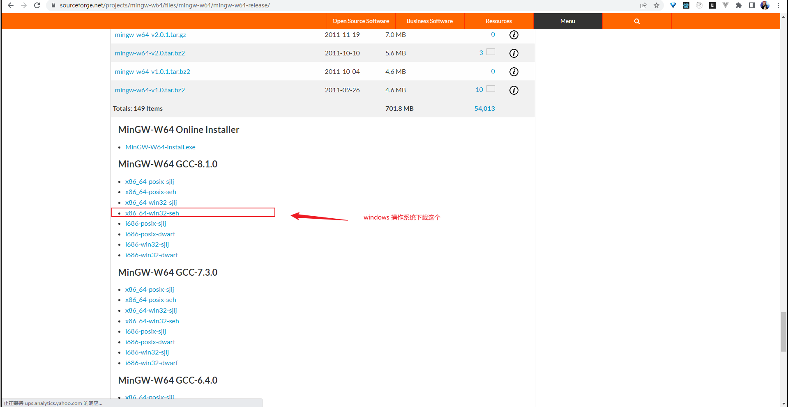
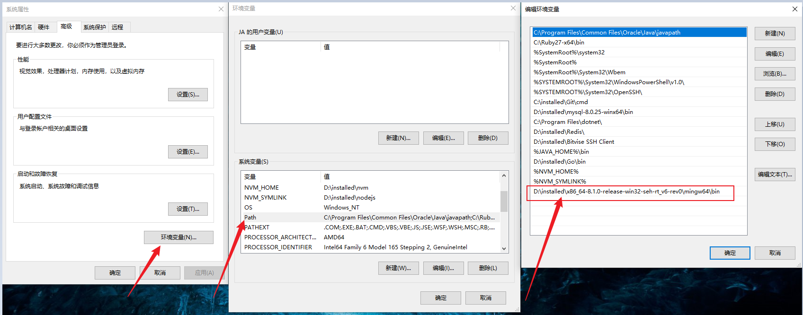

### 1. 项目截图


### 2. 项目中用到的技术
#### 2.1. gin 框架
- [Gin Web Framework - 中文文档](https://gin-gonic.com/zh-cn/docs/)
- [Gin框架介绍及使用](https://liwenzhou.com/posts/Go/Gin_framework/)

#### 2.2. gorm （Golang语言的ORM库 ）
- [GORM 指南](https://gorm.io/zh_CN/docs/index.html)

#### 2.3. 前端画面
- 主要是原生的 ```html``` ```css``` ```JavaScript```，以及引入了 ```JQuery```

### 3. 运行项目
#### 3.1. 项目地址
https://github.com/wtraceback/ToDoList

#### 3.2. 在 windows 上运行
##### 3.2.1. 先安装 MinGW-w64
由于使用的数据库是 sqlite，然后操作数据库的驱动需要使用 ```MinGW-w64``` 中的 ```gcc``` 来编译，因此需要安装 ```MinGW-w64```

安装 MinGW-w64 的步骤如下：
- MinGW-w64 的下载地址
https://sourceforge.net/projects/mingw-w64/files/mingw-w64/mingw-w64-release/
- 要下载的文件

向下一直滚动

- 解压（位置随意）
- 在解压后的目录里找到 bin 目录，然后将这个路径加到```环境变量```中


##### 3.2.2. windows 上运行
```bash
# 克隆项目
$ git clone https://github.com/wtraceback/ToDoList.git
# 切换至目录
$ cd ToDoList
# 安装依赖
$ go get
# 运行项目
$ go run main.go
```

#### 3.3. 在服务器 ubuntu 上运行
```bash
# 克隆项目
$ git clone https://github.com/wtraceback/ToDoList.git
# 切换至目录
$ cd ToDoList
# 构建 Docker 镜像
$ docker build -t todolist .
# 使用镜像，启动容器
$ docker run -d -p 8080:8080 todolist

# 查看启动后的容器
docker ps
```
