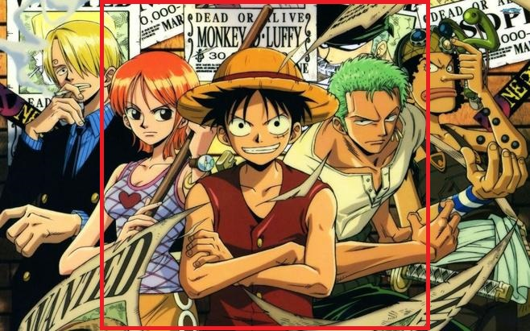
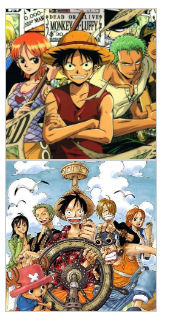

## （一）需要实现的效果
在做前端页面的时候，遇到这样一个问题：一个非正方形的图片，要让此图片以正方形的样子显示、并且还不变形。




## （二）实现方法
### 1. 使用背景图来实现
- 实现代码：
```
<!DOCTYPE html>
<html lang="en">
<head>
    <meta charset="UTF-8">
    <title>使用背景图来实现</title>
    <style>
        div {
            width: 150px;
            height: 150px;
            border: 1px solid #ccc
        }

        .img {
            background-image: url("https://img2022.cnblogs.com/blog/1053464/202206/1053464-20220606150500511-73127963.jpg");
            background-position: center;
            background-size: cover;
            background-repeat: no-repeat;
        }

        .img2 {
            background-image: url("https://img2022.cnblogs.com/blog/1053464/202206/1053464-20220606150507249-293527786.jpg");
            background-position: center;
            background-size: cover;
            background-repeat: no-repeat;
        }
    </style>
</head>
<body>
    <div class="img"></div>

    <div class="img2"></div>
</body>
</html>
```

- 实现效果示意图：



### 2. 使用 overflow 和 position 实现（img 标签，外层嵌套一层 div 标签）
#### （1） 宽 大于 高 的情况
- 实现代码：
```
<!DOCTYPE html>
<html lang="en">
<head>
    <meta charset="UTF-8">
    <title>宽 大于 高 的情况</title>
    <style>
        div {
            width: 150px;
            height: 150px;
            border: 1px solid #ccc;
            overflow: hidden;
        }

        .img {
            position: relative;
            left: 50%;
            height: 100%;
            width: auto;
            transform: translateX(-50%);
        }
    </style>
</head>
<body>
    <div>
        
    </div>
</body>
</html>
```

- 实现效果示意图：


#### （2） 高 大于 宽 的情况
- 实现代码：
```
<!DOCTYPE html>
<html lang="en">
<head>
    <meta charset="UTF-8">
    <title>高 大于 宽 的情况</title>
    <style>
        div {
            width: 150px;
            height: 150px;
            border: 1px solid #ccc;
            overflow: hidden;
        }

        .img {
            position: relative;
            top: 50%;
            height: auto;
            width: 100%;
            transform: translateY(-50%);
        }
    </style>
</head>
<body>
    <div>
        
    </div>
</body>
</html>
```

- 实现效果示意图：


### 3. 使用 object-fit 来实现
- 实现代码：
```
<!DOCTYPE html>
<html lang="en">
<head>
    <meta charset="UTF-8">
    <title>使用 object-fit 来实现</title>
    <style>
        div {
            width: 150px;
            height: 150px;
            border: 1px solid #ccc;
            overflow: hidden;
        }

        .img {
            width: 100%;
            height: 100%;
            object-fit: cover;
            object-position: center;
        }
    </style>
</head>
<body>
    <div>
        
    </div>

    <div>
        
    </div>
</body>
</html>
```

- 实现效果示意图：


## （三）参考
部分思路参考自：https://www.cnblogs.com/libo0125ok/p/8422617.html