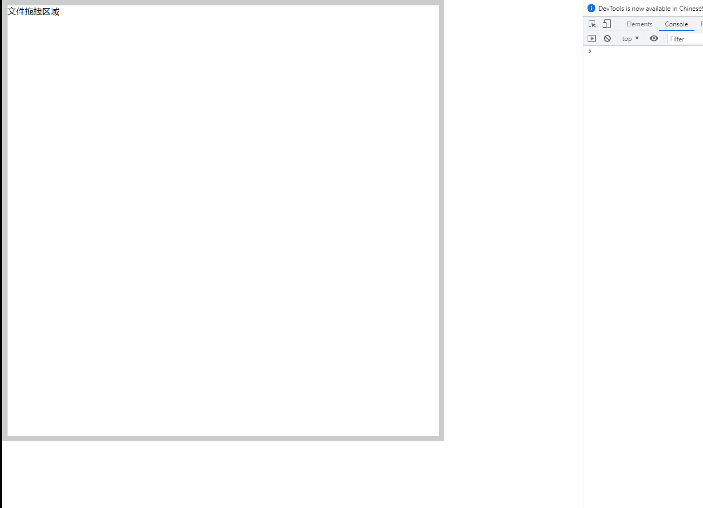
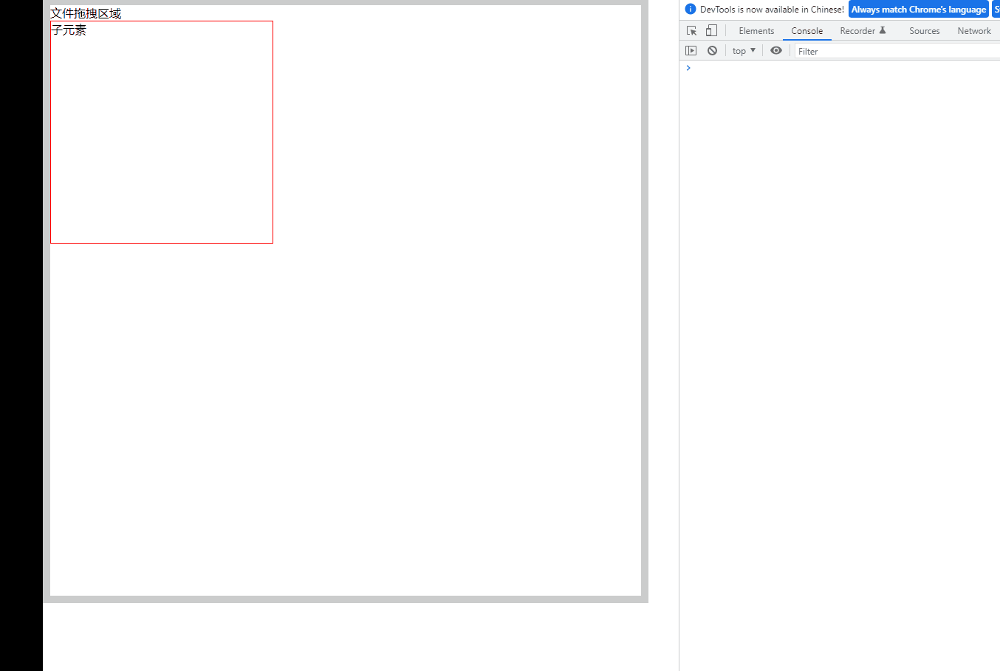
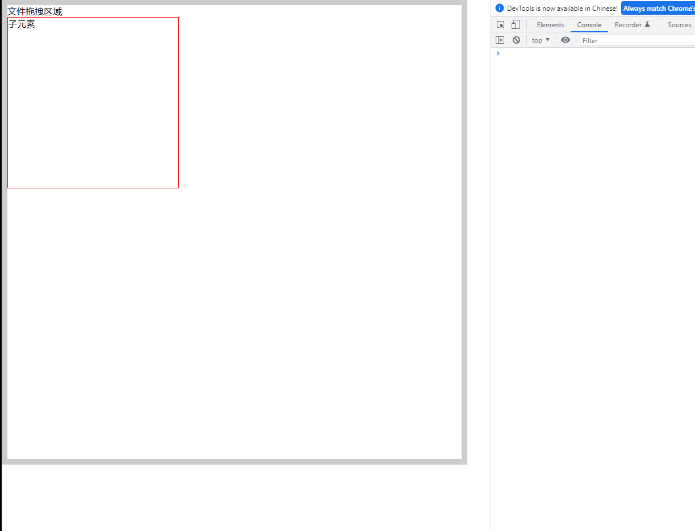

## （一） 将文件拖拽到指定的区域，然后指定区域高亮
### 1. 示意图


### 2. 代码示例
```html
<div class="drag-area">
</div>
```

```js
// 识别指定区域的拖动效果
var localDragFile = function() {
    let localDragArea = document.querySelector('.drag-area')

    localDragArea.addEventListener('dragenter',function(e){
        e.preventDefault()

        // 拖动文件到指定区域时，添加高亮
        localDragArea.classList.add('highlight')
    })

    localDragArea.addEventListener('dragleave', function(e) {
        e.preventDefault();

        // 去除高亮
        localDragArea.classList.remove('highlight')
    })
}
```
### 3. 存在的问题
如果拖拽指定区域内不存在子元素，那么运行效果看起来是可以的
但是当拖拽指定区域内存在子元素时，运行起来就不那么如人意了，如下图：




## （二） 当拖拽指定区域内存在子元素时的解决方案
### 1. 思路
- dragenter 里面记录最后进入的元素
- dragleave 里面，每次离开都判断 “当前离开的元素” 是否等于 “最后进入的元素”，如果是，则视为真正的离开

### 2. 示意图



### 3. 代码示例
```html
<div class="drag-area">
    <div class="drag-area-child">
    </div>
</div>
```

```js
// 识别指定区域的拖动效果
var localDragFile = function() {
    let localDragArea = document.querySelector('.drag-area')

    localDragArea.addEventListener('dragenter',function(e){
        e.preventDefault()
        // 拖动文件到指定区域时，添加高亮
        localDragArea.classList.add('highlight')

        window.lastenter = e.target    // 记录最后进入的元素
    })

    localDragArea.addEventListener('dragleave', function(e) {
        e.preventDefault();
        if (window.lastenter === e.target) {        // 最后进入的元素 === 当前离开的元素，那么此时是真正的离开拖拽指定区域
            // 去除高亮
            localDragArea.classList.remove('highlight')
        }
    })
}
```

## （三） 完整代码
```html
<!DOCTYPE html>
<html lang="en">
<head>
    <meta charset="UTF-8">
    <meta http-equiv="X-UA-Compatible" content="IE=edge">
    <meta name="viewport" content="width=device-width, initial-scale=1.0">
    <title>Document</title>
    <style>
        * {
            padding: 0;
            margin: 0;
        }

        body {
            width: 100vw;
            height: 100vh;
        }

        .drag-area {
            width: 800px;
            height: 800px;
            border: 10px solid #ccc;
        }

        .drag-area-child {
            width: 300px;
            height: 300px;
            border: 1px solid #f00;
        }

        .highlight {
            border: 10px solid #0f0;
        }
    </style>
</head>
<body>
    <div class="drag-area">
        文件拖拽区域
        <div class="drag-area-child">
            子元素
        </div>
    </div>

    <script>
        (function() {
            // 禁止浏览器的拖拽默认事件
            var globalDragFile = function() {
                let globalDragArea = document.querySelector('body')

                globalDragArea.addEventListener('dragover',function(e){
                    e.preventDefault()
                })

                globalDragArea.addEventListener('drop', function(e) {
                    e.preventDefault()
                })
            }

            // 识别指定区域的拖动效果
            var localDragFile = function() {
                let localDragArea = document.querySelector('.drag-area')

                localDragArea.addEventListener('dragenter',function(e){
                    // 拖动文件到指定区域时，添加高亮
                    localDragArea.classList.add('highlight')

                    window.lastenter = e.target    // 记录最后进入的元素
                    console.log("dragenter e.target = ", e.target);

                    e.preventDefault()
                })

                localDragArea.addEventListener('dragover',function(e){
                    e.preventDefault()
                })

                localDragArea.addEventListener('drop', function(e) {
                    e.preventDefault()
                })

                localDragArea.addEventListener('dragleave', function(e) {
                    e.preventDefault();

                    if (window.lastenter === e.target) {
                        console.log("window.lastenter = ", window.lastenter);
                        // 去除高亮
                        localDragArea.classList.remove('highlight')
                    }
                })
            }

            var __main = function() {
                // 禁止浏览器的拖拽默认事件
                globalDragFile()

                // 识别指定区域的拖动效果
                localDragFile()
            }

            __main()
        })()
    </script>
</body>
</html>
```