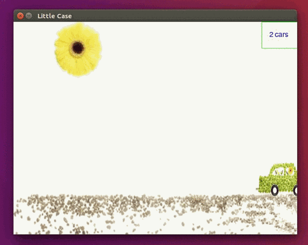

## 1. 效果图

最近学习了一下 Python 的 Pygame 模块，顺便做个小程序巩固所学的，运行效果如下：



其中，背景图"highway.jpg"是使用PhotoShop将其分辨率改变为640 × 480，而小车"car.png"则是将其转变为png格式的图片，并且填充其背景色，让其拥有透明性。


## 2. 源码
```
# -*- coding: utf-8 -*-

# 背景图以及移动小车图
highway_image_name = "highway.jpg"
car_image_name = "car.png"

# 导入程序相关的模块
import pygame
from pygame.locals import *
from sys import exit

pygame.init()

# 生成窗口以及窗口标题
screen = pygame.display.set_mode((640, 480), 0, 32)
pygame.display.set_caption("Little Case")

# 加载并转换图片
highway = pygame.image.load(highway_image_name).convert()
car = pygame.image.load(car_image_name).convert_alpha()

x = 0
y = 300
z = 1

# 加载以及渲染字体
my_font = pygame.font.SysFont("arial", 16)
text_surface = my_font.render(("%d car" % (z)), True, (0, 0, 255))

# 主循环
while True:

    for event in pygame.event.get():
        if event.type == QUIT:
            pygame.display.quit()
            exit()

    # 矩形颜色坐标等
    rc = (0, 250, 0)
    rp = (560, 0)
    rs = (639, 60)

    x += 0.2
    if x > 640 + car.get_width():
        x = -car.get_width()
        z += 1
        text_surface = my_font.render(("%d cars" % z), True, (0, 0, 255))

    screen.blit(highway, (0, 0))
    screen.blit(text_surface, (620 - text_surface.get_width(), text_surface.get_height()))
    screen.blit(car, (x, y))
    pygame.draw.rect(screen, rc, Rect(rp, rs), 1)  #   Rect(左上角的坐标，右下角的坐标)

    pygame.display.update()
```


## 3.素材图片
#### highway.jpg


#### car.png

