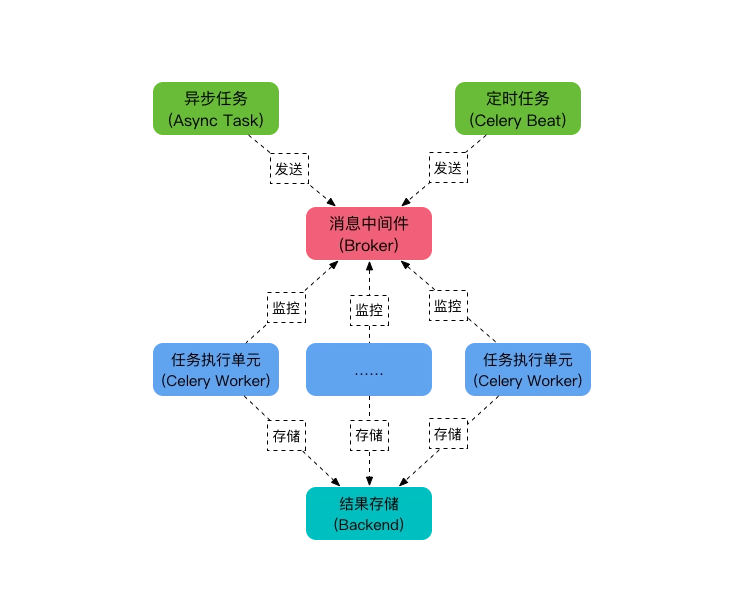
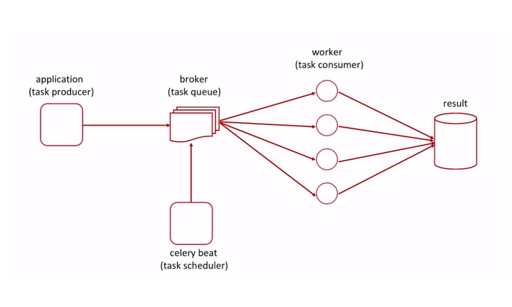
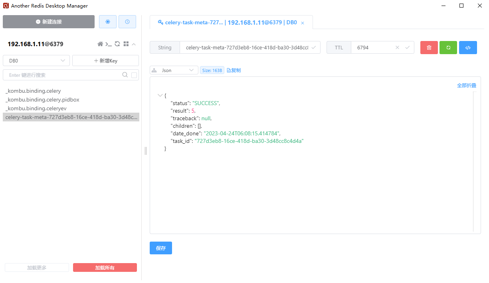
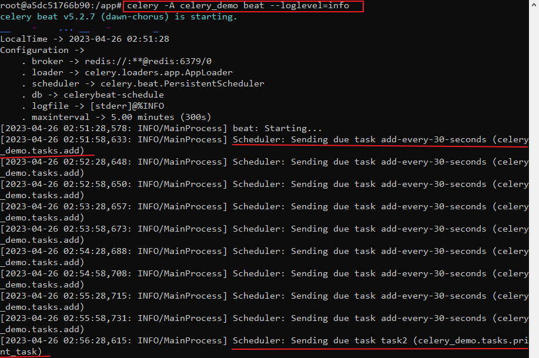
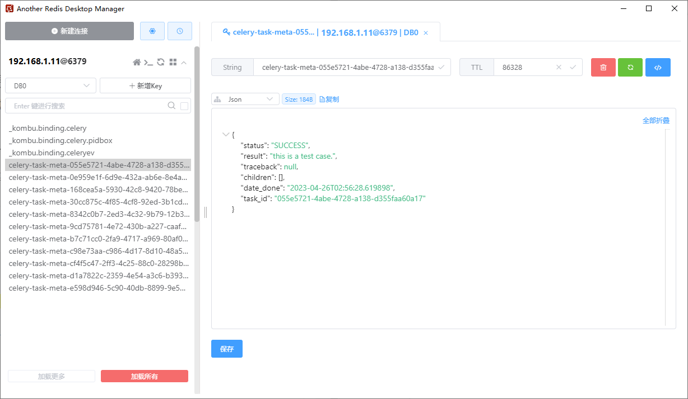
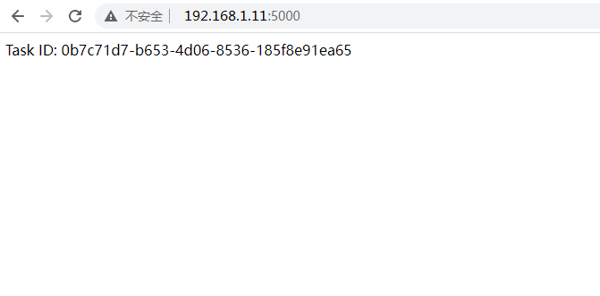
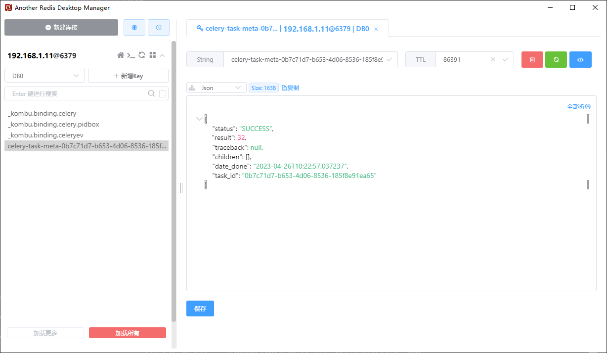

## （一） Celery 的使用
### 1. 概述
Celery 是一个基于分布式消息传递的任务队列，用于异步处理任务和定时任务等。它可以让你将耗时的任务放到后台处理，从而不会阻塞 Web 应用程序的主线程。（例如：发送电子邮件、生成报表、爬虫、定时任务等）

Celery 可以与多种消息代理（如 RabbitMQ、Redis 等）配合使用，并且提供了许多高级特性，例如任务调度、定时任务、任务重试、任务结果存储等。

使用 Celery，你可以将复杂的任务分解成多个小任务，然后将它们分配给多个工作进程或者多个机器来处理。这样可以提高任务的执行效率，减少响应时间，并且可以更好地管理任务和作业。

Celery 是使用 python 编写的分布式任务调度框架，因此非常适合与 Python Web 框架（如 Django、Flask 等）一起使用。

### 2. Celery 的结构图


---



从上图可以看出，Celery 的主要组件构成包括：
1. ```Task```
任务，是实际需要执行的代码逻辑。
2. ```Beat```
定时任务调度器，用于定时触发任务的执行。
3. ```Broker```
任务队列的消息代理，消息代理是一个中间件，它负责接收任务请求并将其分发给可用的工作进程（用于存储和传递任务消息）。常用的 Broker 有 RabbitMQ、Redis、Amazon SQS 等。
4. ```Worker```
任务执行者，Celery Worker 是一个独立的进程，它负责从 Broker 中接收任务请求，并执行这些任务。
5. ```Result Backend```
结果后端，用于存储任务执行结果，常用的有 Redis、MongoDB、数据库等。

### 3. Celery 的异步任务
#### （1） 项目的目录结构：
```
├─celery_demo
│  ├─app.py
│  └─tasks.py
```

#### （2） 安装 Celery
可以使用 pip 命令安装 Celery，如下所示：
```py
pip install celery

# 另外，如果要使用 redis 作为 Broker 的话，还需要安装 redis 模块
pip install redis
```

#### （3） 创建任务
在 Celery 中，任务是最基本的单位，你需要定义一个任务并且为其编写处理函数，如下所示：
```py
# tasks.py 文件
from celery import Celery

# 连接 redis 的规则： "redis://用户名:密码@主机:端口/Redis默认的n号数据库"
app = Celery('tasks',
            broker='redis://:123456@localhost:6379/0',
            backend='redis://:123456@localhost:6379/0')

@app.task
def add(x, y):
    return x + y

@app.task
def print_task():
    print("this is a test case.")
    return "this is a test case."
```

#### （4） 启动 Celery worker
在任务定义好以后，你需要启动 Celery worker 来执行这些任务，如下所示：
```
celery -A tasks worker --loglevel=info
```
命令说明：
- ```-A``` 参数用于指定 celery 的应用程序
- ```tasks``` 为文件名，即 ```tasks.py``` 文件
- ```--loglevel``` 参数用于指定日志级别

可通过 ```celery worker --help``` 或 ```celery --help``` 查看更详细的命令说明

#### （5） 调用任务
在需要执行任务的地方，你可以通过如下方式调用任务：
```py
# app.py 文件
from tasks import add, print_task

# 调用 add 命令
result = add.delay(2, 3)
print(result.get(timeout=5))

# 调用 print_task 命令
result = print_task.delay()
print(result.get(timeout=5))
```

- 这里的 ```add.delay(2, 3)``` 是异步调用任务的方式，它会立即返回一个 ```AsyncResult``` 对象，你可以通过 ```result.get()``` 方法来获取任务的执行结果。
- 使用 ```python app.py``` 运行程序，即可看到程序结果的打印，在 redis 中也会有处理结果的存储。
- 以上是 Celery 的基本使用步骤，还可以根据自己的需求来设置 Celery 的配置参数，比如消息队列的地址、任务的并发数等。
- 额外说明：
我在 win10 上启动了 redis 作为消息代理，redis 接收到了任务请求并将其分发给可用的工作进程，但是在存储结果时，总是连不上 redis，一直报连接超时的错误；后面换成了在云服务器 ubuntu 上执行，没有出现过这个问题，推荐使用云服务器或 linux 系统去做测试

#### （6） 任务执行完成后，redis 中存储的结果



### 4. Celery 的定时任务
在 ```Celery``` 中，你可以使用 ```beat``` 模块来设置定时任务。```beat``` 模块是 ```Celery``` 的一个独立的组件，它可以独立于 ```worker``` 进程运行，它会定期读取你的任务配置，并根据配置调度任务，定时地发送任务到 Broker（消息队列） 中等待 ```worker``` 进程执行。

#### （1） 项目的目录结构：
```
├─myapp
│  ├─celery_demo
│  │  ├─__init__.py                 # 入口文件
│  │  ├─celeryconfig.py             # celery 的配置文件
│  │  └─tasks.py                    # celery 注册任务的文件
```

#### （2） 在 ```celeryconfig.py``` 文件中，添加以下配置信息：
```py
# celeryconfig.py

from datetime import timedelta

task_serializer = 'json'
accept_content = ['json']
result_serializer = 'json'
enable_utc = True

broker_url = 'redis://:123456@localhost:6379/0'
result_backend = 'redis://:123456@localhost:6379/0'
timezone = 'Asia/Shanghai'
beat_schedule = {
    'add-every-30-seconds': {
        'task': 'celery_demo.tasks.add',
        'schedule': timedelta(seconds=30),
        'args': (16, 16),
    },
    'task2': {
        'task': 'celery_demo.tasks.print_task',
        'schedule': timedelta(minutes=1),
        'args': (),
    },
}
```
在上述代码中，我们定义了 ```Celery``` 的配置信息。这些配置信息包括代理设置、任务设置和定时任务设置。在定时任务设置中，我们定义了两个定时任务，分别是 ```add-every-30-seconds``` 和 ```task2```，并指定了任务的名称、调度时间和参数。

- ```add-every-30-seconds``` 任务为每 30 秒执行一次
- ```task2``` 任务为每 1 分钟执行一次

#### （3） 在 ```tasks.py``` 文件中，添加以下内容：
```py
# tasks.py

from celery_demo import app


@app.task
def add(x, y):
    print("x + y = {}".format(x + y))
    return x + y

@app.task
def print_task():
    print("this is a test case.")
    return "this is a test case."
```
在上述代码中，我们定义了两个任务，分别是 ```add``` 和 ```print_task```，并指定了任务的逻辑和返回结果。

#### （4） 最后，在 ```__init__.py``` 文件中，添加以下内容：
```py
# __init__.py

from celery import Celery

app = Celery('celery_demo')
app.config_from_object('celery_demo.celeryconfig')

from . import tasks
```
在上述代码中，我们创建了一个名为 ```app``` 的 ```Celery``` 应用程序，并从 ```celeryconfig.py``` 文件中加载配置信息。

#### （5） 使用命令来启动 Celery worker 和 beat 服务
通过运行以下命令来启动 Celery worker 和 beat 服务（在 myapp 目录下执行以下命令）：
```
# 1. 先启动 Celery worker 服务
celery -A celery_demo worker --loglevel=INFO

# 2. 再启动 beat 服务
celery -A celery_demo beat --loglevel=INFO
```
这将会启动一个 ```Celery worker``` 和 ```beat``` 服务，并开始执行定时任务。

结果示意图：





## （二） Celery 和 Flask 的结合使用
### 1. 项目的文件结构
文件结构如下：
```bash
├─project
│  ├─ app.py
│  └─ tasks.py
```

### 2. 项目中各个文件的内容
```app.py``` 文件的内容如下：
```py
from flask import Flask
from tasks import add

app = Flask(__name__)

@app.route('/')
def index():
    result = add.delay(16, 16)
    return "Task ID: {}".format(result.id)

if __name__ == '__main__':
    app.run(host='0.0.0.0', debug=True, port=5000)
```

```tasks.py``` 文件的内容如下：
```py
from celery import Celery


celery_app = Celery('tasks',
                broker = 'redis://:123456@localhost:6379/0',
                backend = 'redis://:123456@localhost:6379/0',
            )


@celery_app.task
def add(x, y):
    print("x + y = {}".format(x + y))
    return x + y
```

### 3. 安装相关的依赖
```py
pip install flask
pip install celery
pip install redis
```

### 4. 使用命令来启动 Celery worker 和 Flask 服务
在命令行中执行以下命令启动 Celery worker：
```
celery -A tasks worker --loglevel=info
```

最后，在命令行中执行以下命令启动 Flask 应用：
```
python app.py
```
在浏览器中访问 ```http://localhost:5000/``` 就可以看到任务 ID 了。

### 5. 执行结果示意图


---




## （三） Celery 的官方文档
[Celery 的英文文档](https://docs.celeryq.dev/en/stable/index.html)
[Celery 的中文文档](https://celeryproject.readthedocs.io/zh_CN/latest/index.html)
[Celery 中文手册](https://www.celerycn.io/jian-jie)
