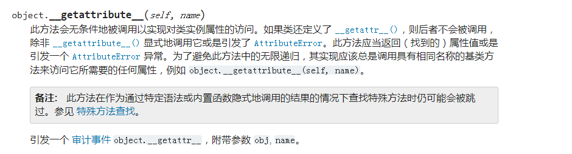
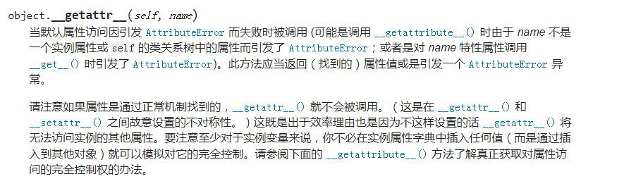
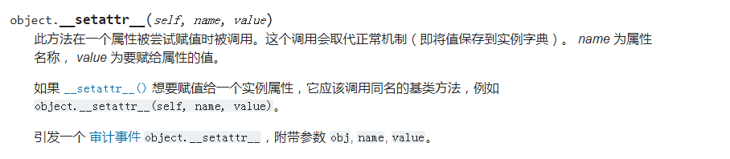

### 1. ```__getattribute__```
官方文档说明：


```__getattribute__``` 魔法方法是属性访问拦截器，就是当实例的属性被访问时，会自动调用类的 ```__getattribute__ ``` 方法。
当实例调用属性时，比如 t.name，会把 name 作为实参传进 ```__getattribute__``` 方法中，经过一系列操作后，再把 name 处理后的结果返回。


因为 ```__getattribute__``` 拦截所有属性的访问，其中就包括了对 ```__dict__``` 属性的访问，如果你在 ```__getattribute__``` 中使用 ```__dict__``` 来返回值，那么将会陷入无限循环的陷阱，因此要在 ```__getattribute__``` 中访问当前实例的属性时，得用基类的方法 ```object.__getattribute__``` 或 ```super().__getattribute__```。
正确的使用：
```py
class Test(object):
    def __init__(self, name):
        self.name = name

    def print_name(self):
        print("print name = {}".format(self.name))

    def __getattribute__(self, item):
        print("__getattribute__ = {}".format(item))
        return object.__getattribute__(self, item)
        # return super().__getattribute__(item)


t = Test('测试的名字')
print("t.name = {}".format(t.name))
t.print_name()


# 打印的结果：
# __getattribute__ = name
# t.name = 测试的名字
# __getattribute__ = print_name
# __getattribute__ = name
# print name = 测试的名字
```

错误的使用：
```py
class Test(object):
    def __init__(self, name):
        self.name = name

    def __getattribute__(self, item):
        print("__getattribute__ = {}".format(item))
        return self.__dict__[item]
```
如果在 ```__getattribute__``` 中使用 ```self.__dict__[item]``` 来访问对象自身的属性，将会使程序陷入无限循环，直到崩溃。


### 2. ```__getattr__```
官方文档说明：



```__getattr__``` 被调用的条件：
1. 访问对象属性
2. 访问对象属性时，由于对象属性不存在，触发 AttributeError 异常


```py
class Test(object):
    def __init__(self, name):
        self.name = name

    def __getattribute__(self, item):
        print("__getattribute__ = {}".format(item))
        return object.__getattribute__(self, item)

    def __getattr__(self, item):
        print("__getattr__ = {}".format(item))


t = Test('测试的名字')
print("name = {}".format(t.name))
print("abcdef = {}".format(t.abcdef))


# 打印的结果：
# __getattribute__ = name
# name = 测试的名字
# __getattribute__ = abcdef
# __getattr__ = abcdef
# abcdef = None
```

注意：
- ```__getattribute__``` 魔法方法会先执行，如果 ```__getattribute__``` 中找不到定义的属性，可以显示或隐式的触发 AttributeError 异常，这个时候，就会触发 ```__getattr__``` 魔法方法，相当于 ```__getattr__``` 兜底了，做最后的处理。
- 如果在 ```__getattribute__``` 中没有抛出 AttributeError 异常，或是抛出了其它类型的异常，那么 ```__getattr__``` 都不会执行。

### 3. ```__setattr__```
官方文档说明：


在对一个属性设置值的时候，会调用到这个函数。

```py
class Test(object):
    def __init__(self, name):
        self.name = name

    def print_name(self):
        print("print name = {}".format(self.name))


    def __setattr__(self, name, value):
        print("__setattr__ name = {}, value = {}".format(name, value))
        return object.__setattr__(self, name, value)


t = Test('测试的名字')
print("t.name = {}".format(t.name))


# 打印的结果：
# __setattr__ name = name, value = 测试的名字
# t.name = 测试的名字
```
