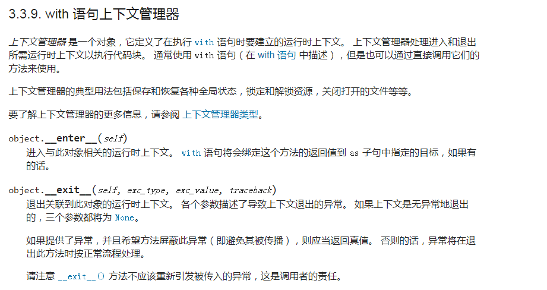

### 1. 概述
在 Python 中，只要一个对象实现了 ```__enter__``` 和 ```__exit__``` 方法，那么就能使用 ```with``` 语句，该对象也可以称之为上下文管理器。

官方文档的相关说明：


上下文管理器的语法：
```py
with ...:
    代码处理块

# ======================

with ... as ...:
    代码处理块
```

### 2. 代码示例
```py
"""
数据库操作：
    连接数据库
    执行sql语句
    释放资源
"""

class MyResource(object):
    def __enter__(self):
        print("连接数据库")
        return self

    def __exit__(self, exc_type, exc_value, traceback):
        """
            功能：处理异常 + 回收资源
        """
        print("exc_type = {}, exc_value = {}, traceback = {}".format(exc_type, exc_value, traceback))
        if traceback:
            print("process exception")
        else:
            print("no exception")

        print("关闭数据库的连接")

        # return False    如果有异常，返回 False 的话，将会在 with 外部抛出异常
        # return True     如果有异常，返回 True 的话，表示在函数内部已经处理了异常，这时，在 with 外部就不用再抛出异常
        # 如果什么都不返回，那么就相当于返回 None，返回 None 就相当于返回了 False
        return True

    def query(self):
        print("执行数据库的相关操作")


with MyResource() as resource:
    resource.query()
    # 1 / 0
```

代码说明：
1. 使用 ```with ... as ...``` 操作一个上下文管理器时，进入该对象的运行上下文，将会自动调用 ```__enter__``` 方法
2. ```as``` 后面跟着的变量 ```resource``` 的值，是 ```__enter__``` 函数的返回值，所以 ```__enter__``` 函数内一般用 ```return self``` 返回实例对象
3. ```with``` 语句块用来执行中间步骤的相关操作
4. 操作结束后，退出该对象的上下文，将会自动调用 ```__exit__``` 方法
5. ```__exit__``` 具有【异常处理】和【资源回收】的功能
6. ```__exit__``` 接收 4 个参数，各个参数描述了导致上下文退出的异常情况
7. ```__exit__``` 的返回值为布尔值（有异常的情况下，【返回False】或【什么都不返回】内部的错误将会向外抛出；如果【返回True】，外部将不会接收到异常情况）

---

看下最常用的 ```open``` 操作
```py
"""
文件读写：
    打开文件
    读取文件或写入文件
    关闭文件
"""

with open(path, 'w+', encoding='utf-8') as f:
    f.write(s)


with open(path, 'r', encoding='utf-8') as f:
    s = f.read()
```

内置函数 ```open``` 中已经实现了 ```__enter__``` 和 ```__exit___```，不需要我们自己去实现

### 3. 额外说明
对于 ```with ... as ...``` 语句，我们也可以使用 ```try ... except ... finally``` 或者 ```if ... else ...``` 等相关语法来代替，但是使用 ```with``` 语句可以简化代码，可以更好的组织代码，因此，为了更优雅的编写代码，推荐使用 ```with``` 语句。
