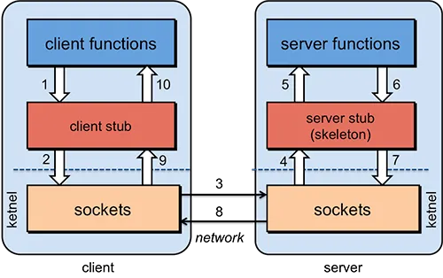
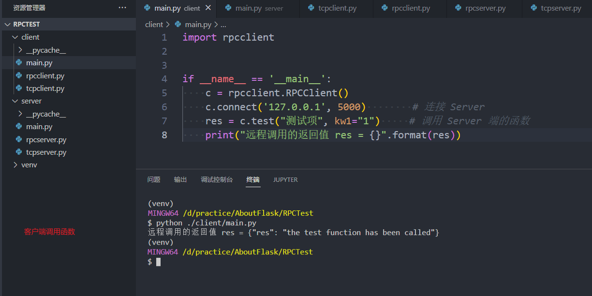
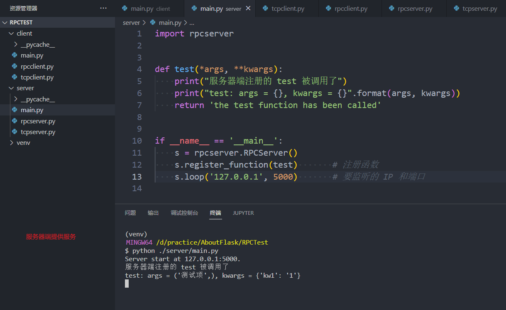

### 1. 概述
- RPC 是什么？
RPC（Remote Procedure Call Protocol），RPC 是指远程过程调用，比如现在有两台服务器 A、B，一个应用部署在 A 服务器上，想要调用 B 服务器上应用提供的函数/方法，由于不在一个内存空间，不能直接调用，需要通过网络来表达调用的语义和传达调用的数据参数。

简略的来讲，RPC 的目的就是像调用本地的函数一样，去调用远程服务器中的函数。

### 2. 实现 RPC 需要解决的问题
在远程调用时，我们需要执行的函数体是在远程的机器上的，因此需要解决几个问题：
1. 网络传输
远程调用往往用在网络上，客户端和服务端是通过网络连接的。我们可以通过在客户端和服务器之间建立 TCP 连接，远程过程调用所有交换的数据都在这个连接里传输。
2. 序列化和反序列化
在远程过程调用时，客户端跟服务端是不同的进程，不能通过内存来传递参数。客户端和服务端使用的可能不是同一种语言（比如服务端用Python，客户端用Java或者JavaScript）。因此可以使用 JSON 这一数据交换格式，这样就能在多种语言之间进行数据交换。
3. 解决寻址的问题
客户端和服务器端要规定好传输数据的格式，这样客户端传送数据到服务器端后（客户端传递要调用的函数名和相关参数），服务器才能确定客户端调用的函数和传入的参数，然后执行相应函数的代码。比如可以通过一个简单的哈希表，规定传输数据的格式，如下所示：
```py
{
    'method_name': name,
    'method_args': args,
    'method_kwargs': kwargs
}
```

### 3. 详细说明


- ```client functions```
客户端：里面有客户端调用服务器端的函数
- ```client stub```
将调用的函数名和函数参数转换成规定的格式，并将数据序列化，再传递给下层的 TCP Server；
接收响应的数据，然后反序列化，再向上传递
- ```client sockets```
TCP Client 端，提供网络服务，用来连接服务器
- ```server functions```
本地提供的服务，即一些函数，供客户端调用
- ```server stub```
将客户端发送过来的数据反序列化，然后再调用本地服务进行处理
将要发送给客户端的响应序列化，然后再传递给下层的 TCP Server
- ```server sockets```
TCP Server 端，提供服务器端的网络服务，供客户端连接

### 4. 实现 JSONRPC
目录结构：
```
│
├── client                     # 客户端
│   ├── main.py                # 客户端入口文件
│   ├── rpcclient.py           # 对外暴露的接口
│   └── tcpclient.py           # 网络传输 TCP Client
├── server                     # 服务器端
│   ├── main.py                # 服务器端入口文件
│   ├── rpcserver.py           # 对外暴露的接口
└── └── tcpserver.py           # 网络传输 TCP Server
```

Client 与 Server 都采用 Minix 多继承机制来实现，每个类负责自身的事情，最终暴露出的，只有一个类中有限的方法。

#### （1） 客户端
```main.py``` 文件
```py
import rpcclient


if __name__ == '__main__':
    c = rpcclient.RPCClient()
    c.connect('127.0.0.1', 5000)        # 连接 Server
    res = c.test("测试项", kw1="1")     # 调用 Server 端的函数
    print("远程调用的返回值 res = {}".format(res))
```
- 实例化 rpcclient.RPCClient 类，然后调用 connect 方法去连接 server 端
- 然后调用 server 端的 test 方法，并传入相关的参数，等待 server 端返回的响应
- 最后将响应结果打印出来。

---

```rpcclient.py``` 文件
```py
import json
import tcpclient


class RPCStub(object):
    def __getattr__(self, item):
        def func(*args, **kwargs):
            d = {
                'method_name': item,
                'method_args': args,
                'method_kwargs': kwargs
            }
            self.send(json.dumps(d))        # 发送数据到 Server 端
            return self.receive(1024)       # 接收 Server 返回的执行结果

        setattr(self, item, func)
        return func


class RPCClient(tcpclient.TCPClient, RPCStub):
    pass

```
- 对外暴露 RPCClient 类，而 RPCClient 类继承于 TCPClient 类和 RPCStub 类
- TCPClient 负责通过 socket 实现 TCP 客户端，用来和 TCP服务器端 连接
- 而 RPCStub 主要将 client 端调用的函数和函数的参数打包成规定的数据格式，然后调用 TCPClient 类中的方法发送给服务器端
- 当我们调用 ```c.test("测试项", kw1="1")``` 时，由于类中不存在这个方法，会自动执行 RPCStub 的 ```__getattr__``` 方法，这个魔法方法会将数据打包，将要发送的数据进行 json 格式化，然后发送给服务器端，最后接收服务器端的响应，然后将响应信息返回。

---

```tcpclient.py``` 文件
```py
import socket


class TCPClient(object):
    def __init__(self):
        self.clientsocket = socket.socket(socket.AF_INET, socket.SOCK_STREAM)

    def connect(self, host='127.0.0.1', port=5000):
        """链接Server端"""
        self.clientsocket.connect((host, port))

    def send(self, data):
        """将数据发送到Server端"""
        self.clientsocket.sendall(data.encode('utf-8'))

    def receive(self, length):
        """接收Server端返回的数据"""
        r = self.clientsocket.recv(length)
        r = r.decode('utf-8')
        return r
```
- TCPClient 类主要是常规的 Socket API 操作

#### （2） 服务器端
```main.py``` 文件
```py
import rpcserver


def test(*args, **kwargs):
    print("服务器端注册的 test 被调用了")
    print("test: args = {}, kwargs = {}".format(args, kwargs))
    return 'the test function has been called'


if __name__ == '__main__':
    s = rpcserver.RPCServer()
    s.register_function(test)       # 注册函数
    s.loop('127.0.0.1', 5000)       # 要监听的 IP 和端口
```
- 实例化 rpcserver.RPCServer 类
- 调用 register_function 方法注册函数，这个函数是想要被 Client 端调用的方法
- 调用 loop 方法，循环监听请求，并将要监听的 IP 和端口传递进入

---

```rpcserver.py``` 文件
```py
import json
import tcpserver


class RPCStub(object):
    def __init__(self):
        self.funcs = {}

    def register_function(self, fn, name=None):
        """Server 端方法的注册，已注册的方法可以在 Client 端调用"""
        if name is None:
            name = fn.__name__
        self.funcs[name] = fn


class JSONRPC(object):
    def __init__(self):
        self.data = None

    def from_data(self, data):
        """解析数据"""
        self.data = json.loads(data.decode('utf-8'))

    def call_method(self):
        """根据解析的数据，调用对应的方法"""
        method_name = self.data.get('method_name', '')
        method_args = self.data.get('method_args', None)
        method_kwargs = self.data.get('method_kwargs', None)

        if (method_name in self.funcs):
            res = self.funcs[method_name](*method_args, **method_kwargs)
        else:
            res = 'Please use the correct function'
        data = { "res": res }
        return json.dumps(data)


class RPCServer(tcpserver.TCPServer, JSONRPC, RPCStub):
    def __init__(self):
        # super(RPCServer, self).__init__() # 多继承的情况下，默认初始化 TCPServer
        # super().__init__()                # 多继承的情况下，默认初始化 TCPServer
        tcpserver.TCPServer.__init__(self)
        JSONRPC.__init__(self)
        RPCStub.__init__(self)

    def loop(self, host='0.0.0.0', port=5000):
        self.bind_listen(host, port)
        print('Server start at', '{}:{}.'.format(host, port))
        while True:
            self.accept_receive_close()

    def process_request(self, data):
        self.from_data(data)
        return self.call_method()
```
- 对外只暴露 RPCServer 类，而 RPCServer 类继承于 TCPServer类、JSONRPC类 和 RPCStub类
- TCPServer 类主要是常规的 Socket API 操作，提供网络服务
- RPCStub 类用于注册函数，注册给 client 端调用的函数
- JSONRPC 类主要负责解析数据

---

```tcpserver.py``` 文件
```py
import socket


class TCPServer(object):
    def __init__(self):
        # 初始化 socket；socket.AF_INET 表示因特网 IPv4 地址族，SOCK_STREAM 表示使用 TCP 的 socket 类型
        self.serversocket = socket.socket(socket.AF_INET, socket.SOCK_STREAM)

    def bind_listen(self, host, port):
        # 套接字绑定的 IP 与 端口
        self.serversocket.bind((host, port))
        # 将套接字变为一个服务区套接字，进行监听，数字 5 将端口上的等待队列长度限制为 5，即超过 5 个的请求将被拒绝。
        self.serversocket.listen(5)

    def accept_receive_close(self):
        # 接收外部连接请求，当有客户端过来连接的时候, serversocket.accept 函数就会返回 2 个值
        clientsocket, address = self.serversocket.accept()
        r = clientsocket.recv(1024)
        data = self.process_request(r)
        clientsocket.sendall(data.encode('utf-8'))            # 用 sendall 发送响应给客户端
        clientsocket.close()
```
- TCPServer 类主要是常规的 Socket API 操作，提供网络服务

### 5. 运行效果
- 客户端

- 服务器端


### 6. 参考
[谁能用通俗的语言解释一下什么是 RPC 框架？](https://www.zhihu.com/question/25536695)
[使用Python实现RPC框架](https://blog.csdn.net/weixin_30230009/article/details/104004595)
