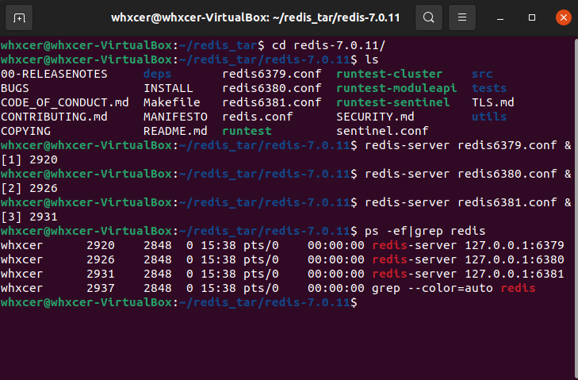
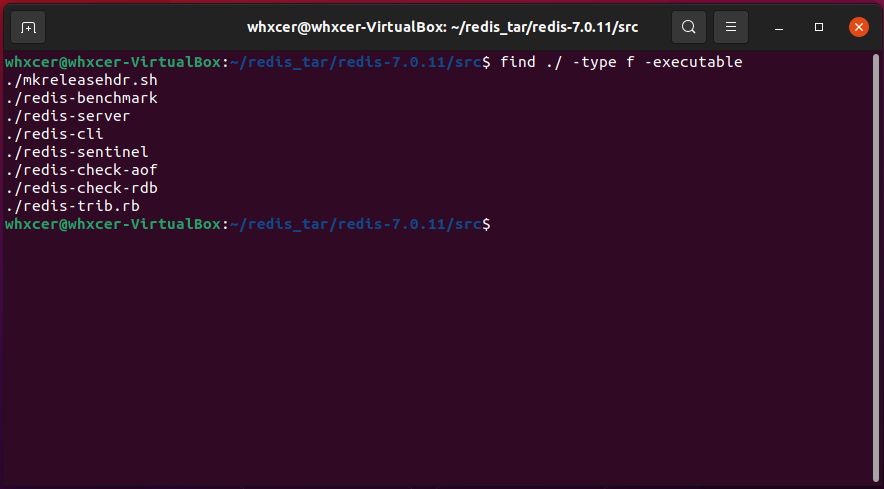
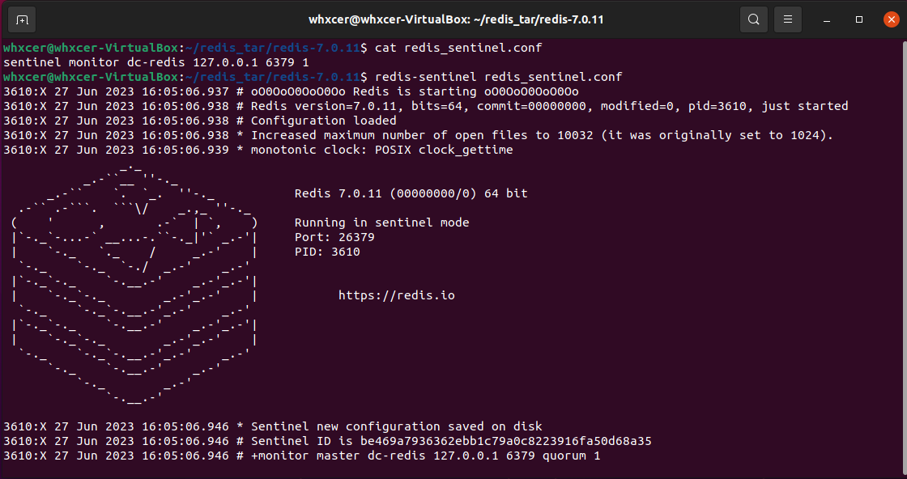
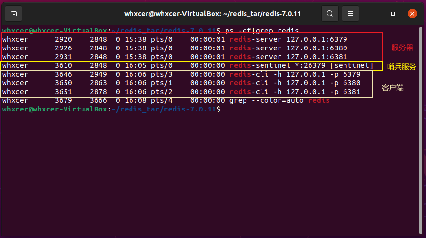
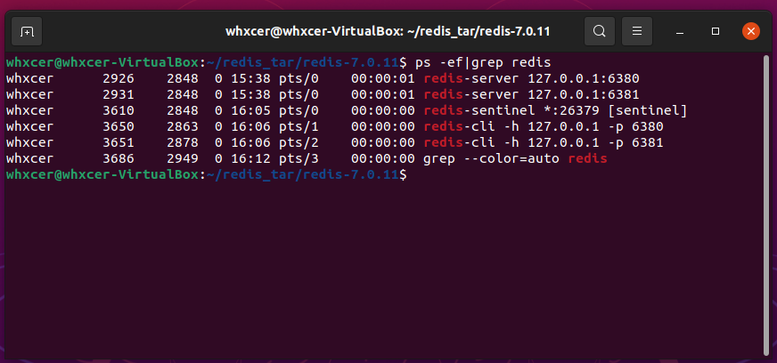
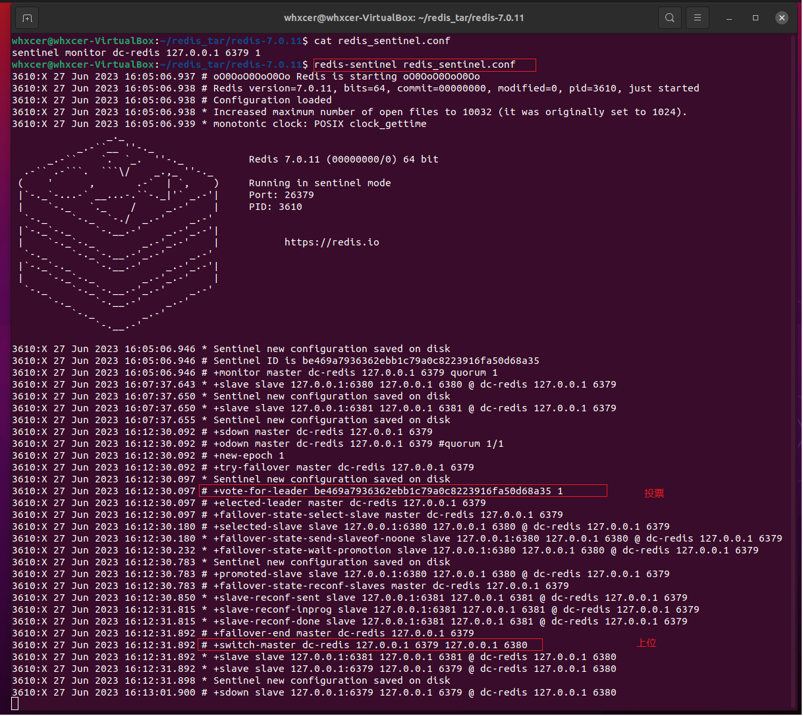
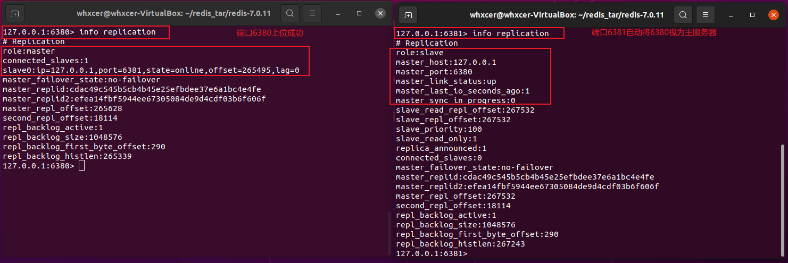
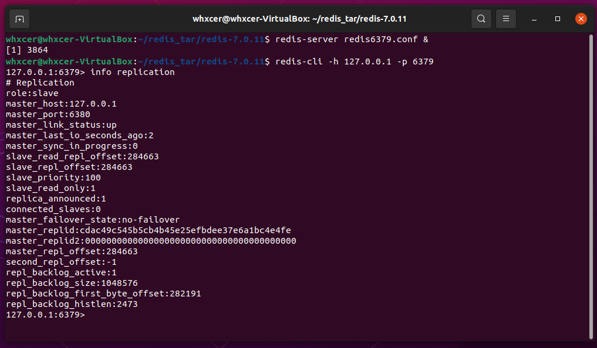

### 1. 原理
Redis 哨兵模式是指在 Redis 集群中，有一组专门的进程（即哨兵进程）负责监控主节点和从节点的状态，并在发现故障时自动进行故障转移，以保证 Redis 集群的高可用性。

Redis 提供了哨兵的命令，哨兵命令是一个独立的进程，哨兵进程会周期性地向主节点和从节点发送 PING 命令来检测它们的状态，当哨兵进程发现 master主节点 不可用时，根据投票数自动将某一个 slave 转换 master，然后通过消息订阅模式通知其它 slave，让它们切换到新的 master主节点 上，从而实现故障转移。然而，一个哨兵进程对 Redis 服务器进行监控，可能会出现问题，为此，我们可以使用多哨兵进行监控。哨兵进程还可以监控 Redis 集群的配置变化，并在配置变化时通知客户端进行相应的调整。

哨兵模式三大任务：
- 监控
- 提醒
- 自动故障迁移

### 2. 搭建示例
通俗来说，Redis 哨兵模式就是从机上位的自动版。以之前的一篇```Redis主从复制，Redis从机上位```的文章为示例：[Redis 的主从复制](https://www.cnblogs.com/wanghuizhao/p/17481632.html)
#### 2.1. 在同一台服务器上搭建三台 Redis 服务
1. 由于我是通过解压 Redis 包，然后用 make 编译生成的 Redis 服务，所以是在 Redis 解压后的根目录下创建的相关配置文件
2. 提供三份 Redis 配置文件：```redis6379.conf```、```redis6380.conf```、```redis6381.conf```
3. 修改三份配置文件，以 ```redis6379.conf``` 为例：
    ```bind 127.0.0.1```
    ```port 6379```
    ```pidfile /var/run/redis_6379.pid```
    ```logfile "6379.log"```
    ```dbfilename dump6379.rdb```
4. 使用上面的三个配置文件，启动三个 Redis 服务：
    ```redis-server redis6379.conf &```
    ```redis-server redis6380.conf &```
    ```redis-server redis6381.conf &```
5. 通过 redis 客户端分别连接三台 redis 服务
    ```redis-cli -h 127.0.0.1 -p 6379```
    ```redis-cli -h 127.0.0.1 -p 6380```
    ```redis-cli -h 127.0.0.1 -p 6381```
6. 默认启动都是主服务器
查看这三台 redis 服务在集群中的主从角色 ```info replication```，默认情况下，所有的 redis 服务都是主机，即都能写和读，但是都还没有从机。
7. 设置主从关系：设从不设主
在 ```6380``` 上执行：```slaveof 127.0.0.1 6379```
在 ```6381``` 上执行：```slaveof 127.0.0.1 6379```




#### 2.2. 提供哨兵配置文件
在 redis 安装目下创建配置文件：```redis_sentinel.conf```，跟上面的 ```redis6379.conf``` 文件放在同一个目录下。

在文件内输入：```sentinel monitor dc-redis 127.0.0.1 6379 1```；
- ```127.0.0.1``` 是监控主机的 IP 地址
- ```6379``` 是监控主机的 port 端口
- ```1``` 为得到哨兵程序的投票数(当哨兵投票数大于或者等于此数时切换主从关系，该从机将自动升级为主机，其他从机将指向这个刚刚升级的从机)

#### 2.3. 启动哨兵服务
使用 redis 提供的 ```redis-sentinel``` 命令来启动哨兵服务，并且使用上面配置的 ```redis_sentinel.conf``` 配置文件。

执行命令：```redis-sentinel redis_sentinel.conf```

Redis 提供的可执行程序：


前台启动哨兵服务示意图：


当前运行的进程：


#### 2.4. 主机宕机
关闭 ```6379``` 服务：```redis-cli -h 127.0.0.1 -p 6379 shutdown```


哨兵程序自动选择从机上位：



#### 2.5. 之前主机恢复：自动从属于新的主机
重启 ```6379``` 服务：```redis-server redis6379.conf &```
客户端连接 6379：```redis-cli -h 127.0.0.1 -p 6379```



### 3. Redis 哨兵模式的优缺点
优点：
- Redis 哨兵模式的优点是可以提高 Redis 集群的可用性和稳定性。

缺点：
- 缺点是会增加系统的复杂度和资源消耗。

因此，在选择 Redis 哨兵模式时需要根据实际情况进行权衡。
