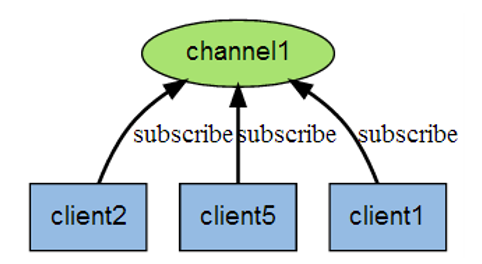
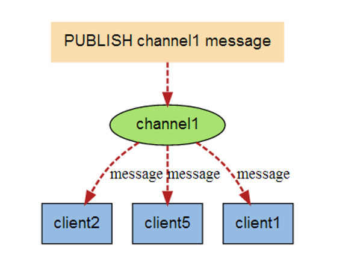
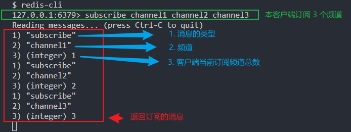
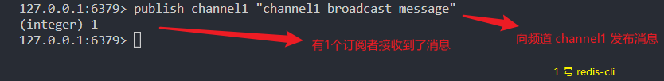
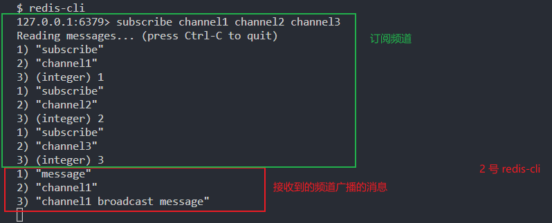
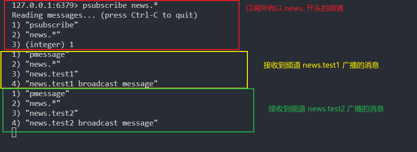
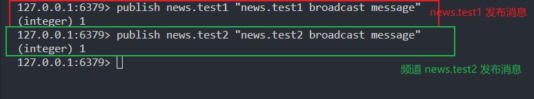

## 1. Redis 发布订阅
### 1.1. Redis 发布订阅的简介
```Redis``` 发布订阅```(pub/sub)```是一种消息通信模式：```发送者(pub)```发送消息，```订阅者(sub)```接收消息。Redis 客户端可以订阅任意数量的频道。

### 1.2. Redis 发布订阅示意图
1. ```订阅```：消息订阅者 (client2 、 client5 和 client1) 订阅频道 channel1

2. ```发布```：消息发布者发布消息到频道 channel1，接着消息会被发送到三个订阅者



## 2. Redis 发布订阅的常用命令
### 2.1. subscribe
语法：
- ```subscribe channel [channel2 …]```

功能：
- 订阅一个或多个频道的信息

返回值：
- 订阅的消息



### 2.2. publish
语法：
- ```publish chanel message```

功能：
- 将信息发送到指定的频道。

返回值：
- 数字。接收到消息订阅者的数量。




### 2.3. psubscribe
语法：
- ```psubscribe pattern [pattern]```

功能：
- 订阅一个或者多个频道的消息，频道名支持通配符。模式以 ```*``` 作为通配符，例如：```news.*``` ，将会收到所有news.开头的频道消息。

返回值：
- 订阅的信息。




### 2.4. unsubscribe
语法：
- ```unsubscribe channel [channel ...]```

功能：
- unsubscribe 命令用于退订给定的一个或多个频道的信息。

### 2.5. punsubscribe
语法：
- ```punsubscribe [pattern [pattern ...]]```

功能：
- punsubscribe 命令用于退订所有给定模式的频道。


## 3. 参考
[Redis 中文文档 - Redis发布订阅](https://redis.com.cn/topics/pubsub.html)
[菜鸟教程 - Redis 发布订阅](https://www.runoob.com/redis/redis-pub-sub.html)
