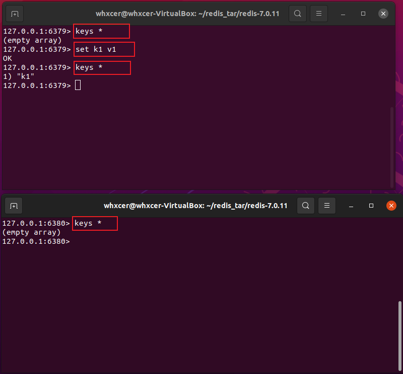

## 1. Redis 主从复制
### 1.1. 简介
Redis 的主从复制是指将一个 Redis 实例（称为主节点）的数据复制到其他 Redis 实例（称为从节点）的过程。主从复制可以实现数据备份、读写分离、负载均衡等功能。

主机数据更新后根据配置和策略，自动同步到从机的 master/slave 机制，Master 以写为主，Slave 以读为主。主少从多、主写从读、读写分离、主写同步复制到从。

### 1.2. 主从复制的方式
在 Redis 主从复制中，主节点负责接收客户端的写操作，并将其同步到从节点。从节点只能接收读操作请求，不能进行写操作。主节点将数据同步到从节点的方式有两种：
1. ```全量复制```
主节点将所有数据发送给从节点进行复制，适用于从节点第一次复制数据或者从节点数据丢失需要重新复制的情况。
2. ```增量复制```
主节点只发送最新的修改数据给从节点进行复制，适用于从节点已经复制过数据，只需要同步最新数据的情况。

### 1.3. 主从复制的步骤
主从复制的步骤如下：
1. 从节点连接主节点，并发送 SYNC 命令请求复制数据。
2. 主节点接收到 SYNC 命令后，开始进行复制数据。
3. 主节点将数据发送给从节点进行复制。
4. 从节点接收到数据后，将其保存到本地数据库中。
5. 主节点将增量数据发送给从节点进行同步。
6. 从节点接收到增量数据后，将其保存到本地数据库中。
7. 主从复制完成。

需要注意的是，主从复制中主节点的数据可能会出现延迟，因为主节点需要将数据同步到从节点才能进行读取。如果需要实现实时读写分离，可以采用 Redis 集群的方式。

### 1.4. Redis的主从复制和Redis集群的区别
Redis 的主从复制和 Redis 集群都是实现高可用性的方式，但它们的实现方式和应用场景有所不同。
1. 主从复制是将一个 Redis 实例（主节点）的数据复制到多个 Redis 实例（从节点）中，可以实现数据的备份和读写分离。主节点负责写操作，从节点负责读操作，可以提高读写性能。但是主从复制不能扩展写性能，因为所有的写操作都需要在主节点上执行。
2. Redis 集群是将多个 Redis 实例组成一个集群，每个实例负责部分数据，可以实现数据的分片存储和负载均衡。不同的实例负责不同的数据，可以提高写操作的性能。同时， Redis 集群还可以实现自动故障转移，当某个实例出现故障时，集群会自动将该实例的数据迁移到其他实例上，保证数据的可用性。
3. 因此，主从复制适用于读多写少的场景，而 Redis 集群适用于读写都比较频繁的场景。如果需要提高读写性能和数据的可用性，可以采用主从复制和 Redis 集群的组合方式。


## 2. Redis 主从复制的示例（一主二从）
### 2.1. 在同一台服务器上搭建三台 Redis 服务
1. 提供三份 Redis 配置文件：```redis6379.conf```、```redis6380.conf```、```redis6381.conf```
2. 修改三份配置文件，以 ```redis6379.conf``` 为例：
    ```bind 127.0.0.1```
    ```port 6379```
    ```pidfile /var/run/redis_6379.pid```
    ```logfile "6379.log"```
    ```dbfilename dump6379.rdb```
3. 使用上面的三个配置文件，启动三个 Redis 服务：
    ```redis-server redis6379.conf &```
    ```redis-server redis6380.conf &```
    ```redis-server redis6381.conf &```
4. 通过 redis 客户端分别连接三台 redis 服务
    ```redis-cli -h 127.0.0.1 -p 6379```
    ```redis-cli -h 127.0.0.1 -p 6380```
    ```redis-cli -h 127.0.0.1 -p 6381```

### 2.2. 实际操作这三台 Redis 服务的功能
1. 查看这三台 redis 服务在集群中的主从角色 ```info replication```
默认情况下，所有的 redis 服务都是主机，即都能写和读，但是都还没有从机。

2. 先在 ```6379``` 进行写操作：
执行 ```set k1 v1```；三台 redis 服务互相独立，互不影响。

3. 设置主从关系：设从不设主
在 ```6380``` 上执行：```slaveof 127.0.0.1 6379```
在 ```6381``` 上执行：```slaveof 127.0.0.1 6379```

4. 全量复制：一旦主从关系确定，会自动把主库上已有的数据同步复制到从库。
在 ```6380``` 和 ```6381``` 上执行：```keys *```

5. 增量复制：主库写数据会自动同步到从库。
在 ```6379``` 上执行：```set k2 v2```
在 ```6380``` 和 ```6381``` 上执行：```keys *```
6. 主写从读，读写分离：
在 ```6380``` 和 ```6381``` 上执行：```set k3 v3```  ===>报错
7. 主机宕机、从机原地待命:
关闭 ```6379``` 服务：```redis-cli -h 127.0.0.1 -p 6379 shutdown```
查看 ```6380``` 和 ```6381``` 服务的主从角色：```info replication```

8. 主机恢复、一切恢复正常：
重启 ```6379``` 服务：```redis-server redis6379.conf &```
客户端连接 6379：```redis-cli -h 127.0.0.1 -p 6379```

9. 从机宕机、主机少一个从机、其它从机不变：
关闭 ```6380``` 服务： ```redis-cli -h 127.0.0.1 -p 6380 shutdown```
查看 ```6379``` 服务的主从角色：```info replication```
查看 ```6381``` 服务的主从角色：```info replication```

10. 从机恢复、需要重新设置主从关系：
重启 ```6380``` 服务：```redis-server redis6380.conf &```
客户端连接 6380：```redis-cli -h 127.0.0.1 -p 6380```
在 ```6380``` 上执行： ```slaveof 127.0.0.1 6379```
11. 从机上位：
    a) 主机宕机、从机原地待命：
       关闭 ```6379``` 服务：```redis-cli -h 127.0.0.1 -p 6379 shutdown```
       查看 ```6380``` 和 ```6381``` 服务的主从角色：```info replication```
    b) 从机断开原来主从关系，恢复为独立的主机：
       在 ```6380``` 上执行：```slaveof no one```
       查看 ```6380``` 服务的主从角色：```info replication```
    c) 重新设置主从关系：
       在 ```6381``` 上执行：```slaveof 127.0.0.1 6380```
    d) 之前主机恢复、变成孤家寡人：
       重启 ```6379``` 服务：```redis-server redis6379.conf &```
       客户端连接 6379：```redis-cli -h 127.0.0.1 -p 6379```
    e) 天堂变地狱：
       在 ```6379``` 上执行：slaveof 127.0.0.1 6381
       在 ```6381``` 上执行：info replication   既是主机又是从机

小结：一台主机配置多台从机，一台从机又可以配置多台从机，从而形成一个庞大的集群架构。减轻一台主机的压力，但是增加了服务间的延迟时间。


## 3. Redis 主从复制的意义
1. ```提高系统的可靠性```
主从复制可以将数据备份到多个节点上，当主节点出现故障时，可以快速切换到从节点上，保证系统的高可用性和可靠性。
2. ```减轻主节点的负载```
主从复制可以实现读写分离，从节点可以承担一部分读操作的负载，减轻主节点的压力，提高系统的性能。
3. ```数据的容灾备份```
主从复制可以将数据备份到多个节点上，当节点出现故障时，可以快速恢复数据，保证数据的安全性和完整性。
4. ```数据的分布式处理```
主从复制可以将数据分布到多个节点上，实现数据的分布式处理，提高系统的并发性能和处理能力。
5. ```数据的实时同步```
主从复制可以实现数据的实时同步，保证数据的一致性，提高系统的稳定性和可靠性。

## 4. 参考
关于 ```Reids主从复制``` 更详细的内容，请参考 [Redis 中文文档](https://redis.com.cn/topics/replication.html)
