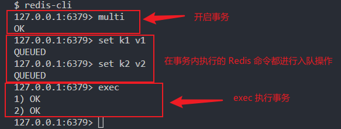
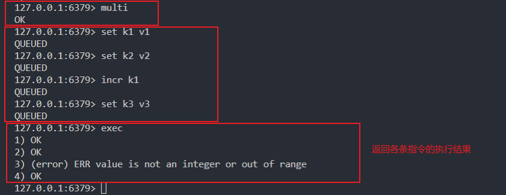
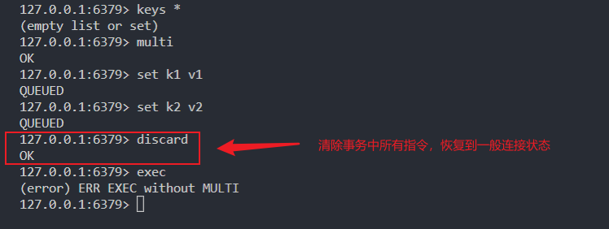
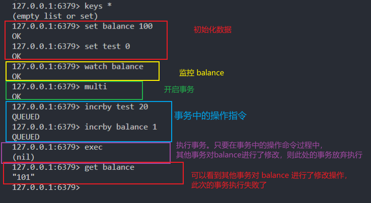
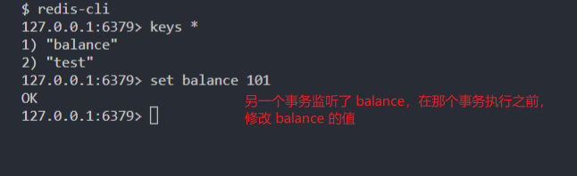
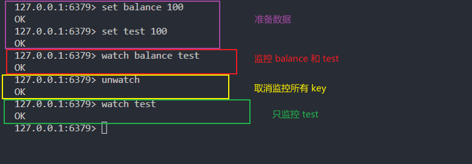

## 1. Redis 的事务
一般来说，常见的关于 MySQL 的 ```事务``` 的定义，无非是把一组数据库命令放在一起执行，保证操作原子性，要么同时成功，要么同时失败。

但是 Redis 的事务跟 MySQL 的事务有一点点区别，Redis 的事务允许把一组 redis 命令放在一起，把命令进行序列化，然后一起执行，但是 Redis 只保证部分原子性，Redis 的事务不能回滚，这就是它跟 MySQL 事务的差异。

Redis 事务执行的基本步骤：
1. 使用 multi 开启事务
2. 将要执行的一系列命令放入队列中
3. 使用 exec 执行事务

Redis 的事务只能保证部分的原子性，且不支持回滚：
- 如果在把命令压入队列的过程中报错，则整个队列中的命令都不会执行，执行结果报错；
- 如果在压队列的过程中正常，在执行队列中某一个命令报错，则只会影响本条命令的执行结果，其它命令正常运行；不会像 MySQL 一样，只要有一个命令不成功，那其他已经执行的命令都得回滚。

## 2. Redis事务的常用命令
### 2.1. multi
语法：
- multi

功能：
- 用于标记事务块的开始。Redis 会将后续的命令逐个放入队列中，然后才能使用 ```EXEC``` 命令原子化地执行这个命令序列。

返回值：
- 如果开启成功，则返回 OK。



### 2.2. exec
语法：
- exec


功能：
- 用来执行事务队列中所有的命令，然后恢复正常的连接状态。
- 当使用 watch 命令时，只有当受监控的键没有被修改时，exec 命令才会执行事务中的命令；而一旦执行了 exec 命令，之前加的所有 watch 监控全部取消。

返回值：
- 这个命令的返回值是一个数组，其中的每个元素分别是原子化事务中的每个命令的返回值。
- 当使用 watch 命令时，如果事务执行中止，那么 exec 命令就会返回一个 Null 值。



### 2.3. discard
语法：
- discard


功能：
- 清除所有已经压入队列中的命令，并且结束整个事务。
- 如果使用了 watch 命令，那么 discard 命令就会将当前连接监控的所有键取消监控。

返回值：
- 清除成功，返回OK。



### 2.4. watch
语法：
- ```watch key [key …]```

功能：
- 监控某一个键，当事务在执行过程中，此键代码的值发生变化，则本事务放弃执行；否则，正常执行。
- watch 命令相当于关系型数据库中的乐观锁。

返回值：
- 监控成功，返回 OK。

开启两个 redis-cli 客户端来验证：



### 2.5. unwatch
语法：
- unwatch

功能：
- 放弃监控所有的键
- 如果在 watch 命令之后你调用了 exec 或 discard 命令，那么就不需要手动调用 unwatch 命令。

返回值：
- 清除成功，返回 OK。



## 3. Redis 事务小结
1. 单独的隔离操作
事务中的所有命令都会序列化、顺序地执行。事务在执行过程中，不会被其它客户端发来的命令请求所打断，除非使用 watch 命令监控某些键。
2. 不保证事务的原子性
redis 同一个事务中如果一条命令执行失败，其后的命令仍然可能会被执行，redis 的事务没有回滚。Redis 已经在系统内部进行功能简化，这样可以确保更快的运行速度，因为 Redis 不需要事务回滚的能力。

## 4. Redis 中文文档
https://redis.com.cn/topics/transactions.html
