## （一） 通用类型的命令
### 1. Redis 服务器的启动和关闭
1. ```启动 Redis 服务```：
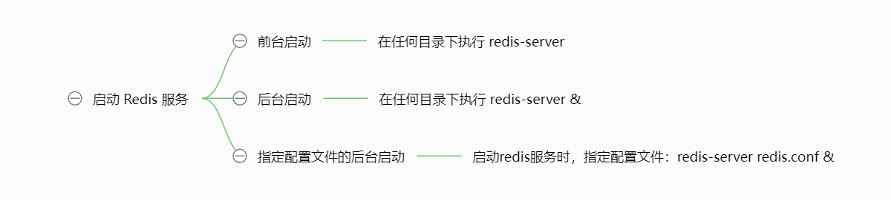
2. ```关闭 Redis 服务```：
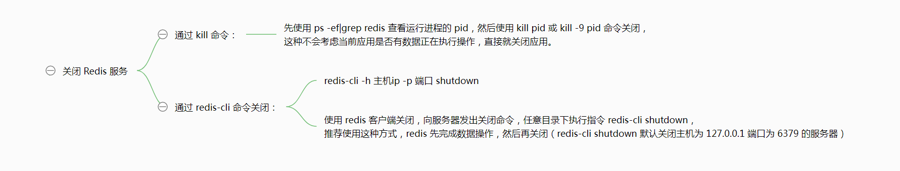

### 2. Redis 客户端
1. 命令行客户端
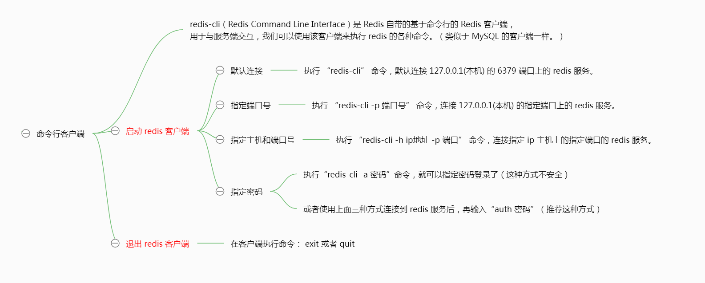
2. 可视化界面的客户端
[AnotherRedisDesktopManager](https://github.com/qishibo/AnotherRedisDesktopManager/)
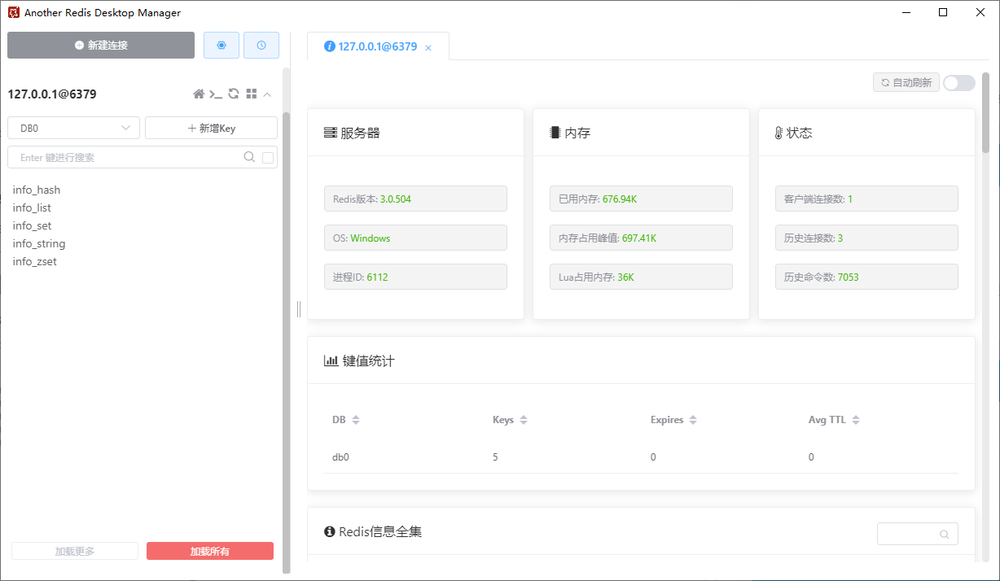

### 3. 配置文件
```Redis``` 的配置文件位于 ```Redis``` 安装目录下，文件名为 ```redis.conf```：
- 网络上的 redis.conf 配置文件
http://download.redis.io/redis-stable/redis.conf
- redis.conf 配置文件参数的说明
[Redis 配置](https://www.runoob.com/redis/redis-conf.html)
[Redis 配置文件详解](https://redis.com.cn/redis-configuration.html)

可以通过 ```CONFIG``` 命令查看或设置配置项，如下所示：


### 4. 查看 redis 服务器的统计信息
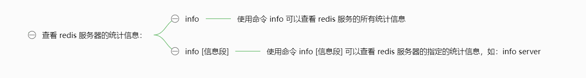

### 5. 其他
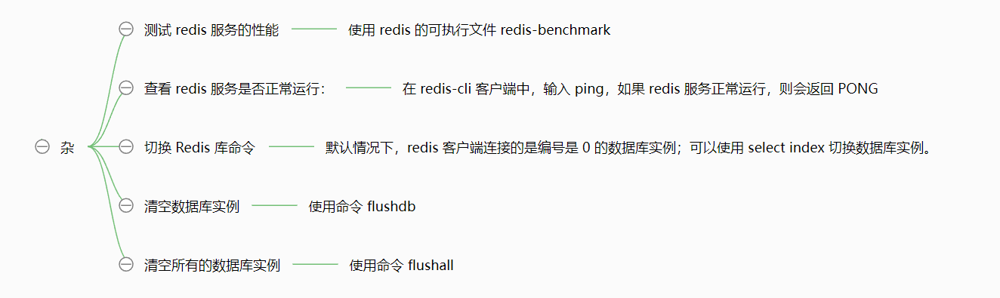

### 6. key 的常用命令
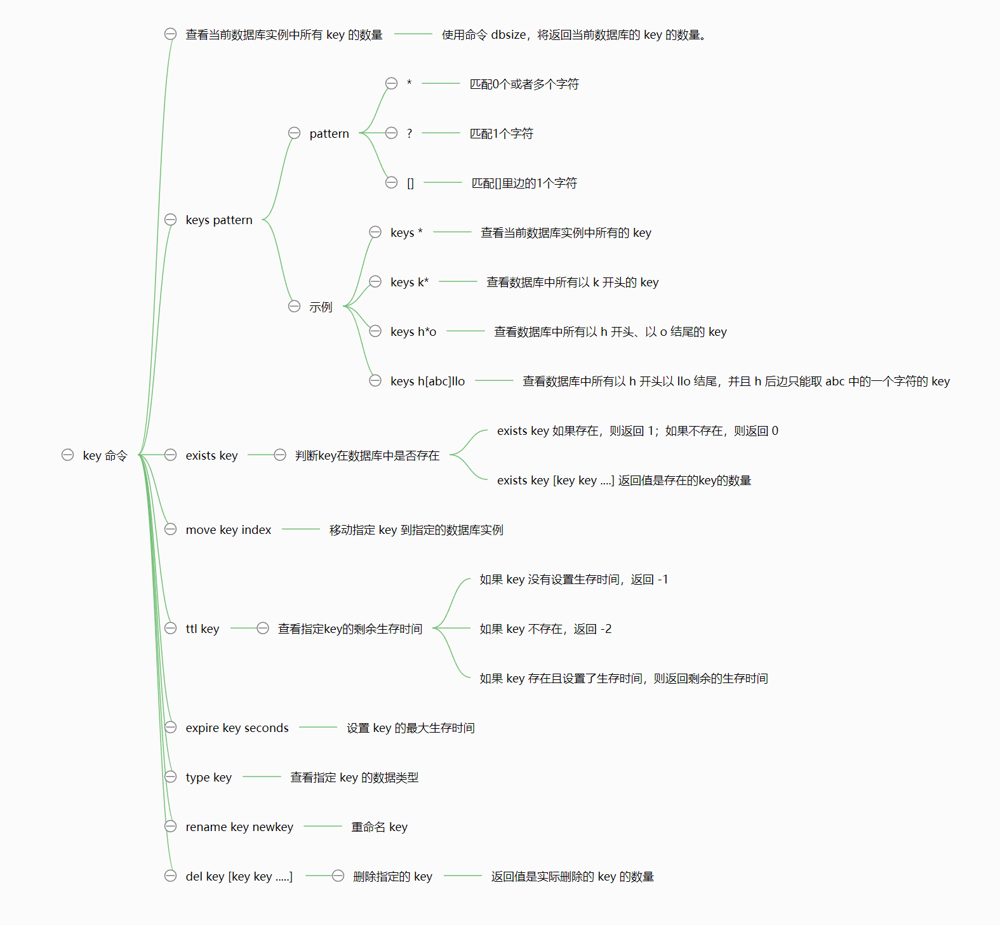


## （二） Redis 的五种数据结构和对应数据结构的常用命令
程序是用来处理数据的，Redis 是用来存储数据的；程序处理完的数据要存储到 redis 中，不同特点的数据要存储在 Redis 中不同类型的数据结构中。（个人感觉和 Python 语言中的数据类型比较像，不同的数据存储到对应的数据结构中，然后这些数据结构还拥有特定的操作命令）

Redis 中的五种数据结构：
1. ```字符串类型 string```
2. ```列表类型 list```
3. ```哈希类型 hash```
4. ```集合类型 set```
5. ```有序集合类型 zset （sorted set）```


### 1. redis 中有关 string 类型数据的常用操作命令
字符串类型是 Redis 中最基本的数据结构，它能存储任何类型的数据，包括二进制数据，序列化后的数据，JSON 化的对象甚至是一张图片。最大 512M。

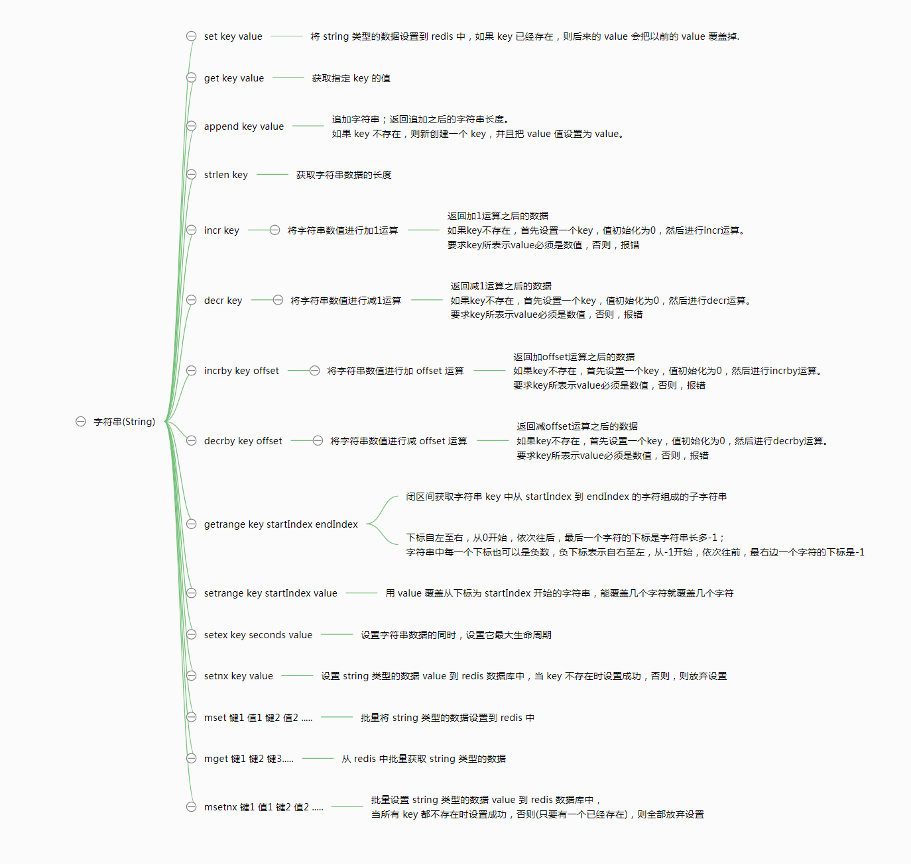

### 2. redis 中有关 list 类型数据的常用操作命令
Redis 列表是简单的字符串列表，按照插入顺序排序，元素可以重复。你可以添加一个元素到列表的头部（左边）或者尾部（右边），底层是个链表结构。

- list 中的多个 value 之间有顺序，最左侧是表头，最右侧是表尾
- 每一个元素都有下标，表头元素的下标是 0，依次往后排序，最后一个元素下标是列表长度 -1
- 每一个元素的下标又可以用负数表示，负下标表示从表尾计算，最后一个元素下标用 -1 表示
- 主要通过 key 和下标来操作 list 类型的数据。

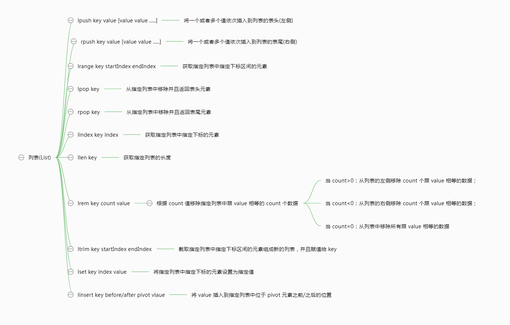

### 3. redis 中有关 hash 类型数据的常用操作命令
Redis hash 是一个 string 类型的 field 和 value 的映射表，可以用来存储一些 key-value 对，hash 特别适合用于存储对象。

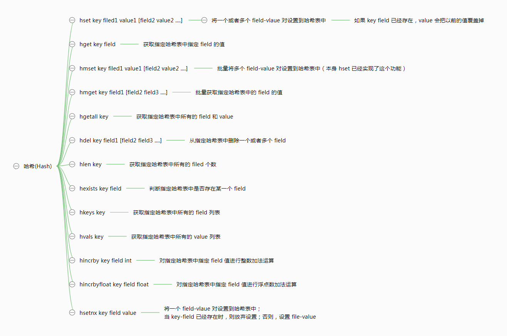

### 4. redis 中有关 set 类型数据的常用操作命令
Redis 的 Set 是 string 类型的无序无重复集合。集合是通过哈希表实现的，所以添加，删除，查找的复杂度都是 O(1)。
和列表类似，也可以存储多个元素，但是不能重复，集合中的元素是无序的，集合可以进行交集、并集、差集操作

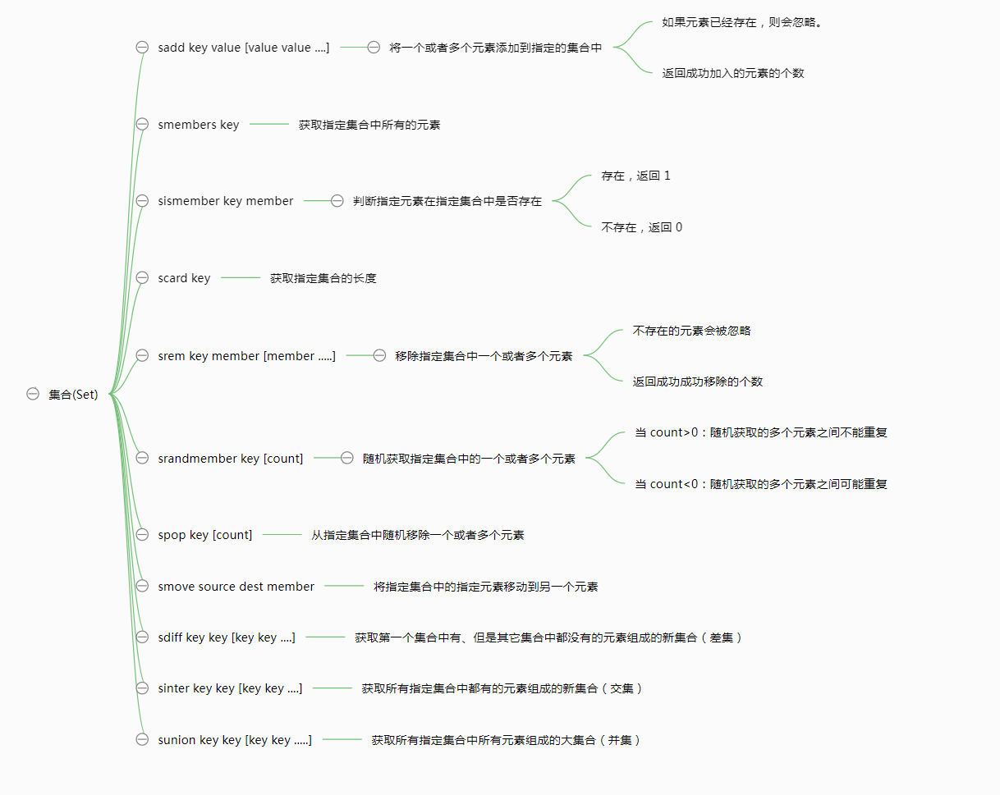

### 5. redis 中有关 zset 类型数据的常用操作命令
Redis 的 zset 和 set 一样也是 string 类型元素的集合，且不允许重复的成员。
不同的是 zset 的每个元素都会关联一个分数（分数可以重复），redis 通过分数来为集合中的成员进行**从小到大的排序**。
zset 的成员是唯一的，但分数(score)却可以重复。

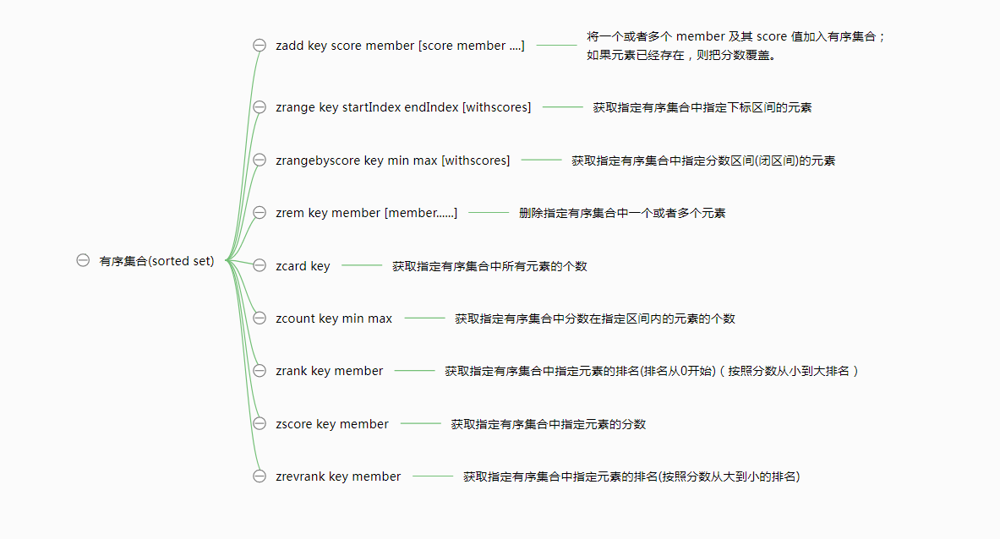


## （三） 更具体的命令，请参考以下链接
[redis中文文档 - redis命令手册](https://redis.com.cn/commands.html)
[菜鸟教程 - Redis命令](https://www.runoob.com/redis/redis-commands.html)