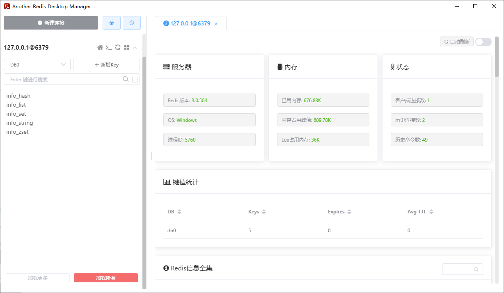

## （一） NoSQL 简介
### 1. 数据库应用的演变历程
1. 单机数据库时代
一个应用，一个数据库实例
2. Memcached 时代
3. 读写分离时代
4. 分表分库时代(集群)
5. nosql 时代

### 2. NoSQL 数据库
NoSQL = Not Only SQL(不仅仅是SQL) ，泛指 non-relational (非关系型数据库)。今天随着互联网 web2.0 网站的兴起，比如谷歌或 Facebook 每天为他们的用户收集万亿比特的数据，这些类型的数据存储不需要固定的模式，无需多余操作就可以横向扩展，就是一个数据量超大。传统的 SQL 语句库不再适应这些应用了。NoSQL 数据库是为了解决大规模数据集合多重数据种类带来的挑战，特别是超大规模数据的存储。

NoSQL 数据库的一个显著特点就是去掉了关系数据库的关系型特性，数据之间一旦没有关系，使得扩展性、读写性能都大大提高。

### 3. SQL 和 NoSQL
#### （1） 关系型数据库
关系型数据库是指采用了关系模型来组织数据的数据库。简单来说，关系模式就是二维表格模型。

主要代表有：SQL Server、Oracle、PostgreSQL、MySQL、DB2、SQLite、...

#### （2） 非关系型数据库
非关系型数据库彻底改变底层存储机制。不再采用关系数据模型，而是采用聚合数据结构存储数据。

主要代表有：Redis、mongoDB、HBase、....

聚合模型---把一组相关联的数据作为一个整体进行存储和管理：K-V键值对、列簇、图表模型等。
Redis 采用的是 K-V 模型存储数据的。

存储示例：
```
{
    "student": {
        "id": 1001,
        "name": "zhangsan",
        "addresses": {"city":"haikou","street":"qiongshanqu"},
        "courses":[
            {
                "id":01,
                "name":"python"
            },
            {
                "id":02,
                "name":"flask"
            },
        ]
    }
}
```

#### （3） 两者间的关系
```NoSQL``` 和 ```传统的关系型数据库``` 不是排斥和取代的关系，在一个分布式应用中往往是结合使用的。复杂的互联网应用通常都是多数据源、多数据类型，应该根据数据的使用情况和特点，存放在合适的数据库中。


## （二） Redis
### 1. Redis 简介
Reids（Remote Dictionary Server 远程字典服务器），是一个用 C 语言编写的、开源的、基于内存运行并支持持久化的、高性能的 NoSQL 数据库。也是当前热门的 NoSQL 数据库之一。Redis 中的数据大部分时间都是存储内存中的，适合存储频繁访问、数据量比较小的数据。

Redis 是一种数据库。能够存储数据、管理数据的一种软件。

### 2. Redis 的特点
1. ```支持数据持久化```
Redis 支持数据的持久化，可以将内存中的数据保持在磁盘中，重启的时候可以再次加载进行使用。
2. ```支持多种数据结构```
Redis 不仅仅支持简单的 key-value 类型的数据，同时还提供 list、set、zset、hash 等数据结构的存储。
3. ```支持数据备份```
Redis 支持数据的备份，即 master-slave 模式的数据备份。

### 3. Redis 的安装
关于 Redis 在 windows 或 linux 上的安装，请参照：
[Redis 安装](https://www.runoob.com/redis/redis-install.html)

关于使用 Docker 安装并启动 Redis，请参照：
[使用Docker安装并启动Redis](https://www.cnblogs.com/wanghuizhao/p/17124637.html)

一般来说，安装完成后的 Redis 会有这么几个可执行文件：
1. ```redis-server```
redis 的服务器端
2. ```redis-cli```
redis 的客户端
3. ```redis-benchmark```
测试 redis 服务的性能
4. ```redis-check-aof -> redis-server```
5. ```redis-check-rdb -> redis-server```
6. ```redis-sentinel -> redis-server```

### 4. 启动 Redis 服务
1. 前台启动
在任何目录下执行 ```redis-server```
2. 后台启动
在任何目录下执行 ```redis-server &```
3. 启动redis服务时，指定配置文件：```redis-server redis.conf &```

### 5. 关闭 Redis 服务
1. 通过 ```kill``` 命令：
先使用 ```ps -ef|grep redis``` 查看运行进程的 pid，然后使用 ```kill pid``` 或 ```kill -9 pid``` 命令关闭，这种不会考虑当前应用是否有数据正在执行操作，直接就关闭应用。
2. 通过 ```redis-cli``` 命令关闭：
使用 redis 客户端关闭，向服务器发出关闭命令，任意目录下执行指令 ```redis-cli shutdown```，推荐使用这种方式，redis 先完成数据操作，然后再关闭

### 6. redis 的客户端
Redis 客户端是一个程序，通过网络连接到 Redis 服务器，从而实现跟 Redis 服务器的交互。

Redis 客户端发送命令，同时显示 Redis 服务器的处理结果。

#### （1） 命令行客户端
redis-cli（Redis Command Line Interface）是 Redis 自带的基于命令行的 Redis 客户端，用于与服务端交互，我们可以使用该客户端来执行 redis 的各种命令。（类似于 MySQL 的客户端一样。）

启动 ```redis``` 客户端：
- 默认连接
执行 ```redis-cli``` 命令，默认连接 127.0.0.1(本机) 的 6379 端口上的 redis 服务。
- 指定端口号
执行 ```redis-cli -p 端口号``` 命令，连接 127.0.0.1(本机) 的指定端口上的 redis 服务。
- 指定主机和端口号
执行 ```redis-cli -h ip地址 -p 端口``` 命令，连接指定 ip 主机上的指定端口的 redis 服务。

退出客户端：
- 在客户端执行命令： ```exit``` 或者 ```quit```

#### （2） 可视化界面的客户端
使用的可视化工具 [AnotherRedisDesktopManager](https://github.com/qishibo/AnotherRedisDesktopManager/)



### 7. redis 的基本知识
redis 中数据库个数相关：
1. Redis 默认使用 ```16``` 个库，从 ```0``` 到 ```15```，使用时通过编号来使用数据库；也可以通过配置文件，指定 ```redis``` 自动创建的数据库个数，在 ```redis.conf``` 文件中默认为 ```databases 16```，理论上可以配置无限多个。
2. Redis 的库和关系型数据库中的数据库实例类似，但又有一些不同，比如 redis 中各个库不能自定义命名，只能用序号表示；redis 中的数据库实例只能由 redis 服务来创建和维护，开发人员不能修改和自行创建数据库实例。
3. redis 中各个库不是完全独立的，使用时最好一个应用使用一个 redis 实例，不建议一个 redis 实例中保存多个应用的数据。redis 的每一个数据库实例本身占用的存储空间是很少的，所以也不造成存储空间的太多浪费。


命令相关：
1. 测试 redis 服务的性能
使用 redis 的可执行文件 ```redis-benchmark```
2. 查看 redis 服务是否正常运行：
在 ```redis-cli``` 客户端中，输入 ```ping```，如果 redis 服务正常运行，则会返回 ```PONG```
3. 查看 redis 服务器的统计信息：
使用命令 ```info``` 可以查看 redis 服务的所有统计信息
使用命令 ```info [信息段]``` 可以查看 redis 服务器的指定的统计信息，如：```info server```
4. 查看当前数据库实例中所有 key 的数量
使用命令 ```dbsize```，将返回当前数据库的 key 的数量。
5. 查看当前数据库实例中所有的 key
使用命令 ```keys *```
6. 清空数据库实例
使用命令 ```flushdb```
7. 清空所有的数据库实例
使用命令 ```flushall```
8. 查看 redis 中所有的配置信息
使用命令 ```config get *``` 获取运行中Redis服务器的配置参数， 获取全部配置可以使用 ```*```。参数信息来自 ```redis.conf``` 文件的内容。
9. 查看 redis 中的指定的配置信息
使用命令 ```config get parameter```，例如：获取数据库个数 ```config get databases```；获取端口号 ```config get port```
10. 切换 Redis 库命令
默认情况下，redis 客户端连接的是编号是 ```0``` 的数据库实例；可以使用 ```select index``` 切换数据库实例。


## （三） 参考
[深入剖析Redis教程-全网讲的最细最全的Redis教程](https://www.bilibili.com/video/BV13U4y1a7vi/?p=1&vd_source=4859610c015d401745b90b6ed755b9d6)
[redis 中文版命令大全](http://redisdoc.com/)
