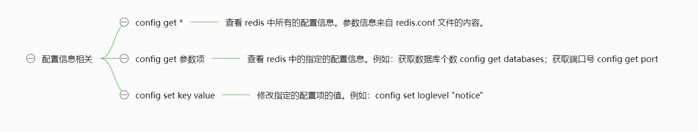

### 1. Redis 配置文件的位置
在 linux 操作系统中，安装了 Redis 后，Redis 的配置文件位于 Redis 安装目录下，文件名为 ```redis.conf```（例如：```Ubuntu apt``` 命令安装，则配置文件位于 ```/etc/redis/redis.conf```）。Redis 启动时会加载这个配置文件，在运行时按照配置进行工作。

网络上的 redis.conf 配置文件，可以下载下来查看：
http://download.redis.io/redis-stable/redis.conf

### 2. 修改配置文件，让 redis 服务根据配置文件来运行
```Redis``` 在启动时会使用默认的配置文件 ```redis.conf``` 来启动，如果需要使用其他配置文件，可以通过命令行参数指定。如果没有指定配置文件，则会使用默认配置。

如果我们修改了默认的 ```redis.conf``` 配置文件之后，需要重新启动 ```redis-server```，修改的配置项才能生效。
```
# redis 在 ubuntu 下使用 apt 命令安装
sudo apt install redis-server

# 切换至 redis.conf 目录下查看配置信息
cd /etc/redis/

# 修改配置文件 redis.conf
vi redis.conf

# 使用 redis-cli 客户端发出命令关闭 redis 服务
redis-cli shutdown

# 根据配置文件以及后台运行的方式启动 redis 服务
redis-server redis.conf &

# 查看 redis 是否运行
ps -ef|grep redis
```

### 3. 配置内容的解释（网络相关配置）
1. ```bind```
绑定 IP 地址，其它机器可以通过此 IP 访问 Redis，默认绑定 ```bind 127.0.0.1 -::1```，可以```注释掉```、```将 127.0.0.1 改为 0.0.0.0```或```修改为本机的 IP 地址```，这三种方法都可以让其它机器访问到本机的 Redis。
2. ```port```
配置 Redis 占用的端口，默认是 ```port 6379```。
3. ```tcp-keepalive```
它是 ```TCP 连接```保活策略，可以通过 ```tcp-keepalive``` 配置项来进行设置，单位为秒，假如设置为 ```60``` 秒，则 ```server``` 端会每 ```60``` 秒向连接空闲的客户端发起一次 ```ACK``` 请求，以检查客户端是否已经挂掉，对于无响应的客户端则会关闭其连接。如果设置为 ```0```，则不会进行保活检测（默认为 ```tcp-keepalive 300```）。

### 4. 配置内容的解释（常规配置）
1. ```loglevel```
日志级别，开发阶段可以设置成 ```debug```，生产阶段通常设置为 ```notice``` 或者 ```warning```，默认为 ```loglevel notice```。
2. ```logfile```
指定日志文件。redis 在运行过程中，会输出一些日志信息；默认情况下，这些日志信息会输出到控制台；我们可以使用 ```logfile``` 配置日志文件，使 ```redis``` 把日志信息输出到指定文件中。（默认为 ```logfile ""```，由于我是使用 ```ubuntu``` 中的 ```sudo apt-get install redis``` 安装的，因此会默认设置为 ```logfile /var/log/redis/redis-server.log```）。
3. ```databases```
配置 Redis 数据库的个数，默认是 ```16``` 个，从 ```0``` 到 ```15```，使用时通过编号来使用数据库；也可以通过配置文件，指定 ```redis``` 自动创建的数据库个数，在 ```redis.conf``` 文件中默认为 ```databases 16```，理论上可以配置无限多个。

### 5. 配置内容的解释（安全配置）
1. ```requirepass```
配置 ```Redis``` 的访问密码。默认不配置密码，即访问不需要密码验证。一旦设置了密码验证，客户端连接 ```redis``` 服务时，必须使用密码连接：```redis-cli -h ip -p 6379 -a pwd```。


### 6. 在客户端查看或设置配置项
我们可以在客户端通过 ```config``` 命令查看或设置配置项



### 7. 更详细的配置
[Redis中文学习网 - Redis 配置文件详解](https://redis.com.cn/redis-configuration.html)
[菜鸟教程 - Redis 配置](https://www.runoob.com/redis/redis-conf.html)