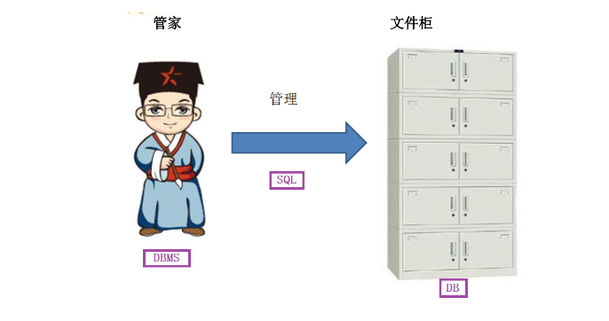
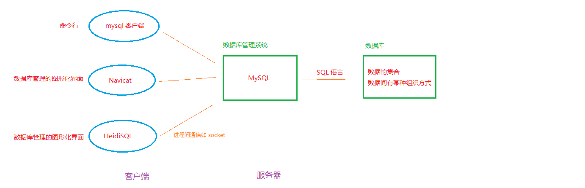
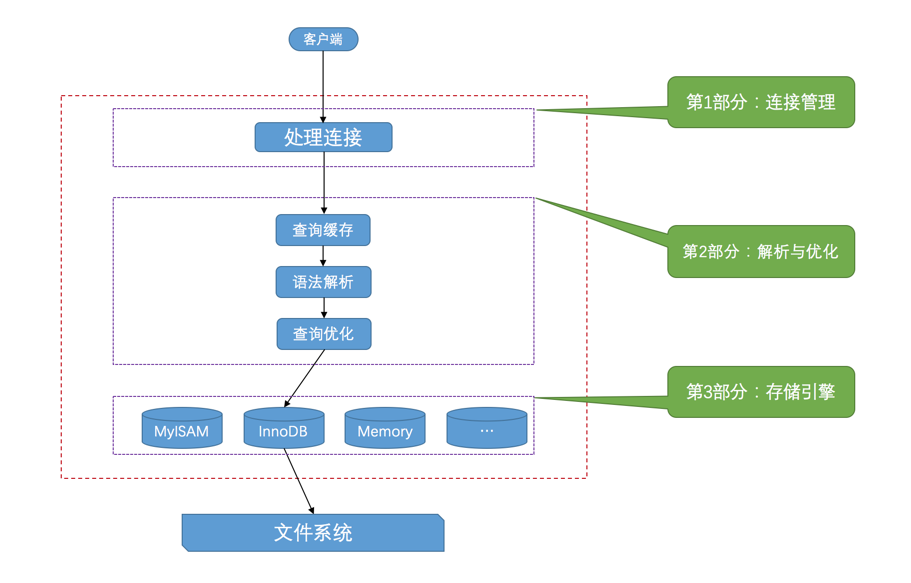

## （一） 数据库基础
### 1. 什么是数据库
数据库这个术语的用法很多，一般来说，数据库是一个以某种有组织的方式存储的数据集合。理解数据库的一种最简单的办法是将其想象为一个文件柜。此文件柜是一个存放数据的物理位置，不管数据是什么以及如何组织的。

数据库（database）：保存有组织的数据的容器（通常是一个文件或一组文件）。

### 2. 数据库管理系统（DBMS）
人们通常用数据库这个术语来代表他们使用的数据库软件。这是不正确的，它是引起混淆的根源。

确切地说，数据库软件应称为 DBMS（数据库管理系统）。数据库是通过 DBMS 创建和操纵的容器。数据库可以是保存在硬设备上的文件，但也可以不是。在很大程度上说，数据库究竟是文件还是别的什么东西并不重要，因为你并不直接访问数据库；你使用的是DBMS，它替你访问数据库。

数据库管理系统（DBMS）的种类：
1. 关系型数据库管理系统
Oracle Database：甲骨文公司的RDBMS
SQL Server：微软公司的RDBMS
DB2：IBM公司的RDBMS
PostgreSQL：开源的RDBMS
MySQL：开源的RDBMS
2. 非关系型数据库管理系统
MongoDB
Redis
...

### 3. 数据库、数据库管理系统、SQL
严格来说，数据库和数据库管理系统不是同一个东西。但是在现实中，数据、DBMS 及关联应用一起被称为数据库系统，通常简称为数据库。

1. 数据库
用于存储数据的地方，是通过 DBMS 创建和操纵的容器（通常是一个文件或一组文件，即存储在磁带、磁盘、光盘或其他外存介质上、按一定结构组织在一起的相关数据的集合）。
2. 数据库管理系统
用于管理数据库的软件，数据库管理系统是一种操纵和管理数据库的大型软件，用于建立、使用和维护数据库，简称 DBMS。它对数据库进行统一的管理和控制，以保证数据库的安全性和完整性。
3. SQL
它只是一种语言，是一种专门用来与数据库沟通的语言。
与其他语言（如，英语以及Java和Visual Basic这样的程序设计语言）不一样，SQL由很少的词构成，这是有意而为的。设计SQL的目的是很好地完成一项任务，即提供一种从数据库中读写数据的简单有效的方法。




### 4. 数据库详细信息（往文件柜中放文件）
在将资料放入自己的文件柜时，并不是随便将它们扔进某个抽屉就完事了，而是在文件柜中创建文件，然后将相关的资料放入特定的文件中。在数据库领域中，这种文件称为表。

1. 表
表是一种结构化的文件，可用来存储某种特定类型的数据。表可以保存顾客清单、产品目录，或者其他信息清单。数据库中的每个表都有一个名字来标识自己，这个名字是唯一的。
2. 列
表由列组成。表中的一个字段。所有表都是由一个或多个列组成的。
3. 列的数据类型
数据库中每个列都有相应的数据类型。数据类型（datatype）定义了列可以存储哪些数据种类。
4. 行
表中的数据是按行存储的，所保存的每个记录存储在自己的行内。如果将表想象为网格，网格中垂直的列为表列，水平行为表行。（一条数据库记录，通常指的是一行数据）
5. 主键
表中每一行都应该有一列（或几列），其值可以唯一标识自己。唯一标识表中每行的这个列（或这几列）称为主键。主键用来表示一个特定的行。没有主键，更新或删除表中特定行就极为困难，因为你不能保证操作只涉及相关的行。


## （二） MySQL
### 1. MySQL 的客户端／服务器架构
以我们平时使用的 QQ 为例，它其实是由两部分组成的，一部分是客户端程序，一部分是服务器程序。客户端可能有很多种形式，比如 浏览器网站、微信、QQ、网游客户端等等。当我们在 QQ 上给某个好友发送消息时，通常过程是这样的：
1. 消息被客户端包装了一下，添加了发送者和接收者信息，然后从我们的 QQ 客户端传送给 腾讯QQ 服务器
2. 腾讯 QQ 服务器从消息里获取到它的发送者和接收者，根据消息的接收者信息把这条消息送达到指定的好友 QQ 客户端，对方的 QQ 客户端里就显示出刚刚发送的一条消息。

MySQL 的使用过程跟这个是一样的，它的服务器程序直接和我们存储的数据打交道，然后可以有好多客户端程序连接到这个服务器程序，发送增删改查的请求，然后服务器就响应这些请求，从而操作它维护的数据。和 QQ 一样，MySQL的每个客户端都需要提供用户名密码才能登录，登录之后才能给服务器发请求来操作某些数据。我们日常使用MySQL的情景一般是这样的：
1. 启动MySQL服务器程序。
2. 启动MySQL客户端程序并连接到服务器程序。
3. 在客户端程序中输入一些命令语句作为请求发送到服务器程序，服务器程序收到这些请求后，会根据请求的内容来操作具体的数据并向客户端返回操作结果。

- ```MySQL客户端```
MySQL 的命令行客户端（MySQL 安装时携带的 ```mysql.exe``` 文件）
- ```MySQL服务器端```
MySQL 安装时携带的 ```mysqld.exe``` 文件



### 2. MySQL 服务器处理客户端请求
<font color='red'>客户端进程向服务器进程发送一段文本（MySQL语句），服务器进程处理后再向客户端进程发送一段文本（处理结果）。</font>那服务器进程对客户端进程发送的请求做了什么处理，才能产生最后的处理结果呢？


从上图可以看出，客户端可以向服务器发送增删改查各类请求，服务器程序处理来自客户端的查询请求大致需要经过三个部分，分别是 ```连接管理```、```解析与优化```、```存储引擎```。
1. ```连接管理```
客户端进程一般采用网络套接字来与服务器进程建立连接，每当有一个客户端进程连接到服务器进程时，服务器进程都会创建一个线程来专门处理与这个客户端的交互，当该客户端退出时会与服务器断开连接，服务器并不会立即把与该客户端交互的线程销毁掉，而是把它缓存起来，在另一个新的客户端再进行连接时，把这个缓存的线程分配给该新客户端。这样就起到了不频繁创建和销毁线程的效果，从而节省开销。
2. ```解析与优化```
**查询缓存：** 把刚刚处理过的查询请求和结果缓存起来，如果下一次有一模一样的请求过来，直接从缓存中查找结果，就不用再傻呵呵的去底层的表中查找了。（维护缓存会造成一些开销，从MySQL 5.7.20开始，不推荐使用查询缓存，并在MySQL 8.0中删除。）
**语法解析：** 客户端程序发送过来的请求只是一段文本，因此MySQL服务器程序首先要对这段文本做分析，判断请求的语法是否正确，然后从文本中将要查询的表、各种查询条件都提取出来放到MySQL服务器内部使用的一些数据结构上来。
**查询优化：** 语法解析之后，服务器程序获得到了需要的信息，比如要查询的列是哪些，表是哪个，搜索条件是什么等等，但光有这些是不够的，因为我们写的MySQL语句执行起来效率可能并不是很高，MySQL的优化程序会对我们的语句做一些优化，如外连接转换为内连接、表达式简化、子查询转为连接等等的一堆东西。
3. ```存储引擎```
截止到服务器程序完成了查询优化为止，还没有真正的去访问真实的数据表，MySQL服务器把数据的存储和提取操作都封装到了一个叫```存储引擎```的模块里。```存储引擎```负责在物理上表示```表和记录```。怎么从表中读取数据，怎么把数据写入具体的物理存储器上。
MySQL提供了各式各样的```存储引擎```，不同的```存储引擎```管理的数据库表具体的存储结构可能不同，采用的存取算法也可能不同，不同的存储引擎支持不同的功能。（常用存储引擎有：```InnoDB```、```MyISAM```、```MEMORY```等等）

## （三） 参考
[《MySQL必知必会》](https://book.douban.com/subject/3354490/)
[《MySQL是怎样运行的 - 从根儿上理解 MySQL》](https://book.douban.com/subject/35231266/) 非常非常棒的一本书，通俗易懂的讲解了 MySQL 的运行，值得买书来看
