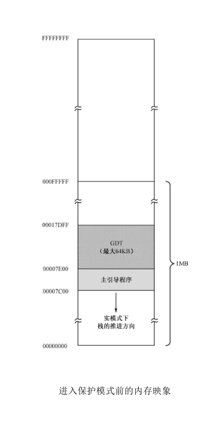
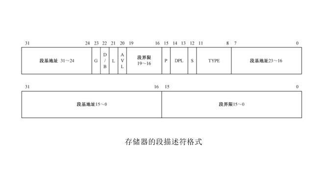
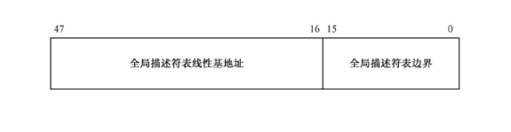
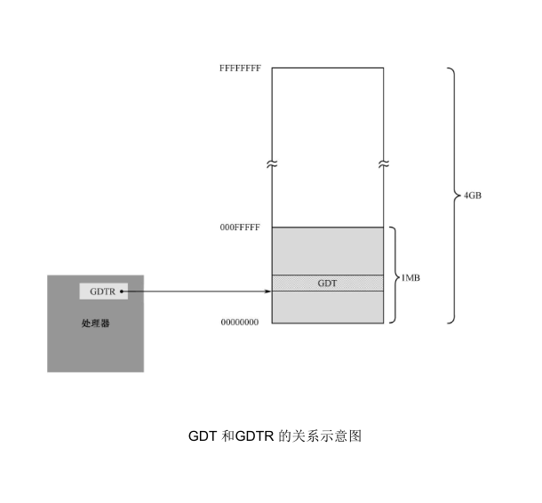
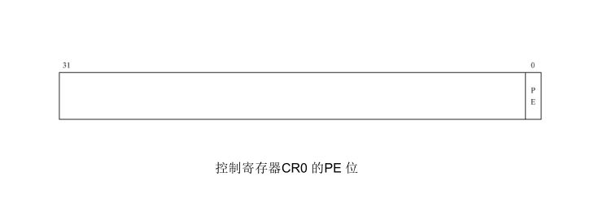
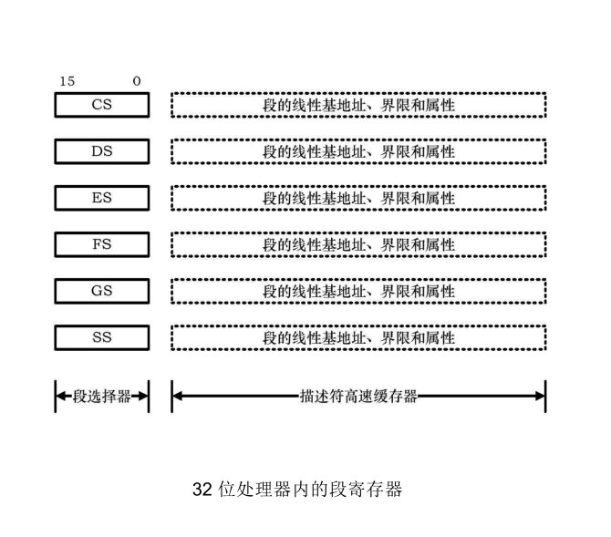
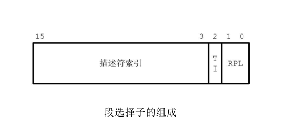
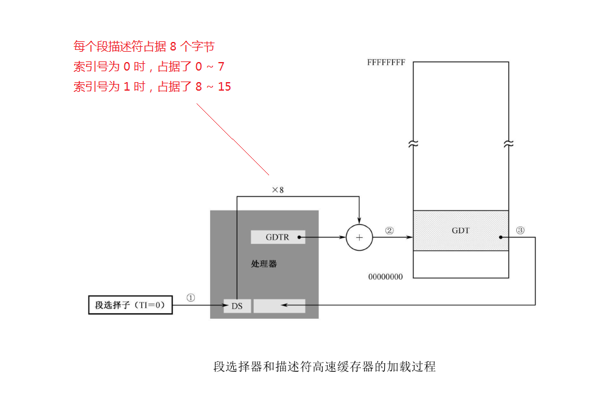
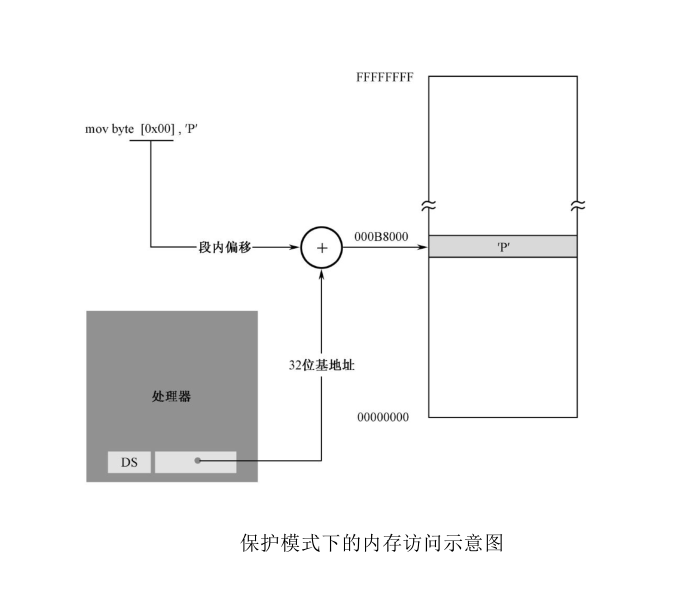
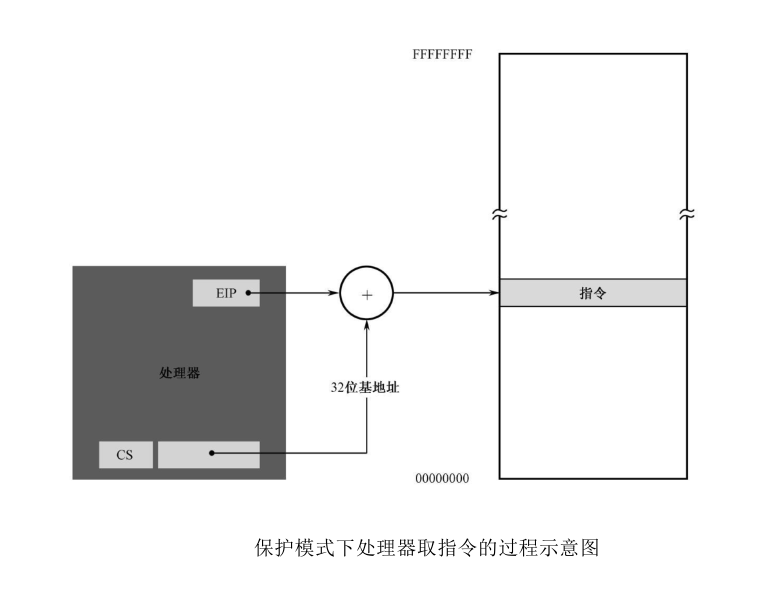

## （一） Intel 系列微处理器的 3 种工作模式
### 1. 实模式
工作方式相当于一个 8086。

在实模式下，用户程序对内存的访问非常自由，没有任何限制，随随便便就可以修改任何一个内存单元。

### 2. 保护模式
提供支持多任务环境的工作方式，建立保护机制。

在多用户、多任务时代，内存中会有多个用户（应用）程序在同时运行。为了使它们彼此隔离，防止因某个程序的编写错误或者崩溃而影响到操作系统和其他用户程序，使用保护模式是非常有必要的。

### 3. 虚拟 8086 模式
可以从保护模式切换至其中的一种 8086 工作方式。这种方式的提供使用户可以方便地在保护模式下运行一个或多个原 8086 程序。

## （二） 保护模式
在保护模式下，一般来说，操作系统负责整个计算机软、硬件的管理，它做任何事情都是可以的。但是，用户程序却应当有所限制，只允许它访问属于自己的数据，即使是转移，也只允许在自己的各个代码段之间进行。

- 可以避免某一个程序更改操作系统或其他用户程序的“地盘”而带来不可预料的后果
- 可以避免恶意的程序获取用户密码然后发送到网络上

### 1. 全局描述符表（GDT）相关的内容
在实模式下，为了让程序在内存中能自由浮动而又不影响它的正常执行，处理器将内存划分成逻辑上的段，并在指令中使用段内偏移地址。
在保护模式下，对内存的访问仍然使用段地址和偏移地址，但是，在每个段访问之前，必须先在全局描述符表（GDT）中登记（在操作系统中双击启动的程序，操作系统会自动帮忙登记）。

#### （1）全局描述符表（GDT）
在进入保护模式之前，必须要先定义全局描述符表。（也就是通过启动盘引导我们自己编写的程序，那么需要手动在 GDT 中登记 “空描述符”、“代码段描述符”、“数据段描述符” 和 “栈段描述符”。）

- 进入保护模式前的内存映像

- 每个段描述符在 GDT 中占 8 字节，也就是 2 个双字，或者说是 64 位，段描述符的格式如下：

- 段描述符各个字段的含义，请查看 [《x86汇编语言：从实模式到保护模式》](https://book.douban.com/subject/20492528/) 第十一章的内容。

#### （2） 全局描述符表寄存器（GDTR）
为了跟踪全局描述符表，CPU 内部有一个 48 位的寄存器，称为全局描述符表寄存器（GDTR）

- 全局描述符表线性基地址（32 位）
保存的是全局描述符表在内存中的起始线性地址（GDT 在内存中的起始线性地址）
- 全局描述符表边界（16 位）
保存的是全局描述符表的边界（GDT 的大小）
因为 GDT 的界限是 16 位的，所以，该表最大是 2^16 字节，也就是 65536 字节（64KB）。又因为每一个描述符占 8 字节，故最多可以定义 8192 个描述符。实际上，不一定非得这么多，到底有多少，视需要而定，但最多不能超过 8192 个。
- 设置 GDTR 寄存器的值使用 **lgdt 指令**

#### （3） GDT 和 GDTR 的关系
理论上，全局描述符表可以位于内存中的任何地方。但是，由于在进入保护模式之后，处理器立即要按新的内存访问模式工作，所以，必须在进入保护模式之前定义 GDT。但是，由于在实模式下只能访问 1MB 的内存，故 GDT 通常都定义在 1MB 以下的内存范围中。当然，允许在进入保护模式之后换个位置重新定义 GDT。

### 2. 保护模式下的内存访问
#### （1） 保护模式的启动（CR0 寄存器）
CR0 是处理器内部的控制寄存器（Control Register，CR）。之所以有个 “0” 后缀，是因为还有 CR1、CR2、CR3 和 CR4 控制寄存器，甚至还有 CR8。

CR0 是 32 位的寄存器，包含了一系列用于控制处理器操作模式和运行状态的标志位。如下图所示，它的第 1 位（位0）是保护模式允许位（Protection Enable，PE），是开启保护模式大门的门把手，如果把该位置 “1”，则处理器进入保护模式，按保护模式的规则开始运行。

#### （2） 32 位处理器下的段寄存器
在实模式下，处理器访问内存的方式是将段寄存器的内容左移 4 位，再加上偏移地址，以形成 20 位的物理地址。

8086 处理器的段寄存器是 16 位的，共有 4 个：CS、DS、ES 和 SS。而在 32 位处理器内，在原先的基础上又增加了两个段寄存器 FS 和 GS。

32 位处理器的这 6 个段寄存器又分为两部分，前 16 位和 8086 相同，在实模式下，它们用于按传统的方式寻址 1MB 内存，使用方法也没有变化，所以使得 8086 的程序可以继续在 32 位处理器上运行。同时，每个段寄存器还包括一个不可见的部分，称为描述符高速缓存器，用来存放段的线性基地址、段界限和段属性。既然不可见，那就是处理器不希望我们访问它。事实上，我们也没有任何办法来访问这些不可见的部分，它是由处理器内部使用的。

#### （2） 32 位处理器下段寄存器中 “段选择器”
在实模式下，访问内存用的是逻辑地址，即将段地址乘以 16，再加上偏移地址。
在 32 位处理器上运行实模式，这个过程稍有不同。首先，每当引用一个段时，处理器自动将段地址左移 4 位，并传送到描述符高速缓存器。此后，就一直使用描述符高速缓存器的内容作为段地址。

在 32 位处理器上，实模式下的 6 个段寄存器 CS、DS、ES、FS、GS 和 SS，在保护模式下叫做段选择器。和实模式不同，保护模式的内存访问有它自己的方式。在保护模式下，尽管访问内存时也需要指定一个段，但传送到段选择器的内容不是逻辑段地址，而是段描述符在描述符表中的 **索引号**。

- 段选择子的组成
在保护模式下访问一个段时，传送到**段选择器**的是**段选择子**。**它由三部分组成**：
（1）第一部分是描述符的索引号：用来在全局描述符表中选择一个段描述符。
（2）第二部分是 TI：TI 是描述符表指示器（Table Indicator），TI=0 时，表示描述符在 GDT 中；TI=1 时，描述符在 LDT 中。
（3）第三部分是 RPL：RPL 是请求特权级，表示给出当前选择子的那个程序的特权级别，正是该程序要求访问这个内存段。

#### （3） 段选择器和描述符高速缓存器的加载过程
GDT 的线性基地址在 GDTR 中，又因为每个描述符占 8 字节，因此，描述符在表内的偏移地址是索引号乘以 8。如下图所示：

#### （4） 保护模式下的内存访问示意图

#### （5） 保护模式下处理器取指令的过程示意图

## （三） 参考书籍
[《x86汇编语言：从实模式到保护模式》](https://book.douban.com/subject/20492528/)