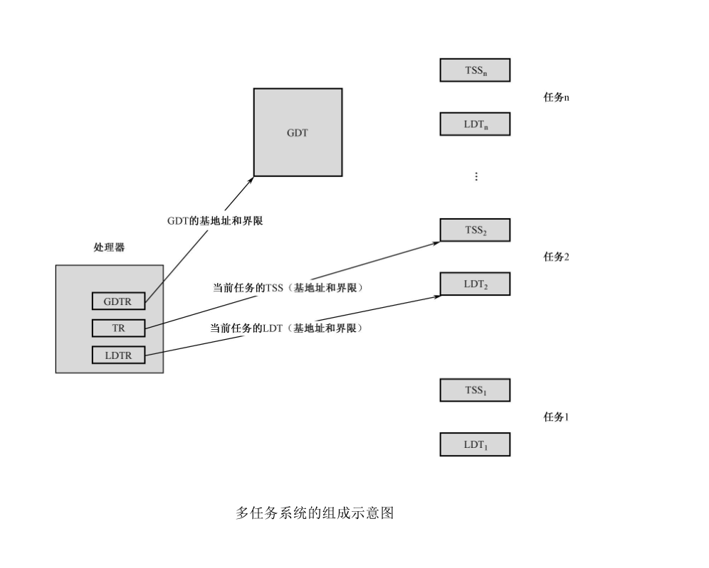
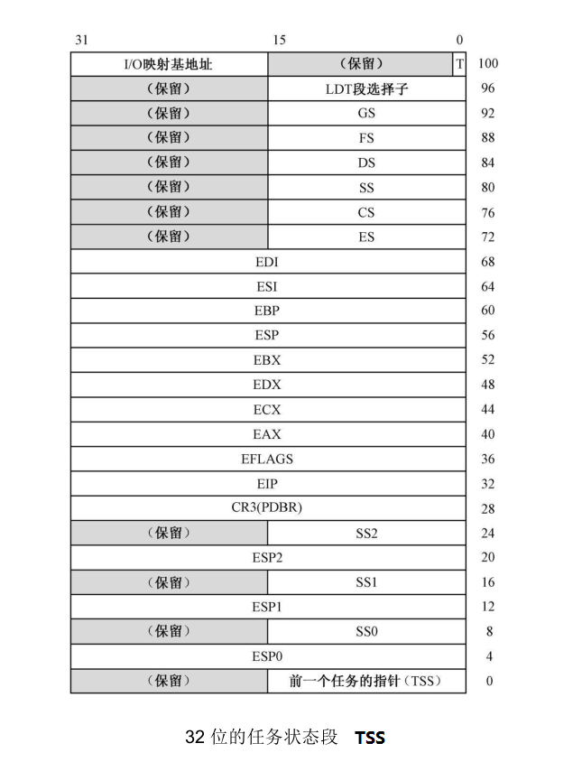
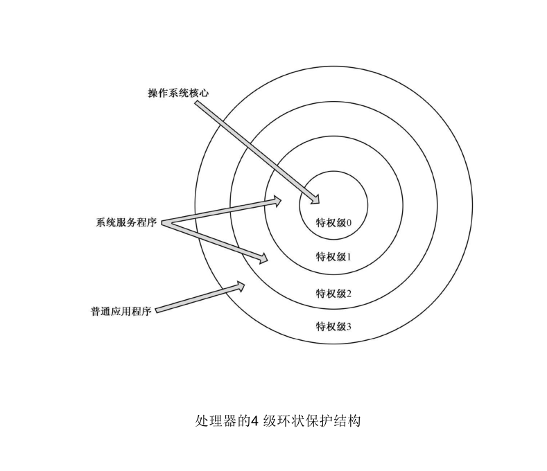
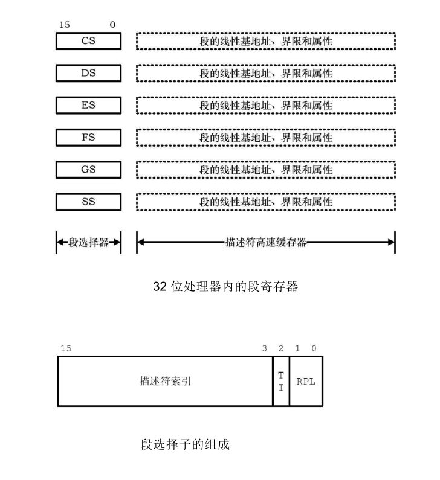
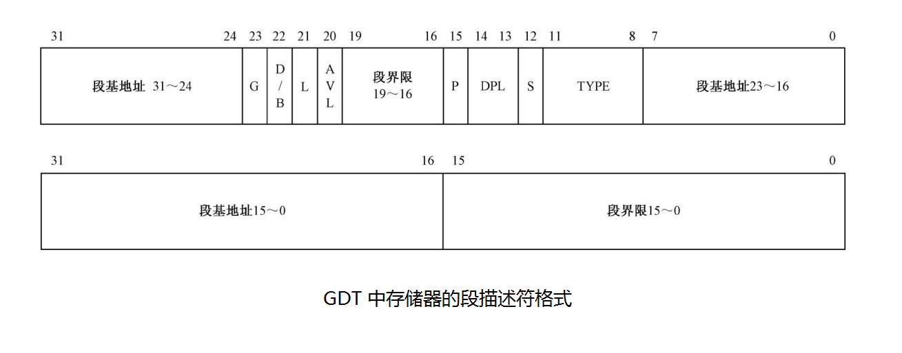
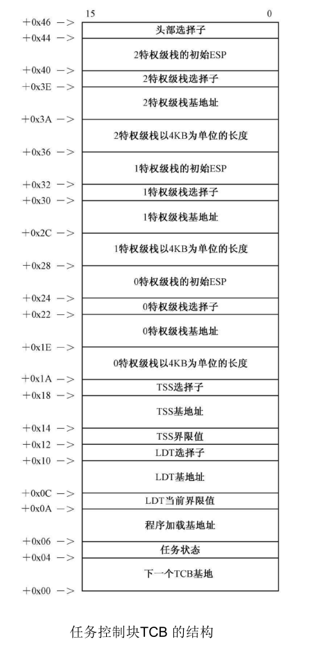
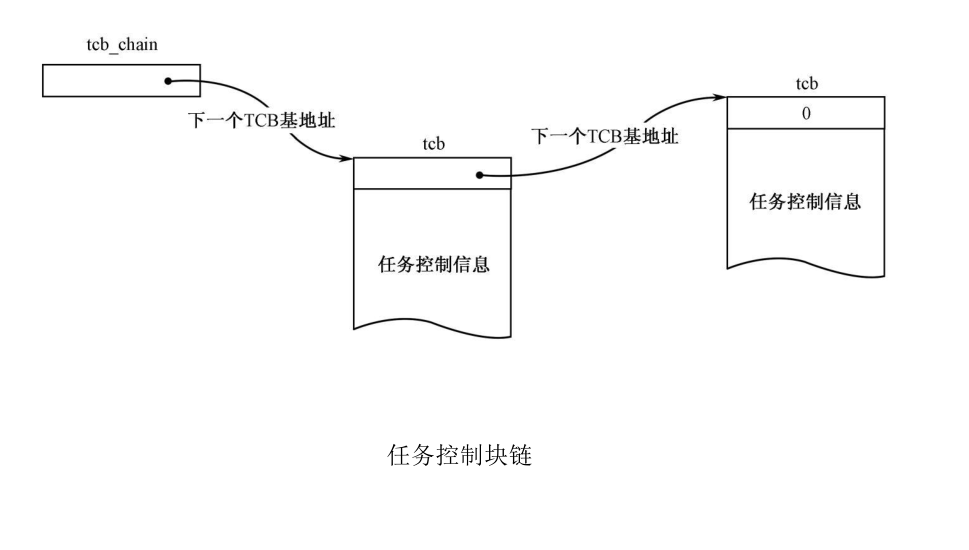
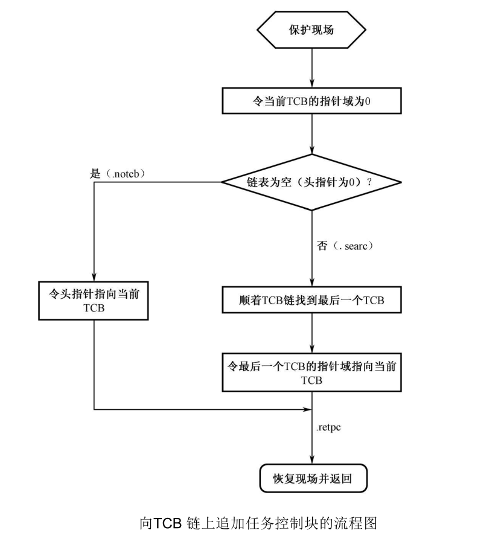
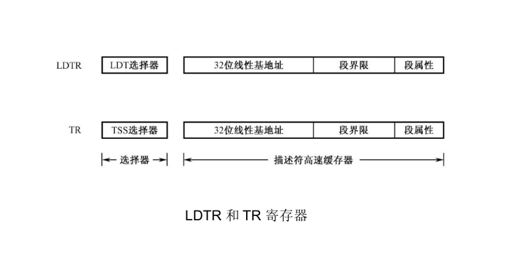
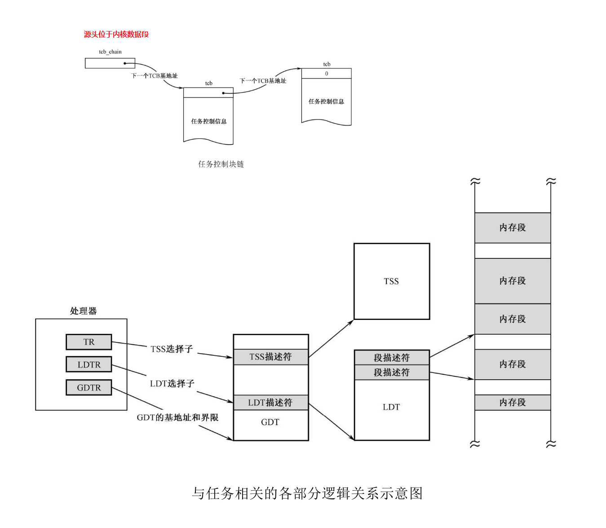

在保护模式下，通过将内存分成大小不等的段，并用描述符对每个段的用途、类型和长度进行指定，就可以在程序运行时由处理器硬件施加访问保护。
- 比如，当程序试图让处理器去写一个可执行的代码段时，处理器就会阻止这种企图；
- 再比如，当程序试图让处理器访问超过段界限的内存区域时，处理器也会引发异常中断。

段保护是处理器提供的基本保护功能，但是只通过 GDT 是无法解决现实中所有的需求的，因此还需要引入其他的机制，比如：特权级保护。

如果对 GDT 有疑问的，只看我之前的博客文章：[32位保护模式下的分段（GDT相关）](https://www.cnblogs.com/wanghuizhao/p/16617936.html)

## （一） 任务的隔离和特权级保护
32 位处理器是为多任务系统而设计的。所谓多任务系统，是指能够同时执行两个以上程序的系统，即使前一个程序没有执行完，其他程序也可以开始执行。在单处理器（核）的系统中，多个程序并不可能真的同时执行，但是，处理器可以在多个任务之间周期性地切换和轮转。这样，它们都处于走走停停的状态，快速的处理器加上高效的任务切换，在外界看来，多个任务都在同时运行中。

多任务系统，对任务之间的隔离和保护，以及任务和操作系统之间的隔离和保护都提出了要求，这可以看做对段保护机制的进一步强化。同时，在多任务系统中，操作系统居于核心软件的位置，为各个任务服务，负责任务的加载、创建和执行环境的管理，并执行任务之间的调度，对操作系统的保护显得尤为重要。事实上，对于这种要求，基本的段保护机制已经无能为力了。

### 1. 任务的区分
程序是记录在载体上的指令和数据，总是为了完成某个特定的工作，其正在执行中的一个副本，叫做任务（Task）。

按处理器的要求标准，要使一个程序成为“任务”，并且能够参与任务切换和调度，那不是简简单单就能行的，每个人物必须要有 LDT 和 TSS。

- LDT
为了有效地在任务之间实施隔离，处理器建议每个任务都应当具有自己的描述符表，称为局部描述符表LDT（Local Descriptor Table），并且把专属于自己的那些段放到 LDT 中。
和 GDT 一样，LDT 也是用来存放描述符的。不同之处在于，LDT 只属于某个任务。或者说，每个任务都有自己的 LDT，每个任务私有的段，都应当在 LDT 中进行描述。
- TSS
在一个多任务的环境中，当任务切换发生时，必须保护旧任务的运行状态，或者说是保护现场，保护的内容包括通用寄存器、段寄存器、栈指针寄存器 ESP、指令指针寄存器 EIP、状态寄存器 EFLAGS，等等。否则的话，等下次该任务又恢复执行时，一切都会变得茫然而毫无头绪。所以为了保存任务的状态，并在下次重新执行时恢复它们，每个任务都应当用一个额外的内存区域保存相关信息，这叫做任务状态段（Task State Segment：TSS）。

**每一个任务都有自己的 LDT 和 TSS。**

### 2. 多任务系统的组成

- GDTR 寄存器（全局描述符表寄存器）
追踪全局描述符表（GDT），访问它内部的描述符。
全局描述符表（GDT）是全局性的，为所有任务服务，是它们所共有的，整个系统只需要一个全局描述符表（GDT）
- LDTR 寄存器（局部描述符表寄存器）
追踪和访问 LDT，LDTR 寄存器只有一个，它只用于**指向当前任务的 LDT**。
因为每一个任务都有一个 LDT，所以局部描述符表（LDT）的数量则不止一个，具体有多少，视任务的多少而定。
- TR 寄存器（任务寄存器 Task Register）
和 LDT 一样，处理器用 TR 寄存器来**指向当前任务的 TSS**。
和 GDTR、LDTR 一样，TR 寄存器在处理器中也只有一个。当任务切换发生的时候，TR 寄存器的内容也会跟着指向新任务的 TSS。

### 3. 局部描述符表的概述
LDT 的组成和 GDT 基本一样，请看上一篇博客：[32位保护模式下的分段（GDT相关）](https://www.cnblogs.com/wanghuizhao/p/16617936.html)

### 4. 任务状态段的概述
任务状态段具有固定的格式，最小尺寸是 104 字节，如下图所示：（**图中所标注的偏移量是十进制的**）

### 5. 特权级保护
引入 LDT 和 TSS，只是从任务层面上进一步强化了分段机制，从安全保障的角度来看，只相当于构建了可靠的硬件设施。仅有设施是不够的，还需要规章制度，还要有人来执行，处理器也一样。为此，在分段机制的基础上，**处理器引入了特权级**，并由固件负责实施特权级保护。

特权级（Privilege Level），也叫特权级别，是**存在于描述符及其选择子中的一个数值**，当这些描述符或者选择子所指向的对象要进行某种操作，或者被别的对象访问时，该数值用于控制它们所能进行的操作，或者限制它们的可访问性。

Intel 处理器可以识别 4 个特权级别，分别是 0 到 3，较大的数值意味着较低的特权级别，反之亦然。如上图所示，这是 Intel 处理器所提供的 4 级环状保护结构。

- 特权级 0
因为操作系统是为所有程序服务的，可靠性最高，而且必须对软硬件有完全的控制权，所以它的主体部分必须拥有特权级 0，并处于整个环形结构的中心。也正是因为这样，操作系统的主体部分通常又被称做内核（Kernel、Core）。
- 特权级 1
- 特权级 2
特权级 1 和 2 通常赋予那些可靠性不如内核的系统服务程序，比较典型的就是设备驱动程序。当然，在很多比较流行的操作系统中，驱动程序与内核的特权级别相同，都是0。
- 特权级 3
应用程序的可靠性被视为是最低的，而且通常不需要直接访问硬件和一些敏感的系统资源，调用设备驱动程序或者操作系统例程就能完成绝大多数工作，故赋予它们最低的特权级别 3。

应用程序编写时，不需要考虑 GDT、LDT、分段、描述符这些东西，它们是在程序加载时，由操作系统负责创建的，应用程序的编写者只负责具体的功能就可以了。应用程序的加载和开始执行，也是由操作系统所主导的，而操作系统一定会将它放在特权级 3 上。当应用程序开始执行时，当前特权级 CPL 自然就会是 3。

### 6. CPL、RPL 和 DPL
#### （1） CPL
在实模式下，段寄存器存放的是段地址；而在保护模式下，段寄存器存放的是段选择子，段地址则位于描述符高速缓存器中。当处理器正在一个代码段中取指令和执行指令时，那个代码段的特权级叫做当前特权级（Current Privilege Level，CPL）。正在执行的这个代码段，其选择子位于段寄存器 CS 中，其最低两位就是当前特权级的数值。

在保护模式下访问一个段时，传送到段选择器的是段选择子。
它由三部分组成：
- 第一部分是描述符的索引号，用来在描述符表中选择一个段描述符。
- 第二部分是 TI，TI 是描述符表指示器（Table Indicator），TI=0 时，表示描述符在 GDT 中；TI=1 时，描述符在 LDT 中。
- 第三部分是 RPL，RPL 是请求特权级，表示给出当前选择子的那个程序的特权级别，正是该程序要求访问这个内存段。

#### （2） RPL
RPL 的意思是请求特权级（Requested Privilege Level）。我们知道，要将控制从一个代码段转移到另一个代码段，通常是使用 jmp 和 call 指令，并在指令中提供目标代码段的选择子，以及段内偏移量（入口点）。而为了访问内存中的数据，也必须先将段选择子加载到段寄存器 DS、ES、FS 或者 GS 中。不管是实施控制转移，还是访问数据段，这都可以看成是一个请求，请求者提供一个段选择子，请求访问指定的段。从这个意义上来说，RPL 也就是指请求者的特权级别（Requestor’s Privilege Level）。

引入请求特权级（RPL）的原因是处理器在遇到一条将选择子传送到段寄存器的指令时，无法区分真正的请求者是谁。但是，引入 RPL 本身并不能完全解决这个问题，这只是处理器和操作系统之间的一种协议，处理器负责检查请求特权级 RPL，判断它是否有权访问，但前提是提供了正确的 RPL；内核或者操作系统负责鉴别请求者的身份，并有义务保证 RPL 的值和它的请求者身份相符，因为这是处理器无能为力的。

因此，在引入 RPL 这件事上，处理器的潜台词是，仅依靠现有的 CPL 和 DPL，无法解决由请求者不同而带来的安全隐患。那么，好吧，再增加一道门卫，但前提是，操作系统只将通行证发放给正确的人。

#### （3） DPL
实施特权级保护的第一步，是为所有可管理的对象赋予一个特权级，以决定谁能访问它们。如下图显示，图中，每个描述符都有一个两比特的 DPL 字段，可以取值为 00、01、10 和 11，分别对应特权级 0、1、2 和 3。DPL 是每个描述符都有的字段，故又称描述符特权级（Descriptor Privilege Level）。描述符总是指向它所描述的目标对象，代表着该对象，因此，该字段实际上是目标对象的特权级。

#### （4） 基本的特权级检查规则
1. 首先，将控制直接转移到非依从的代码段，要求当前特权级 CPL 和请求特权级 RPL 都等于目标代码段描述符的 DPL。
2. 其次，要将控制直接转移到依从的代码段，要求当前特权级 CPL 和请求特权级 RPL 都低于，或者和目标代码段描述符的 DPL 相同。
3. 第三，高特权级别的程序可以访问低特权级别的数据段，但低特权级别的程序不能访问高特权级别的数据段。访问数据段之前，肯定要对段寄存器DS、ES、FS 和 GS 进行修改在这个时候，要求当前特权级 CPL 和请求特权级 RPL 都必须高于，或者和目标数据段描述符的 DPL 相同。
4. **最后，处理器要求，在任何时候，栈段的特权级别必须和当前特权级 CPL 相同。**
a. 任何时候，当前栈的特权级别必须和 CPL 是一样的。进入不同特权级别的段执行时，要切换栈。
b. 通过调用门实施特权级之间的控制转移时，可以使用 jmp far 指令，也可以使用 call far 指令。如果是后者，会改变当前特权级 CPL。因为栈段的特权级必须同当前特权级保持一致，因此，还要切换栈，即，从低特权级的栈切换到高特权级的栈。比如，一个特权级为 3 的程序必须使用自己的 3 特权级栈工作。当它通过调用门进入 0 特权级的代码段执行时，当前特权级由 3 变为 0。此时，栈也要跟着切换，从 3 特权级的栈切换到 0 特权级的栈。这主要是为了防止因栈空间不足而产生不可预料的问题，同时也是为了防止栈数据的交叉引用。
c. 为了切换栈，每个任务除了自己固有的栈之外，还必须额外定义几套栈，具体数量取决于任务的特权级别。0 特权级任务不需要额外的栈，它自己固有的栈就足够使用，因为除了调用返回外，不可能将控制转移到低特权级的段；1 特权级的任务需要额外定义一个描述符特权级 DPL 为 0 的栈，以便将控制转移到 0 特权级时使用；2 特权级的任务则需要额外定义两个栈，描述符特权级 DPL 分别是 0 和 1，在控制转移到 0 特权级和 1 特权级时使用；3 特权级的任务最多额外定义 3 个栈，描述符特权级分别是 0、1 和 2，在控制转移到 0、1 和 2 特权级时使用。
d. 不要担心，这些额外的栈，也会由操作系统加载程序时自动创建，这些额外创建的栈，其描述符位于任务自己的 LDT 中。同时，还要在任务的 TSS 中登记。

## （二） 加载用户程序并创建任务

### 1. 任务控制块（TCB）
加载程序并创建一个任务，需要用到很多数据，比如程序的大小、加载的位置，等等。当任务执行结束，还要依据这些信息来回收它所占用的内存空间。

多任务系统是多个任务同时运行的，特别是在一个单处理器（核）的系统中，为了在任务之间切换和轮转，必须能追踪到所有正在运行的任务，记录它们的状态，或者根据它们的当前状态来采取适当的操作。

为了满足以上的要求，内核应当为每一个任务创建一个内存区域，来记录任务的信息和状态，称为任务控制块（Task Control Block，TCB）。任务控制块不是处理器的要求，是我们自己为了方便而发明的。

### 2. TCB 链
为了能够追踪到所有任务，应当把每个任务控制块 TCB 串起来，形成一个链表。

**TCB 链的起始地址放在内核数据段中。**

- TCB 链的示意图如下：

- 向 TCB 链上追加 TCB 的流程图：

### 3. 加载用户程序
当用户程序被读入内存，并处于运行或者等待运行的状态时，就视为一个任务。任务有自己的代码段和数据段（包括栈），这些段必须通过描述符来引用，而这些描述符可以放在 GDT 中，也可以放在任务自己私有的 LDT 中，但最好是放在 LDT 中。GDT 用于存放各个任务公有的描述符，比如公共的数据段和公共例程。

每个任务都允许有自己的 LDT，而且可以定义在任何内存位置。整体事件的流程是：
1. 分配一块内存，作为 TCB 来用，然后将其添加到 TCB 链上。
2. 加载并重定位用户程序。
1). 分配一块内存，作为 LDT 来用，为创建用户程序各个段的描述符做准备。
2). 将 LDT 的大小和起始线性地址登记在任务控制块 TCB 中。
3). 分配内存，并加载用户程序到刚分配的内存中，并将它的大小和起始线性地址登记到 TCB 中。
4). 用户程序已被加载到内存中，接着就是在 LDT 中创建段描述符，如：程序头部段描述符、程序代码段描述符、程序数据段描述符、程序堆栈段描述符。
5). 通过调用门的控制转移通常会改变当前特权级 CPL，同时还要切换到与目标代码段特权级相同的栈。为此，必须为每个任务定义额外的栈。对于用户程序为 3 特权级任务来说，应当创建特权级 0、1 和 2 的栈。而且，应当将它们定义在每个任务自己的 LDT 中。（即创建特权级 0、1 和 2 的栈，然后将它们登记到 TCB 和 LDT 中）
6). 在 GDT 中登记 LDT 描述符。
7). 登记 LDT 选择子到 TCB 中。
8). 创建用户程序的 TSS，登记 TSS 界限值到 TCB，登记 TSS 基地址到 TCB。
9). 登记基本的 TSS 表格内容，如：登记 0、1、2 特权级堆栈段选择子到 TSS 中；登记任务的 LDT 选择子到 TSS 中。
10). 访问用户程序头部，获取数据填充 TSS，如：用户程序加载的基地址、程序入口点、程序代码段（CS）选择子、程序数据段（DS）选择子、程序堆栈段（SS）选择子。
11). 在 GDT 中登记 TSS 描述符，登记 TSS 选择子到 TCB 中。

### 4. LDTR 和 TR 寄存器

### 5. 与任务相关的各部分逻辑关系示意图

## （三） 参考书籍
[《x86汇编语言：从实模式到保护模式》](https://book.douban.com/subject/20492528/)