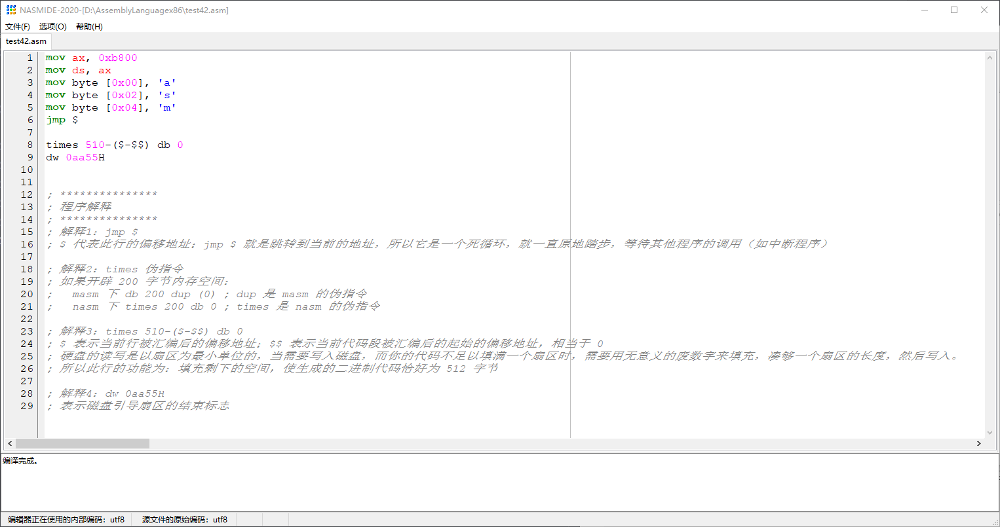
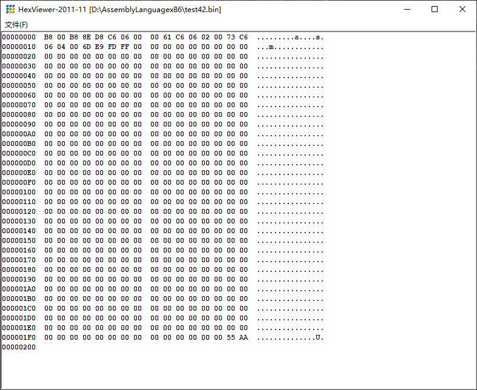
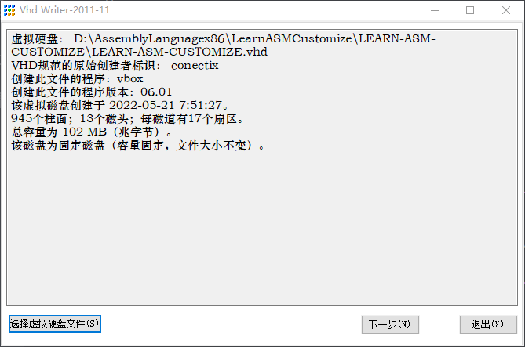
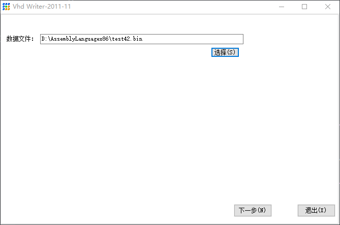
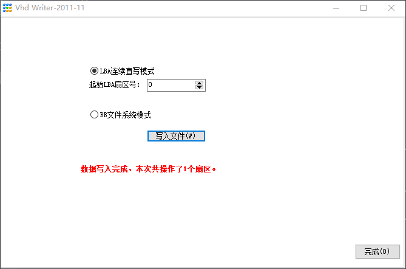
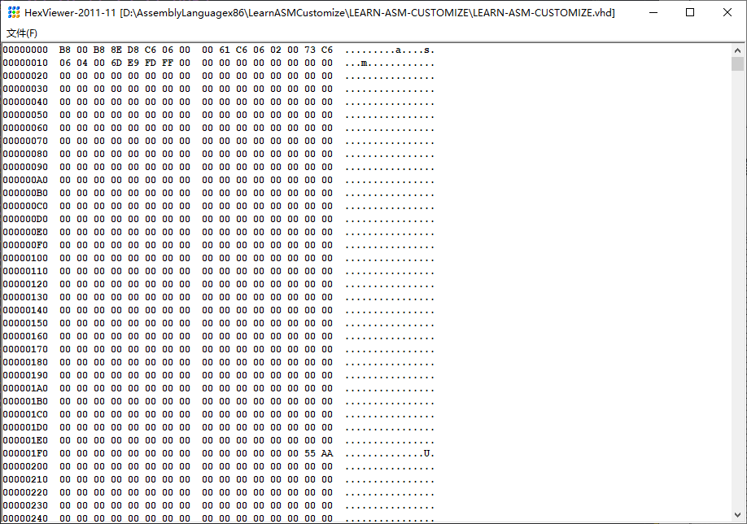
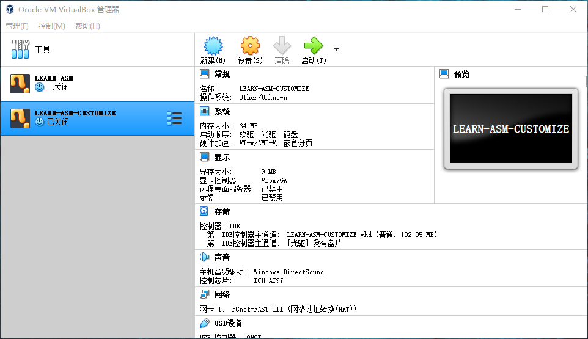
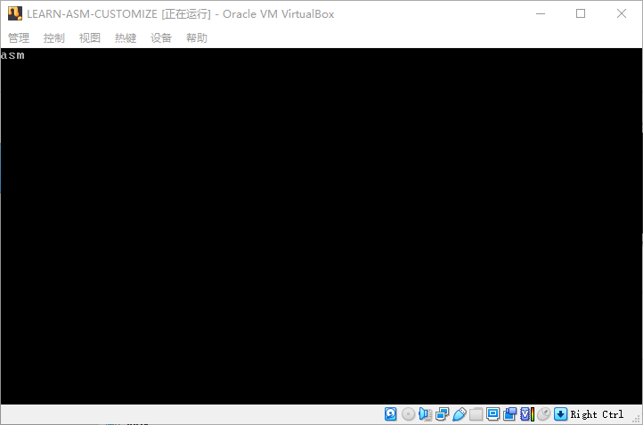

## （一） 题目
1． 运行 NASMIDE 程序，输入以下汇编指令并保存为文件 4-2.asm（不要考虑这些指令的含义和功能）：
```
mov ax,0xb800
mov ds,ax
mov [0x00], 'a'
mov [0x02], 's'
mov [0x04], 'm'
jmp $
```
2． 将上面的 4-2.asm 文件编译，得到二进制文件 4-2.bin，并写入虚拟硬盘的主引导扇区。注意，该虚拟硬盘应当是 VirtualBox 虚拟机的启动硬盘。
3． 启动你的 VirtualBox 虚拟机。当虚拟机启动时，会像真实的计算机一样加载硬盘上的主引导扇区代码，并执行。此时，注意观察屏幕上都显示了什么内容。


## （二）解析
### 1. 保存汇编源代码
如果只按照书籍中给出的汇编代码，那么在虚拟机磁盘引导启动的时候，会直接报错，以下是改善之后的代码：
```
mov ax, 0xb800
mov ds, ax
mov byte [0x00], 'a'
mov byte [0x02], 's'
mov byte [0x04], 'm'
jmp $

times 510-($-$$) db 0
dw 0aa55H


; ***************
; 程序解释
; ***************
; 解释1：jmp $
; $ 代表此行的偏移地址；jmp $ 就是跳转到当前的地址，所以它是一个死循环，就一直原地踏步，等待其他程序的调用（如中断程序）

; 解释2：times 伪指令
; 如果开辟 200 字节内存空间：
;   masm 下 db 200 dup (0) ; dup 是 masm 的伪指令
;   nasm 下 times 200 db 0 ; times 是 nasm 的伪指令

; 解释3：times 510-($-$$) db 0
; $ 表示当前行被汇编后的偏移地址；$$ 表示当前代码段被汇编后的起始的偏移地址，相当于 0
; 硬盘的读写是以扇区为最小单位的，当需要写入磁盘，而你的代码不足以填满一个扇区时，需要用无意义的废数字来填充，凑够一个扇区的长度，然后写入。
; 所以此行的功能为：填充剩下的空间，使生成的二进制代码恰好为 512 字节

; 解释4：dw 0aa55H
; 表示磁盘引导扇区的结束标志，一个有效的主引导扇区，其最后两字节应当是 0x55 和 0xAA。
```


### 2. 编译汇编源代码并写入虚拟硬盘的主引导扇区
#### （1） 使用书籍的配套工具 NASMIDE 编译汇编源代码


#### （2） 使用书籍的配套工具 HexView 查看编译之后的二进制文件


#### （3） 使用书籍的配套工具 fixvhdwr 将编译之后的二进制文件写入虚拟硬盘的主引导扇区




#### （4）查看虚拟硬盘的主引导扇区的内容



### 3. 启动 VirtualBox 虚拟机，查看屏幕上显示的内容
启动 VirtualBox 虚拟机后，可以看到，计算机加载了硬盘上主引导扇区的代码，在显示器上显示了 asm 字符串

