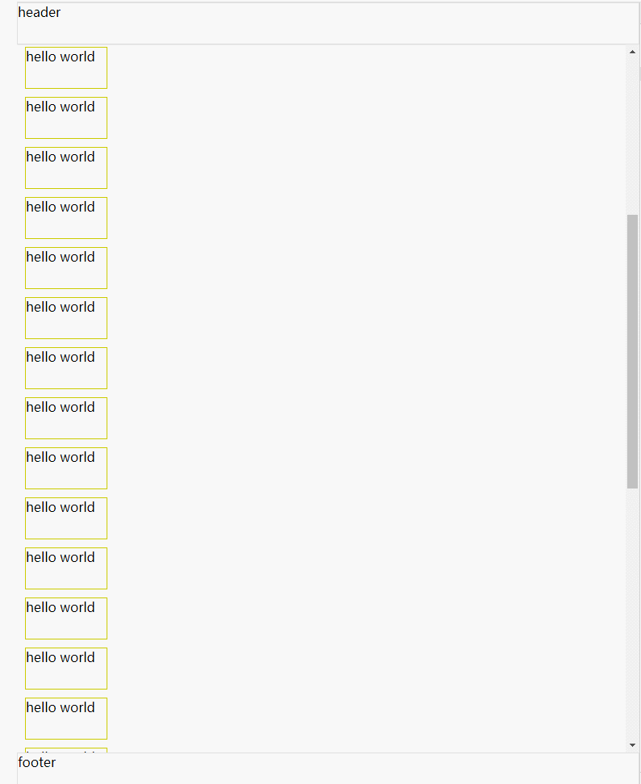
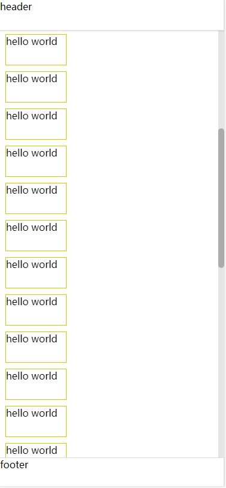

在一个区域内，只允许部分区域产生滚动的效果，其余部分不能移动，俗称内滚动

##### 1. 实现步骤：
1） 只显示一屏的内容
*a. 固定页面各个区域布局的高度，如：*
```
.header {
    height: 50px;
}

.footer {
    height: 50px;
}

/*内滚动区域的高度*/
.content {
    height: calc(100vh - 100px);
}
```

*b. 禁止页面原生的滚动，即设置页面的 body*
```
body {
    overflow: hidden
}
```

2） 设定区域滚动 css
*a. 设置滚动区域的 css*
```
.content {
    height: calc(100vh - 100px);
    overflow-y: scroll;
}
```

##### 2. 效果示意图：


##### 3. 代码实现：
```
<!DOCTYPE html>
<html lang="en">
<head>
    <meta charset="UTF-8">
    <meta http-equiv="X-UA-Compatible" content="IE=edge">
    <meta name="viewport" content="width=device-width, initial-scale=1.0">
    <title>Document</title>
    <style>
        * {
            padding: 0;
            margin: 0;
        }

        body {
            overflow: hidden;
        }

        .header,
        .footer {
            height: 50px;
            border: 1px solid rgba(34,36,38,.15);
            box-shadow: 0 1px 2px 0 rgb(34 36 38 / 15%);
        }

        .content {
            height: calc(100vh - 100px);
            overflow-y: scroll;
        }

        .item {
            width: 100px;
            height: 50px;
            margin: 10px;
            border: 1px solid #cc0;
        }
    </style>
</head>
<body>
    <div>
        <div class="header">header</div>
        <div class="content">
            <div class="item">hello world</div>
            <div class="item">hello world</div>
            <div class="item">hello world</div>
            <div class="item">hello world</div>
            <div class="item">hello world</div>
            <div class="item">hello world</div>
            <div class="item">hello world</div>
            <div class="item">hello world</div>
            <div class="item">hello world</div>
            <div class="item">hello world</div>
            <div class="item">hello world</div>
            <div class="item">hello world</div>
            <div class="item">hello world</div>
            <div class="item">hello world</div>
            <div class="item">hello world</div>
            <div class="item">hello world</div>
            <div class="item">hello world</div>
            <div class="item">hello world</div>
            <div class="item">hello world</div>
            <div class="item">hello world</div>
            <div class="item">hello world</div>
            <div class="item">hello world</div>
            <div class="item">hello world</div>
            <div class="item">hello world</div>
            <div class="item">hello world</div>
            <div class="item">hello world</div>
            <div class="item">hello world</div>
            <div class="item">hello world</div>
            <div class="item">hello world</div>
            <div class="item">hello world</div>
            <div class="item">hello world</div>
            <div class="item">hello world</div>
            <div class="item">hello world</div>
            <div class="item">hello world</div>
            <div class="item">hello world</div>
        </div>
        <div class="footer">footer</div>
    </div>
</body>
</html>
```

##### 4. 自定义滚动条：
由于滑块效果是浏览器自带的，不同的浏览器，滑块效果不一样

1）Chrome 浏览器自定义滑块效果示意图：


2）Chrome 浏览器自定义滑块的 css
```
/* 自定义滚动条 */
.content::-webkit-scrollbar {/*滚动条整体样式*/
    -webkit-appearance: none;
    width: 10px;
    height: 10px;
}

.content::-webkit-scrollbar-thumb {/*滚动条里面小方块*/
    cursor: pointer;
    border-radius: 5px;
    background: rgba(0,0,0,.25);
    -webkit-transition: color .2s ease;
    transition: color .2s ease;
}

.content::-webkit-scrollbar-thumb:hover {
    background: #949A9D;
}

.content::-webkit-scrollbar-track {/*滚动条里面轨道*/
    background: rgba(0,0,0,.1);
    border-radius: 0;
}

::selection {
    background-color: #cce2ff;
    color: rgba(0,0,0,.87);
}
```


##### 5. 参考链接:
[1. 移动端实现内滚动的4种方案](https://xdlrt.github.io/2016/12/02/2016-12-02/)
[2. 移动端实现内滚动的4种方案](https://zhuanlan.zhihu.com/p/24125823)
 [CSS3自定义滚动条样式](https://www.cnblogs.com/ranyonsue/p/9487599.html)

##### 6. 代码文件
[代码下载](https://github.com/wtraceback/Learning-Front-End/blob/master/%E7%BB%83%E4%B9%A0%E4%BB%A3%E7%A0%81/HTML%20%E5%85%83%E7%B4%A0%E5%86%85%E6%BB%9A%E5%8A%A8.html)
