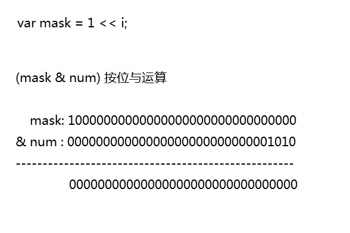
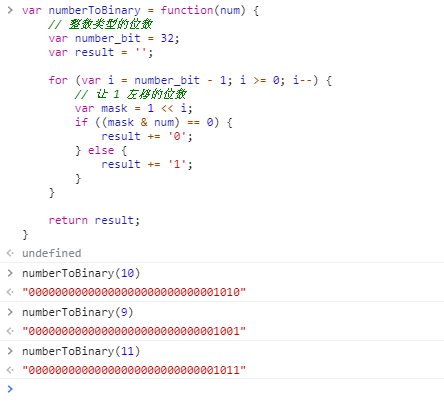

###### 1. 示意图


###### 2. 代码实现
```
var numberToBinary = function(num) {
    if (num < 0) {
        return num;
    }

    // 整数类型的位数
    var number_bit = 32;
    var result = '';

    for (var i = number_bit - 1; i >= 0; i--) {
        // 让 1 左移的位数
        var mask = 1 << i;
        if ((mask & num) == 0) {
            result += '0';
        } else {
            result += '1';
        }
    }

    return result;
}
```

###### 3. 运算结果的展示



###### 4. 改进版本
[在 js 中实现十进制转二进制](https://www.cnblogs.com/wanghuizhao/p/16311158.html)
