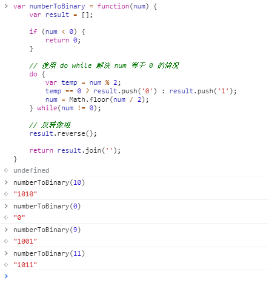

###### 1. js 中二进制和十进制的相互转换：

```
var num = 10;

num.toString(2);        // 十进制转二进制
num.toString(8);        // 十进制转八进制
num.toString(10);      // 十进制转十进制
num.toString(16);      // 十进制转十六进制

parseInt(num, 2);     // 二进制转十进制；num 被看做是二进制的数
parseInt(num, 8);     // 八进制转十进制；num 被看做是八进制的数
parseInt(num, 16);   // 十六进制转十进制；num 被看做是十六进制的数

parseInt(num, 2).toString(8);     // 二进制转八进制；也可以看做是二进制先转成十进制，再转成八进制
parseInt(num, 2).toString(16);    // 二进制转十六进制；也可以看做是二进制先转成十进制，再转成十六进制
```

###### 2. 自定义实现 十进制转二进制
```
var numberToBinary = function(num) {
    var result = [];

    if (num < 0) {
        return num;
    }

    // 使用 do while 解决 num 等于 0 的情况
    do {
        var temp = num % 2;
        temp == 0 ? result.push('0') : result.push('1');
        num = Math.floor(num / 2);
    } while(num != 0);

    // 反转数组
    result.reverse();

    return result.join('');
}
```

###### 3. 运算结果的展示

