### 1. 概述
#### （1） 概述
1. ```Flask```
Flask 是 Python 中有名的轻量级同步 web 框架
2. ```Gunicorn```
高性能的 Python WSGI 服务器
3. ```Nginx```
Nginx 是一个高性能的 HTTP 和反向代理服务器，同时也是一个 IMAP/POP3/SMTP 代理服务器。
4. ```Supervisor```
Supervisor 是用 Python 开发的一套通用的进程管理程序，能监控进程的状态，在进程异常退出时能自动重启。


#### （2） 整体结构图
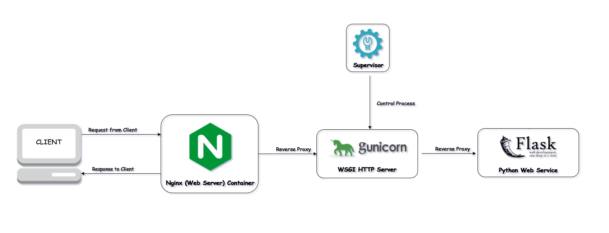


### 2. Flask 应用
#### （1） 创建目录
```
# 创建项目目录
mkdir flask_demo

# 切换进项目目录
cd flask_demo

# 打印当前目录所在的位置
pwd
# /home/whxcer/flask_demo
# /主页/用户/刚创建的目录
```

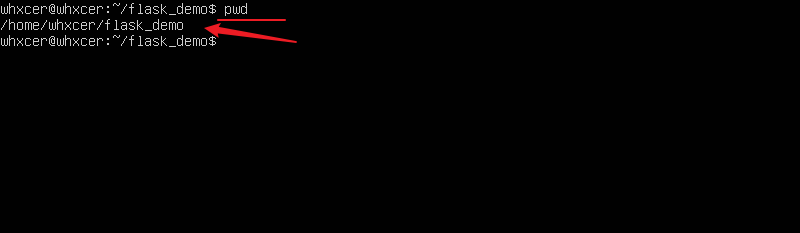

#### （2） 创建虚拟环境
```
# 创建虚拟环境
python3 -m venv venv

#激活虚拟环境
. venv/bin/activate

# 退出虚拟环境
deactivate

# 安装依赖
pip3 install -i https://pypi.douban.com/simple/ flask
```

#### （3） 创建 flask 应用
```app.py``` 文件
```py
from flask import Flask

app = Flask(__name__)

@app.route("/")
def index():
    return "flask index page"
```

### 3. Gunicorn
关于 Gunicorn 更详细的信息，请参考我的另一篇博客 [Docker+Gunicorn+Flask部署项目](https://www.cnblogs.com/wanghuizhao/p/17149630.html)，里面详细阐述了 Gunicorn 相关的信息，这里就不再赘述。

#### （1） 创建 Gunicorn 的运行配置文件
```gunicorn_config.py``` 文件
```
"""gunicorn + gevent 的配置文件"""

# 多进程
import multiprocessing

# 绑定ip + 端口
# ip 设置为 0.0.0.0 为对外可见；设置为 127.0.0.1 为对外不可见，只对内可见
# bind = '0.0.0.0:8080'
bind = '127.0.0.1:8080'

# 进程数 = cup数量 * 2 + 1
workers = multiprocessing.cpu_count() * 2 + 1

# 工作模式--多线程
worker_class = 'gthread'

# 每个进程中有 5 个线程，最大的并发数为： workers * 线程数
threads = 5

# 进程名称
proc_name = 'gunicorn.pid'

# 进程 pid 记录文件
pidfile = 'gunicorn.pid'
```

#### （2） 安装 Gunicorn 模块
```
pip3 install -i https://pypi.douban.com/simple/ gunicorn
```

#### （3） Gunicorn 的运行
##### ① 命令行运行：
```
gunicorn -c gunicorn_config.py app:app
```
命令说明：
第一个 app 指的是 app.py 文件名
第二个 app 指的是文件中的实例变量 app

##### ② 运行测试示意图：
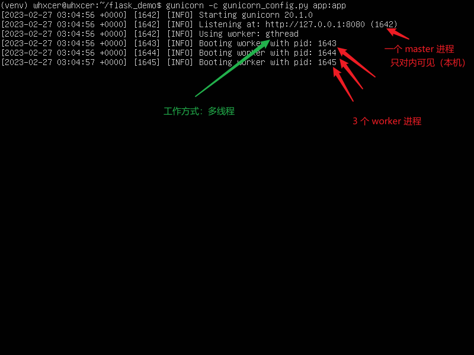

##### ③ ```对外可见```和```只对内可见```：
- 对外可见的情况：
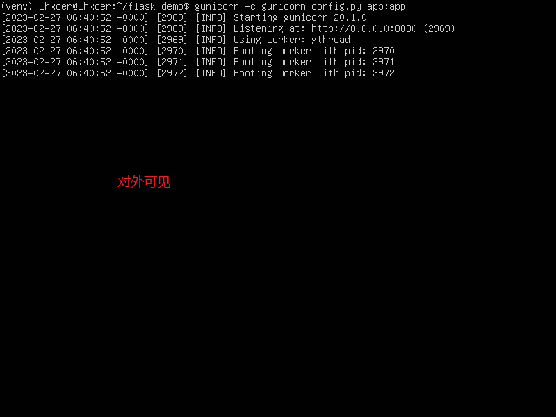
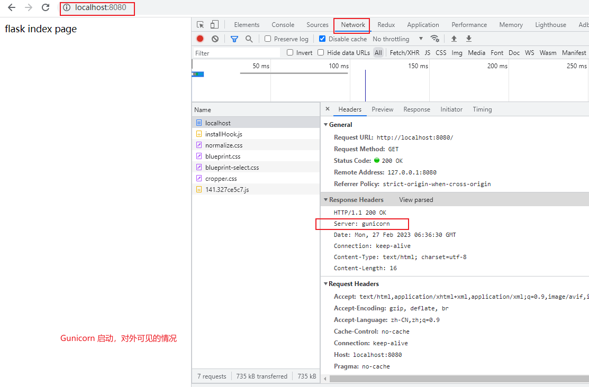
- 对外不可见的情况（只对内可见）
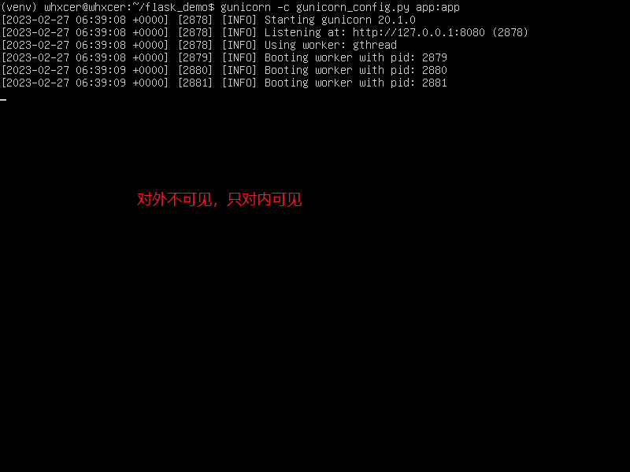
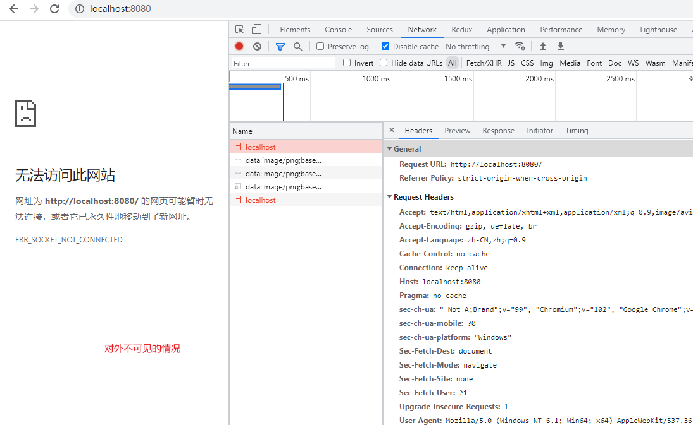

### 4. Nginx
Nginx 是一个高性能的 HTTP 和反向代理 web 服务器，同时也提供了 IMAP/POP3/SMTP 服务 。关于 Nginx 的详细信息，请查看我其他的文章。

#### （1） Nginx 的安装
```
# 安装 nginx
apt-get install nginx

# 查看 nginx 安装的版本
nginx -v

# 启动 nginx
service nginx start
```

#### （2） Nginx 的配置文件
nginx 启动后，在浏览器中输入 ```http://localhost:80``` 或 ```http://127.0.0.1:80```，就能看到 nginx 的欢迎页面，这时候 nginx 已经安装成功。
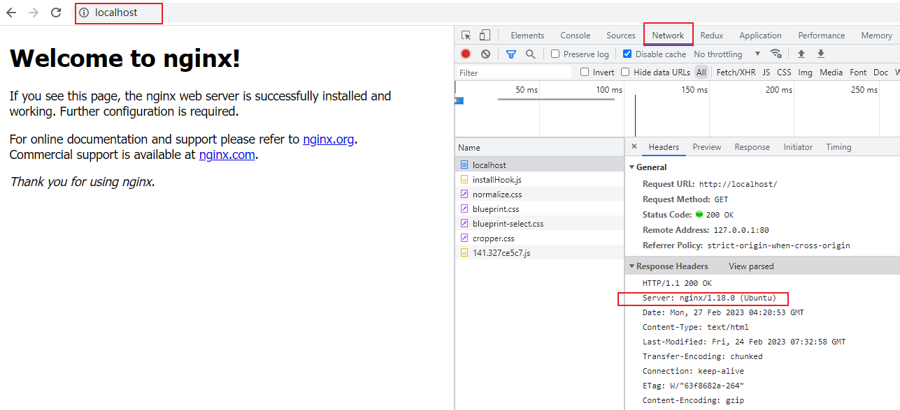

nginx 加载配置文件的说明：
nginx 启动时，会加载 ```/etc/nginx/nginx.conf``` 主配置文件，然后该文件将会加载 ```/etc/nginx/sites-enabled``` 目录中的所有配置文件，而 ```/etc/nginx/sites-enabled``` 存放的是 ```/etc/nginx/sites-available``` 目录中的所有配置文件的软链接
```
nginx 启动 <----加载----> nginx.conf <----加载----> /sites-enabled/*  <----软链接----> /sites-available/*
```

我们上面看到的 nginx 的欢迎页面，就是 ```/usr/share/nginx/html/index.html``` 文件中的内容，而指向这里的配置就是 ```/etc/nginx/sites-available``` 目录中的 ```default``` 文件

#### （3） Nginx 做反向代理
我们想要让 nginx 做反向代理，则需要改写配置文件
- 方式一
根据上面可知，直接修改 ```/etc/nginx/sites-available/default``` 即可。（改之前先做一个备份）
- 方式二
在 ```/etc/nginx/sites-available/``` 目录中添加一个配置文件，然后创建一个软链接放到 ```/etc/nginx/sites-enabled/``` 目录中即可

##### ① 备份 nginx 配置文件
这里使用方式一，更改 ```/etc/nginx/sites-available/default``` 文件
```
# 备份一下 default 文件
cd /etc/nginx/sites-available
cp default default.bak
```

##### ② 修改 default 配置
```
server {
    listen     80;              # 监听 80 端口，可以自行配置
    server_name ip_address;     # 定义使用服务器 ip 访问

    # 动态请求转发到 8080 端口(gunicorn)
    # 这里的 gunicorn 不能使用  80 端口，因为会导致和 Nginx 的接收端口相冲突，80 端口被 nginx 占用
    location / {
        proxy_pass   http://127.0.0.1:8080;
        proxy_set_header X-Real-IP $remote_addr;
        proxy_set_header Host $host;
        proxy_set_header X-Forwarded-For $proxy_add_x_forwarded_for;
    }
}
```

##### ③ 重启 Nginx 服务
修改了配置文件，想要让 Nginx 使用这些配置文件，则需要让 Nginx 重新加载，配置才能生效
```
# 方式一：重启 Nginx 服务
service nginx restart

# 方式二：重新加载配置
nginx -s reload
```

##### ④ Nginx对外可见的示意图
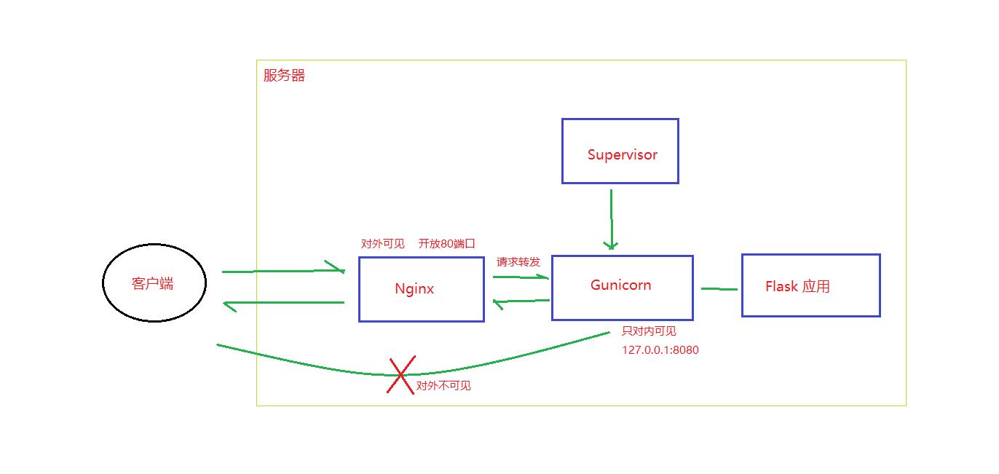

##### ⑤ nginx做反向代理转发动态请求
nginx 的 80 端口对外可见，然后做反向代理，转发请求到 gunicorn 服务器（gunicorn 启动的服务只对内可见）
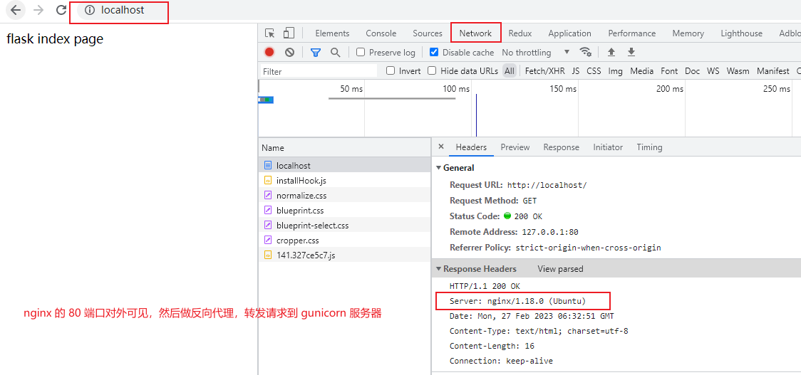


### 5. Supervisor
```注意：```
> 上面手动使用 gunicorn -c gunicorn_conf.py app:app 命令启动内部的服务器，是为了测试 nginx 反向代理的功能，是临时性的操作。

> 下面会自动让 Supervisor 在后台自动启动 gunicorn 的服务，所以是不需要自己手动启动 gunicorn 服务的。

---

在我们生产环境的时候，有些任务是不能停止的，否则业务就会受到影响，这时就需要用到我们的守护进程了，比方说我们的进程运行挂掉之后自动恢复等等，这些都可以利用工具来实现，比如我们将要介绍的 ```supervisor```。

```supervisor``` 叫做监护程序，又可以叫做守护程序，它会自动重启你的这个程序。
```supervisor``` 是 Linux 后台进程管理的工具，是用 Python 开发的一套通用的进程管理程序，能监控进程的状态，在进程异常退出时能自动重启。

它是通过 ```fork/exec``` 的方式把这些被管理的进程当作 ```supervisor``` 的子进程来启动，这样只要在 ```supervisor``` 的配置文件中，把要管理的进程的可执行文件的路径写进去即可

#### （1） Supervisor 的安装
```
# ubuntu 系统通过 apt 安装
apt-get install supervisor
```

#### （2） Supervisor 的配置
```Supervisor``` 基础配置在 ```/etc/supervisor/supervisord.conf``` 中，如果要为我们自己开发的应用程序编写配置文件，则需要放在 ```/etc/supervisor/conf.d/``` 目录中，让 supervisor 来管理它。每个进程的配置文件都可以单独拆开放置，放在 ```/etc/supervisor/conf.d/``` 目录下，以 ```.conf``` 作为扩展名。

#### （3） 配置当前应用的守护进程
切换进 ```/etc/supervisor/conf.d/``` 目录中
```
# 切换进目录中
cd /etc/supervisor/conf.d/

# 创建配置文件
touch flaskdemo.conf
```

```flaskdemo.conf``` 文件的内容
```
[program:flaskdemo]     ; 被管理的进程配置参数，flaskdemo 是进程的名称，使用 supervisorctl 来管理进程时需要使用该进程名

directory=/home/whxcer/flask_demo   ; 项目所在的目录，在执行命令前会切换到这个目录

; 需要执行的命令，这里启动虚拟环境下的 gunicorn，可以是绝对路径或者相对路径
; 这边使用的是绝对路径，指向了 /venv/bin/ 目录下的 gunicorn，就不再需要手动启动虚拟环境了，以下命令会自动使用虚拟环境
command=/home/whxcer/flask_demo/venv/bin/gunicorn -c gunicorn_config.py app:app

autostart=true          ; 在 supervisor 启动的时候也自动启动

autorestart=true        ; 程序异常退出后自动重启

stdout_logfile=/home/whxcer/flask_demo/gunicorn.log       ; 子进程的 stdout 的日志路径 输出日志文件

stderr_logfile=/home/whxcer/flask_demo/gunicorn.error     ; 错误日志文件
```

#### （4） 启动程序
配置更改之后，要让 supervisor 读取自定义的配置，新加的配置都要执行下，配置重新加载后，会自动的执行上面的配置，这时候的 gunicorn 也会启动起来
```
# 方式一
supervisorctl update

# 方式二
supervisorctl reload            # 重新启动配置中的所有程序

# 查看所有 supervisor 相关的进程的状态
supervisorctl status

# 尝试杀掉 flaskdemo，看下是否会重启
kill [pid]      # 这时候，进程被杀掉了，但是过个两三秒，进程又会重新启动，说明守护进程配置成功了

# 重启 flaskdemo
supervisorctl restart flaskdemo
```

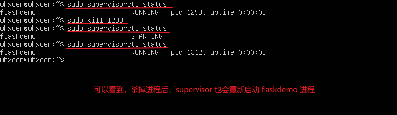

访问画面：
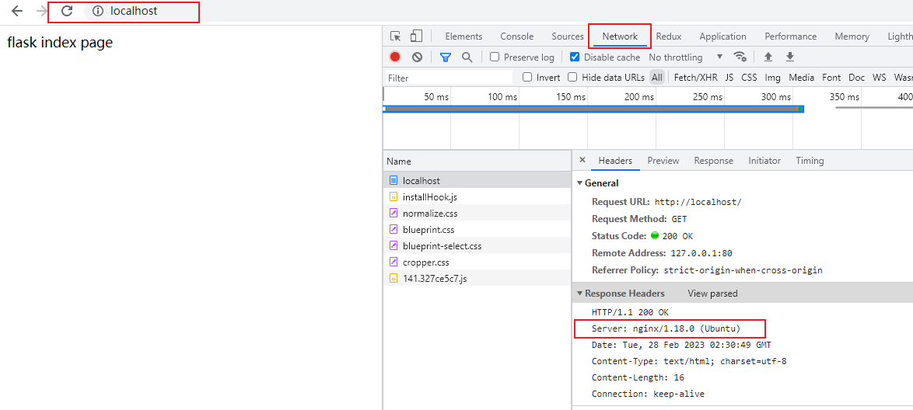

#### （5） supervisor 的常用命令
```
supervisorctl status        # 查看所有 supervisor 相关的进程的状态
supervisorctl start xx      # 启动 xx 服务（启动 xx 进程）
supervisorctl stop xx       # 停止 xx 服务
supervisorctl restart xx    # 重启 xx 服务
supervisorctl update        # 根据最新的配置文件，启动新配置或有改动的进程，配置没有改动的进程不会受影响而重启
supervisorctl reload        # 载入最新的配置文件，停止原有进程并按新的配置启动、管理所有进程
supervisorctl shutdown      # 关闭所有任务
supervisorctl stop all      # 停止全部进程
```
更详细的信息请查看 [supervisor文档](http://supervisord.org/)


### 6. 总结
以上的操作和配置都是相对简单的，如果项目中有更多复杂的操作，请查看相关的官方文档，进行更完善的配置。

额外提示：
可以设置 ```nginx``` 和 ```supervisor``` 都开机自启动，这样即使服务器宕机，重启服务器之后，项目又会重新自动运行起来。

好像默认情况下，```nginx``` 和 ```supervisor``` 是开机自启动的，如果测试过程中发现不是，则自己手动执行以下的命令，设置它们为开机自启动：
```
# 开机自启动 nginx
systemctl enable nginx
# 开机自启动 supervisor
systemctl enable supervisor

# 查看是否开机自启动
systemctl is-enabled nginx
systemctl is-enabled supervisor

# 关闭开机自启动 nginx
systemctl disable nginx.service
# 关闭开机自启动 supervisor
systemctl disable supervisor.service


# ubuntu 重启命令
reboot
# ubuntu 关机命令
shutdown now
```
