## （一） Nginx 的基本概念
### 1. Nginx 是什么？
Nginx（发音为 “engine X”）是由俄罗斯人编写的一款十分轻量级的 HTTP 服务器，是一个高性能的 HTTP 和反向代理 web 服务器，同时也提供了 IMAP/POP3/SMTP 服务。由于它的内存占用少，启动极快，高并发能力强，在互联网项目中广泛应用。

Nginx 可支持大量并行处理：
> Nginx 在官方测试的结果中，能够支持五万个并行连接，而在实际的运作中，可以支持二万至四万个并行连接。

### 2. Nginx 可以做什么？
1. Nginx 可以作为反向代理服务器，进行服务端的负载、转发等操作
2. 负载均衡
3. Nginx 可以作为静态资源服务器，用于部署静态资源，如作为 WEB 服务器（动静分离）
4. 缓存
5. ...

### 3. 反向代理
#### ① 正向代理
由于客户端直接访问目标服务器不能访问到，因此，为了从目标服务器取得内容，客户端向代理服务器发送一个请求并指定目标(目标服务器)，然后代理服务器向目标服务器转交请求并将获得的内容返回给客户端。

特点：
1. 指定目标服务器
2. 客户端主动进行一些特别的配置，通过代理服务器来访问
3. 正向代理是一种用户知道并主动使用的代理方式。

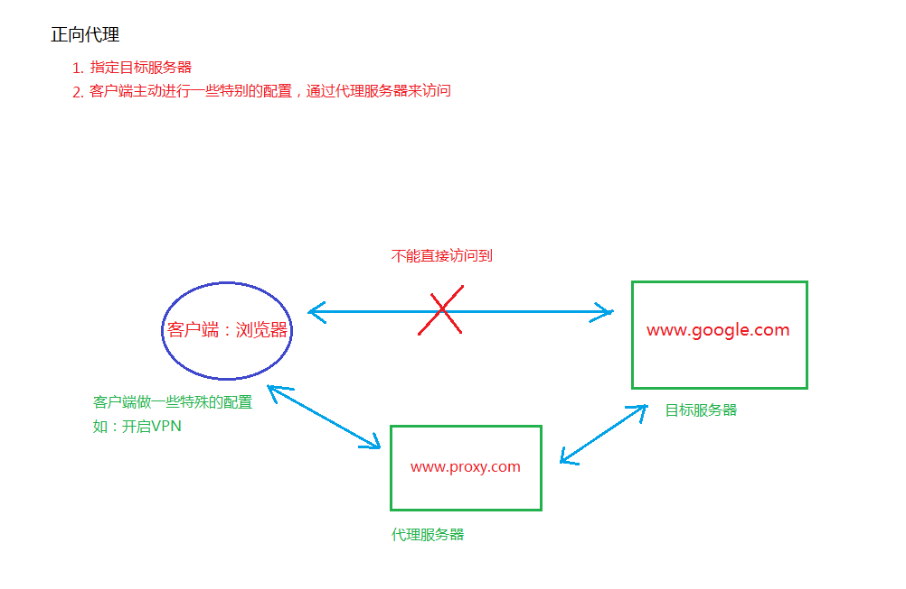

#### ② 反向代理
反向代理，其实客户端对反向代理是无感知的，因为客户端不需要任何配置就可以直接访问到服务器，只需要直接将请求发送到服务器即可（客户端认为访问到的是目标服务器，可能实际上只是一个代理服务器，然后由代理服务器去真正的目标服务器去获取信息再返回给客户端），此时反向代理服务器和目标服务器对外就是一个服务器，暴露的是代理服务器地址，隐藏了真实服务器 IP 地址。

特点：
1. 客户端不需要任何配置，直接就能访问到服务器

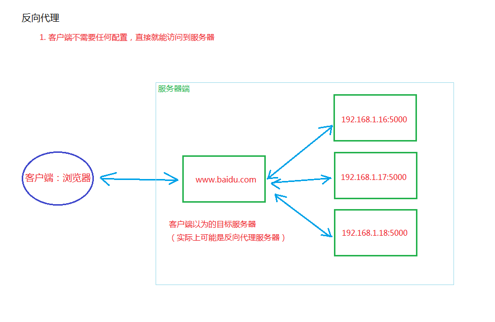

### 4. 负载均衡
一般来说，客户端发送多个请求到服务器，服务器处理请求，有一些可能要与数据库进行交互，服务器处理完毕后，再将结果返回给客户端。

- （```小型应用```）访问量和数据量不大的时候，一台服务器解决问题
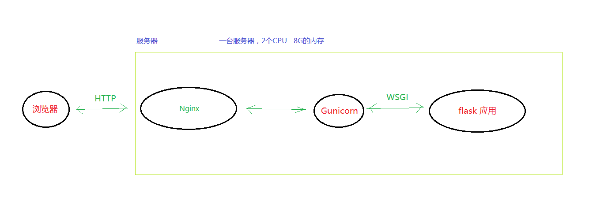
- （```增加物理配置```）当访问量再大一点，这时候，最直观的想法就是升级服务器的配置，如增加CPU、增加内存等
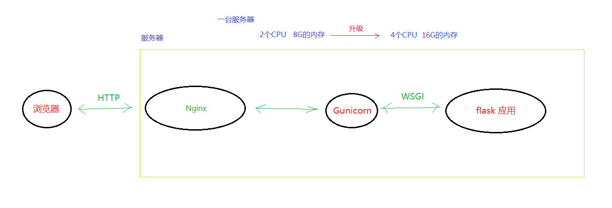
- （```集群```）当访问量大到一台服务器都无法解决的情况下，既然一台服务器解决不了，那么就用多台服务器来解决
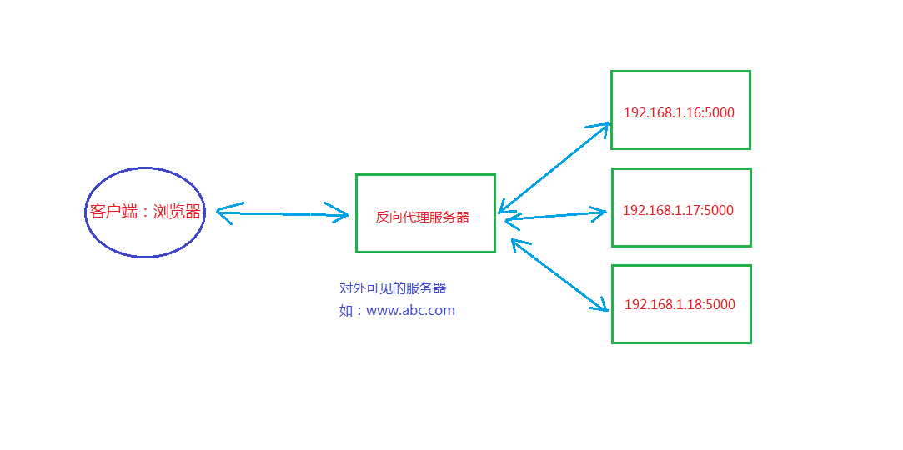

```负载均衡：```
单个服务器解决不了，我们就增加服务器的数量，然后将请求分发到各个服务器上，将原先请求集中到单个服务器上的情况改为将请求分发到多个服务器上，将负载分发到不同的服务器，也就是我们所说的```负载均衡```。

### 5. 动静分离
为了加快网站的解析速度，可以把```静态文件```和```动态请求```由不同的服务器来解析，加快解析速度。降低原来单个服务器的压力。

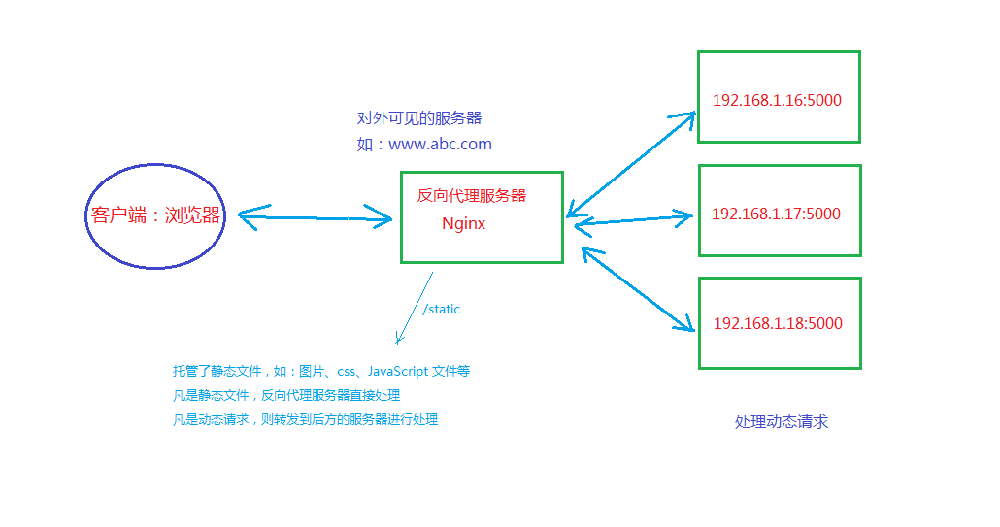

Nginx + Gunicorn + Flask 的服务器演示动静分离：
- Nginx 对静态文件（图片、css、js）进行了托管，凡是请求静态文件的，都由 Nginx 来处理
- 凡是动态请求的，都转发到后方的服务器进行处理
- 示意图如下


## （二） Nginx 的安装、常用命令和卸载
### 1. 安装 Nignx
```
# 安装 nginx
sudo apt-get install nginx

# 查看 nginx 安装的版本
nginx -v

# 启动 nginx
service nginx start
```

nginx 启动后，在浏览器中输入 ```http://localhost:80``` 或 ```http://127.0.0.1:80```，就能看到 nginx 的欢迎页面，这时候 nginx 已经安装成功。
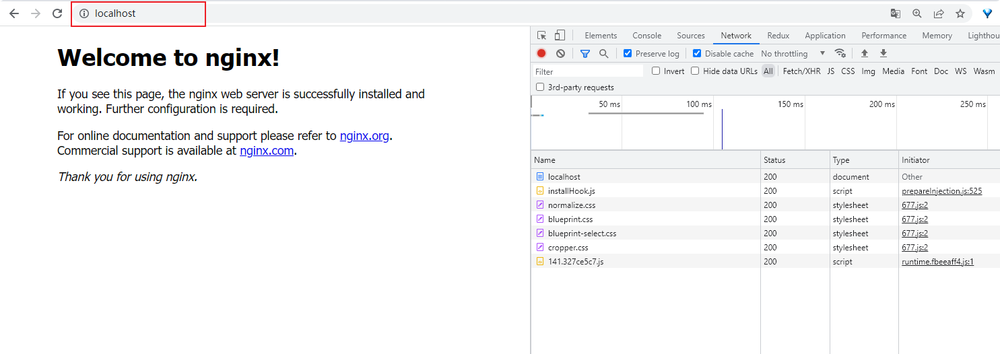

### 2. Nignx 相关的常用命令
```
nginx -v                    显示 nginx 的版本
nginx -V                    显示 nginx 的版本，编译器版本和配置参数

service nginx start         启动 Nginx 服务
service nginx restart       重启 Nginx 服务

nginx -s stop               快速关闭 Nginx，可能不保存相关信息，并迅速终止 web 服务
nginx -s quit               平稳关闭 Nginx，保存相关信息，有安排的结束 web 服务
nginx -s reload             因改变了 Nginx 相关配置，需要重新加载配置而重载（不需要重启Nginx，只需要重新加载，就能让配置生效）

pkill -9 nginx              停止 Nginx 服务

ps -ef | grep nginx         查找 nginx 进程
kill -9 [pid]               根据进程id，停止 Nginx 进程
```

### 3. 卸载 Nignx
```
# 查看正在运行的 nginx 进程
ps -ef | grep nginx

# 停止 nginx 的服务
nginx -s stop

# 列出与 nginx 相关的软件 并删除显示的软件
dpkg --get-selections|grep nginx
sudo apt-get --purge remove nginx
sudo apt-get --purge remove nginx-common
sudo apt-get --purge remove nginx-core
```


## （三） Nginx 中的配置文件
### 1. Nignx 安装后相关的文件说明
#### （1） Nginx 成功安装后相关文件的说明：
1. ```/usr/sbin/nginx``` --> 主程序
2. ```/etc/nginx``` --> 存放配置文件的目录
3. ```/usr/share/nginx``` --> 存放静态文件的目录
4. ```/var/log/nginx``` --> 存放日志的目录
里面有 ```access.log``` 和 ```error.log``` 文件

#### （2） Nginx 的主配置文件
在 Nginx 启动时，会加载 ```/etc/nginx/nginx.conf``` 主配置文件，而该配置文件中，会加载另外的配置文件，如下图所示：
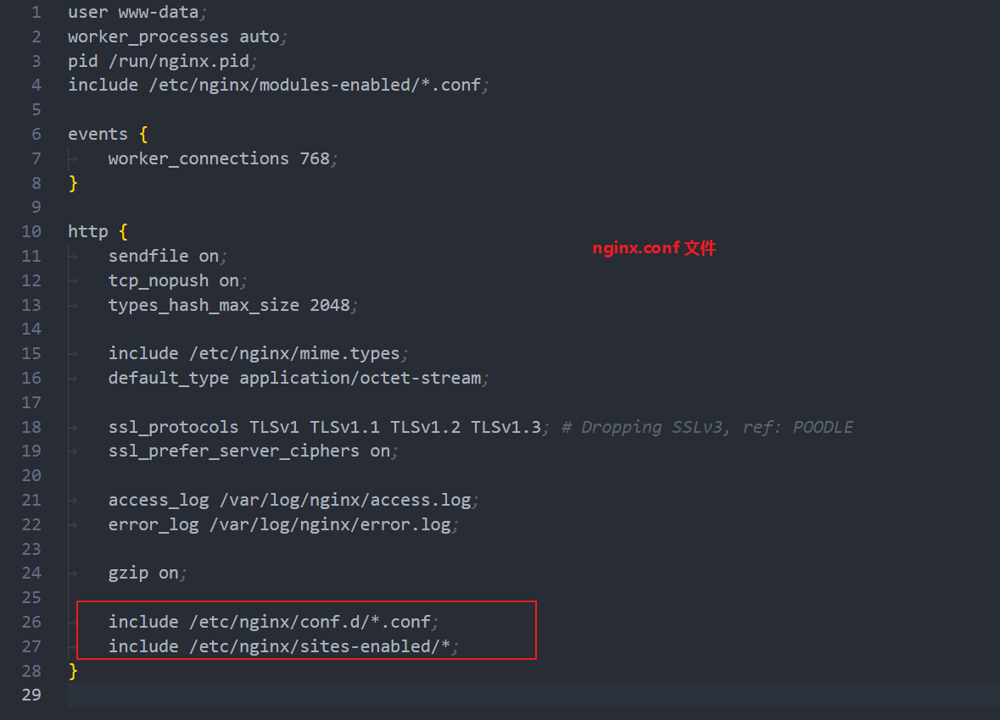
从上图可以看出：
- ```nginx``` 会从 ```/etc/nginx/conf.d``` 中加载以 ```.conf``` 结尾的配置文件
- ```nginx``` 会从 ```/etc/nginx/sites-enabled``` 中加载任何名称的配置文件


#### （3） Nginx 的 sites-available 和 sites-enabled 的区别：
##### ① sites-available 文件夹
- sites-available 文件夹是用于存放网站的配置目录，意为可用的网站列表，用于在需要时链接到 sites-enabled 中作为需要启用的网站。
##### ② sites-enabled 文件夹
- sites-enabled 意为已开启的网站
- sites-enabled 用于存放 sites-available 中配置文件的软链接
- sites-enabled 中的配置文件将被 nginx.conf 加载
##### ③ 总结
1. 安装 nginx 后，默认 sites-available 文件夹中的 default 被创建了软链接，放在 sites-enabled 文件夹中，当 sites-available 中的 default 有变化时，sites-enabled 文件夹中的 default 也会有变化
2. sites-enabled 中的配置文件会被 nginx.conf 加载，所以当 sites-enabled 中有多个配置文件时， nginx.conf 都会加载并启动这些网站
3. sites-available 与 sites-enabled 使我们能够进行模块化配置
4. 当我们希望增加新网站时，我们可以在 sites-available 中创建新配置文件，然后创建这些配置文件的软链接，放到 sites-enabled 中
5. 当我们需要关闭某个站点时，我们可以在 sites-enabled 中将链接移除
6. 以上的操作某种程度是提高了 nginx 的管理效率
一个 Nginx 一般来说，需要自动配置多个网站，并且配置基本类似，大部分情况下只需要修改端口号或 root 目录位置即可。如果每次都修改 /etc/nginx/nginx.conf，会比较麻烦，如果改成在 sites-available 和 sites-enabled 目录中增加配置文件的方式，可以降低代码复杂度。

#### （4） Nginx 启动成功后访问到的页面的具体说明
nginx 启动后，在浏览器中输入 ```http://localhost:80``` 或 ```http://127.0.0.1:80```，就能看到 nginx 的欢迎页面，这时候 nginx 已经安装成功。


- 因为 Nginx 启动的时候，会加载主配置文件 ```/etc/nginx/nginx.conf ```
- 主配置文件 ```/etc/nginx/nginx.conf ``` 中又会加载其他的配置文件（如：```/etc/nginx/sites-enabled```）
- ```/etc/nginx/sites-enabled``` 意为已开启的网站，里面所有的配置文件都会被 ```nginx.conf``` 文件加载
- ```/etc/nginx/sites-enabled``` 中存放的是 ```/etc/nginx/sites-available``` 中的配置文件的软链接，所以说 ```nginx.conf``` 加载的实际上是 ```/etc/nginx/sites-available``` 中的配置文件
- nginx 安装成功后，默认情况下，```/etc/nginx/sites-available``` 中存在 ```default``` 配置文件，而 ```/etc/nginx/sites-enabled``` 中存放着 ```/etc/nginx/sites-available``` 中的 ```default``` 配置文件的软链接
- 我们上面看到的 nginx 的欢迎页面，就是 ```/usr/share/nginx/html/index.html``` 文件中的内容
- 我们通过修改 ```/etc/nginx/sites-available``` 中的 ```default``` 文件，就可以自行配置 Nginx 了，当然配置之后需要使用 ```service nginx restart``` 命令将 nginx 重新启动，这时候新的配置才会生效。（一般都会使用 ```cp default default.bak``` 先备份一下 default 文件，然后才修改）


### 2. Nignx 配置文件的组成结构
#### （1） nginx 配置文件的位置
nginx 服务的主配置文件：```/etc/nginx/nginx.conf```
#### （2） nginx.conf 配置文件的组成部分示意图
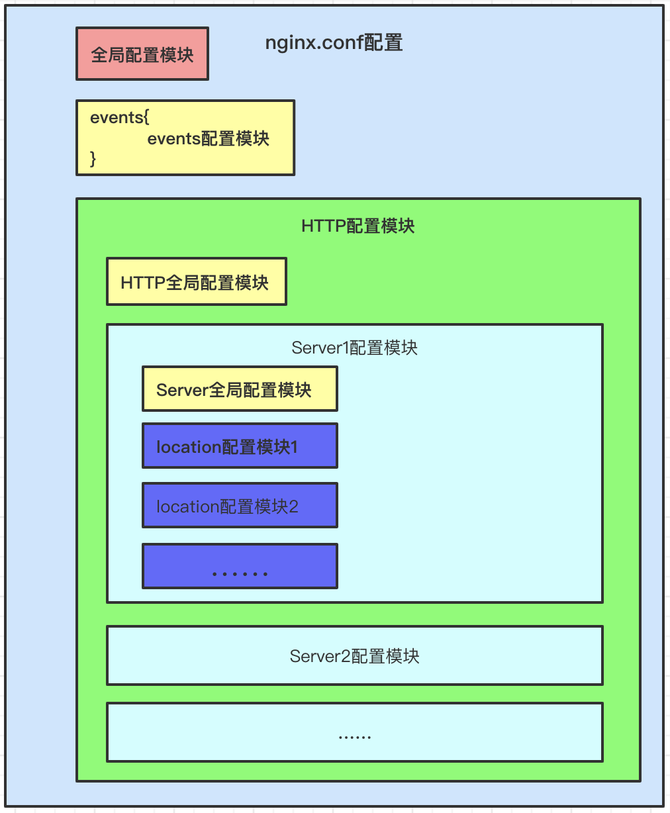


#### （3） nginx.conf 配置文件的组成部分具体说明
##### ① 第一部分：全局块
从配置文件开始到 events 块之间的内容，主要会设置一些影响 nginx 服务器整体运行的配置指令。
主要包括配置运行 Nginx 服务器的用户（组）、允许生成的 worker process 数，进程 PID 存放路径、日志存放路径和类型以及配置文件的引入等。
##### ② 第二部分：events 块
events 块设计的指令主要影响 Nginx 服务器与用户的网络连接。（这部分的配置对 Nginx 的性能影响较大，在实际中应该灵活配置）
常用的设置包括是否开启对多 work process 下的网络连接进行序列化，是否允许同时接收多个网络连接，选取哪种事件驱动模型来处理连接请求，每个 work process 可以同时支持的最大连接数等。
##### ③ 第三部分：http 块
http 块是 Nginx 服务器配置中最频繁的部分，代理、缓存和日志定义等绝大多数功能和第三方模块的配置都在这里。需要注意的是：```http 块也可以包括 http全局块、server块```。

###### （①） http 全局块
http 全局块配置的指令包括文件引入、MIME-TYPE 定义、日志自定义、连接超时时间、单链接请求数上限等。
###### （②） server 块
server 块和虚拟主机有密切关系的，虚拟主机从用户角度看，和一台独立的硬件主机是完全一样的，该技术的产生是为了节省互联网服务器硬件成本。

每个 http 块可以包括多个 server 块，而每个 server 块就相当于一个虚拟主机。
每个 server 块也分为 ```server全局块```，以及可以同时包含多个 ```location块```。

- server 全局块
最常见的配置是本虚拟机主机的监听配置和本虚拟主机的名称或 IP 配置。
- location 块
一个 server 块可以配置多个 location 块。
location 块的主要作用是基于 Nginx 服务器接收到的请求字符串（例如：server_name:port/uri_string），对虚拟主机名称之外的字符串进行匹配（```url 中的路径部分```），对特定的请求进行处理。地址定向、数据缓存和应答控制等功能，还有许多第三方模块的配置也在这里进行。

### 2. Nignx 配置文件的语法
Nginx 的配置语法如下：
1. 配置文件由 ```指令``` 与 ```指令块``` 构成，每条指令以分号 ```;``` 结尾，
2. 指令与参数之间以 ```空格符号``` 分割
3. 指令块以大括号 ```{}``` 将多条指令组织在一起
4. ```include``` 语句允许组合多个配置文件以提升可维护性
5. 使用 ```#``` 符号添加注释，提供可读性
6. 使用 ```$``` 符号来使用变量
7. 部分指令的参数支持正则表达式

以 ```nginx.conf``` 文件中的内容为示例：
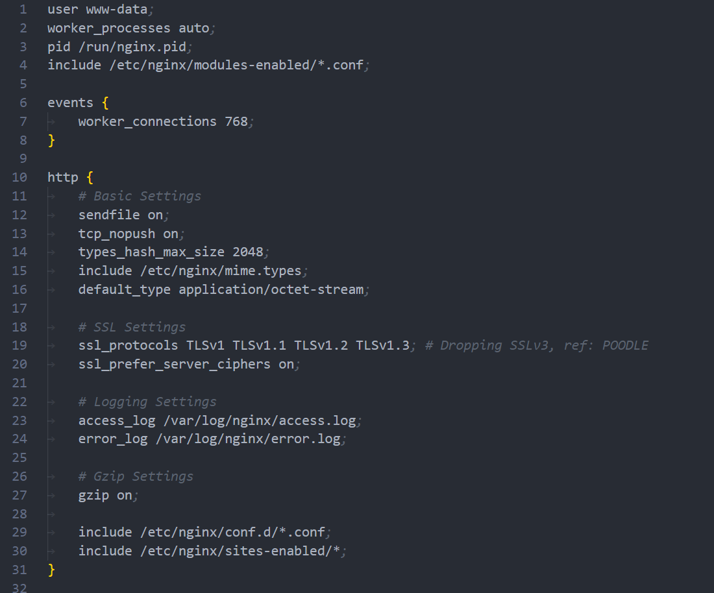

### 3. Nginx 配置文件的详细配置
#### （1） location 指令说明
location 指令用于匹配 URL，语法如下：
```
location [ = | ~ | ~* ^~ ] uri {

}
```
1. ```=```
用于不含正则表达式的 uri 前，要求请求字符串与 uri 严格匹配，如果匹配成功，就停止继续向下搜索并立即处理该请求
2. ```~```
用于表示 uri 包含正则表达式，并且区分大小写
3. ```~*```
用于表示 uri 包含正则表达式，并且不区分大小写
4. ```^~```
用于不含正则表达式的 uri 前，要求 Nginx 服务器找到标识 uri 和请求字符串匹配度最高的 location 后，立即使用此 location 处理请求，而不再使用 location 块中的正则 uri 和请求字符串做匹配。

注意：
如果 uri 包含正则表达式，则必须要用 ```~``` 或者 ```~*``` 标识。


#### （2） 更详细的配置请查看以下的文档
[Nginx 官方文档](https://www.nginx.com/resources/wiki/start/)
[Nginx 配置文件nginx.conf中文详解](https://www.w3cschool.cn/nginx/nginx-d1aw28wa.html)


## （三） Nginx 配置实例1-反向代理
这里演示反向代理的示例
### 1. ```未使用反向代理的情况```
- Nginx 启动的服务对外可见
- Flask 的开发服务器启动的服务也对外可见

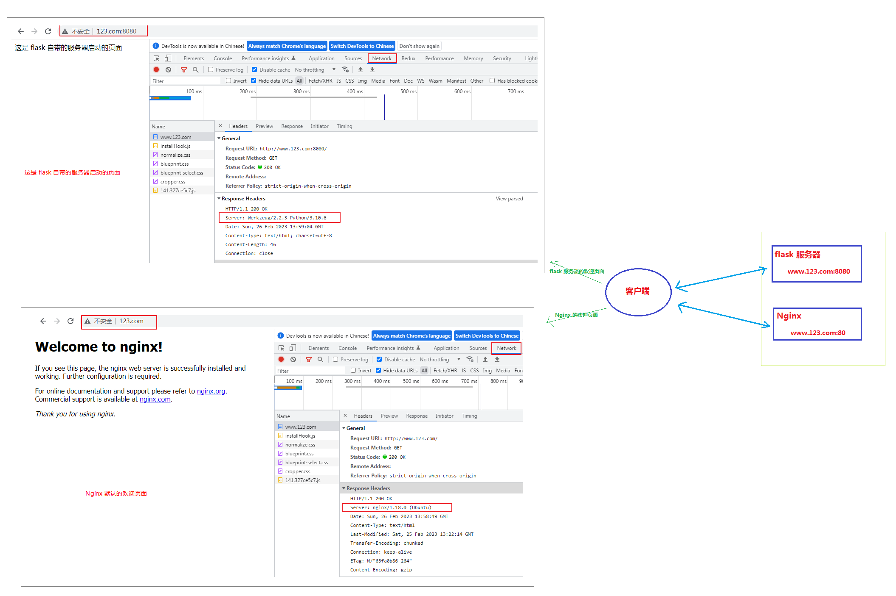
### 2. ```使用反向代理的情况（内部开启一台服务器）```
- Nginx 启动的服务对外可见
- Flask 的启动的服务不对外可见，只对内可见

在 Nginx 的配置文件中做了请求转发的配置（反向代理配置）
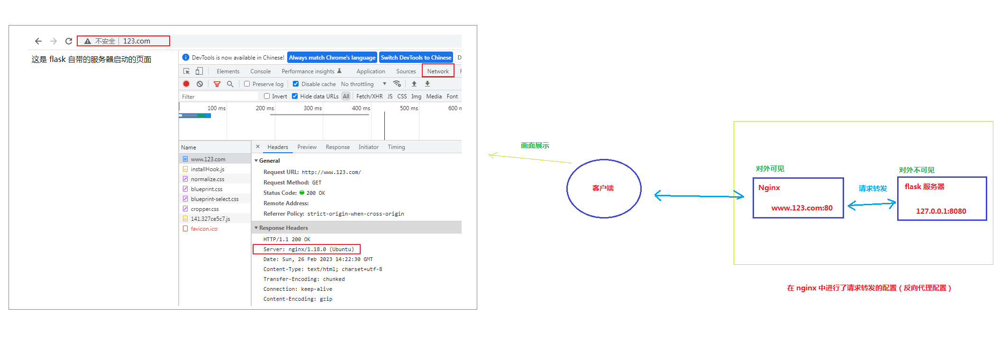
更改 ```/etc/nginx/sites-available/default``` 文件
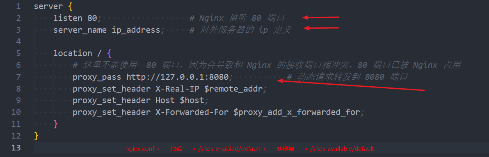

### 3. ```使用反向代理的情况（内部开启两台服务器）```
#### （1） 要实现的效果：
使用 nginx 反向代理，根据访问的路径跳转到不同端口的服务中，nginx 监听端口为 80
当访问 ```www.234.com:80/demo1``` 时，跳转到 ```127.0.0.1:8080```
当访问 ```www.234.com:80/demo2``` 时，跳转到 ```127.0.0.1:8081```

#### （2） 服务器代码
内部 ```8080端口``` 的服务器代码：
```
from flask import Flask

app = Flask(__name__)

@app.route('/demo1')
def index():
    return '这是第一个服务器 8080 端口的主页'

@app.route('/demo1/test')
def test2():
    return 'test2'

@app.route('/test/demo1')
def test_demo():
    return 'test demo'
```

内部 ```8081端口``` 的服务器代码：
```
from flask import Flask

app = Flask(__name__)

@app.route('/demo2')
def index():
    return 'flask 第二个服务器 8081 端口的主页'
```

#### （3） 更改配置文件
更改 ```/etc/nginx/sites-available/default``` 文件
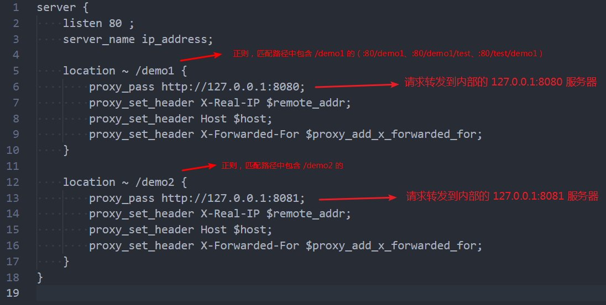

#### （4） 结构图
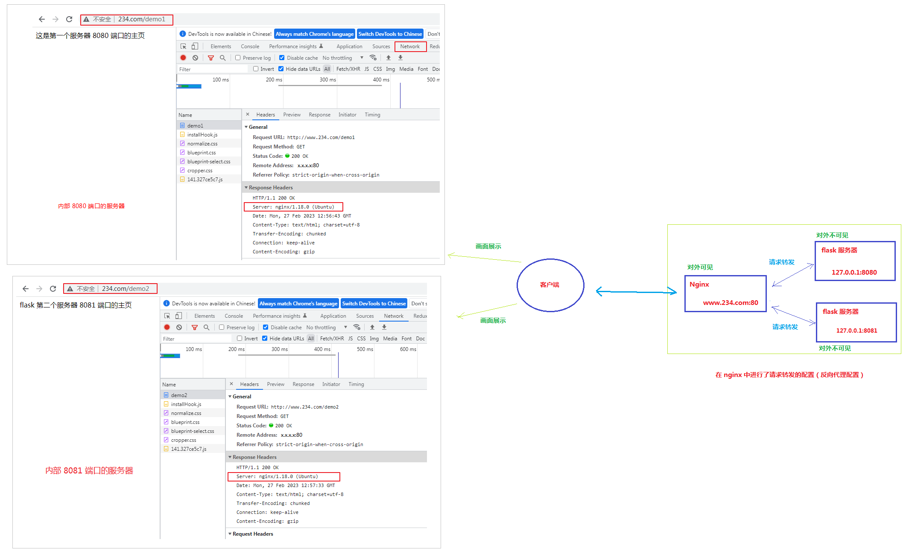


## （四） Nginx 配置实例2-负载均衡
### 1. 负载均衡的说明
负载均衡的含义就是将负载分摊到不同的服务器中，保证服务的可用性以及响应速度。

负载均衡的操作过程：
- 准备两台服务器，启动时只对内可见，而且两台服务器的代码完全一致（就是将一个项目分别在不同的服务器中运行）
- 分别启动这两台服务器，然后分别赋予它们不同的端口，如 ```8080``` 和 ```8081```
- 使用 nginx 做负载均衡，将请求分发到各个服务器上，保证服务的响应速度等

### 2. 负载均衡的配置
```upstream``` 是 Nginx 的 ```HTTP``` 块中的 ```upstream``` 模块，这个模块通过一个简单的调度算法来实现客户端 IP 到后端服务器的负载均衡。
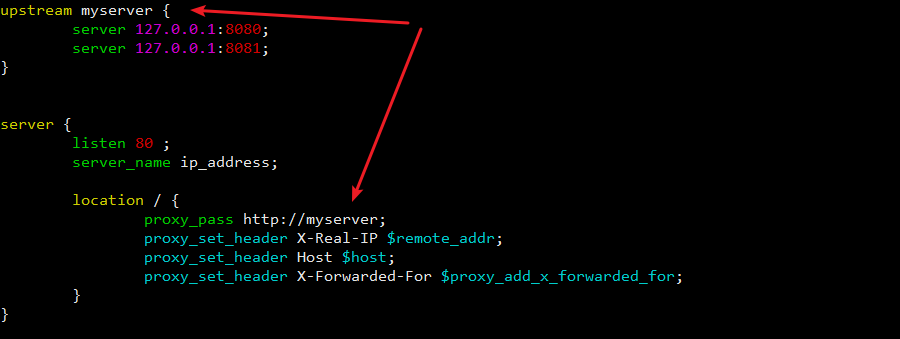
以下的配置是将负载均衡写在 ```/sites-available/default``` 文件中（当然可以直接写在 ```/etc/nginx/nginx.conf``` 文件的 ```http``` 模块中）。
```
upstream myserver {
    server 127.0.0.1:8080;
    server 127.0.0.1:8081;

    # 上面是在同一个计算机中启动了两台服务器，也可以分别指定两台计算机
    # server 192.168.0.11:80;
    # server 192.168.0.12:80;
}


server {
    listen 80 ;
    server_name ip_address;

    location / {
        proxy_pass http://myserver;
        proxy_set_header X-Real-IP $remote_addr;
        proxy_set_header Host $host;
        proxy_set_header X-Forwarded-For $proxy_add_x_forwarded_for;
    }
}
```

### 3. 项目代码和运行效果
```
from flask import Flask

app = Flask(__name__)

@app.route('/demo1')
def index():
    # 为了在画面上展示请求转发到 8080 还是 8081 中，可以让返回值不一样而区分，访问同一个连接，展示不同的主页
    return '这是第一个服务器 8080 端口的主页'
```

运行效果：


### 4. upstream 的几种常用配置
#### （1） 轮询（默认）
每个请求按时间顺序逐一分配到不同的后台服务器，如果某个后台服务器宕机了，它能自动剔除不能使用的服务器，从而将请求转发给其它可用的服务器。

```
upstream myserver {
    server 192.168.0.11:80;
    server 192.168.0.12:80;
}
```

#### （2） weight （指定权重）
```weight``` 代表权重，默认是 1，权重越高被分配的客户端越多。
指定轮询几率，weight 和访问比率成正比，用于后端服务器性能不均的情况。

```
upstream myserver {
    server 192.168.0.11:80 weight=7;
    server 192.168.0.12:80 weight=10;
}
```

#### （3） ip_hash （ip 绑定）
每个请求按访问 ip 的 hash 结果分配，这样每个访客固定访问一个后端服务器，可以解决分布式 session 的问题。

```
upstream myserver {
    ip_hash;
    server 192.168.0.11:80;
    server 192.168.0.12:80;
}
```

#### （4） fair （第三方）
按后端服务器的响应时间来分配请求，响应时间短的优先分配。

```
upstream myserver {
    server 192.168.0.11:80;
    server 192.168.0.12:80;
    fair;
}
```

## （五） Nginx 配置实例3-动静分离
### 1. 概述
nginx 可以进行静态文件托管，我们可以将静态文件的访问交给 nginx 来处理，有助于降低 app server 的压力，app server 就专心处理动态请求，使得服务器整体的访问效率更高效。动静分离从目前实现的角度来说，大致有两种：
1. 一种方法是纯粹把静态文件独立成单独的域名，放在独立的物理服务器上
2. 另一种方法是将动态请求和静态文件混合在一起发布，通过 nginx 来分开

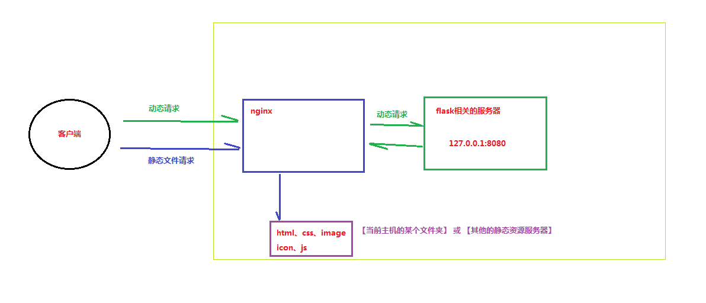

### 2. 配置
#### （1） 静态文件的路径
我的项目在系统根目录下的 ```/flask_demo``` 文件夹中，所以根据 ```flask``` 项目的套路，直接在 ```/flask_demo``` 中创建一个 ```static``` 的目录，用来存放静态文件，如下图所示


#### （2） nginx 中静态文件的托管配置
更改 ```/etc/nginx/sites-available/default``` 文件
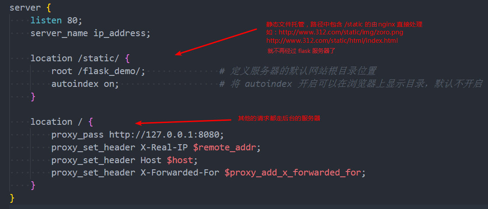

静态托管的效果图（后台服务器没开启的情况下，nginx 直接就处理了请求）
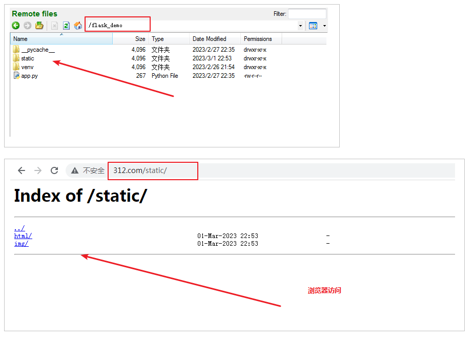


#### （3） 静态文件托管配置相关的说明
1. 不同文件后缀的转发请求
通过设置 ```server```块下的```location```块，可以指定不同的文件后缀名实现不同的请求转发或过期时间。如：```location ~ .*.(gif|jpg|jpeg|png|bmp|swf)$ { expires 10d; }``` 和 ```location ~ .*.(js|css)$ { expires 1h; }```
2. ```autoindex```
将 autoindex 开启可以在浏览器上显示目录，默认不开启
3. ```expires```
通过设置 expires 参数，可以给一个资源设定一个过期时间，使得浏览器缓存该文件，在过期时间内，针对该文件的请求，浏览器都会携带 ```If-Modified-Since``` 头和服务器比对该文件最后更新时间有没有变化；如果没有修改，则 nginx 返回 ```304``` 状态码，让浏览器使用缓存的文件；如果有修改，则直接从服务器重新下载，返回 200 状态码。


## （六） Nginx 的高可用
### 1. 使用 Supervisor 守护 Nginx 进程
```supervisor``` 是 Linux 后台进程管理的工具，是用 Python 开发的一套通用的进程管理程序，能监控进程的状态，在进程异常退出时能自动重启。因为 nginx 会有宕机的情况，为了让 nginx 在宕机后能够自动重启，我们需要使用 ```supervisor``` 来完成这个操作。


#### （1） supervisor 的安装
```
# ubuntu 系统通过 apt 安装
apt-get install supervisor

# 查看所有 supervisor 相关的进程的状态
supervisorctl status
```

#### （2） supervisor 的配置
```Supervisor``` 基础配置在 ```/etc/supervisor/supervisord.conf``` 中，如果要为我们自己开发的应用程序编写配置文件，则需要放在 ```/etc/supervisor/conf.d/``` 目录中，让 supervisor 来管理它。每个进程的配置文件都可以单独拆开放置，放在 ```/etc/supervisor/conf.d/``` 目录下，以 .conf 作为扩展名。

#### （3） 配置 nginx 的守护进程
切换进 ```/etc/supervisor/conf.d/``` 目录中
```
# 切换进目录中
cd /etc/supervisor/conf.d/

# 创建配置文件
touch nginxdemo.conf
```

```nginxdemo.conf``` 文件的内容
```
[program:nginxdemo]     ; 被管理的进程配置参数，nginxdemo 是进程的名称，使用 supervisorctl 来管理进程时需要使用该进程名

command=/usr/sbin/nginx -g 'daemon off;' # 需要执行的命令
# nginx 的启动命令默认是后台启动（daemon on; 以守护进程运行），supervisor不能监控后台程序，所以当 nginx 以守护进程的方式启动时，supervisor 检测不到 nginx 的启动，就会一直执行 nginx 的启动命令，不断的启动 Nginx，最后可能还会报错。 加上 -g 'daemon off;' 这个参数可解决这问题。
# 额外说明：在容器环境，容器要能持续运行，至少有一个前台进程在运行，所以对nginx进程容器化，需要将 nginx 转为前台进程( daemon off)。当然，nginx 的官方镜像 Dockerfile 已经指定 nginx -g "daemon off;"

autostart=true          ; 在 supervisor 启动的时候也自动启动

autorestart=true        ; 程序异常退出后自动重启

stdout_logfile=/var/log/nginx/nginx-out.log       ; 子进程的 stdout 的日志路径 输出日志文件

stderr_logfile=/var/log/nginx/nginx-err.log       ; 错误日志文件
```

#### （4） supervisor 重新加载配置以及 supervisor 的常用命令
配置更改之后，要让 supervisor 读取自定义的配置，新加的配置都要执行下，配置重新加载后，会自动的执行上面的配置，这时候的 nginx 也会启动起来
```
# 方式一
supervisorctl update

# 方式二
supervisorctl reload            # 重新启动配置中的所有程序

# 查看所有 supervisor 相关的进程的状态
supervisorctl status
```

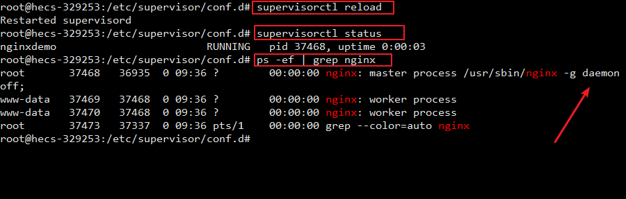

supervisor 常用命令
```
supervisorctl status        # 查看所有 supervisor 相关的进程的状态
supervisorctl start xx      # 启动 xx 服务（启动 xx 进程）
supervisorctl stop xx       # 停止 xx 服务
supervisorctl restart xx    # 重启 xx 服务
supervisorctl update        # 根据最新的配置文件，启动新配置或有改动的进程，配置没有改动的进程不会受影响而重启
supervisorctl reload        # 载入最新的配置文件，停止原有进程并按新的配置启动、管理所有进程
supervisorctl shutdown      # 关闭所有任务
supervisorctl stop all      # 停止全部进程
```

#### （5） 注意事项
1. 默认情况下，```nginx``` 安装之后，默认会启动，所以我们在使用 ```supervisor``` 运行 nginx 之前，应该先关闭原先正在运行的 ```nginx```，改成让 ```supervisor``` 去启动 ```nginx```
2. ```nginx``` 默认会开机自启动，也就是说重启操作系统后，```nginx``` 会自行运行，这时候我们也应该关闭 ```nginx``` 的开机自启动功能， 让 ```supervisor``` 去启动 ```nginx```，```supervisor``` 也是开机自启动的。

```nginx 自启动``` 和 ```使用supervisor启动的nginx``` 的区别：
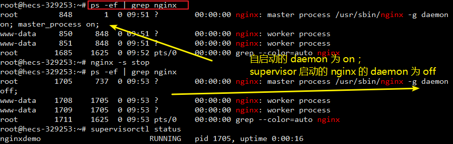


开机自启动的检测和关闭：
```
# 开机自启动 nginx
systemctl enable nginx
# 开机自启动 supervisor
systemctl enable supervisor

# 查看是否开机自启动
systemctl is-enabled nginx
systemctl is-enabled supervisor

# 关闭开机自启动 nginx
systemctl disable nginx.service
# 关闭开机自启动 supervisor
systemctl disable supervisor.service


# ubuntu 重启命令
reboot
# ubuntu 关机命令
shutdown now
```

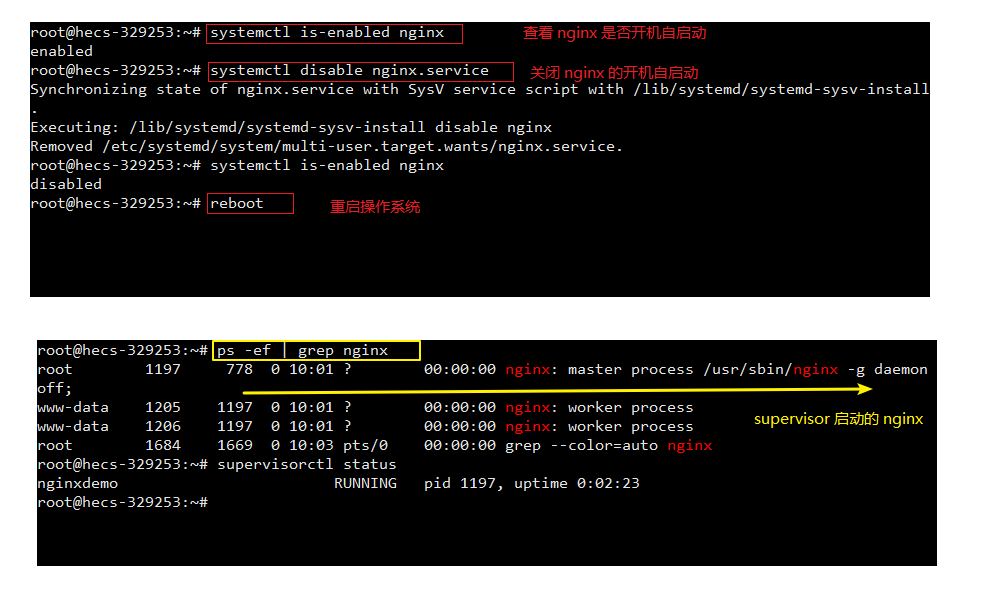


### 2. Nginx 配置高可用集群
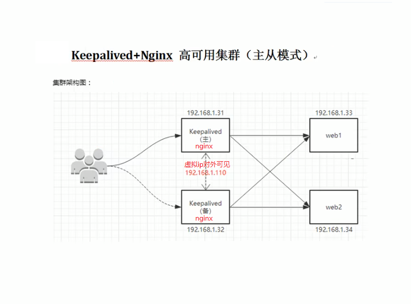

以上图为示例的说明：
- 需要两台 nginx 服务器
- 两台 nginx 服务器上都分别装上 keepalived，然后做相应的 keepalived 配置
- 一个虚拟 ip，用于对外可见，用户通过这个 ip 访问服务器
- 两台 web 服务器，两台 nginx 都分别做同样的反向代理和负载均衡等操作，映射到这两台 web 服务器上

## （七） Nginx 原理
### 1. Nginx 的工作原理
- ```/etc/nginx/nginx.conf``` 主配置文件中指定要生成的 ```worker``` 数
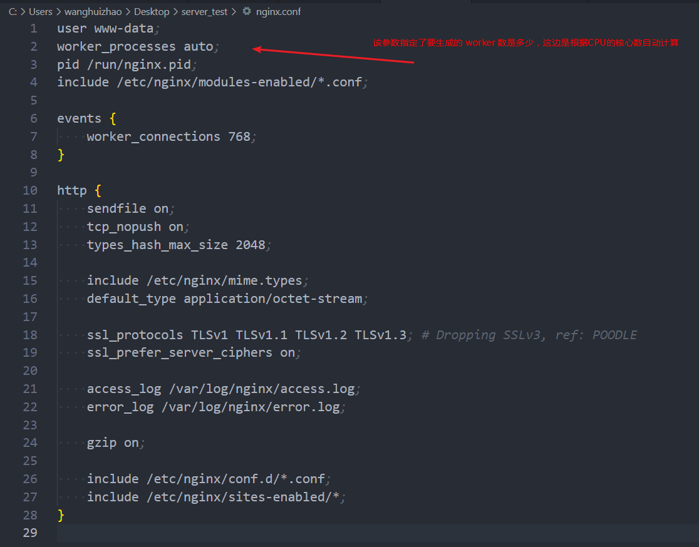
- 实际启动后的相关进程


master 进程充当一个管理者，当客户端发送一个请求到服务器端，nginx 的 master 进程接收到请求之后，就通知 worker 进程，客户端那边有请求过来，然后各个 worker 去争抢请求的处理，当某个 worker 抢夺到请求之后，如果是静态文件相关的请求，则 nginx 的 workder 进程直接进行处理，如果是动态请求，则将请求转发到反向代理对应的 web 服务器中，由 web 服务器去处理。

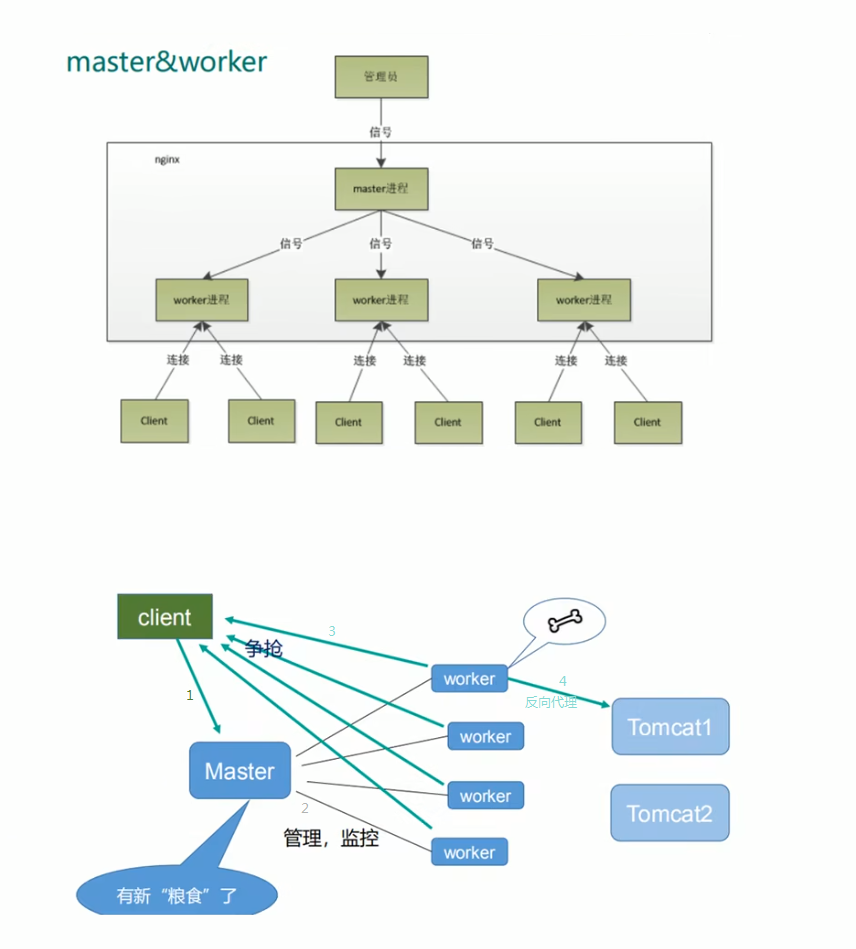

### 2. master-workers 的机制
#### （1） master-workers 的机制的好处
1. 利于 nginx 进行热部署操作，可以使用 ```nginx -s reload``` 热部署
假设当前有 2 个 worker 进程，一个 worker 进程正在处理请求，另一个 worker 进程处于空闲的状态，此时 nginx 的配置突然更改了，然后使用 ```nginx -s reload``` 命令让 nginx 重新加载配置，此时空闲的 worker 进程将会使用新的配置去处理客户端新的请求；当繁忙的 worker 进程处理完手头上的请求后，也会重新更新配置，下次再处理请求时，会使用新的配置去处理。
2. 每个 worker 是独立的进程，不会相互影响，其中一个异常退出了，其他的依然可以处理请求，不会造成服务中断
首先，对于 worker 进程来说，独立的进程，不需要加锁，所以省掉了锁带来的开销，同时在编程以及问题查找时，也会方便很多。其次，采用独立的进程，这些进程不会互相影响，一个进程退出后，其它进程还在工作，服务不会中断，master 进程则很快就能启动新的 worker 进程去替代。当然，worker 进程的异常退出，肯定是程序有 bug 了，异常退出，会导致当前 worker 上的所有请求失败，不过不会影响到其他进程中的请求，所以降低了风险。

#### （2） 设置多少个 worker 合适
Nginx 同 redis 类似都采用了 io 多路复用机制，每个 worker 都是一个独立的进程，每个进程中只有一个主线程，通过异步非阻塞的方式来处理请求，即使是成千上万个请求也不在话下。每个 worker 的线程可以把一个 cpu 的性能发挥到机制。在 nginx 中，worker 数和服务器的 cpu 数相等是最为适宜的（CPU 一次能并行执行多少个进程，就设置多少个 worker），设置少了会浪费 CPU，设置多了会造成 CPU 频繁切换上下文带来的损耗。

#### （3） 设置 worker 数量
nginx 的配置文件中，设置 ```worker_processes 4```，这样就可以直接指定要生成的 worker 数是多少。

#### （4） 连接数 worker_connection
这个值是表示每个 worker 进程所能建立连接的最大值，所以，一个 nginx 能建立的最大连接数，应该是 ```worker_processes * worker_connections```。

nginx 配置文件的结构：


## （八） 参考
[Nginx教程由浅入深](https://www.bilibili.com/video/BV1zJ411w7SV?p=1&vd_source=4859610c015d401745b90b6ed755b9d6)
[浅谈Nginx](https://www.cnblogs.com/yb-ken/p/15084800.html)
[Nginx 入门指南](https://www.w3cschool.cn/nginx/nginx-d1aw28wa.html)