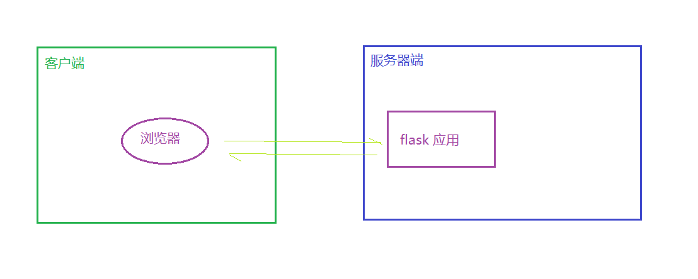
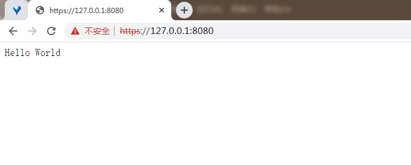
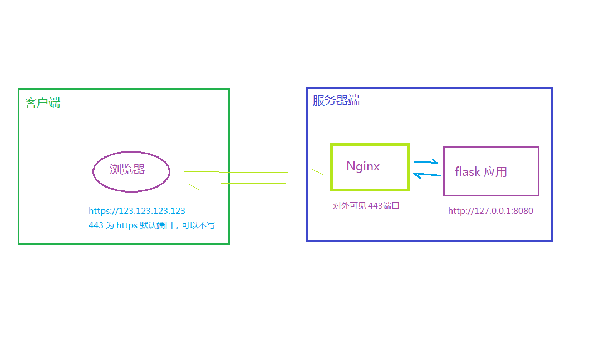
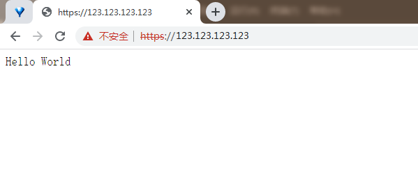

将服务从 ```HTTP``` 变为 ```HTTPS```，需要进行 ```SSL``` 证书的配置。需要完成一下步骤：
1. 获取 ```SSL``` 证书
2. 安装 ```SSL``` 证书
3. 配置 **Nginx** 支持 ```HTTPS```
4. 重启 **Nginx**
5. ```HTTP``` 到 ```HTTPS``` 的重定向（可选）


## 1. 获取 ```SSL``` 证书（自签名证书）
对于 ```SSL/TLS``` 证书，一般来说，它们是基于 **域名** 进行颁发的，而不是 **IP地址**。这是因为 ```SSL/TLS``` 证书是用来验证服务器身份和提供一个安全的连接通道的，它们需要关联到一个被认可的域名以确保服务器的真实性。

如果你没有 **域名**，但是你的应用又需要使用 ```HTTPS```，那么以下几种方式或许可以考虑：
1. 购买一个域名：
域名现在相当便宜，你可以购买一个，并将其解析到你的 IP 地址。
2. 自签名证书：
可以创建自己的自签名证书。但是，用户的浏览器会显示一个警告，提示他们证书不受信任。这可能不适合面向公众的应用程序，但对于测试或内部使用的服务来说，这是一个可行的选择。
3. 使用 **CloudFlare**
**CloudFlare** 是一个内容分发网络（CDN）和 **DNS** 提供商，它提供免费的 ```SSL``` 证书，即使你没有域名也可以使用。但是，这需要将你的流量通过他们的网络，可能并不适合所有应用。

### 1.1. 安装 openssl
```
// 更新 apt-get 下载源节点
sudo apt-get update

// 查看当前 apt-get 下载源节点里 libssl-dev 可下载安装的所有版本和默认的最合适的版本
sudo apt-cache policy libssl-dev

// 下载并默认安装 libssl-dev（默认的版本）
sudo apt-get install libssl-dev

// 如果要指定安装某个版本
//sudo apt-get install libssl-dev=版本号
```

### 1.2. 自签名证书
使用 **OpenSSL** 工具来创建自己的自签名证书
1. 生成私钥
打开命令行，然后输入以下命令来生成一个新的 RSA 私钥：```openssl genrsa -out server.key 2048```，将在当前目录下生成一个名为 ```server.key``` 的 2048 位私钥文件。
2. 生成证书签名请求（CSR）
使用此命令生成 CSR（Certificate Signing Request）：```openssl req -new -key server.key -out server.csr```，会提示输入很多东西，一直按 enter 即可
3. 生成自签名证书
最后，使用以下命令生成自签名证书：```openssl x509 -req -days 365 -in server.csr -signkey server.key -out server.crt```，这将生成一个有效期为一年的自签名证书 **server.crt**。

### 1.3. 尝试在 flask 应用中使用
```
from flask import Flask


app = Flask(__name__)


@app.route("/")
def index():
    return "Hello World"


if __name__ == "__main__":
    app.run(ssl_context=('server.crt', 'server.key'), host='0.0.0.0', port=8080)
    #app.run(host='0.0.0.0', port=8080)
```
这样，Flask 服务器就会在 ```HTTPS``` 上运行了。但是，请注意，因为使用的是自签名证书，所以浏览器将警告用户这个连接不安全（因为证书不是由受信任的证书颁发机构签署的）。对于公开服务，应该考虑获得一个由公认的 CA 签署的证书。


- 直接在 flask 中使用 ssl 证书的示意图：




## 2. 安装 ```SSL``` 证书
将上面生成的 SSL 证书文件放置到位于 ```/etc/nginx/ssl/``` 目录中。确保已经拥有了服务器私钥(```server.key```)和证书文件(```server.crt``` 或 ```server.crt```)。


## 3. 配置 ```Nginx``` 支持 ```HTTPS```
### 3.1. 打开 Nginx 配置文件
Nginx 的配置文件通常位于 **/etc/nginx/** 目录下，具体取决于你的系统和 Nginx 安装方式。大部分情况下，站点特定的配置在 **/etc/nginx/sites-available/** 中。

### 3.2. 修改或增加一个server块
在 **/etc/nginx/sites-available/default** 配置文件中，将文件中的内容全部替换为下面的 server 模块（或者新建一个使用 SSL 的 server 块），内容如下：
```
server {
    listen 443 ssl;
    server_name _;
    # server_name your-domain.com;                  # 没有域名则直接写一个下划线即可

    ssl_certificate /etc/nginx/ssl/server.crt;      # 修改为证书路径
    ssl_certificate_key /etc/nginx/ssl/server.key;  # 修改为私钥路径

    location / {
        proxy_pass http://127.0.0.1:8080;           # 修改为 http 服务地址
        proxy_set_header Host $host;
        proxy_set_header X-Real-IP $remote_addr;
    }
}
```
- 替换 **your-domain.com** 为真实的域名，没有域名则直接写一个下划线（**_**）即可。
- ```listen 443 ssl``` 告诉 Nginx 在 443 端口上监听 SSL 连接。
- ```ssl_certificate``` 和 ```ssl_certificate_key``` 指令分别指向你的证书文件和私钥文件的实际路径。


## 4.  重启 Nginx
保存并关闭配置文件，然后运行以下命令来检查新的配置是否有语法错误：
```
sudo nginx -t
```

如果这个命令没有报错，就可以安全地重启 Nginx：
```
sudo systemctl restart nginx
```
nginx 重启成功后，将可以在浏览器上通过 https 访问服务器应用了。由于使用的是自签名证书，用户的浏览器将显示一个警告，提示他们此证书不受信任。这对于测试和开发环境可能没问题，但是如果计划在生产环境中使用 SSL，应该考虑从一个可信的证书颁发机构获取一个证书。

- 使用 nginx 作为反向代理后，使用 ssl 证书的示意图：




## 5. HTTP 到 HTTPS 的重定向（可选）
如果希望所有的 HTTP 流量都自动跳转到 HTTPS，可以在 Nginx 配置中添加以下内容：
```
server {
    listen 80;
    server_name your-domain.com;
    return 301 https://$host$request_uri;
}
```
这段配置会捕获所有到端口 80（HTTP） 的请求，并将它们重定向到相同地址的 HTTPS 版本。
