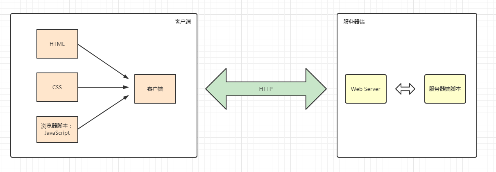
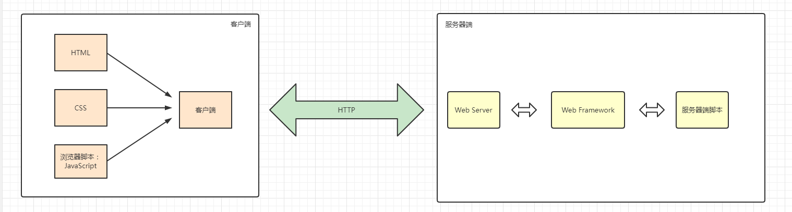
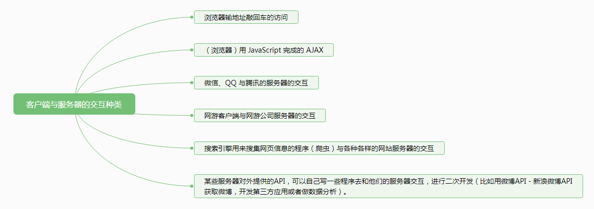
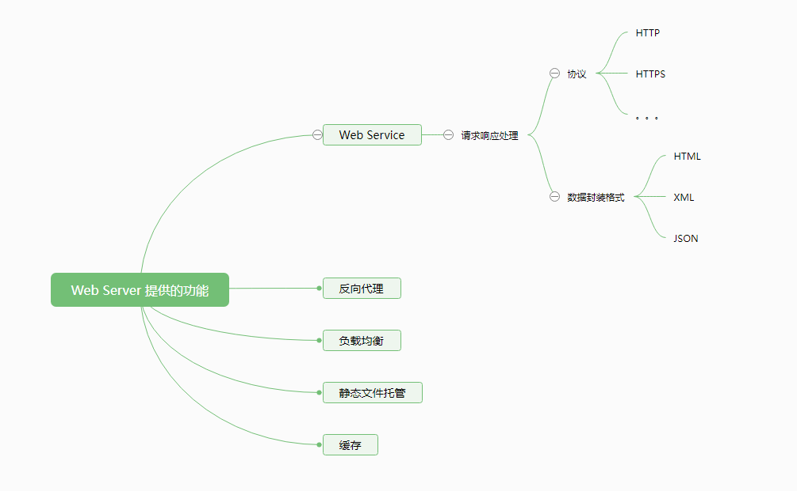
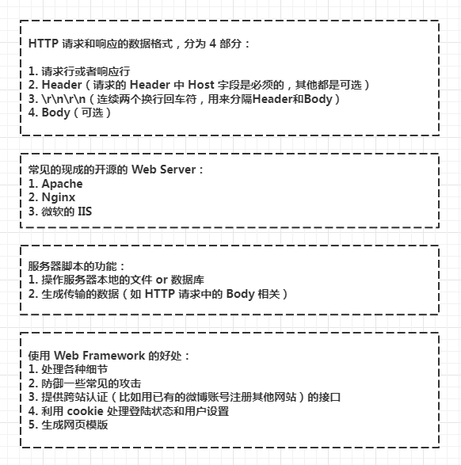
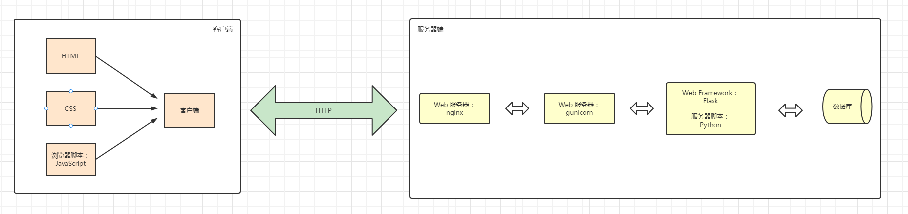
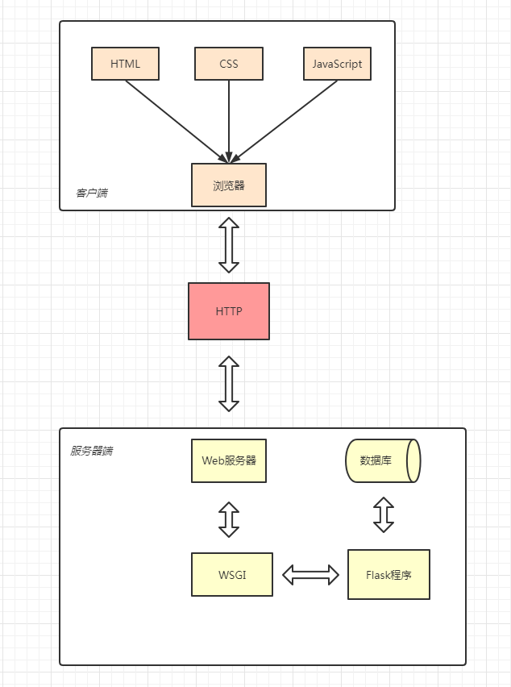

## （一） 前后端的交互
### 1. 前后端的概括图
1. 简略

2. 使用 Web Framework 的情况

### 2. 详细
#### （1） 客户端与服务器的交互种类

#### （2） Web Server 提供的功能

#### （3） HTTP、Web Server、Framework、服务器脚本

### 3. 一个普通网站访问的过程
1. 用户操作浏览器访问，浏览器向服务器发出一个 HTTP 请求；
2. 服务器接收到 HTTP 请求，Web Server 进行相应的初步处理，使用服务器脚本生成页面；
3. 服务器脚本（利用Web Framework）调用本地和客户端传来的数据，生成页面；
4. Web Server 将生成的页面作为 HTTP 响应的 body，根据不同的处理结果生成 HTTP header，发回给客户端；
5. 客户端（浏览器）接收到 HTTP 响应，通常第一个请求得到的 HTTP 响应的 body 里是 HTML 代码，于是对 HTML 代码开始解析；
6. 解析过程中遇到引用的服务器上的资源（额外的 CSS、JS代码，图片、音视频，附件等），再向 Web Server 发送请求，Web Server 找到对应的文件，发送回来；
7. 浏览器解析 HTML 包含的内容，用得到的 CSS 代码进行外观上的进一步渲染，JS 代码也可能会对外观进行一定的处理；
8. 用户与页面交互（点击，悬停等等）时，JS 代码对此作出一定的反应，添加特效与动画；
9. 交互的过程中可能需要向服务器索取或提交额外的数据（局部的刷新，类似微博的新消息通知），一般不是跳转就是通过 JS 代码（响应某个动作或者定时）向 Web Server 发送请求，Web Server 再用服务器脚本进行处理（生成资源or写入数据之类的），把资源返回给客户端，客户端用得到的资源来实现动态效果或其他改变。

注意这只是小网站里比较常见的模型，大网站为了解决规模问题还会有很多处理，每个环节都会有一些细微的差异，中间还会使用各种各样的工具减轻服务器的压力，提高效率，方便日常维护。

## （二） 后端为 Python 和 Flask 的情况

## （三） 参考
[Web 建站技术中，HTML、HTML5、XHTML、CSS、SQL、JavaScript、PHP、ASP.NET、Web Services 是什么？](https://www.zhihu.com/question/22689579/answer/22318058)
[从 HTTP 请求-响应循环探索 Flask 的基本工作方式](https://zhuanlan.zhihu.com/p/42231394)