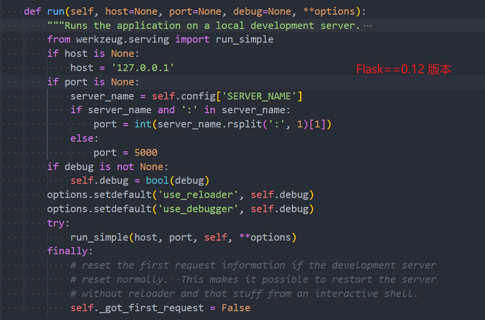
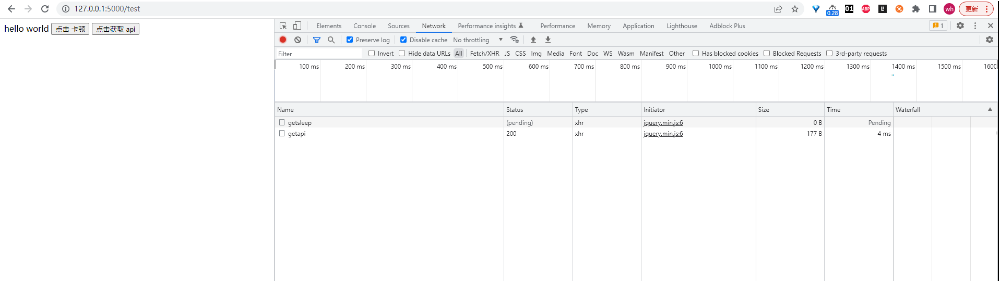
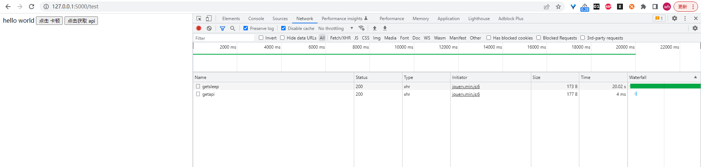

## （一） 概述
Flask 是 Python 中有名的同步的轻量级 web 框架，主要提供最基本的 api 接口功能，表现形式主要是服务端被动接收客户端的请求后做出响应，然后客户端根据响应结果做出业务操作。

## （二） 对 Flask 运行机制的源码的初步理解
**以下所有 Flask 的源码基于 Flask==1.1.2 版本**

### 1. app.run()
既然要理解 Flask 运行的机制，不可避免的要看 Flask 的源码，咱们以 app.run() 为入口去探索
```py
from flask import Flask

app = Flask(__name__)

@app.route('/')
def index():
    return 'hello world'

if __name__ == '__main__':
    app.run()
```

### 2. run() 函数的源码
run() 函数是 flask/app.py 中的 Flask 类的一个方法，核心代码如下：
```py
def run(self, host=None, port=None, debug=None, load_dotenv=True, **options):
    '''省略部分代码'''

    _host = "127.0.0.1"
    _port = 5000
    server_name = self.config.get("SERVER_NAME")
    sn_host, sn_port = None, None

    if server_name:
        sn_host, _, sn_port = server_name.partition(":")

    host = host or sn_host or _host
    # pick the first value that's not None (0 is allowed)
    port = int(next((p for p in (port, sn_port) if p is not None), _port))

    options.setdefault("use_reloader", self.debug)
    options.setdefault("use_debugger", self.debug)
    options.setdefault("threaded", True)

    cli.show_server_banner(self.env, self.debug, self.name, False)

    from werkzeug.serving import run_simple

    try:
        run_simple(host, port, self, **options)
    finally:
        # reset the first request information if the development server
        # reset normally.  This makes it possible to restart the server
        # without reloader and that stuff from an interactive shell.
        self._got_first_request = False
```

在 run 函数内，函数设置了服务器启动的 address、port 等信息，最后引入了一个 werkzeug 库的 run_simple 方法，另外还传入了一个 options 参数。

- 请注意：
    ```options.setdefault("threaded", True)``` 这行代码是用来启动多线程的，也就相当于，在 Flask==1.1.2 版本中，Flask 的基本运行是基于**单进程多线程**的（下面会进行具体的说明）


### 3. run() 函数源码以前版本的解释


在以前的 Flask 版本中，threaded 这个参数是没有的，**在 werkzeug 库的 run_simple 方法中，threaded 的默认值是 False**，因此在最早的 Flask 版本中，Flask 的运行时基于**单进程单线程**的。

在后续增加了 threaded 后，就可以在使用 ```app.run()``` 启动的时候，添加 threaded 参数，可以手动的设置是使用**单进程单线程**还是使用**单进程多线程**的方式来跑 Flask。

- 单进程单线程
当设置 ```app.run(threaded=False)``` 的方式，将会使得 Flask 以单进程单线程的阻塞方式运行；这样当一个请求过来，当前请求未处理完，其它后续过来的请求都会排队等待，也就是处于阻塞的状态。
- 单进程多线程
如果以 ```app.run()``` 的方式运行，那么 threaded 被设置的默认值为 True，```options.setdefault("threaded", True)```，这时 Flask 以单进程多线程的非阻塞方式运行；每过来一个请求，Flask 都会开启一个线程去处理这个请求，这时候就不存在请求排队等待的过程了；这时多线程就由操作系统来调度，操作系统来决定哪个线程先执行，执行多长时间，什么时候切换到另一个线程去执行，我们相信操作系统的调度能力。


### 4. werkzeug 库的 run_simple 方法
run_simple() 函数在 werkzeug/serving.py 中，核心代码如下：
```py
def run_simple(
    hostname,
    port,
    application,
    use_reloader=False,
    use_debugger=False,
    use_evalex=True,
    extra_files=None,
    reloader_interval=1,
    reloader_type="auto",
    threaded=False,
    processes=1,
    request_handler=None,
    static_files=None,
    passthrough_errors=False,
    ssl_context=None,
):
    '''省略部分代码'''

    def inner():
        try:
            fd = int(os.environ["WERKZEUG_SERVER_FD"])
        except (LookupError, ValueError):
            fd = None
        srv = make_server(
            hostname,
            port,
            application,
            threaded,
            processes,
            request_handler,
            passthrough_errors,
            ssl_context,
            fd=fd,
        )
        if fd is None:
            log_startup(srv.socket)
        srv.serve_forever()

    if use_reloader:
        '''省略部分代码'''
    else:
        inner()
```
从上面的代码中，可以看到 Flask 框架是通过调用 Werkzeug 这个第三方库来创建 web 服务，监听用户的请求的。

---

make_server() 函数在 werkzeug/serving.py 中，核心代码如下：
```py
def make_server(
    host=None,
    port=None,
    app=None,
    threaded=False,
    processes=1,
    request_handler=None,
    passthrough_errors=False,
    ssl_context=None,
    fd=None,
):
    """Create a new server instance that is either threaded, or forks
    or just processes one request after another.
    """
    if threaded and processes > 1:
        raise ValueError("cannot have a multithreaded and multi process server.")
    elif threaded:
        return ThreadedWSGIServer(
            host, port, app, request_handler, passthrough_errors, ssl_context, fd=fd
        )
    elif processes > 1:
        return ForkingWSGIServer(
            host,
            port,
            app,
            processes,
            request_handler,
            passthrough_errors,
            ssl_context,
            fd=fd,
        )
    else:
        return BaseWSGIServer(
            host, port, app, request_handler, passthrough_errors, ssl_context, fd=fd
        )
```

从上面的代码，可以看出，通过传入的 threaded 和 processes 两个值，来确定是使用 单进程单线程？单进程多线程？多进程？的方式运行 server 的。

---

因为 Flask 中设置了 threaded=True，那么这时我们将进入到 ThreadedWSGIServer 类中。
ThreadedWSGIServer 类在 werkzeug/serving.py 中，核心代码如下：
```py
class ThreadedWSGIServer(ThreadingMixIn, BaseWSGIServer):

    """A WSGI server that does threading."""

    multithread = True
    daemon_threads = True
```
这个类的实现很简单，通过继承 ThreadingMixIn 和 BaseWSGIServer 两个类实现多线程的 socket，通过分析，我们可以发现，这两个类最终对应的源头是 Python 基本库中的 socketserver 库的 ThreadingMixIn 和 TCPServer 两个类。

- 这两个类最终对应的源头是 Python 基本库中的 socketserver.py 模块中的 ThreadingMixIn 和 TCPServer 这两个类
ThreadedWSGIServer --继承--> ThreadingMixIn, BaseWSGIServer
BaseWSGIServer --继承--> HTTPServer --继承--> socketserver.TCPServer --继承--> BaseServer
ThreadingMixIn 类的实现

---

socketserver.py --> ThreadingMixIn
```py
class ThreadingMixIn:
    """Mix-in class to handle each request in a new thread."""

    # Decides how threads will act upon termination of the
    # main process
    daemon_threads = False
    # If true, server_close() waits until all non-daemonic threads terminate.
    block_on_close = True
    # For non-daemonic threads, list of threading.Threading objects
    # used by server_close() to wait for all threads completion.
    _threads = None

    def process_request_thread(self, request, client_address):
        """Same as in BaseServer but as a thread.

        In addition, exception handling is done here.

        """
        try:
            self.finish_request(request, client_address)
        except Exception:
            self.handle_error(request, client_address)
        finally:
            self.shutdown_request(request)

    def process_request(self, request, client_address):
        """Start a new thread to process the request."""
        t = threading.Thread(target = self.process_request_thread,
                             args = (request, client_address))
        t.daemon = self.daemon_threads
        if not t.daemon and self.block_on_close:
            if self._threads is None:
                self._threads = []
            self._threads.append(t)
        t.start()

    def server_close(self):
        super().server_close()
        if self.block_on_close:
            threads = self._threads
            self._threads = None
            if threads:
                for thread in threads:
                    thread.join()
```
这个类重写了类 BaseServer 中的 process_request() 方法，而 BaseServer 是类 TCPServer 的父类，这个重写也就相当于是重写了 TCPServer 中的该方法，当 server 接受到请求，如果 threaded 被设为 True，则会执行 ThreadingMixIn 中的 process_request()，该方法内创建了一个新的线程来处理请求。

---

socketserver.py --> BaseServer
```py
class BaseServer:
    """省略部分代码"""

    def serve_forever(self, poll_interval=0.5):
        """Handle one request at a time until shutdown.

        Polls for shutdown every poll_interval seconds. Ignores
        self.timeout. If you need to do periodic tasks, do them in
        another thread.
        """
        self.__is_shut_down.clear()
        try:
            # XXX: Consider using another file descriptor or connecting to the
            # socket to wake this up instead of polling. Polling reduces our
            # responsiveness to a shutdown request and wastes cpu at all other
            # times.
            with _ServerSelector() as selector:
                selector.register(self, selectors.EVENT_READ)

                while not self.__shutdown_request:
                    ready = selector.select(poll_interval)
                    # bpo-35017: shutdown() called during select(), exit immediately.
                    if self.__shutdown_request:
                        break
                    if ready:
                        self._handle_request_noblock()

                    self.service_actions()
        finally:
            self.__shutdown_request = False
            self.__is_shut_down.set()

    """省略部分代码"""

    def _handle_request_noblock(self):
        """Handle one request, without blocking.

        I assume that selector.select() has returned that the socket is
        readable before this function was called, so there should be no risk of
        blocking in get_request().
        """
        try:
            request, client_address = self.get_request()
        except OSError:
            return
        if self.verify_request(request, client_address):
            try:
                self.process_request(request, client_address)
            except Exception:
                self.handle_error(request, client_address)
                self.shutdown_request(request)
            except:
                self.shutdown_request(request)
                raise
        else:
            self.shutdown_request(request)

    """省略部分代码"""

    def process_request(self, request, client_address):
        """Call finish_request.

        Overridden by ForkingMixIn and ThreadingMixIn.

        """
        self.finish_request(request, client_address)
        self.shutdown_request(request)

    """省略部分代码"""
```

### 5. 总结
Flask 框架是通过 **多线程/多进程 + 阻塞的 socket 实现非阻塞**，其本质上是基于 Python 的源库 socketserver 实现的。

Flask 默认是基于多线程来处理请求的，即来一个请求，创建一个新线程处理，处理结束后，再销毁线程。

## （三） 编写代码测试
app.py
```py
from flask import Flask, render_template, jsonify
import time


app = Flask(__name__)


@app.route('/')
def index():
    return 'hello world'


@app.route('/test')
def test():
    return render_template('test.html')


@app.route('/getsleep')
def getsleep():
    time.sleep(20)
    return jsonify({"getsleep": '延迟'})


@app.route('/getapi')
def getapi():
    return jsonify({"getapi": '不延迟'})


if __name__ == '__main__':
    # app.run(threaded=False)
    app.run()
```

test.html
```html
<!DOCTYPE html>
<html lang="en">
<head>
    <meta charset="UTF-8">
    <meta http-equiv="X-UA-Compatible" content="IE=edge">
    <meta name="viewport" content="width=device-width, initial-scale=1.0">
    <script src="https://cdn.staticfile.org/jquery/1.10.2/jquery.min.js"></script>
    <title>Document</title>
</head>
<body>
    hello world

    <button id="id-getsleep">点击 卡顿</button>
    <button id="id-getapi">点击获取 api</button>

    <script>
        $(document).ready(function() {
            $('#id-getsleep').bind('click', function() {
                console.log("id-getsleep");
                $.ajax({
                    url: '/getsleep',
                    type: 'get',
                    success: function(data, textStatus, jqxhr) {
                        console.log("id-getsleep success data = ", data);
                    },
                    error: function(jqxhr, textStatus, error) {
                        console.log("id-getsleep error = ", error);
                    }
                })
            })

            $('#id-getapi').bind('click', function() {
                console.log("id-getapi");
                $.ajax({
                    url: '/getapi',
                    type: 'get',
                    success: function(data, textStatus, jqxhr) {
                        console.log("id-getapi success data = ", data);
                    },
                    error: function(jqxhr, textStatus, error) {
                        console.log("id-getapi error = ", error);
                    }
                })
            })
        })
    </script>
</body>
</html>
```
通过上面的代码结合浏览器，可以看到，```/getsleep``` 路由执行的时候，后台会睡眠 20 秒，因此浏览器发送这个请求之后，这个请求的状态将会处于等待的状态（ajax 是异步的，所以即使等待也不会影响画面的操作），这时候点击网页其他操作，发送其它请求到后台，也可以很快就得到反馈，因此某一个请求的阻塞并不影响其他请求的操作。```/getsleep``` 路由则是睡眠 20 秒之后，再给浏览器返回响应。




## （四） 参考
[Flask: flask框架是如何实现非阻塞并发的](https://zhuanlan.zhihu.com/p/99669985)
