Markdown 是一种轻量级的「标记语言」，它的基本语法非常简明，常用的标记符号大致十来个，因此学习成本很低，而且当你熟悉了这种语法规则，那么将有一劳永逸的效果。

### 1. Markdown 的优点
1. 语法简明、学习成本低，学成后将终身受用
2. 纯文本内容，能保证在任何平台，打开来都是同样的格式
3. 代码高亮

### 2. Markdown 语法
#### （1） 标题
    用法：在文字前面加 # 号
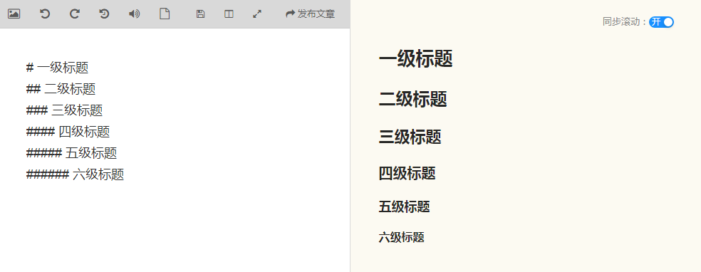

#### （2） 斜体
用法：在文字前后分别添加一个 * 号
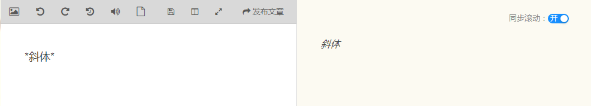

#### （3） 粗体
用法：在文字前后分别添加两个 * 号
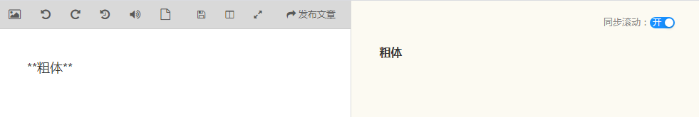

#### （4） 分割线
用法：只需要在空白行连续输入三个 * 号
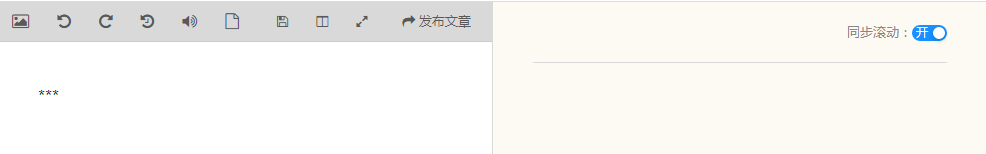

#### （5） 列表
列表分为有序列表和无序列表
- 有序列表
用法：在文字前面加 1. 2. 3. 符号并且空一格
- 无序列表
用法：在文字的前面加上 - 或 * 符号并且空一格
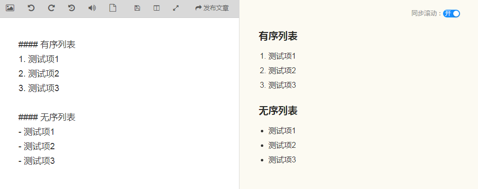

#### （6） 引用
如果你需要引用一段别处的句子，那么就要用引用的格式
用法：在文字前面加 > 尖括号并且空一格
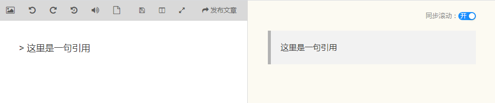

#### （7） 链接
在文章中插入链接
用法：\[文字](链接)
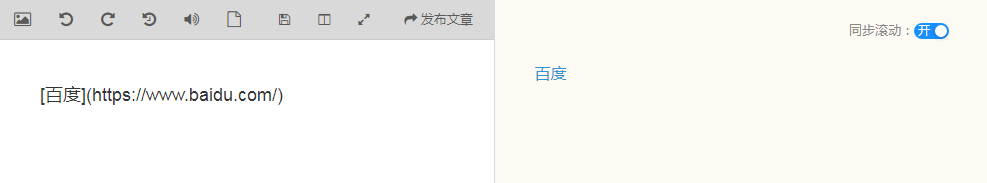

#### （8） 图片
插入图片和插入链接的方式类似，不过插入图片比插入链接多了一个 ! 号
用法：\!\[文字](链接)
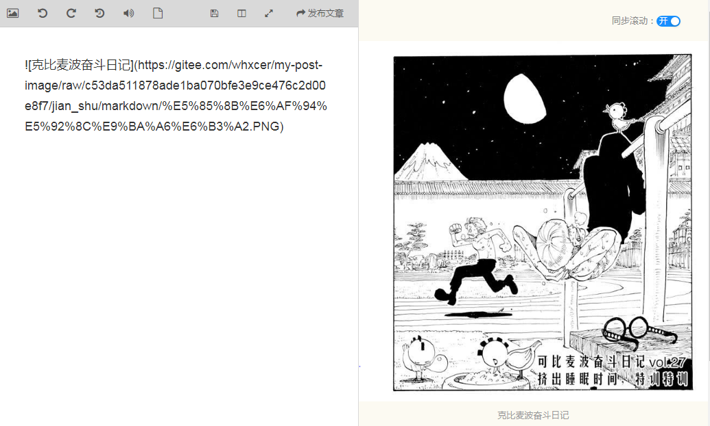

#### （9） 表格
表格的语法比较麻烦，就不详细说明了，如下图所示
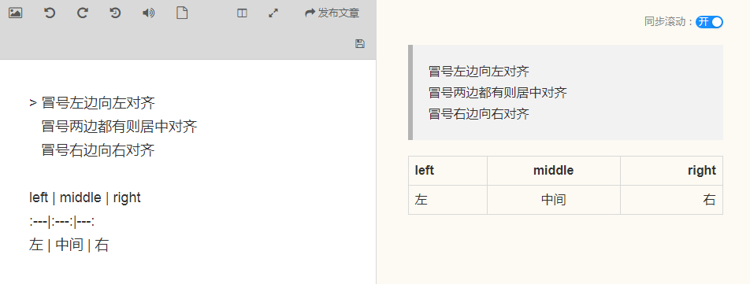

#### （10） 代码框
用法：使用三个反引号 \` 将代码包起来(反引号的按键是左上角 Esc 键下方的 ~ 键)
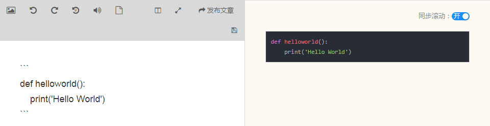

#### （11） 显示转义字符
用法：在 MarkDown 编辑器中，如果想要让 \`、\#、\* 等符号原样显示，不被解析成对应的 Markdown 语法，则可以使用反斜杠 **\\** 来进行转义
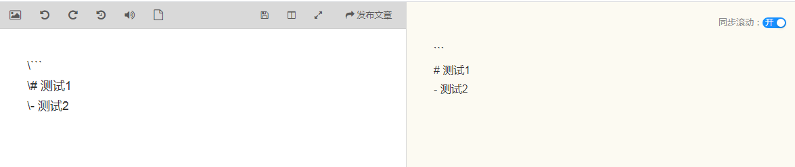

#### （12） 更改文字的颜色
用法：\$\color{颜色}{文字}$ 或 \<font color='red'> 文字 \</font>
颜色的表示方法：颜色的关键词、十六进制值、rgb
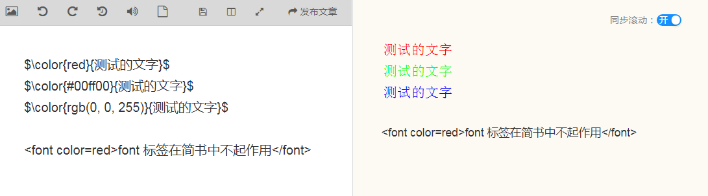

#### （13） 删除线
用法：\~\~ 文字 \~\~ （在文字的前面和后面分别添加两个 波浪号）
示例：~~删除线~~
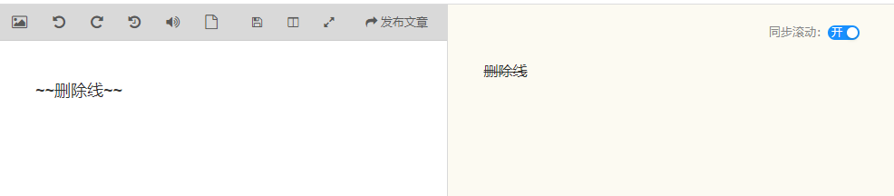

#### （14） 页面内跳转（锚点功能）
用法一：使用 a 标签
```html
1. 点击的地方（添加链接）：<a href="#id-test1">用法一</a>
2. 到达的地方（添加锚点）：<span id="id-test1">用法一实例</span>
```

用法二：使用 markdown 特有的语法
```html
1. 点击的地方（添加链接）：[用法二](#id-test2)
2. 到达的地方（添加锚点）：<span id="id-test2">用法二实例</span>
```

### 3. 总结
以上的 Markdown 语法在日常的使用中基本足够了，只要多加练习，配合好用的工具，写起东西来肯定会行云流水。
