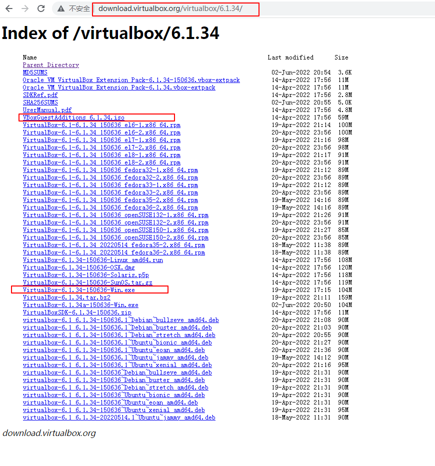

在 VirtualBox 里面安装了 Ubuntu，但是需要从外层的操作系统中复制数据，然后粘贴到虚拟机里面，但是 VirtualBox 默认不支持这种增强性的功能，因此我们需要手动安装 VBoxGuestAdditions 扩展程序来实现主机和虚拟机互相复制粘贴功能。


### 1. 我的电脑上安装的软件版本
1. VirtualBox    --> 6.1.34
    官网下载地址：http://download.virtualbox.org/virtualbox/6.1.34/
2. ubuntu-16.04.7-desktop-amd64
    官网下载地址：https://releases.ubuntu.com/
3. VBoxGuestAdditions_6.1.34.iso
    官网下载地址：http://download.virtualbox.org/virtualbox/6.1.34/

VBoxGuestAdditions 下载示意图



### 2. 一些设置项


### 3. 启动虚拟机将 VBoxGuestAdditions 文件挂载 Ubuntu 上
```
1. 打开终端
    按一下 win 键
    输入 terminal 并打开
2. 创建 /mnt/cdrom 目录
    sudo mkdir /mnt/cdrom
3. 将光驱挂载到 /mnt/cdrom 目录下
    sudo mount /dev/cdrom /mnt/cdrom
4. 切换到 /mnt/cdrom 目录下
    cd /mnt/cdrom
5. 执行脚本文件
    sudo ./VBoxLinuxAdditions.run
6. 当出现 Running kernel modules will not be replaced until the system is restarted. 就表示 VBoxGuestAdditions 已经在虚拟机操作系统 Ubuntu 里安装成功，重启虚拟机即生效。

额外提示：如果在安装 ./VBoxLinuxAdditions.run 过程中出错，没有顺利安装成功，则需要先安装额外的开发工具，再执行脚本文件：
    sudo apt-get update
    sudo apt-get install dkms build-essential linux-headers-$(uname -r) virtualbox-guest-x11 linux-headers-generic linux-headers-virtual
```

挂载过程示意图


### 4. 重启虚拟机即可生效
