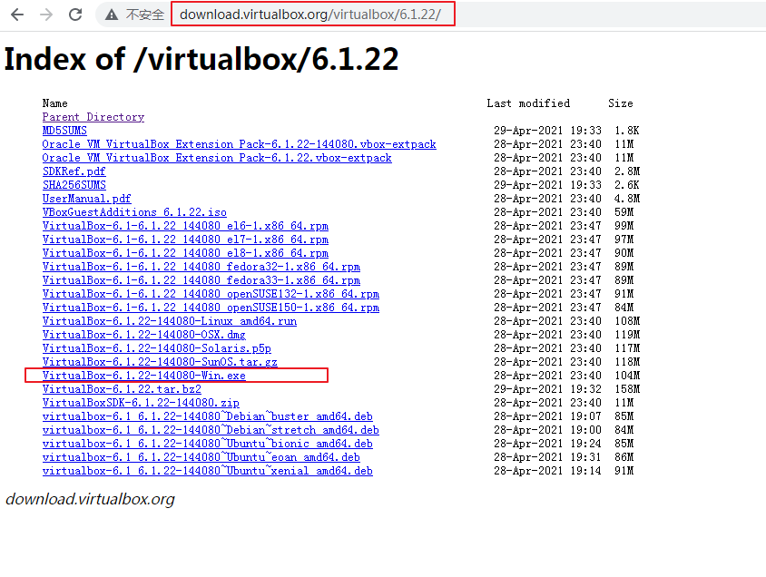
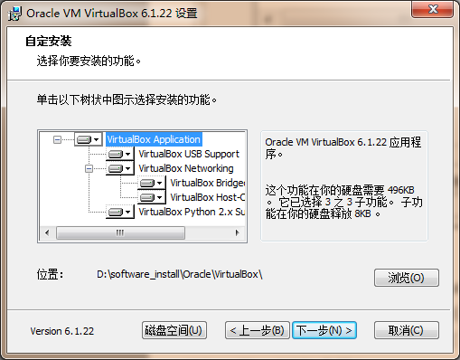
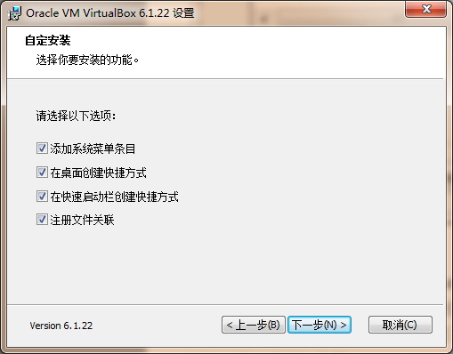

虚拟机仅仅是一个软件，运行在各种主流的操作系统上。它以自己运行的真实计算机为模板，虚拟出另一套处理器、内存和外部设备来。它的处理能力，完全来自于背后那台真实的计算机。

尤其重要的是，针对某种真实处理器所写的任何指令代码，通常都可以正确无误地在该处理器的虚拟机上执行。实际上，这也是虚拟机具有广泛应用价值的原因所在。

在过去的若干年里，虚拟机得到了广泛应用。为了研制防病毒软件、测试最新的操作系统或者软件产品，软件公司通常需要多台用于做实验的计算机。采用虚拟机，就可以避免反复重装软件系统的麻烦，当这些软件系统崩溃时，崩溃的只是虚拟机，而真实的物理计算机丝毫不受影响。

## （一） 下载 Oracle VM VirtualBox
主流的虚拟机软件包括 VMWare、Virtual PC 和 VirtualBox，但只有 VirtualBox 是开源和免费的。

VirtualBox 官网下载地址：http://download.virtualbox.org/virtualbox/6.1.22/

## （二） 安装 Oracle VM VirtualBox
安装过程也很简单，唯一需要说明的是**软件特性的选择**和**安装路径**，其他的就一直**下一步**即可。

## （三） 参考书籍
[《x86汇编语言：从实模式到保护模式》](https://book.douban.com/subject/20492528/)