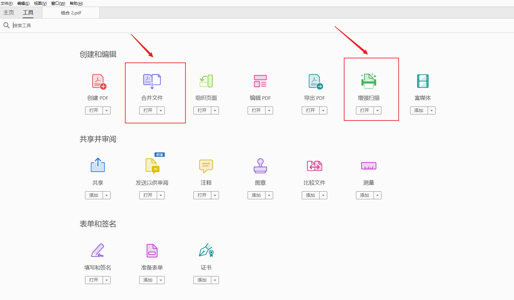
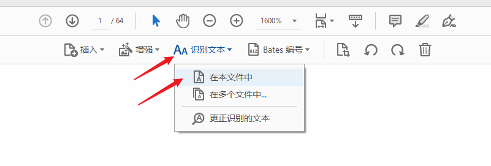
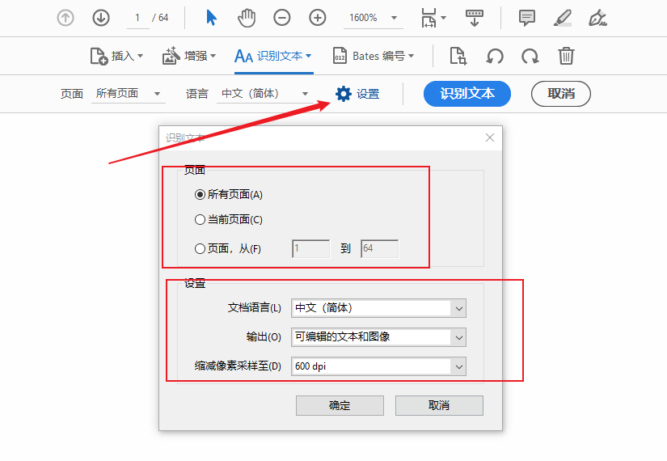

本人使用打开 PDF 的软件为 **Adobe Acrobat Pro DC**。

### 1. 乱码出现的原因：
PDF 中嵌入了字体，而PDF中嵌入的字体在个人的电脑字体库中不存在，因此当复制粘贴到文本编辑器中，将无法识别其编码，也就无法解码，从而产生了乱码。

### 2. 乱码的解决方案：
#### （1） 方案一：下载字体
> 在个人电脑中，安装 PDF嵌入的相应的字体（因为嵌入的字体种类可能比较多，所以就没去实践）

#### （2） 方案二：PDF转为图片、将图片合成PDF、再做识别文本
> 1. 将原 PDF 另存为 PNG 图片，Adobe 会将 PDF 的每页都生成一张图片，因此会有很多图片
> 步骤：文件 => 另存为 => 弹窗-保存类型（png 或 jpeg） => 弹窗-设置（里面可以设定图片分辨率）
> 2. 使用【合并文件】工具，将之前保存的图片，全部合成一个 PDF
> 3. 使用 **Adobe Acrobat Pro DC** 打开之前合成的 PDF，然后点击【增强扫描】工具
> 4. 识别文本过程：
> 
> 
> 
> 
> 识别后，PDF 中的文字复制粘贴，也不会出现乱码。

### 3. 参考
[知乎：如何解决pdf里的文字复制出来是乱码的问题？](https://www.zhihu.com/question/23579811)