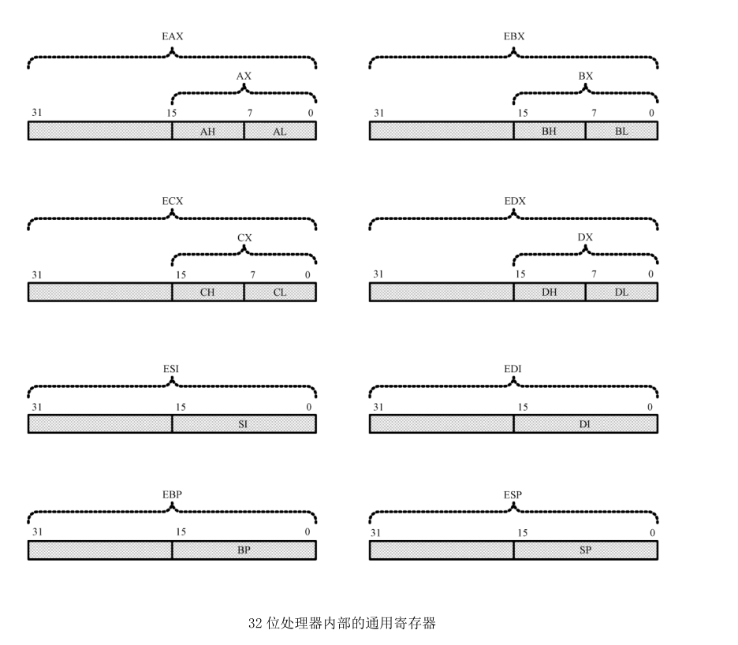
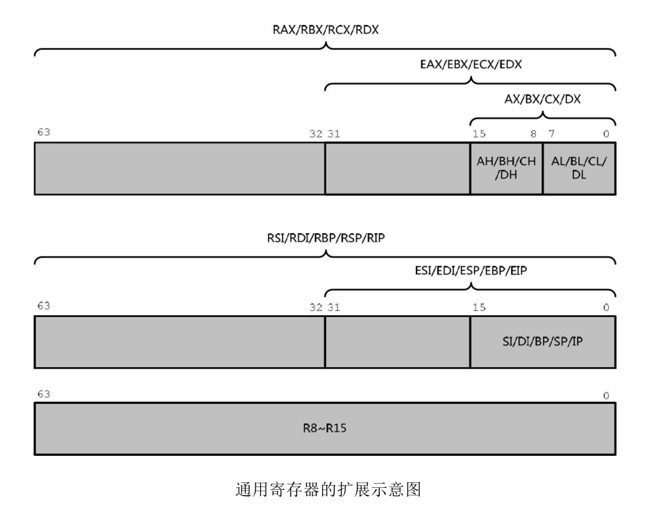
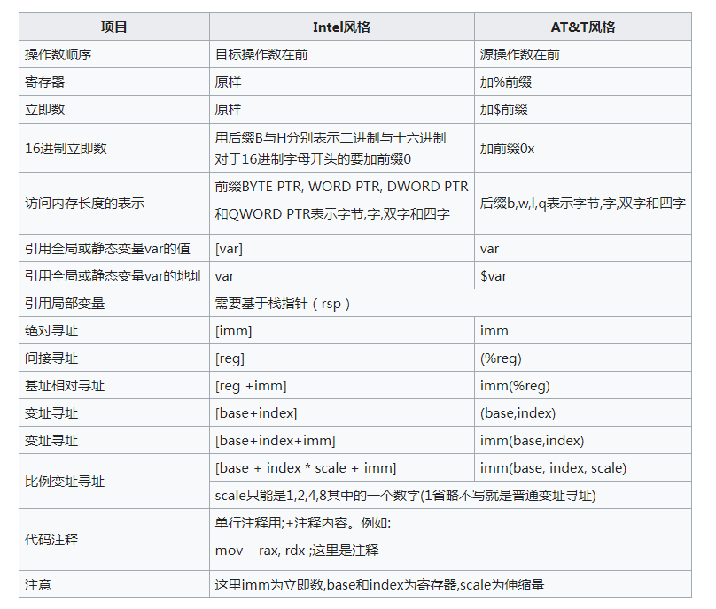

### 1. 汇编语言的流派
x86 汇编指令有两大风格，分别是:
> 1. Intel 汇编
> 2. AT&T 汇编

### 2. 汇编语言的运作模式
> 1. 实模式
> 2. 16 位保护模式
> 3. 32 位保护模式

### 3. x86 寄存器
#### （1）寄存器分类
> 1. 16 位
> 自 Intel 8086和 8088 起，有 14 个 16 比特寄存器（AX、BX、CX、DX、SI、DI、SP、BP、IP、CS、SS、DS、ES、PSW）。
> 其中四个（AX, BX, CX, DX）是通用寄存器，每个寄存器可以被当成两个分开的字节访问（因此 BX 的高比特可以被当成 BH，低比特则可以当成 BL）。
> 除了这些寄存器，还有四个段寄存器（CS、DS、SS、ES）。他们用来产生存储器的绝对地址。还有两个指针寄存器（SP是指向堆栈的底部，BP可以用来指向堆栈或存储器的其它地方）。两个指针寄存器（SI和DI）可以用来指向数组的内部。
> 最后，有标志寄存器（包含状态标志比如进位、溢出、结果为零，等等）。以及 IP 是用来指向目前执行指令的偏移地址。
> 2. 32位
> 自 Intel 80386 起，四个通用寄存器（EAX, EBX, ECX, EDX），它们较低的 16 位分别与原本 16 位的通用寄存器（AX, BX, CX, DX）重叠共享。指针寄存器（EIP, EBP, ESP, ESI, EDI）。区段寄存器除了原本的（CS、DS、SS、ES），另外新增（FS、GS），但是区段寄存器在 32 位模式下改做为存储器区块的选择子寄存器。标志寄存器被扩展为 32 位，较低的 16 位与原本在 16 位下的标志寄存器重叠共享。
> 3. 64位
> MMX 寄存器（MM0～MM7），它们分别与浮点运算器〈FP0～FP7〉相重叠，所以 MMX 与浮点运算不可同时使用，必须透过切换选择要使用哪一种。
> 4. AMD64
> AMD 自行把 32 位 x86（或称为 IA-32）拓展为 64 位，并命名为x86-64 或 Hammer 架构，而后更名为 AMD64 架构。由于 AMD 的 64 位处理器产品线首先进入市场，且微软也不愿意为 Intel 代号为 Yamhill 的 64 位版 x86 处理器开发第三个不同的 64 位操作系统，Intel 被迫采纳 AMD64 架构且增加某些新的扩展到他们自己的产品，命名为 EM64T 架构，EM64T 后来被 Intel 正式更名为 Intel 64。
> 这个架构也被称为 64 位拓展架构，即 x64，譬如四个通用寄存器（RAX, RBX, RCX, RDX）是由 32 位的（EAX, EBX, ECX, EDX）64 位扩展而来，相应的还有 指针寄存器（RIP, RBP, RSP, RSI, RDI），以及增加八个通用寄存器（R8～R15）等等。 这些资源只可在 x64 处理器的 64 位模式下使用，在用来支持 x86 软件的遗留模式和兼容模式中是不可见的。

#### （2）通用寄存器扩展示意图

---

### 4. 常见的汇编器
> 1. 采用 Intel 汇编语法的汇编器
> Linux 下的能产生 16 位代码的 as86 汇编器，使用配套的 ld86 链接器
> 微软汇编器（MASM）
> Netwide汇编器（NASM）
> Borland的Turbo汇编器（TASM）
> 2. 采用 AT&T 汇编语法的汇编器
> Linux 下 GNU 的 汇编器 gas（as），使用 GNU ld 链接器来连接产生的目标文件

### 5. Intel汇编 和 AT&T汇编 的风格比较

#### （1） 指令比较示例：
AT&T 中寄存器有前缀 %，立即数有前缀 $
|  Intel 汇编语法   | AT&T 汇编语法  |
|  ----  | ----  |
| mov eax, 1  | movl $1, %eax |
| mov ebx, 0  | movl $0, %ebx |
| int 80h  | int $0x80 |

#### （2） 风格比较示意图

