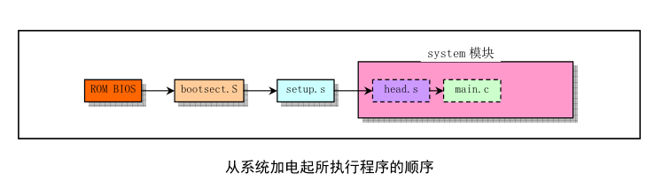
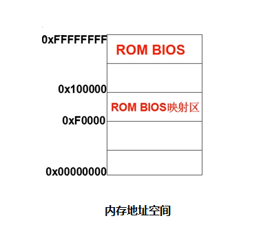
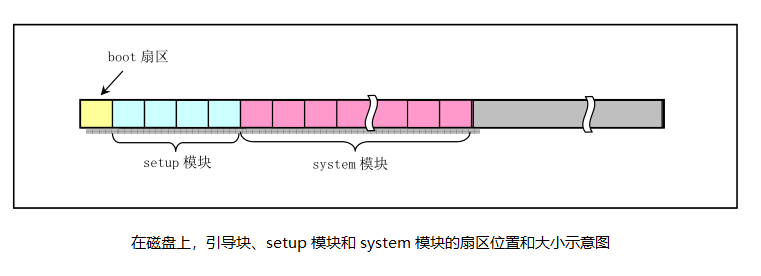
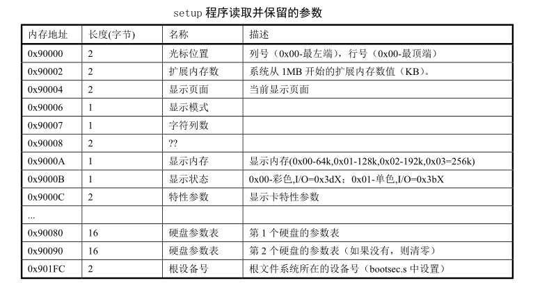
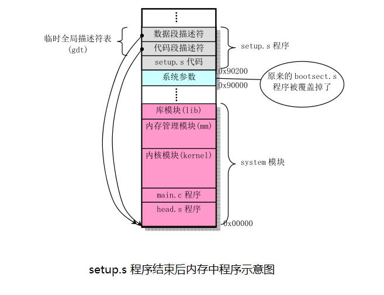
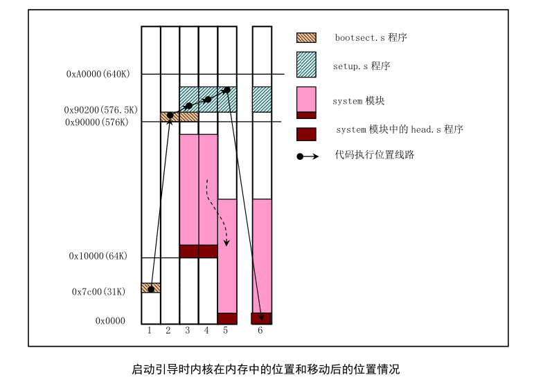
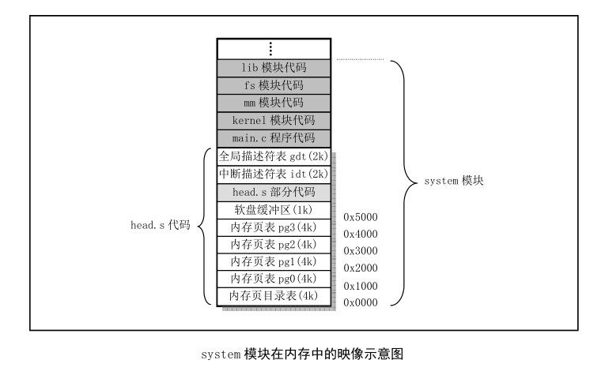
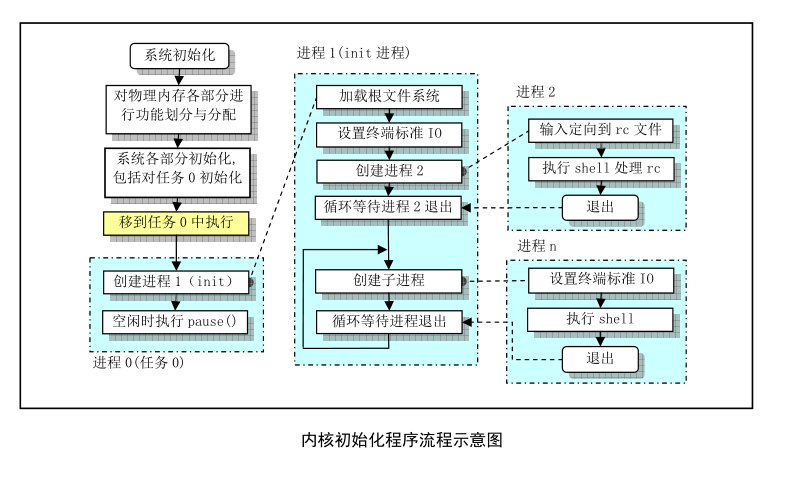

最近在学习操作系统，操作系统的启动也摸索了一段时间，现在记录下来，方便后续的复习。

### 1. 总体功能

#### （1） ROM BIOS
> 功能描述：
> 1. x86 PC 刚开机时，CPU 处于实模式（实模式的寻址 CS:IP （CS左移4位 + IP））
> 2. 开机时，CS=0xFFFF, IP=0x0000
> 3. 寻址 0xFFFF0 (ROM BIOS 映射区)；CPU 自动进入 FFFF:0 单元处执行，此处有一条跳转指令。
> 4. CPU 执行该指令后，转去执行 BIOS 中的**硬件系统检测**和**初始化程序**。
> 5. **硬件系统检测**：检查 RAM，键盘，显示器，软硬磁盘（如果硬件坏了，可能需要重新更换硬件）
> 6. **初始化程序**：在内存物理地址 0 处建立 BIOS 所支持的中断向量，即将 BIOS 提供的中断例程的入口地址登记在中断向量表中。
> 7. 硬件系统检测和初始化完成后，调用 **int 19h** 进行操作系统的引导。
> 8. int 19h 将要完成的内容是：将磁盘 0 面 0 磁道 1 扇区的内容读取到内存 0x7c00 处
> **为什么每次开机，都需要从磁盘将操作系统读入到内存中？**
> **因为内存在断电之后，所有保存的内容都会统统消失；而处理器的主要功能就是从内存中取指令和执行指令；所以，每当处理器加电之后，它都得先将操作系统从磁盘读入到内存中，然后再取指执行。**
> 9. 设置 cs=0x0000, ip=0x7c00 （也可以说是将 CS:IP 指向 0:7c00）

> **上面第 8 步的扩展（即 int 19h 要完成的工作）：**
> 1.  如果设为从软盘启动操作系统，则 int 19h 将主要完成以下工作。
> (1) 控制 0 号软驱，读取软盘 0 面 0 道 1 扇区的内容到 0:7c00
> (2) 将 CS:IP 指向 0:7c00
> 软盘的 0 面 0 道 1 扇区中装有操作系统引导程序。int 19h 将其装到 0:7c00 处后，设置 CPU 从 0:7c00 开始执行此处的引导程序，操作系统被激活，控制计算机。
> 2. 如果在 0 号软驱中没有软盘，或发生软盘 I/O 错误，则 int 19h 将主要完成以下工作。
> (1) 读取 **硬盘 C** 的 0 面 0 道 1 扇区的内容到 0:7c00
> (2) 将 CS:IP 指向 0:7c00

#### （2） bootsect.s （实模式下运行的 16 位汇编代码程序，8086 汇编语言）
bootsect.s 代码是磁盘引导块程序， 驻留在磁盘的第一个扇区中 （引导扇区，0磁道（柱面），0磁头，第1个扇区）。在 PC 机加电 ROM BIOS 自检后，ROM BIOS 会把引导扇区代码 bootsect 加载到内存地址 0x7c00 开始处并执行之。
> 功能描述：
> 1. 在 bootsect 代码执行期间， 它会将自己移动到内存绝对地址 0x90000 开始处并继续执行（为后续 system 的挪动腾出空间）
> 2. 接着该程序把从磁盘第 2 个扇区开始 的 4 个扇区的 setup 模块 （ 由 setup.s 编译而成） 加载到内存紧接着 bootsect 后面位置处 ( 0x90200 )

> 3. 然后利用 BIOS 中断 0x13 取磁盘参数表中当前启动引导盘的参数
> 4. 接着在屏幕上显示 "Loading system... " 字符串
> 5. 再者把磁盘上 setup 模块后面的 system 模块加载到内存 0x10000 开始的地方
> 6. 确定根文件系统的设备号
> 7. 最后长跳转到 setup 程序的开始处( 0x90200 ) 执行 setup 程序

#### （3） setup.s （实模式下运行的 16 位汇编代码程序，8086 汇编语言）
setup.s 是一个操作系统加载程序

> 功能描述：
> 1. 利用 ROM BIOS 中断读取机器系统数据，并将这些数据保存到 0x90000 开始的位置（覆盖掉了 bootsect 程序所在的地方），所取得的参数和保留的内存位置如下图所示
> 
> 2. 然后 setup 程序将 system 模块从 0x10000 - 0x8ffff (当时认为内核系统模块 system 的长度不会超过此值 512KB) 整块向下移动到内存绝对地址 0x00000 处
> 3. 接下来加载**中断描述符表寄存器(idtr)**和**全局描述符表寄存器( gdtr)**，开启 A20 地址线，重新设置两个中断控制芯片 8259A，将硬件中断号重新设置为 0x20 - 0x2f
> 4. 再者设置 CPU 的控制寄存器 CR0（也称机器状态字），并进入 32 位保护模式运行
> 5. 最后跳转到位于 system 模块最前面部分的 head.s 程序继续运行

> 提示：
> 为了能让 head.s 在 32 位保护模式下运行，在 setup 程序中临时设置了**中断描述符表 (IDT)** 和**全局描述符表 ( GDT)**, 并在 GDT 中设置了当前内核**代码段的描述符**和**数据段的描述符**。 后面在 head.s 程序中会根据内核的需要重新设置这些描述符表 。

#### （4） head.s （运行在保护模式下的 32 位汇编代码程序，AT&T 语法的汇编语言程序）
head.s 程序在被编译生成目标文件后会与内核其他程序一起被链接成 system 模块，位于 system 模块的最前面开始部分，这也就是为什么称其为头部( head )程序的原因 。

从这里开始，内核完全都是在保护模式下运行了，head.s 汇编程序与前面的语法格式不同，它采用的是 AT&T 的汇编语言格式 。

该程序位于内存绝对地址 0 处开始的地方，这个程序的功能比较单一。
> 功能描述：
> 1. 首先是加载各个数据段寄存器，重新设置中断描述符表 idt
> 2. 在设置好中断描述符表之后，又重新设置了全局段描述符表 gdt
> 3. 检测 A20 地址线是否已真的开启
> 4. 接着设置管理内存的分页处理机制，将页目录表放在绝对物理地址 0 开始处（也是本程序所处的物理内存位置 ， 因此这段程序将被覆盖掉）
> 5. 最后，head.s 程序利用返回指令将预先放置在堆栈中的 /init/main.c 程序的入口地址弹出，去运行 main() 程序

head.s 程序执行结束后，已经正式完成了内存页目录和页表的设置，并重新设置了内核实际使用的中断描述符表 idt 和全局描述符表 gdt。另外还为软盘驱动程序开辟了 1KB 字节的缓冲区。此时 system 模块在内存中的详细映像如下图所示

#### （5） main.c （C语言程序）
在内核源代码的 init/ 目录中只有一个 main.c 文件。系统在执行完 boot/ 目录中的 head.s 程序后就会将执行权交给 main.c。该程序虽然不长，但却包括了内核初始化的所有工作。

> 功能描述：
> 1. main.c 程序首先利用前面 setup.s 程序取得的系统参数设置系统的根文件设备号以及一些内存全局变量（即确定如何分配使用系统物理内存）。
> 2. 然后调用内核各部分的初始化函数分别对内存管理、中断处理、块设备和字符设备、进程管理以及硬盘和软盘硬件进行初始化处理 ，还包括人工设置第一个任务 (task0)。
> 3. 在完成了这些操作之后，系统各部分已经处于可运行状态，此后 main.c 程序把自己 “手工” 移动到 任务0 (进程0 ) 中运行
> 4. 然后系统第一次调用进程创建函数 fork()，创建出进程1 (init 进程），并在其中调用 init() 函数（创建出一个用于运行 init() 的子进程，所以通常被称为 init 进程）。
> init() 函数的功能：
> (1) 安装根文件系统
> (2) 显示系统信息
> (3) 运行系统初始资源配置文件 rc 中的命令
> (4) 执行用户登录 shell 程序

> 注意：
> 如果以上任何一步中出了错，计算机就会死锁，因为在操作系统还没有完全运转之前是处理不了出错的。

### 2. 总结
> 1. 引导加载程序 bootsect.s 将 setup.s 代码和 system 模块加载到内存中，并且分别把自己和 setup.s 代码移动到物理内存 0x90000 和 0x90200 处后，就把执行权交给了 setup 程序。
> 2. setup 程序的主要作用是利用 ROM BIOS 的中断程序获取机器的一些基本参数，并保存在 0x90000 开始 的内存块中，供后面程序使用。同时把 system 模块往下移动到物理地址 0x00000 开始处，这样，system 中的 head.s 代码就处在 0x00000 开始处了。然后加载描述符表基地址到描述符表寄存器中，为进行 32 位保护模式下的运行作好准备。接下来对中断控制硬件进行重新设置，最后通过设置机器控制寄存器 CR0 并跳转到 system 模块的 head.s 代码开始处，使 CPU 进入 32 位保护模式下运行 。
> 3. head.s 代码的主要作用是初步初始化中断描述符表中的 256 项门描述符，检查 A20 地址线是否已经打开，测试系统是否含有数学协处理器。然后初始化内存页目录表，为内存的分页管理作好准备工作。最后跳转到 system 模块中的初始化程序 init /main.c 中继续执行。
> 4. main 代码的主要作用是调用内核各部分的初始化函数，完成内核初始化的所有工作。

**总的来说，系统启动的时候就做了两件事：**
> 1. 将操作系统从磁盘读入内存
> 2. 完成初始化（获得硬件参数、获得初始化的硬件结构、初始化一些重要的数据结构，方便将来操作系统对硬件的管理）

### 3. 参考
[《汇编语言》(第3版，王爽)](https://book.douban.com/subject/25726019/)
[《Linux内核完全注释》（赵炯）](https://book.douban.com/subject/1231236/)
[MOOC 操作系统 李治军](https://www.icourse163.org/course/HIT-1002531008)
