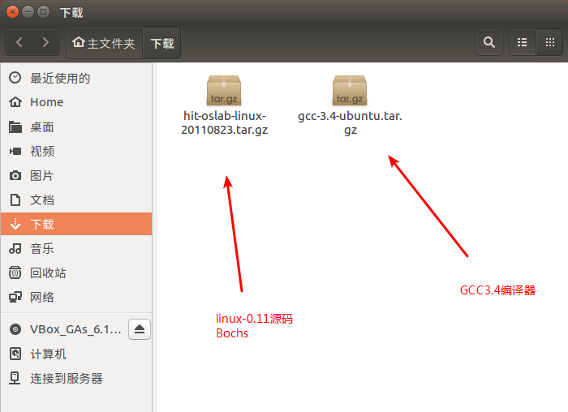
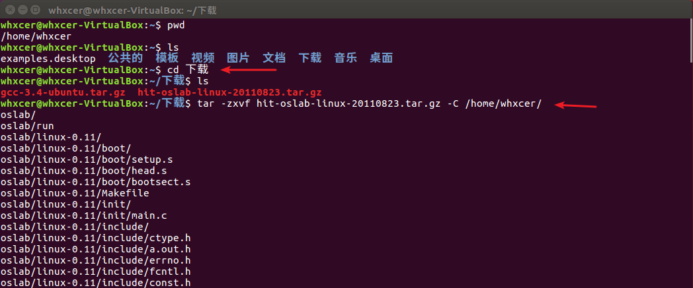
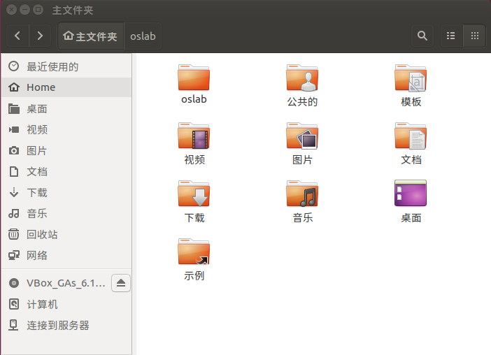
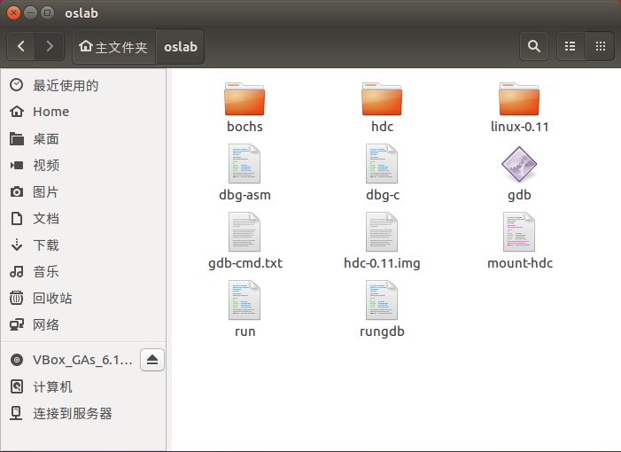
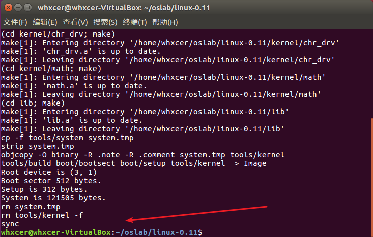
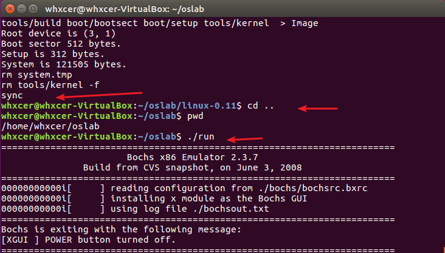
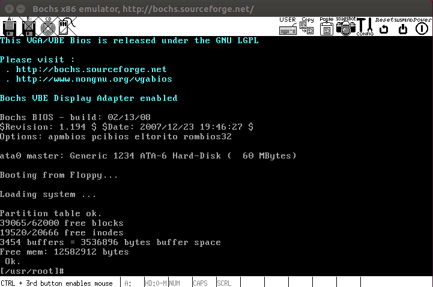

每次更换电脑，都需要重新搭建操作系统的实验环境，在网上找来找去很麻烦，干脆就记录下整个搭建过程，方便后面需要的时候再参考。


## （一） 下载实验所需的资源
- linux-0.11源码、Bochs、用来编译linux-0.11源码的 GCC3.4 编译器
链接: https://pan.baidu.com/s/17dzSHoouoy_jq_ZenwSdIg
提取码: wzs2
- 示意图



## （二） 压缩包的解压和安装
### 1. linux-0.11源码 和 Bochs
- 将前面下载的 hit-oslab-linux-20110823.tar.gz 文件解压

- 解压后的内容



### 2. GCC3.4 编译器
1. 解压 gcc-3.4-ubuntu.tar.gz
```shell
tar -zxvf gcc-3.4-ubuntu.tar.gz
```
2. 进入解压后的 gcc-3.4 目录
```shell
cd gcc-3.4
```
3. gcc-3.4 目录里面有 64位 和 32位 的 gcc3.4 安装包目录，我下载的 ubuntu 是 64位 的，所以要进入 gcc-3.4_amd64 目录
```shell
cd gcc-3.4_amd64        # 进入该目录
sudo dpkg -i *.deb      # 安装所有包

# 等待安装完成
gcc-3.4 -v              # 查看是否安装成功
```


## （三） 安装编译环境
- 使用命令安装相关依赖库
```shell
sudo apt-get install bin86      # 安装as86 ld86

# 如果出现 “有未能满足的依赖关系” 相关的报错，则运行
# sudo apt-get -f install

sudo apt-get install libc6-dev-i386  # 由于是64位系统，还需要安装32位系统的兼容库

# 安装编译相关的依赖库
sudo apt-get install libsm6:i386
sudo apt-get install libx11-6:i386
sudo apt-get install libxpm4:i386

cd /oslab/linux-0.11                # 进入 linux-0.11 目录，编译源代码
make all                            # 编译

# 返回外层目录，也就是进入 oslab 目录
cd ..                               # /home/whxcer/oslab
./run                               # 启动 Bochs
```

- make all 最后一行出现 **sync** 即表示编译成功

- Bochs 加载 linux-0.11 成功，则说明实验需要的环境已搭建完成




## （四） 参考
[哈工大李治军操作系统课程实验环境搭建](https://blog.csdn.net/zy010101/article/details/108085192)