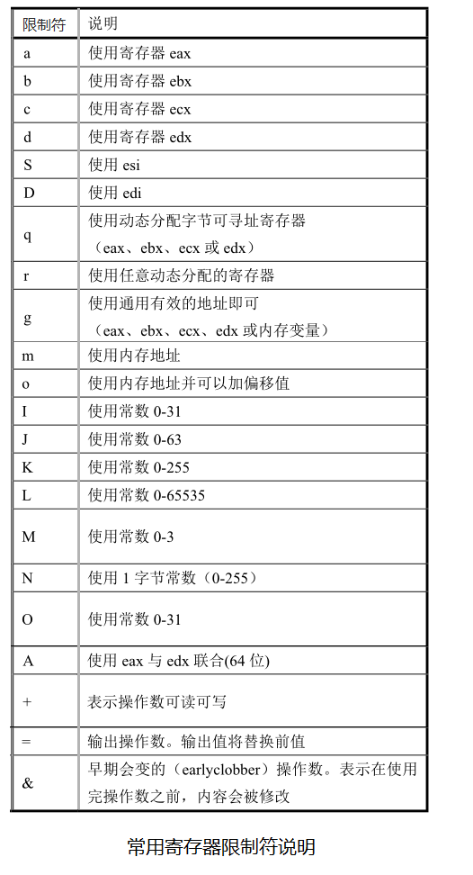

内嵌汇编（英语：Inline assembly）通俗来讲，就是将汇编语言代码嵌入到高级语言的程序中，例如嵌入到 C 语言程序中。

linux 操作系统下，C 语言程序的编译一般使用 GCC 来编译，而 GCC 编译器提供了内嵌汇编的功能，也就是说可以在 C 代码中直接内嵌汇编语言语句。

GNU 汇编器使用的是 AT&T 汇编语言语法，因此内嵌在 C 语言中的汇编语言语法就是 AT&T 语法。

### 1. 内嵌汇编的用途
- 系统调用（System Call）
在保护模式中，运行在用户态的应用程序一般无法直接调用内核态的函数，只能通过中断来发出请求，因此系统调用的包装函数一般是使用内嵌汇编程序编写的。
- 需要更准确的操作寄存器等

### 2. 内嵌汇编的基本语法形式
```
asm (
  "汇编语句模板"
  :输出寄存器
  :输入寄存器
  :会被修改的寄存器
)
```
- 除 "汇编语句模板" 外，后面带冒号的行若不使用就都可以省略
- “asm”
是内嵌汇编语句的关键词
- “汇编语句模板”
是写汇编指令的地方
- “输出寄存器”
表示当这段嵌入汇编执行完之后，哪些寄存器用于存放输出数据，此地，这些寄存器会分别对应一 C 语言表达式值或一个内存地址
- “输入寄存器”
表示在开始执行汇编代码时，这里指定的一些寄存器中应存放的输入值，它们分别对应着一  C 变量或常数值
- “会被修改的寄存器”
表示已对其中列出的寄存器中的值进行了改动，gcc 编译器不能再依赖于它原先对这些寄存器加载的值

### 3. 具体示例
以 linux-0.11 下 kernel/traps.c 文件中第 22 行开始的一段代码为示例
```C
#define get_seg_byte(seg, addr) ({ \
    register char __res; \
    __asm__("push %%fs; \
             mov %%ax, %%fs; \
             movb %%fs:%2, %%al; \
             pop %%fs"\
             :"=a" (__res) \                  // 输出寄存器列表
             :"0" (seg), "m" (*(addr))); \    // 输入寄存器列表
    __res; \
})
```
#### （1）示例的解释
- 以上代码定义了一个内嵌汇编语言宏函数，通常使用汇编语句最方便的方式是把它们放在一个宏内
- “({})” 可以作为表达式使用
- 倒数第二行 __res 为该表达式的输出值
- 因为宏语句需要定义在一行上，因此这里使用反斜杠 "\\" 将这些语句连成一行
- register char __res;
定义了一个寄存器变量 __res ，该变量将被保存在一个寄存器中，以便于快速访问和操作
- \__asm__
表示后面部分为内嵌汇编（AT&T 格式的汇编语句），asm 也可以写成 \__asm__
- 两个 % 号
为了让 gcc 编译产生的汇编语言程序中寄存器名称前有一个百分号 %，在内嵌汇编语句寄存器名称前就必须写上两个百分号 %%
- "=a" (__res)
输出寄存器，表示代码运行结束后将 eax 所代表的寄存器的值放入 __res 变量中；
"=a" 中的 "a" 称为限制符，"=" 表示这是输出寄存器并且其中的值将被输出值替代
- "0" (seg), "m" (\*(addr))
表示这段代码开始运行时将 seg 放到 eax 寄存器中，“0” 表示使用与上面同个位置的输出相同的寄存器。
(*(addr)) 表示一个内存偏移地址值。
- 为了在上面汇编语句中使用该地址值，嵌入汇编程序规定把输出和输入寄存器统一按顺序编号（相当于 C 语言中的占位符），顺序是从输出寄存器序列从左到右、从上到下以 “%0” 开始，分别记为 %0、%1、...%9 。
- 示例代码中，输出寄存器的编号为 %0（这里只有一个输出寄存器），输入寄存器前一部分 ("0" (seg)) 的编号是 %1，而后部分的编号为 %2
- movb %%fs:%2, %%al 中的 %2 代表 (*(addr))) 这个内存偏移量

#### （2）示例的具体功能
- push %%fs
将 fs 段寄存器的内容入栈
- mov %%ax, %%fs
将 ax 寄存器中的值赋给 fs 段寄存器
- movb %%fs:%2, %%al
把 fs:(*(addr)) 所指定的字节放入 al 寄存器中
- pop %%fs
将栈顶的数据出栈，并放入到 fs 段寄存器中
- 当执行完汇编语句后，输出寄存器 eax 的值将被放入 __res，作为该宏函数（快结构表达式）的返回值


### 4. 常用寄存器限制符说明



### 5. 参考
更具体的内容请参考书籍：[《Linux内核完全剖析》 赵炯](https://book.douban.com/subject/3229243/)